## Checking your money

To check your own balance, use the \</money> command.

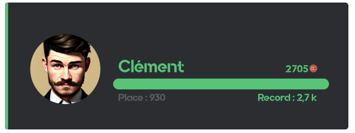

::hint{ type="info" }
  To check another member's balance, add their mention as an argument to the \</money> command.
::

## Commands

Several handy commands make the economy system as smooth as possible for you.

| Command | Description |
|----------|-------------|
| \</daily> | Claims your daily amount. |
| \</money> | Displays how much money you, or another member, have. |
| \</pay> | Gives some of your money to the targeted member. |
| \</shop> | Displays the [server shop](#shop). |
| \</topmoney> | Displays the member [leaderboard](#leaderboard). |
| \</dropmoney> | Creates a message that grants an amount of money to the first person who clicks the button. |

::hint{ type="info" }
  Administrators also have the \</adminmoney> commands to manage members' money. See the [Managing members' money](#managing-members-money) section.
::

## Shop

The shop, accessible through the \</shop> command, lets your members buy articles you have set up!

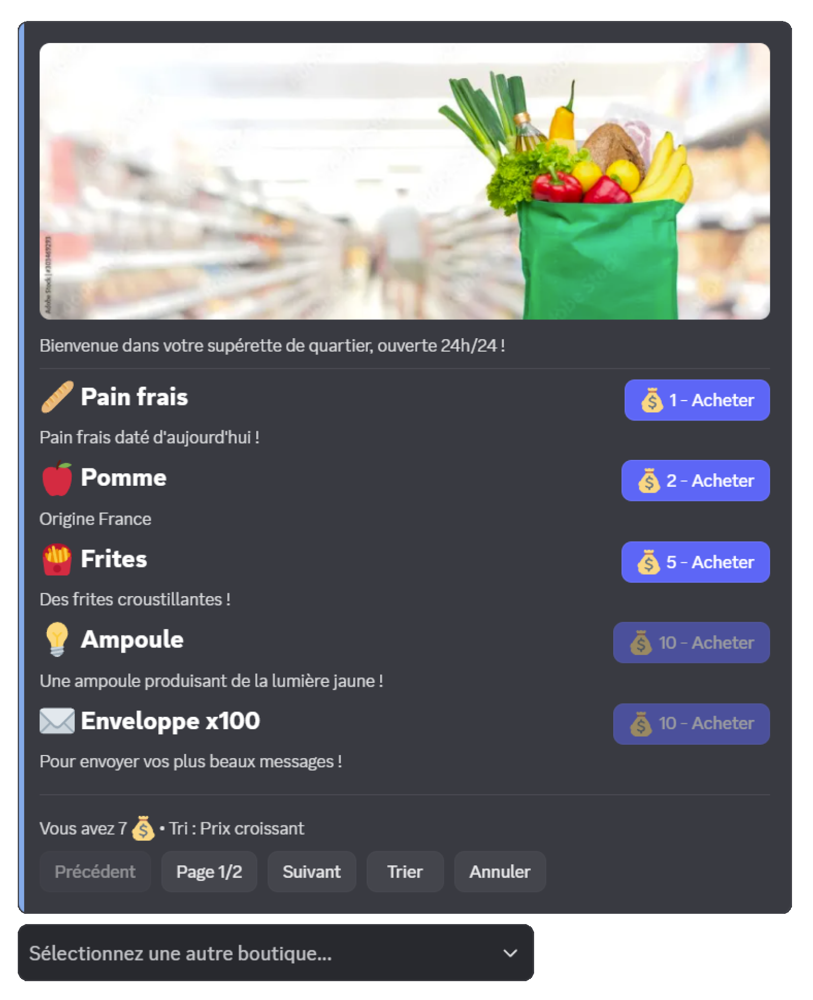

- **Pagination**: articles are displayed in pages of up to 5 articles
- **Article sorting**: 5 sorting options are available (creation date, ascending price, descending price, alphabetical name, type)
- **Shop selection**: if several shops exist, a selection menu is displayed automatically
- **Secure purchase**: confirmation is required before every purchase

| Type | Description | Example |
|------|-------------|---------|
| **Role** | Grants a Discord role | "VIP" role for 5000 💰 |
| **Temporary role** | Grants a role for a limited time | "Boost 7 days" role for 2000 💰 |
| **Experience** | XP points from the [level system](/docs/engagement/levels) | 1000 XP for 500 💰 |
| **Inventory item** | One or more [inventory items](/docs/engagement/inventory) | 3x "Luck potion" for 1500 💰 |
| **Custom article** | A reward you hand out yourself | Promo code, physical goodies, etc. |

::hint{ type="info" }
  You can have 1 shop containing up to **10 articles**. [Premium](/premium) <:icon_premium:1096140508625125417> servers can have 5 shops with 500 articles in each.
::

::hint{ type="success" }
  If you have set up several shops, your members can switch between them easily through the dropdown menu at the bottom of the interface!
::

## Earning money

Money can be earned in various ways on your server. You have full control over how and where your members build up their wealth.

### Money per message

The main way to earn money is **written participation** on the server. Each message grants a **random** amount of money between two values you configure (**15 to 25 💰** by default).

::hint{ type="info" }
  A **cooldown** (30 seconds by default, configurable) applies between each money gain for the same member, to prevent spamming very short messages.
::

::hint{ type="info" }
  [Premium](/premium) <:icon_premium:1096140508625125417> servers can **customize this interval** independently of the voice one.
::

### Money in voice

[Premium](/premium) <:icon_premium:1096140508625125417> servers can enable money gain based on **voice activity**. Each member active in voice earns a **random** amount of money (15 to 25 💰 by default, configurable), at a **regular interval** (every 2 minutes by default, configurable).

::hint{ type="info" }
  This interval is also **customizable** independently of the message one.
::

::hint{ type="info" }
  **Requirements** to earn money in voice:
  - The user must **not have muted their microphone** or **their sound (deafened)**, whether self-deafened or server-deafened.
  - The channel must **not be a stage channel** or set as the **AFK channel** (in the Discord settings).
  - **At least 2 human members in total** (including the beneficiary) must be present and active (not muted/deafened) in the same channel.

  If these conditions are no longer met, the member stops earning money until they are met again.
::

### Other ways to earn money

Thanks to DraftBot's **ecosystem**, you can grant money through other features:

| Features | Description |
|-----------------|-------------|
| **Giveaways** | Offer money as a reward |
| **Starting money** | Set an amount given to new members |
| **Daily** | Daily reward claimable through \</daily> |
| **Birthday gifts** | Offer money automatically |
| **Money drop** (\</dropmoney>) | Create interactive events where the first to click wins |
| **Advent calendar** | Daily rewards in December |
| **Custom commands** | Create all kinds of commands tied to the economy |

### Threads and forums

The economy system distinguishes between two types of discussion spaces:

| Type | Description |
|------|-------------|
| **Threads** | Created in text or announcement channels. Their money gain can be enabled or disabled through the **"Enable money gain in threads"** option. |
| **Forum posts** | Messages published in forum channels. Their money gain is controlled by the **"Enable money gain in forum posts"** option. |

::hint{ type="info" }
  Threads and forum posts **automatically inherit** their parent channel's settings regarding allow/deny lists and multipliers.
::

### Allow and deny lists

The **role** and **channel** lists let you control precisely who can earn money and where:

| Mode | Description |
|------|-------------|
| **With** | Only the listed members/channels can earn money. For roles, a member earns as soon as they hold **at least one** role from the list, whatever their other roles. |
| **Without** | The listed members/channels **cannot** earn money. For roles, a single forbidden role is enough to block the gain. |

### Money multipliers

You can apply **multipliers** (x1.5, x2, x2.5, x3) to certain roles or channels to boost money gain.

::hint{ type="info" }
  [Premium](/premium) <:icon_premium:1096140508625125417> servers can use custom values ranging from x0.1 to x10.
::

- If a member holds several boosted roles, **only the highest boost** is applied.
- If a channel inherits its category's boost **and** has its own boost, **only the channel's boost** is applied.
- Role boosts and channel boosts, however, **stack** with each other (multiplication).

::hint{ type="info" }
  **Example**: a member holding an x2 role who posts in an x1.5 channel earns x3 (2 × 1.5). Conversely, if they hold two boosted roles (x2 and x1.5), only the x2 is applied.
::

### Additional options

Other advanced options are available to fine-tune the system:

| Option | Description |  |
|--------|-------------|--|
| **Money gain per message in voice channels** | Determines whether text messages sent in voice channels grant money, following **three modes**: **Everyone** (any message grants money, whether or not the author is connected to voice), **Only if voice-connected** (money is only granted if the member is also connected to the voice channel), or **Disabled** (no text message in voice channels grants money). |  |
| **Long messages count double** | Messages of 250 characters or more (threshold configurable between 100 and 1500) grant double money. |  |
| **Allow viewing other members' money** | If disabled, members only see their own balance through \</money> and the \</topmoney> command becomes unavailable. In that case, the command becomes ephemeral (visible only to the user who ran it). Administrators can still check every member's money. |  |
| **Reset money when leaving the server** | If enabled, members who leave the server lose their money for good. If they come back, they start from zero. |  |
| **Reset money on ban** | If enabled, banned members lose their money for good. |  |
| **Starting money** | Set an amount of money given automatically to new members joining the server. |  |
| **Daily money** | Configure the amount claimable every day through the \</daily> command. |  |
| **Currency customization** | Change the emoji of your currency. | <:icon_premium:1096140508625125417> |
| **Color customization** | Change the color of economy embeds and cards. | <:icon_premium:1096140508625125417> |

::hint{ type="info" }
  Features marked with the <:icon_premium:1096140508625125417> symbol are reserved for [premium](/premium) <:icon_premium:1096140508625125417> servers.
::

## Leaderboard

You can display the member leaderboard, from the wealthiest to the poorest, in three ways:

### The /topmoney command

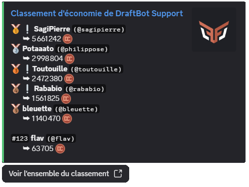

::hint{ type="success" }
  To display a specific number of rows (only the top 3, for instance), pass that number as an argument: \</topmoney> `number:3`.
::

::hint{ type="info" }
  If the **"Allow viewing other members' money"** option is disabled, members can only check their own balance with \</money>, and the \</topmoney> command becomes unavailable to non-administrators. To disable the online leaderboard as well, see the [Online leaderboard](#online-leaderboard) section below.
::

### Online leaderboard

You can open it from the **"View the whole leaderboard"** button of the \</topmoney> command.

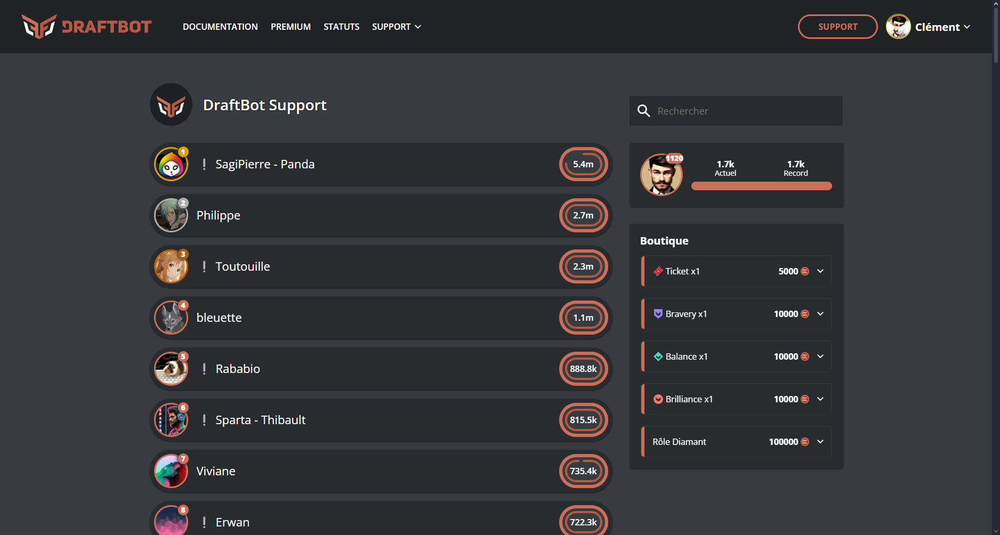

::hint{ type="info" }
  If you are a server administrator, you can also reach it from the [**panel**](/dashboard/first/economy), in the **Economy** module, through the **"Access to the leaderboard"** button.
::

::hint{ type="info" }
  If you want to disable the online leaderboard, an option is provided for that on [the panel](/dashboard/first/economy#economy_leaderboards) or through \</config>.
::

### Real-time leaderboard

[Premium](/premium) <:icon_premium:1096140508625125417> servers can set up an automatic member leaderboard in a dedicated channel.

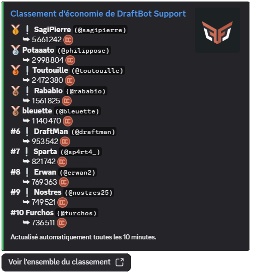

::hint{ type="success" }
  The message displays up to 25 members and is updated automatically every 10 minutes, only if the leaderboard has changed.
::

## Configuring the economy system

::tabs
  ::tab{ label="From the panel" }

    [⫸ Open the **DraftBot** panel](/dashboard/first/economy)

    To enable the module, the first step is to click the button in the top right corner:

    

    Every feature then appears:

    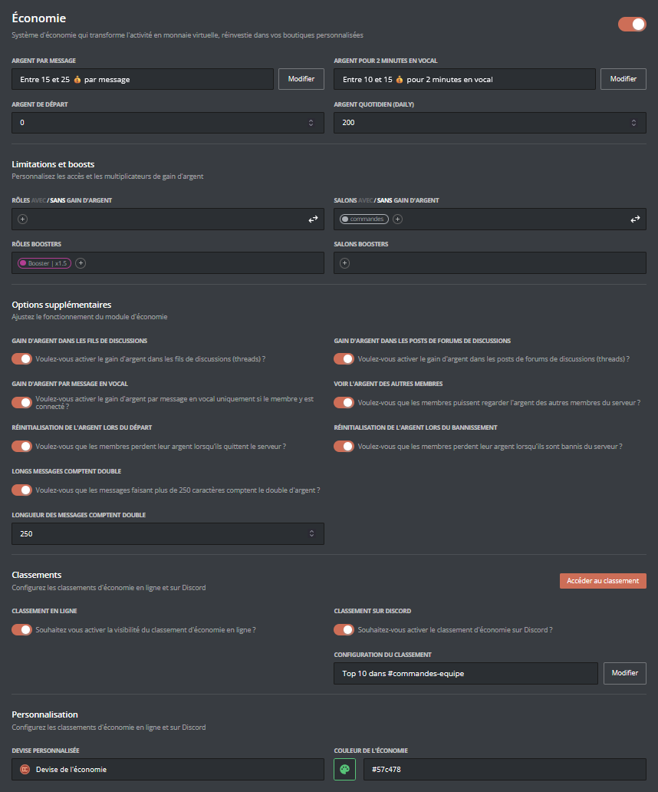

    ::hint{type="warning"}
      Once your changes are done, remember to save them with the "Save" button at the bottom of the page!
    ::
  ::

  ::tab{ label="Using the /config command" }

    If you would rather do the whole setup from Discord, you can use the \</config> command, then go to the "Economy" tab. The menu then looks like this:

    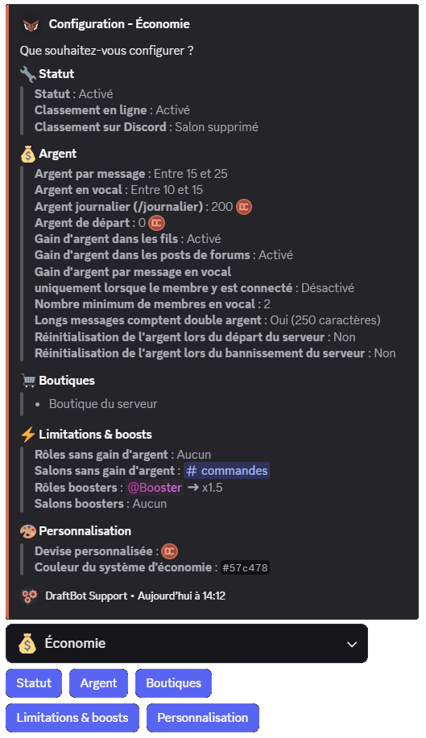

    The body of the **message** lets you see the **current state** of your economy system at a glance, while the **buttons** below let you **change its configuration**.

    ::collapse{ label="Status" }
      This menu lets you:
      - Enable / disable the economy system
      - Enable / disable the online leaderboard
      - Enable / disable the leaderboard on Discord (<:icon_premium:1096140508625125417>)

      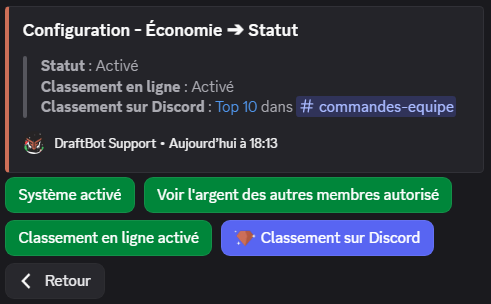

      ::hint{ type="success" }
        When you enable the leaderboard on Discord, you can either use an existing channel or let DraftBot create one for you. You can even set how many leaderboard rows to display!
      ::
    ::

    ::collapse{ label="Money" }
      This menu lets you:
      - Enable / disable / adjust the amount granted per message
      - Enable / disable / adjust the amount granted in voice (<:icon_premium:1096140508625125417>)
      - Configure the amount claimable every day through the \</daily> command
      - Configure the starting money given to new members
      - Enable / disable money gain in threads
      - Enable / disable money gain in forum posts
      - Enable / disable money gain per message in voice channels
      - Enable / disable / adjust x2 gains for long messages
      - Choose whether the money of members leaving the server is reset to 0
      - Choose whether the money of banned members is reset to 0

      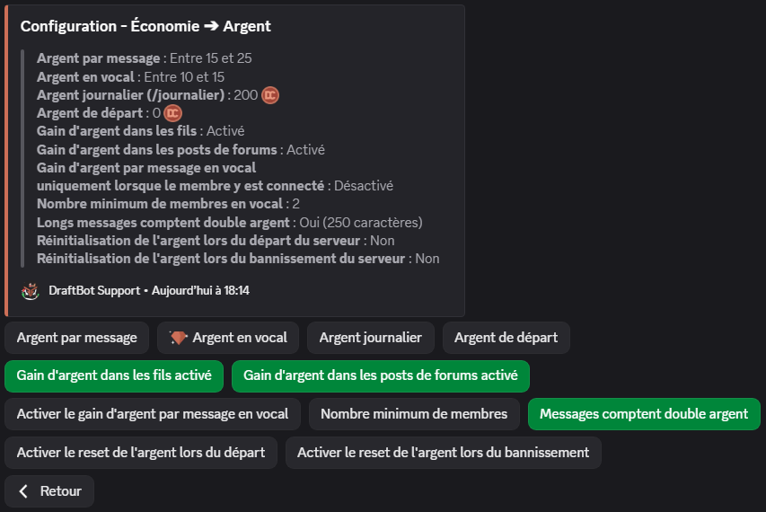
    ::

    ::collapse{ label="Limitations & boosts" }
      This menu configures different gains depending on a member's role or the channel they post in. You can set:
      - which roles have money gain enabled or disabled,
      - which channels have money gain enabled or disabled,
      - which roles get a multiplier (from x1.5 to x3),
      - which channels get a multiplier (from x1.5 to x3).

      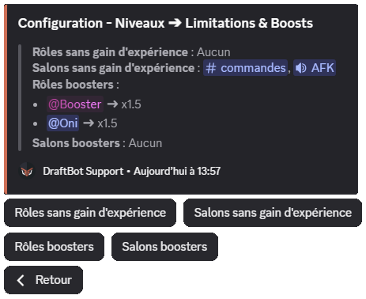
    ::

    ::collapse{ label="Customization" }
      - Customize the emoji of your currency
      - Customize the color of the economy interface (green by default)

      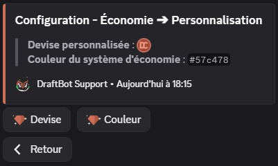

      ::hint{ type="success" }
        When customizing the currency, you can even use your server's custom emojis!
        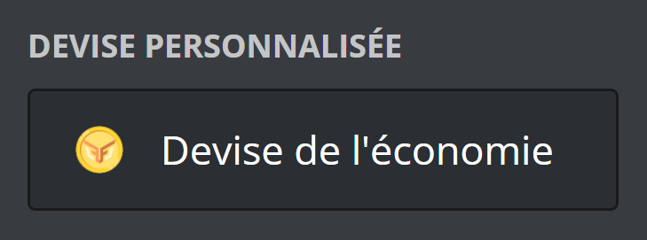
      ::

      ::hint{ type="info" }
        These features are reserved for [premium](/premium) <:icon_premium:1096140508625125417> servers.
      ::
    ::
  ::
::

## Configuring shops

::tabs
  ::tab{ label="From the panel" }

    [⫸ Open the **DraftBot** panel](/dashboard/first/economy)

    To create a shop from the [**panel**](/dashboard/first/economy), click the **"Create shop"** button in the "Shop configuration" section:

    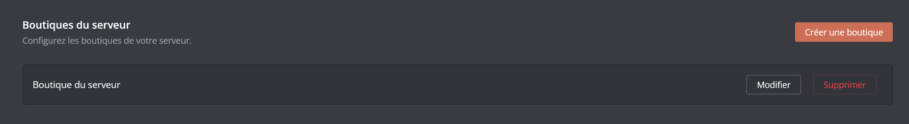

    A window opens to configure your new shop:

    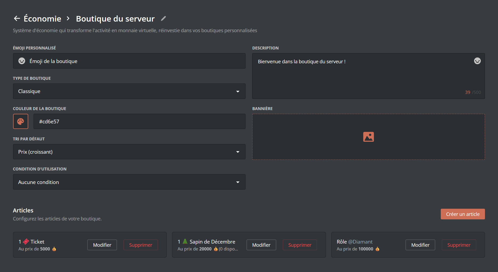

    **Shop settings:**
    - **Name**: the name of your shop (50 characters maximum)
    - **Description**: a description of the shop (500 characters maximum)
    - **Style**: choose between **Classic** (a neutral look, suitable for any theme) or **Black Market** (a dark styling with a mysterious tone, ideal for roleplay servers or rare item shops)

    ::hint{ type="info" }
      If your server already has shops, they appear at the bottom of the screen, where you can edit or delete them.
    ::
  ::

  ::tab{ label="Using the /config command" }
    Through the \</config> command, open the "Economy" menu, then "Shop". You will then be able to create, edit or delete shops.

    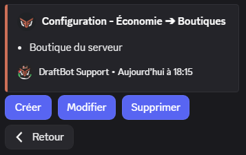

    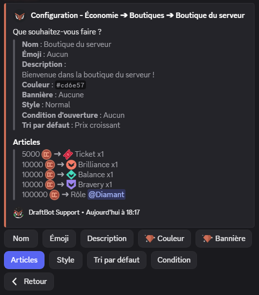
  ::
::

::hint{ type="info" }
  [Premium](/premium) <:icon_premium:1096140508625125417> servers can create up to 5 shops.
::

### Customizing your shop

Once your shop is created, you can customize it further:

| Setting | Description |  |
|-----------|-------------|--|
| **Emoji** | Add an emoji displayed next to the shop's name |  |
| **Description** | Choose a description to build your shop's story |  |
| **Style** | Choose between **Classic** or **Black Market** (see the description above) |  |
| **Default sorting** | Set the default sort order of the articles |  |
| **Access conditions** | Restrict access to the shop: required or forbidden roles, minimum level, etc. |  |
| **Color** | Customize the color of the shop interface | <:icon_premium:1096140508625125417> |
| **Banner** | Add a banner image at the top of the shop (800x137px recommended) (10MB max) | <:icon_premium:1096140508625125417> |

::hint{ type="info" }
  Features marked with the <:icon_premium:1096140508625125417> symbol are reserved for [premium](/premium) <:icon_premium:1096140508625125417> servers.
::

### Creating a shop article

To add articles to your shop:

::tabs
  ::tab{ label="From the panel" }
    [⫸ Open the **DraftBot** panel](/dashboard/first/economy#shops)

    1. Click the **"Edit"** button of the shop concerned
    2. Click **"Create an article"**

    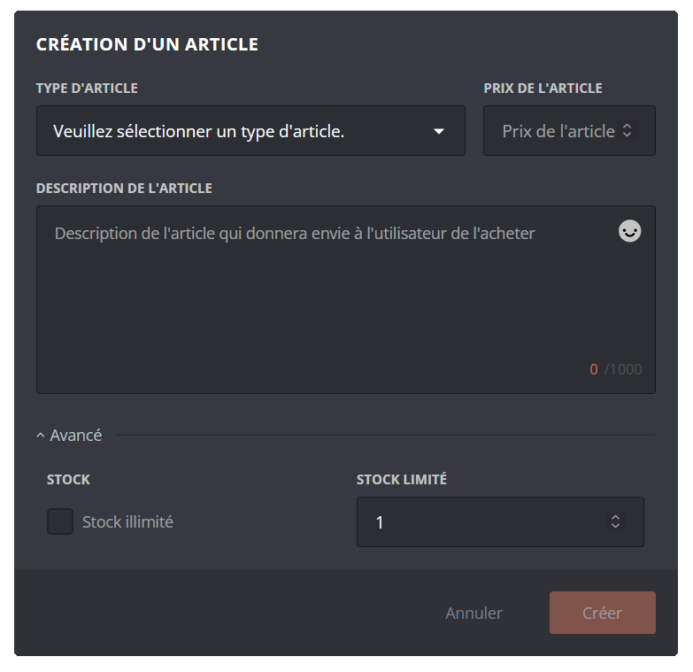
  ::

  ::tab{ label="Using the /config command" }
    Through the \</config> command, open the "Economy" menu > "Shop" > "Create / edit / delete an article".

    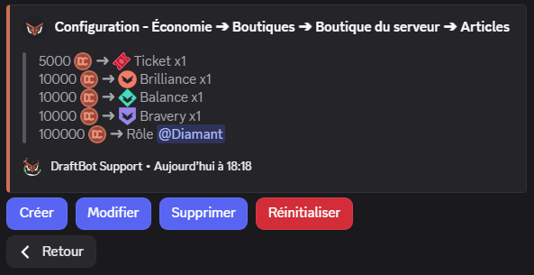
  ::
::

**Information common to every article type:**
- **Type**: the article type (role, temporary role, experience, item, custom)
- **Price**: the cost of the article in server money
- **Description**: a description of the article (1000 characters maximum)
- **Stock**: quantity available (see the [Stock of an article](#stock-of-an-article) section)

::tabs
  ::tab{ label="Role" }
    You can let your members obtain roles (temporary or permanent) in exchange for currency. To add a role to the shop, select the article type **"role"** or **"temporary role"** in the article creation menu.

    Then choose:
    - The price of the article
    - The role to assign
    - The description of the article
    - The duration of the role *(for a temporary role)*

    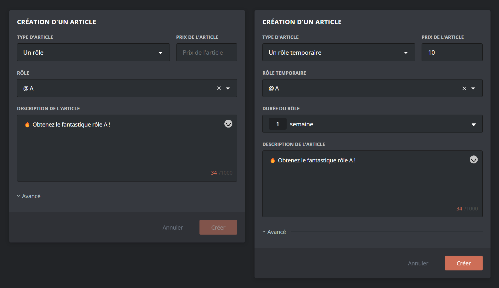

    ::hint{ type="warning" }
      The selected role must have been created on your server beforehand, and must be accessible to DraftBot (so it must not sit higher than DraftBot's highest role).
    ::

    ::hint{ type="info" }
      If a member tries to buy a role they already have, the purchase is refused with an explicit error message.
    ::
  ::

  ::tab{ label="Experience" }
    If the [level system](/docs/engagement/levels) is enabled, you can let your members buy experience points in exchange for currency. To add an amount of XP to the shop, select the article type **"Experience"** in the article creation menu.

    Then choose:
    - The price of the article
    - The amount of experience to grant
    - The description of the article

    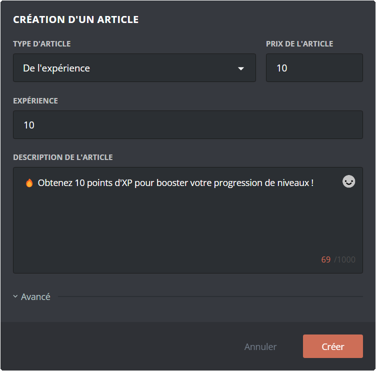

    ::hint{ type="warning" }
      The level system must be **enabled** on your server to use this article type. If you disable it, a warning is displayed at purchase time.
    ::

    **Specific behaviors:**

    - **Levelling up**: if buying XP makes the member level up, they automatically receive the configured level rewards and an announcement is sent (if enabled).
    - **Level cap**: if a maximum level is set ([premium](/premium) <:icon_premium:1096140508625125417> servers), members who have reached that level can no longer buy XP.
  ::

  ::tab{ label="Inventory item" }
    You can create fictional items to add to the inventory. To offer inventory items for sale in your shop, select the article type **"An inventory item"** in the article creation menu.

    Then choose:
    - The price of the article
    - The item to sell
    - The number of items granted per purchase
    - The description of the article

    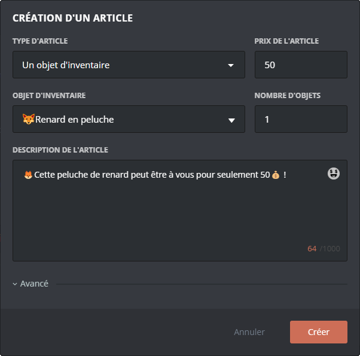

    ::hint{ type="info" }
      If you are not using the inventory yet, discover the feature in the [inventory documentation](/docs/engagement/inventory).
    ::
  ::

  ::tab{ label="Custom article" }
    If you want to let your members buy other articles, such as promotional codes, activation keys, or "real" objects, DraftBot has the answer!

    To add a custom article to the shop, select the article type **"A custom article"** in the article creation menu.

    Then choose:
    - The price of the article
    - The name of the article
    - The description of the article

    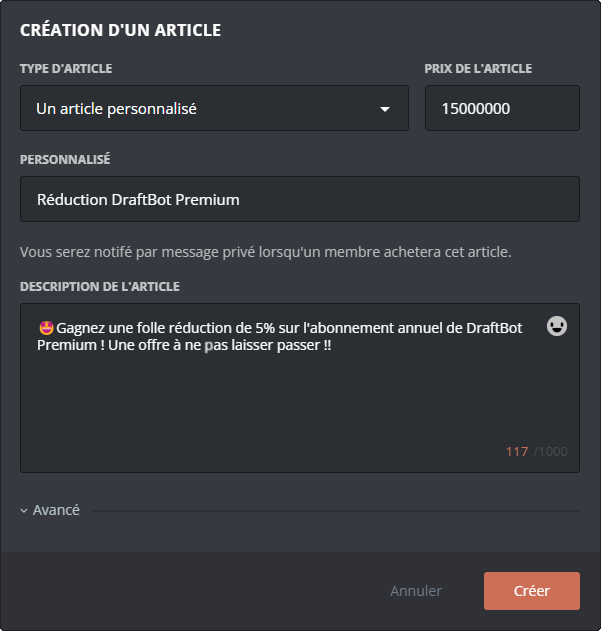

    ::hint{ type="success" }
      **How does it work?** When a member buys this article, **you receive a direct message notification from DraftBot** with the member's details. You can then hand the reward over in person, however you like.
    ::

    ::hint{ type="warning" }
      Make sure your direct messages are open so you can receive purchase notifications! If your DMs are closed, the member receives an error message at purchase time.
    ::
  ::
::

### Stock of an article

An article has an unlimited quantity by default. By expanding the "Advanced" menu, [premium](/premium) <:icon_premium:1096140508625125417> servers can set a **limited stock** for each article. Once it runs out, the article can no longer be bought until you restock it manually.

::hint{ type="info" }
  Stock is managed article by article. You can have some articles with unlimited stock and others with a limited quantity in the same shop.
::

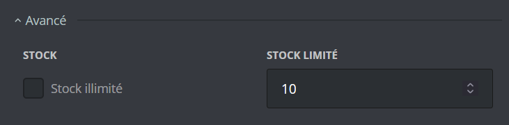

## Managing members' money

As an administrator, you have several commands to manage members' money:

| Command | Description |
|----------|-------------|
| \</dropmoney> | Creates a message with a button: the **first member** to click wins the money. You can set a time limit (**10 minutes** maximum). |
| \</adminmoney add member> | Adds money to a specific member. |
| \</adminmoney add server> | Adds money to **every member** of the server (asynchronous operation). |
| \</adminmoney add role> | Adds money to every member holding a **specific role** (asynchronous operation). |
| \</adminmoney remove member> | Removes money from a member. |
| \</adminmoney remove server> | Removes money from **every member** of the server (asynchronous operation). |
| \</adminmoney remove role> | Removes money from every member holding a **specific role** (asynchronous operation). |
| \</adminmoney set> | Sets a member's money to an exact amount (replaces their current money). |
| \</adminmoney transfer> | Transfers money from one member to another (the giver loses the transferred money). |
| \</adminmoney reset server> | **Resets all the money on the server**. This action cannot be undone! |

::hint{ type="info" }
  Admin commands can only be used by members of your server holding the **administrator permission**.
::

::hint{ type="info" }
  **Bulk operations**: commands targeting "every member" or "a role" run **asynchronously**.
  A progress message is displayed and updates automatically. You can cancel the operation at any time with the button provided.
::

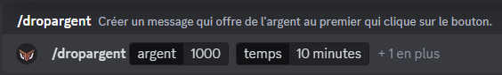

## Migrating from UnbelievaBoat

If you were already using an economy system through UnbelievaBoat, you can import your members' money into DraftBot's economy system!

The feature is available through the \</config> command, in the "Economy" tab.

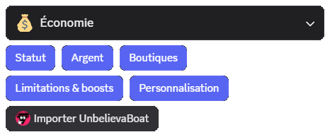

After clicking **Import UnbelievaBoat** and confirming that you want to proceed with the import, DraftBot automatically retrieves all of the members' money information. The imported money **replaces** the members' current money in DraftBot.

::hint{ type="warning" }
  Make sure UnbelievaBoat is present on your server at the time of the import!
::

::hint{ type="info" }
  The import can be run again later if needed, but it will overwrite the DraftBot balances again with the UnbelievaBoat values of the moment.
::
