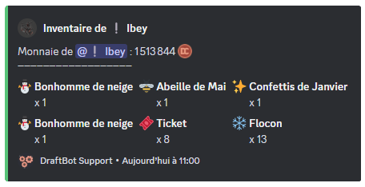
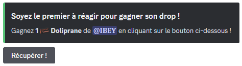
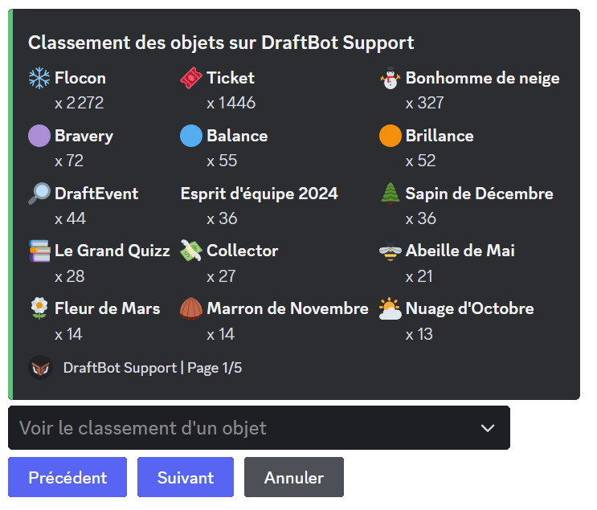

## Obtaining an item

There are several ways to obtain an item:

| Reward | Description |
|------------|-------------|
| **Level rewards** | Configurable through the \</config> command ➜ "[Levels](/docs/engagement/levels)" or through the web panel |
| **Buying in the shop** | Configurable through the \</config> command ➜ "[Economy](/docs/engagement/economy)" or through the web panel |
| **Birthday gifts** | Configurable through the \</config> command ➜ "[Birthdays](/docs/engagement/birthdays)" or through the web panel |
| **Giveaways** | When using the \</giveaway create> command |
| **Trades between members** | With the \</item> command |
| **The \</dropitem> and \</item drop> commands** | They generate a message where you have to be the fastest to grab the item |

After choosing the item, two additional optional settings are available:

- `time` ➜ To set a drop duration between 1 and 10 minutes.
- `channel` ➜ To set the channel where you want to send the drop.

## Managing a member's inventory

With the \</admininventory> command, you can, as an **administrator**, manage the inventory of a member of your Discord server.

Several options are available:

| Command | Description |
|----------|-------------|
| \</admininventory add member> | Adds an item to a member's inventory |
| \</admininventory add server> | Adds an item to **every member** of the server (asynchronous operation) |
| \</admininventory add role> | Adds an item to every member holding a **specific role** (asynchronous operation) |
| \</admininventory delete> | Deletes an item from the server for good |
| \</admininventory rename> | Renames an item in every inventory on the server |
| \</admininventory merge> | Merges two inventory items into one |
| \</admininventory transfer> | Transfers an item, a quantity of an item or a member's whole inventory to another member |
| \</admininventory remove member> | Removes an item from a member's inventory |
| \</admininventory remove server> | Removes an item from **every member** of the server (asynchronous operation) |
| \</admininventory remove role> | Removes an item from every member holding a **specific role** (asynchronous operation) |
| \</admininventory reset member> | Empties a member's inventory entirely |
| \</admininventory reset server> | Resets the inventory of every member of the server |

::hint{ type="info" }
  **\</admininventory add>**: when adding an item to a member, you can choose between adding an **existing item** or **creating one**.
::

::hint{ type="info" }
  **Bulk operations**: commands targeting "every member" or "a role" run **asynchronously**.
  A progress message is displayed and updates automatically. You can cancel the operation at any time with the button provided.
::

## Displaying your inventory

Server members can access **their own inventory** at any time using the \</inventory> command. If the member owns items, they are displayed, and they can also see the money they hold thanks to DraftBot's [economy](/docs/engagement/economy) system.

::hint{ type="info" }
  You can view another member's inventory by **mentioning** them or by using their **username** after the command. For example: `/inventory member:@Username`.
::

## Trading an item

There are a few ways to trade an item with another member through the \</item> command, **selecting** the member you want to trade with:

| Command | Description |
|----------|-------------|
| \</item give> | Gives an item to a member |
| \</item sell> | Sells an item to a member |
| \</item exchange> | Exchanges an item with a member |

## The /dropitem and /item drop commands

The \</dropitem> and \</item drop> commands generate a message and grant the item to the first person who clicks the button (**"Recover!"** for \</dropitem>, **"Claim!"** for \</item drop>) within a set time between 1 and 10 minutes[^1].
[^1]:By default the drop lasts one minute.

**What is the difference between the two, though?**

- \</dropitem> ➜ Generates a new item to start the drop.
- \</item drop> ➜ Gives away an item taken from a member's inventory.

::hint{ type="info" }
  In both cases, you can choose the channel where the drop is started and how long it lasts.
::

## Checking the server's inventory items

You can check the items existing on the server with the \</topitems> command. A selector at the bottom of the message lets you pick an item and see who owns it and in what quantity.

