## Overview

The birthday system lets members share their birthday easily. With it, you can give them special attention to celebrate that day.
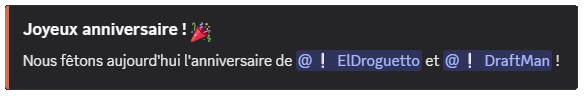

## Your birthday

You can set your birthday through [the **DraftBot** panel](/dashboard/user/profil) or with the \</birthday set> command. Put your birth date in the `Date` argument.

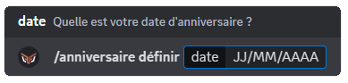

You can also see the list of the next ten birthdays set on the server with the \</birthday list> command.

::hint{ type="warning" }
  Note that changing the day or the month of your birth date triggers a progressive waiting time before the next change.

  - 1st change: 1 day
  - 2nd: 2 days
  - 3rd: 6 months
  - 4th and beyond: 1 year
::

## Changing the visibility of your birthday

With the \</birthday enable> and \</birthday disable> commands, you can turn the visibility of your birthday on or off, **server by server**. You can also change these settings from the panel, in the [profile](/dashboard/user/profil) section.

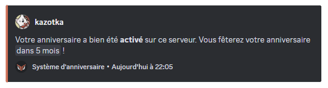

::hint{ type="info" }
  You can disable the visibility of your birthday on every server with the \</birthday remove> command.
::

## Configuration

### Birthday mode

Before setting up birthdays on your server, you have to choose the mode you want to use.

| Public mode | Private mode |
|-------------|------------|
| Birthdays are the same as those in the global database | The birthdays that are set are only available on your server |
| Requires a single setup for the user | Lets the user set a birth date only on your server |
| You cannot control members' birthdays | You can delete, edit or add a member's birthday on your server |
| More reliable for granting rewards | Better suited to a roleplay server where dates are fictional |

Once your mode is selected, you can start configuring the system.

::tabs
  ::tab{ label="From the panel" }
    [⫸ Open the **DraftBot** panel](/dashboard/first/birthdays)

    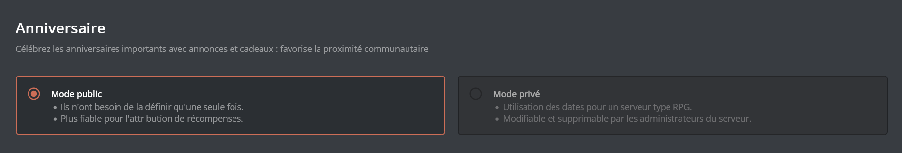
  ::

  ::tab{ label="Using the /config command" }
    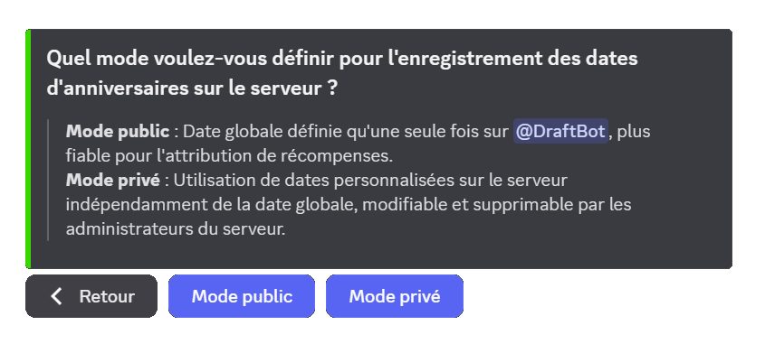
  ::
::

### Announcement messages

When one of your members has their birthday, you can send an announcement in a chosen channel.

You need to set the following:
- **Sending channel:** choose the text channel where the announcement is sent
- **Sending time:** choose the time at which the message is sent
- **Role to mention:** you can choose a role to mention in the announcement
- **Allowed / forbidden roles:** you can decide which roles can trigger the announcement
- **Custom message:** you can write a custom message for the announcement.

::tabs
  ::tab{ label="From the panel" }
    [⫸ Open the **DraftBot** panel](/dashboard/first/birthdays)

    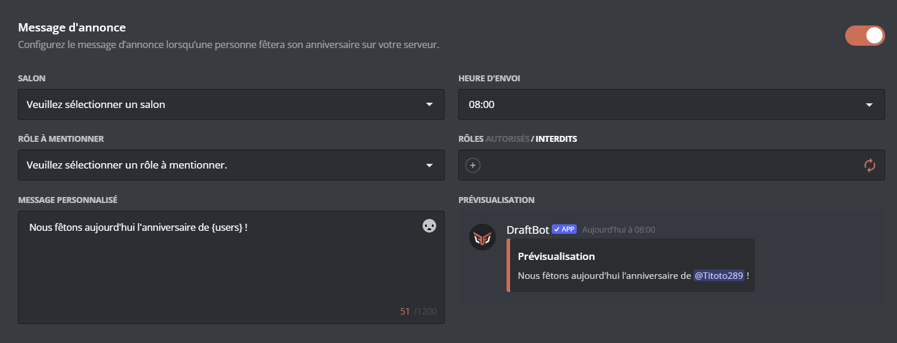
  ::

  ::tab{ label="Using the /config command" }
    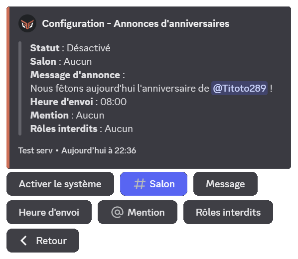
  ::
::

You can customize your message with several variables:

| Variable | Description | Example |
|----------|-------------|---------|
| `{user}` | Member(s) celebrating their birthday | @John, @Jane |
| `{role}` | Temporary birthday role | @Birthday |
| `{gifts}` | Rewards granted | 500 💰, VIP role |

*In addition to the [other variables](/docs/misc/variables) already available globally!*

### Temporary role

You can choose to grant a role, for the day, to the member celebrating their birthday. To do so, select the role to grant. You can also set which roles can or cannot receive the **temporary role**.

::hint{ type="info" }
  If you do not want any restriction, do not select any role and check that the word `forbidden` is in bold
::

::tabs
  ::tab{ label="From the panel" }
    [⫸ Open the **DraftBot** panel](/dashboard/first/birthdays)

    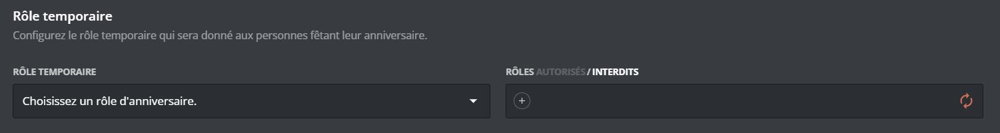
  ::

  ::tab{ label="Using the /config command" }
    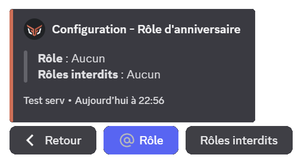
  ::
::

### Birthday gift

You can choose a gift to grant to members celebrating their birthday. Here are the gifts you can offer:

::tabs
  ::tab{ label="Role" }
    You can offer roles to your members. To add a role to the gifts, select the **"Role"** type.

    Then choose the role to offer.

    ::hint{ type="warning" }
      The selected role must have been created on your server beforehand, and must be accessible to DraftBot (so it must not sit higher than DraftBot's highest role).
    ::
  ::

  ::tab{ label="Experience"}
    If the [level system](/docs/engagement/levels) is enabled, you can offer experience to your members. To add experience to the gifts, select the **"Experience"** type.

    Then choose the amount of experience to offer.
  ::

  ::tab{ label="Money" }
    If the [economy system](/docs/engagement/economy) is enabled, you can add a fictional amount of money to the gifts. To add an amount of money to the gifts, select the **"Money"** type.

    Then choose the amount of money to offer.
  ::

  ::tab{ label="Inventory item" }
    You can offer fictional items to your members. To offer inventory items as gifts, select the **"Inventory item"** type.

    Then choose:
    - The item to offer
    - The number of items to grant
  ::

  ::tab{ label="Custom gift" }
    If you want to offer your members something else, such as promotional codes, digital activation keys, or "real" objects, DraftBot has the answer!

    To add a custom gift, select the **"Custom gift"** type.

    Then choose the name of the article.

    ::hint{ type="success" }
      When a member receives this gift, DraftBot notifies you in your direct messages, so you can hand it over in person.
    ::
  ::
::

::hint{ type="info" }
  You can offer up to 2 birthday gifts. [Premium](/premium) <:icon_premium:1096140508625125417> servers can go up to 5.
::

::tabs
  ::tab{ label="From the panel" }
    [⫸ Open the **DraftBot** panel](/dashboard/first/birthdays)

    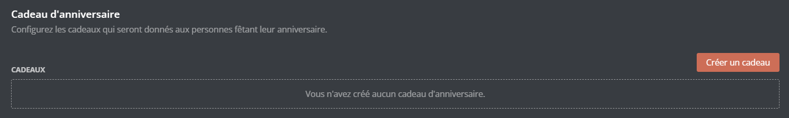
  ::

  ::tab{ label="Using the /config command" }
    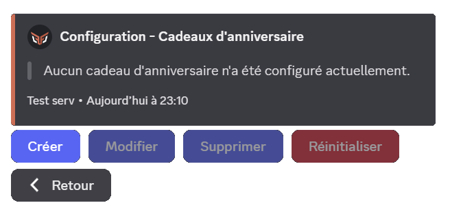
  ::
::

### Targeted birthday messages

You can also set a more personal message for certain roles or members.
In the `Custom announcements` section, choose the role or member concerned as well as the sending channel. You can then write your message. You can also choose whether the members concerned by this announcement will be able to see it in advance if they have the Administrator permission.

::hint{ type="info" }
  The sending time is the same as for the other announcements
::

::tabs
  ::tab{ label="From the panel" }
    [⫸ Open the **DraftBot** panel](/dashboard/first/birthdays)

    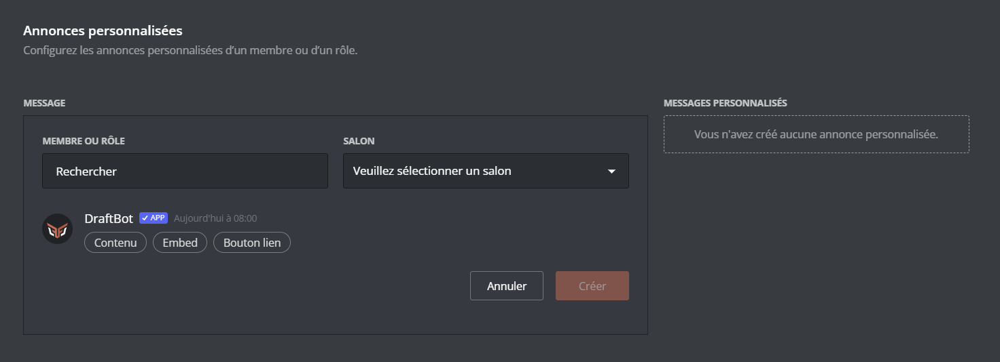
  ::

  ::tab{ label="Using the /config command" }
    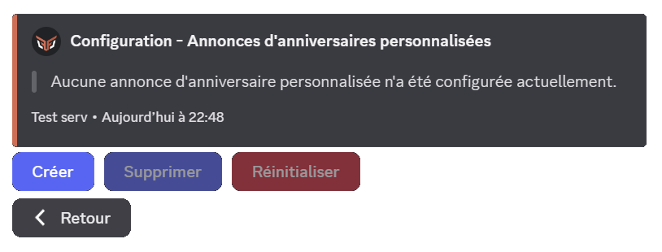
  ::
::

::hint{ type="info" }
  This feature is reserved for [premium](/premium) <:icon_premium:1096140508625125417> servers.
::

