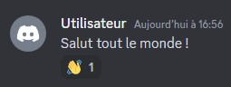
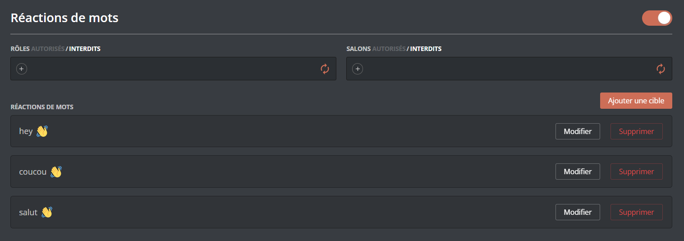
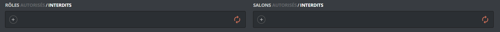
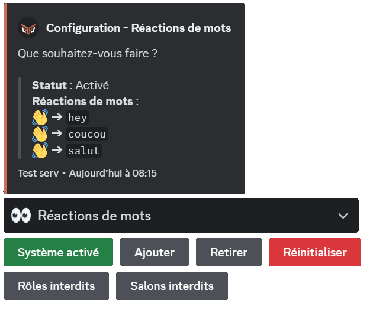
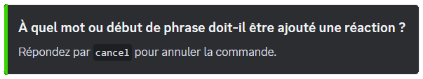

## What is it for?

The word reactions system lets **DraftBot** react to messages beginning with a predefined word, using one or more chosen reactions. Here is a preview of the message:

::hint{ type="info" }
  The bot only reacts when the word is at the **beginning of the sentence**.
::

## Configuration

::tabs
  ::tab{ label="From the panel" }
    [⫸ Open the **DraftBot** panel](/dashboard/first/words-reactions)

    

    ### Enabling / disabling the system

    You can enable or disable the word reactions system with a button in the top right corner of the page.

    ### Adding a word reaction

    You can add a word reaction by putting an **emoji** in the emoji field and the word concerned in the "Please enter a sentence beginning" field. You can then "Add" the word reaction.

    ::hint{ type="warning" }
      You cannot add an emoji coming from another server.
    ::

    ::hint{ type="info" }
      You can set up a reaction for 10 words. [Premium](/premium) <:icon_premium:1096140508625125417> servers can have up to 5 reactions for the same word, and have no limit on the number of words.
    ::

    ### Editing a word reaction

    To edit a word reaction, click the "Edit" button of the word reaction concerned. The fields at the top are pre-filled: you can change the emoji and the word there. Click "Replace" for the change to be applied.

    ### Restricting reactions

    
    You can decide which roles and/or channels DraftBot will not react to.

    ::hint{ type="info" }
      You can also choose to let only certain roles trigger the bot's reactions.
    ::

    ### Deleting a word reaction

    To delete a word reaction, click the "Delete" button of the word reaction concerned.

    ::hint{ type="info" }
      Deletion cannot be undone, but a confirmation is requested.
      > The message in question: "Warning, you have unsaved changes!".
    ::
  ::

  ::tab{ label="Using the /config command" }
    > Below is the word reactions configuration through the \</config> command.

    ### Enabling the word reactions system

    

    To enable the word reactions system, go to the "👀 Word reactions" system, then click "Enable the system".

    ::hint{ type="info" }
      To disable the system, follow the same steps: click the "Enable the system" button, which will have become "Disable the system".
    ::

    ### Adding word reactions

    To add a reaction to a word, click the "Add" button. You will then get the message below:

    

    ::hint{ type="warning" }
      You cannot add an emoji coming from another server.
    ::

    ::hint{ type="info" }
      You can set up a reaction for 10 words. [Premium](/premium) <:icon_premium:1096140508625125417> servers can have up to 5 reactions for the same word, and have no limit on the number of words.
    ::

    ### Deleting word reactions

    If you want to delete a specific reaction, click the "Remove" button. A selector is displayed, letting you choose the word reaction to delete.

    ### Listing word reactions

    You can see the word reactions on your server from the word reactions configuration tab. You will then get a list with all of your word reactions.

    ### Restricting reactions

    You can decide which roles and/or channels DraftBot will not react to.

    ### Resetting the system

    If you want to delete **every** word reaction, click the "Reset" button.

    ::hint{ type="danger" }
      A reset cannot be undone! Once done, it restores the three default word reactions, namely "hey", "coucou" and "salut" with the "👋" reaction.
    ::
  ::
::

