## Creating a message

You can create a message on the panel by [**`clicking here`**](/dashboard/first/messages).

The panel lets you create and send messages that are 100% customizable to your needs.

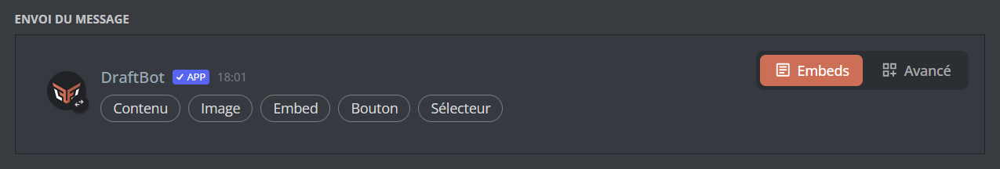

At the top of the editor, you first choose the **format** of your message:
- **Embeds:** the classic format, described below. You compose your message with content, embeds, images, buttons and selectors.
- **Advanced:** a more flexible format, based on Discord's V2 components, detailed in the [Advanced mode](#advanced-mode) section.

::hint{ type="warning" }
  Switching format resets the content you are writing. This action cannot be undone; a confirmation is requested as soon as there is content to lose.
::

For the **Embeds** format, you add text, images or content using the `Content`, `Image` and `Embed` buttons.

::hint{ type="info"}
  The `Button` and `Selector` buttons let you create an interactive experience for your members. To learn more about how they work, see the [interactions](#interactions) section!
::

### Content
By pressing the **Content** button, you can write a classic message with **DraftBot**. You can include native emojis or those of your Discord server.

You can generate dynamic times ([timestamps](/docs/misc/timestamps)) easily with the <:editor_timestamp:1520828760524591154> button. These times automatically adapt to the time zones of your server's users.

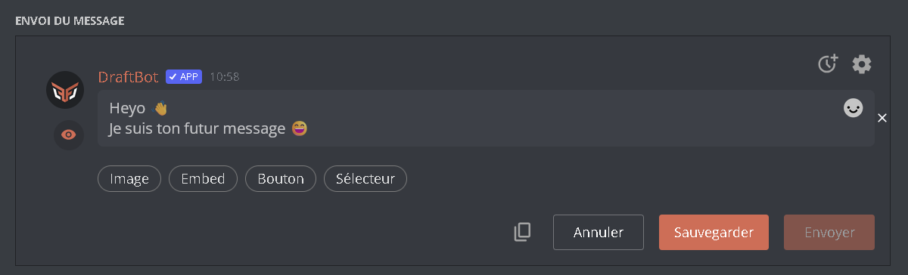

::hint{ type="info" }
  Because of restrictions imposed by Discord, the content is limited to 2000 characters.
::

### Richer autocompletion

By typing a trigger character in any text field, **DraftBot** offers you a smart list:
- `#` your **channels**.
- `@` your **roles** and your **members**.
- `/` the bot's **commands**, inserted as a clickable mention.
- `:` the **emojis**, both custom server ones and native ones.
- `{` the dynamic **variables**.

::hint{ type="info" }
  Autocompletion works in every text field of the panel: Content, Embed, Text.
::

### Adding an image

By pressing the **Image** button, you can add an image directly to your message. Clicking it lets you choose whether to import an image from your device or from a link.

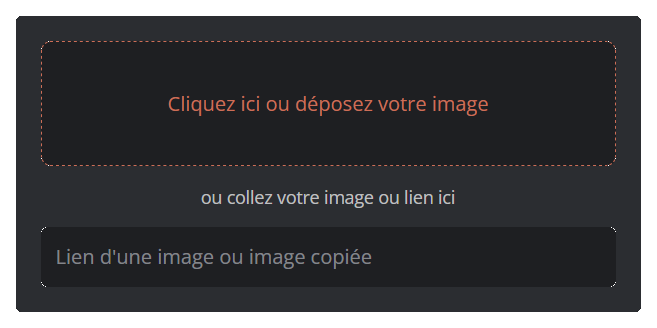

Two options are available for each image:
- **Description (alt text):** a text describing the image. It improves accessibility (screen readers) and is displayed if the image cannot be loaded. The description is limited to `1024` characters.
- **Spoiler:** hides the image behind a veil. Your members have to click it to reveal it.

You can also group several images in a **gallery**, up to `10` images: Discord then displays them side by side as a grid.

::hint{ type="info" }
  The supported image types are: `png`, `jpg`, `jpeg`, `gif`, `webp`.
::

### Embed

By pressing the **Embed** button, you can write a detailed message gathering several pieces of information.

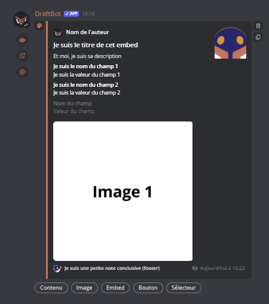

Here is what each text area means:
- **Author name:** you can put text here to introduce the author, your username or the name of your server.
- **Title:** you can enter your embed's title. You can also add a link easily with the <:title_link:1389707183377088572> button that appears when you write.
- **Description:** this is where you put the body of your message. [Discord Markdown](/docs/misc/markdown) (**bold**, *italic*, etc.) can be used in this area.

::hint{ type="info" }
  You can put up to `4096` characters in the description.
::
- **Fields:** you can insert several organized text areas here (title and content). "Field" blocks are separated from each other by a larger line spacing.
    - **Field name:** the text in this area appears in **bold**.
    - **Field value:** this is a text area, you can fill it however you like.

    ::hint{ type="info" }
      The number of fields is limited to `25` per embed. The "Value" part of a field can contain up to `1024` characters.

      You can also reorder your fields and change their alignment (vertical or horizontal) by clicking the <:inline:1389707180994990172> button that appears when you fill in a field.
    ::
- **Footer:** you can add a text to close your message. It is displayed very small, at the bottom of your embed.
- **Timestamp:** by pressing the <:timestamp_eye:1389707185088499712> button, you can choose whether the message's sending time appears at the bottom of the embed.
- **Images:** the orange boxes are areas where you can insert an image. Clicking them lets you choose whether to import an image from your device or from a link. An embed can display up to `4` images as a gallery.

::hint{ type="danger" }
  Your message as a whole cannot contain more than `6,000` characters.
::
Several buttons sit to the right and left of the embed editor:
- <:editor_color:1520826844495085760>: lets you change the color of the bar to the left of the embed. You can also choose **No color**: in that case, Discord automatically applies a color suited to the theme (light or dark) of each person reading the message.
- <:editor_duplicate:1520826881530790059>: lets you duplicate your embed easily. The copy created appears just below the first one.
- <:editor_delete:1520826862459420774>: lets you delete the associated embed.

::hint{ type="warning" }
  Deleting an embed cannot be undone.
::

### Mentions

When your message contains mentions (a member, a role, `@everyone` or `@here`), the **Mentions** button lets you control precisely who is actually notified. This is handy for writing a mention without sending a notification to everyone.

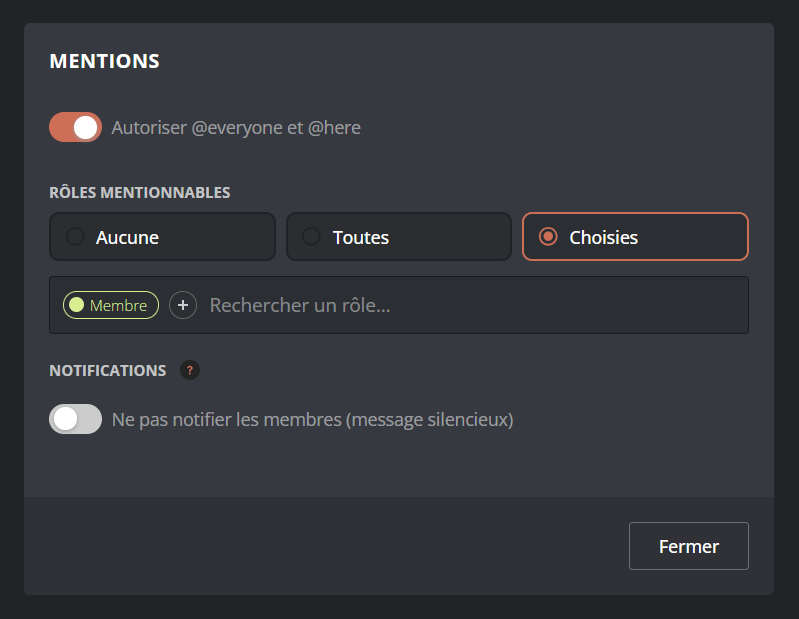

::hint{ type="info" }
  Only the mentions already present in your message's text appear in this menu. This setting is not there to add mentions, but to decide which ones trigger a notification.
::

For roles as for members, you can choose between three modes:
- **None:** the mention is displayed but notifies nobody.
- **All:** every mention of that type notifies the people concerned.
- **Selected:** you pick precisely which roles or members are notified.

Two options are also available:
- **Allow `@everyone` and `@here`:** enable this if you want these global mentions to notify members.
- **Silent message:** the message is sent without notification (no sound, no push notification). Members only see an unread message badge, even if they are mentioned.

::hint{ type="info" }
  Mentions placed in an embed never trigger a notification, whatever this setting.
::

### Sending your message

To send your message after writing it on the panel, choose a sending channel at the top of the page, then click the `Send` button.

Your message has been sent according to your settings.

::hint{ type="info" }
  You can edit your message if you have forgotten something.
::

### Retrieving a message

You can retrieve a message by pressing the orange `Retrieve a message` button in the top right corner of the page. A menu then appears to find the message through the message ID and its original channel. You can also find the message through the message link.
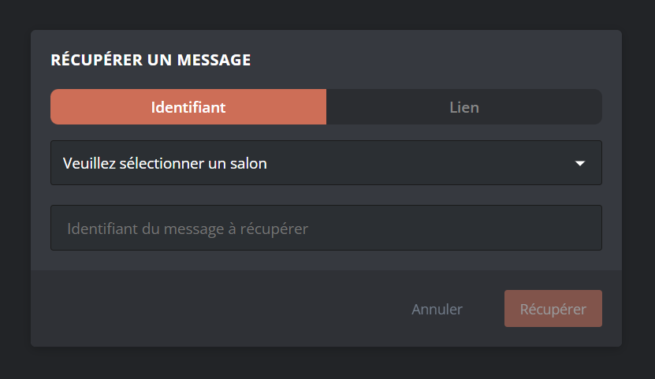

::hint{ type="warning" }
  You cannot retrieve a message that has been deleted from the channel.
::

A message sent in the **Advanced** format reopens directly in the **Advanced** editor: if the editor is in Embeds mode at retrieval time, it switches automatically. You will be able to edit it, but Discord does not allow it to be converted back to the Embeds format.

Once your message has been retrieved, you can edit it however you like.

## Advanced mode

**Advanced** mode (based on Discord's V2 components) is a message format available from the [panel's editor](/dashboard/first/messages). Instead of the fixed structure of embeds, it offers a system of **blocks** you assemble and reorder freely: you stack text, images, separators, buttons and selectors in the order of your choice, and you can group them in colored containers.

This format is well suited when the Embeds format holds you back: for a free layout, several image galleries, or blocks pairing a text with a thumbnail or a button.

To enable it, use the format selector at the top of the editor and choose **Advanced**.

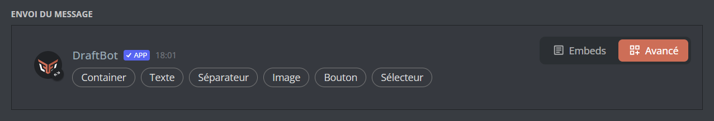

::hint{ type="warning" }
  Switching between **Embeds** and **Advanced** resets the content in progress: this action cannot be undone. A confirmation is requested as soon as there is content to lose.
::

::hint{ type="danger" }
  Discord does not allow a message already sent in **Advanced** mode to be converted back to the classic format. In practice:
  - a message sent in **Embeds** and then edited in **Advanced** is converted for good: you will not be able to switch it back to Embeds;
  - a message sent in **Advanced** can only be edited in **Advanced**. If you switch the editor back to **Embeds**, sending creates a new message instead of editing the old one.
::

As in the Embeds format, the **Mentions** button remains available in Advanced mode: you control who is notified and you can send a silent message (see [Mentions](#mentions)).

A button bar lets you add the following blocks to your message:

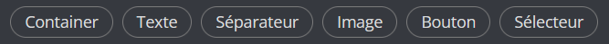

::hint{ type="info" }
  Every block can be reordered by drag and drop (including into or out of a container) and can be duplicated or deleted. A message cannot exceed `40` components.
::

### Text

A simple text block. [Discord Markdown](/docs/misc/markdown) (**bold**, *italic*, etc.), emojis and [timestamps](/docs/misc/timestamps) can be used there. You can add several text blocks to the same message.

From a text block, you can also add an **image** (as a thumbnail) or a **button** to its right.

### Images

Adds one or more images as a **gallery**, arranged automatically in a grid. A gallery can contain up to `10` images. As in Embeds mode, each image can be given a **description** (alt text, `1024` characters maximum) and marked as a **spoiler**.

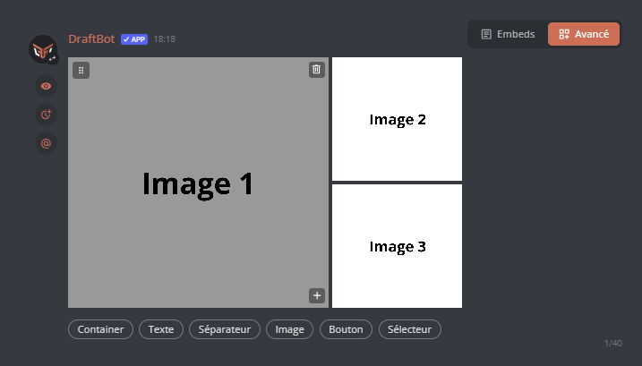

### Separator

Inserts a space between two blocks to give your message room to breathe. You can:
- show or hide the separating **line**;
- choose **large** or **compact** spacing.

### Container

The container (**Container** button) groups several blocks (text, images, separators, buttons, etc.) inside a frame, in the manner of an embed. You can give it an **accent color** (the colored bar on the left) or none at all, and hide its whole content behind a **spoiler**.

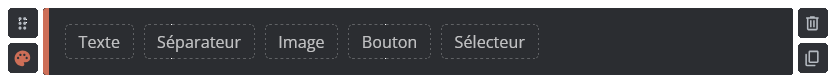

::hint{ type="info" }
  A container cannot contain another container.
::

### Button and Selector

**Buttons** and **selectors** trigger the same [actions](#possible-actions) as in Embeds mode. You can lay them out in **rows**: a row accepts up to `5` buttons, while a selector takes up a row on its own.

## Interactions

You can create **buttons** and **selectors** that the members of your server can use. These buttons and selectors trigger actions you have programmed beforehand (adding roles, sending a message or interacting with **DraftBot** features). You can also set conditions for certain interactions. They work in the **Embeds** format as well as in **Advanced** mode.

::hint{ type="warning" }
  For a message containing one (or more) interaction(s) to work, it **has to** be saved on the panel.
::

::hint{ type="info" }
  You can save up to 5 messages on the panel. On [premium](/premium) <:icon_premium:1096140508625125417> servers, this limit rises to **200**.
::

### Interactive buttons

To create a button, click the button named `Button` in the editor.

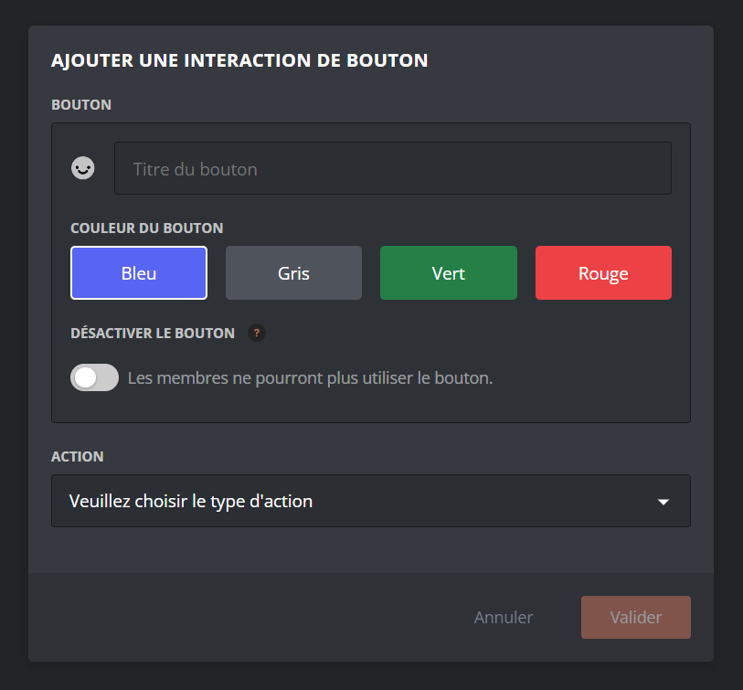

This menu lets you configure:
- The **name** of the button (it is displayed on the button, and visible to everyone);
- An **emoji** of your choice, displayed on the button, to the left of the name. Your server's emojis are accepted, including animated ones!
- The **color** of the button: you can choose between blue, grey, green and red;
- The [**action**](#possible-actions) triggered when a user clicks the button.

### Interactive selectors

A selector is a button displaying a dropdown menu when clicked. Each line of that menu can trigger a separate action.

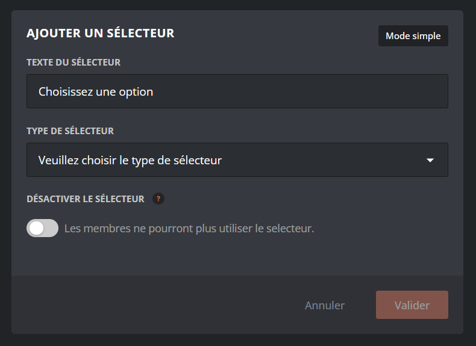

To create an interactive selector, click the button named `Selector`. You can set the text displayed on your selector (by default: "*Choose an option*"). Then you can choose between two selector modes:
- **Simple mode**: every option of the selector triggers the same type of action among:
    - Sending ephemeral messages
    - Adding and removing roles
    - Opening tickets
    - Buying shop articles
- **Advanced mode**: you can configure a different type of action for each option of the selector, among:
    - Send a new message
    - Send a saved message
    - Add and remove roles
    - Open a ticket
    - Buy an article
    - Submit a suggestion

    ::hint{ type="info" }
      **Simple mode** is ideal for allowing several choices within the same action, for example *selecting a role to obtain from a list*.
      **Advanced mode** is ideal for messages that need to do several different things from the same place, for example *choosing a role OR displaying an ephemeral message for more information*.
    ::

### Possible actions

Here are the different actions you can attach to a button or to a selector option.

::hint{ type="info" }
  Most of these actions can be restricted so that they only work under certain conditions. For example, you can reserve an action for members holding a certain role.
::

#### Send a new message
This action sends a new message automatically through **DraftBot**.
In the "Target type" menu, you can choose how the message is sent:
- **Hidden answer to message**: an ephemeral message only visible to the user who triggered the action.
- **In a channel**: DraftBot posts the message in the channel of your choice. (you have to choose the target channel in the "Message sending channel" section).
- **Private message**: DraftBot sends the message directly to the user, in their direct messages.

Once your choice is made, you can create your message using the editor included directly in the selector's configuration menu:
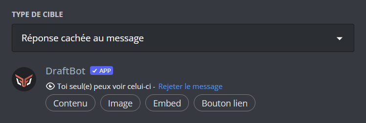

#### Send a saved message
If you have already written and saved a message, this action sends it when the button is clicked. Once the message has been selected, you can set how to send it ("hidden answer", "in a channel" or "private message").

#### Add and remove roles
With this action, you can let users assign or remove roles themselves by simply interacting with the message. DraftBot lets you choose between several styles of behavior for this action:
- **Classic:** when the user clicks the button, **DraftBot** gives them the matching role, or removes it if they already have it.
- **Fix:** when the user clicks the button, DraftBot gives them the matching role, but once the role has been obtained, clicking the button again does not remove it.

::hint{ type="info" }
  This option is particularly suited to situations where you do not want to let members change their mind.
::
- **Unique:** the user can only have one role among those offered by the message. If they choose another button granting another role, their previous role is removed.

You then have to set which roles are granted or removed (you have to set at least one). A checkbox lets you set whether the role is applied temporarily or not. If the role is temporary, you have to set how long the user keeps it before it is removed automatically.

#### Open a ticket
This action lets users open a [ticket](/docs/communication/tickets) easily.

You can set whether the ticket is sent with a reason you have predefined, or whether you want to let the user write the opening reason themselves.

::hint{ type="success" }
  If you use this action in a selector, you can, for example, offer several predefined reason choices.
::

#### Buy an article
When triggered by the button, this option makes the user immediately buy a predefined [shop](/docs/engagement/economy#shop) article. To do so, you have to set the article to be bought. It is bought at the price set in the [Shop](/docs/engagement/economy#shop) module.

::hint{ type="warning" }
  When a user clicks this button, DraftBot carries out the purchase immediately if the user has the necessary amount. No confirmation is requested beforehand.
::

#### Submit a suggestion
With this action, DraftBot lets you make [suggestions](/docs/engagement/suggestions) easier to reach with a single click on a button. You can choose whether interacting with this button opens the user's main suggestions menu, or the form for creating a new suggestion directly.

#### Redirect to a link
This action redirects the user to the URL of your choice when they click the button.

::hint{ type="info" }
  You cannot choose the button's color. It is necessarily grey.

  This action is only available on buttons.
::

## Message profiles

A message profile is a fictional user in its own right, which you can use to send messages.

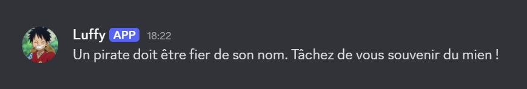

You can open the profiles by clicking DraftBot's profile picture.
Once in the menu, new profiles can be created through the <:edit:1389714236418298017> button.
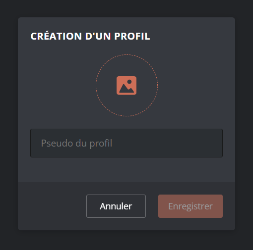
You can then import a profile picture or provide the link to an image. You also have to add a username.

Once your profile has been created, it can be used when designing your messages, whether through the panel or the \</say> and \</embed> commands.

::hint{ type="info" }
  You can find the link to a server's profile picture using the \</info server> command, or \</avatar> for a member.
::

## Sending through a command

As well as the panel, two commands let you send a message directly from Discord, without opening the dashboard. These commands use the classic **Embeds** format.

### The /say command

With this command, you can quickly send a message in a channel of your server. To use it, you need the **Administrator** permission or an override allowing you to use the command.
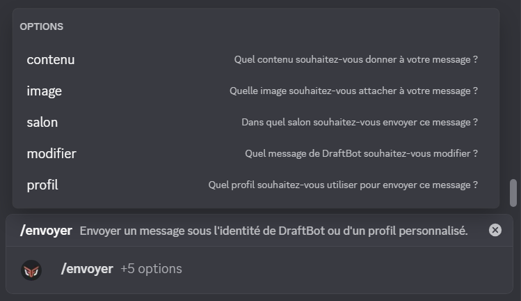
Here is what these parameters mean:
- **content**: the text for DraftBot to say, as a classic message.
- **picture:** you can attach an image to your message.
- **channel:** which channel should **DraftBot** send the message to? Leave it empty if it is the same channel as the one you are running the command from.
- **edit:** if you want to edit a message, use this extra field and include the link of the message to edit.

### The /embed command

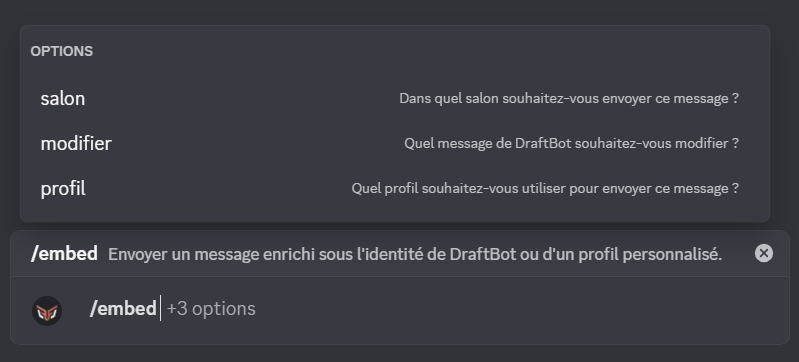
Here is what these parameters mean:
- **channel:** which channel should **DraftBot** send the message to? Leave it empty if it is the same channel as the one you are running the command from.

- **edit:** if you want to edit a message, use this extra field and include the link of the message to edit.
Once the command has been run, a menu appears. It is in this menu that you write your message.
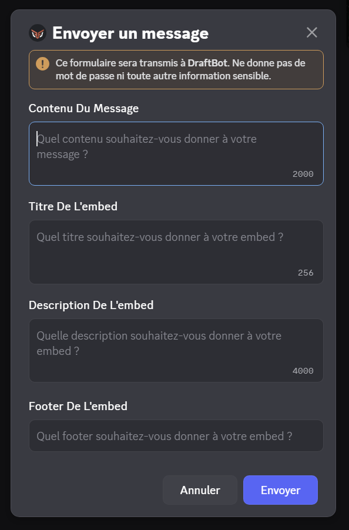
Each text area matches a type of content:
- **Content:** **DraftBot**'s text appears as a classic message.
- **Embed title:** this is your embed's title.
- **Embed description:** the text of your embed goes here.
- **Embed footer:** you can add a small text at the bottom of your embed.

::hint{ type="warning" }
  Deleting the embed cannot be undone: if you click the `Embed` button again after deleting it, a new **empty** embed appears.
::

