## Overview

The giveaways feature lets you run prize draws and offer rewards to the members of your server who take part.

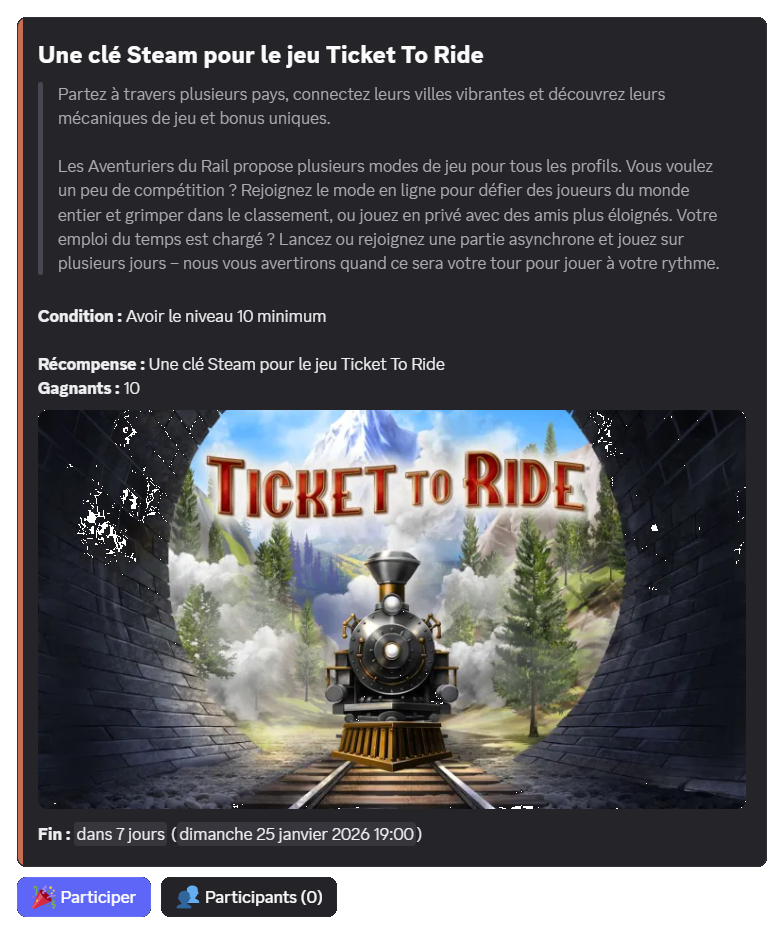

For each giveaway, you can offer one of these rewards:
- Experience in the [levels](/docs/engagement/levels) system.
- Money in the [economy](/docs/engagement/economy) system.
- An item from the [inventory](/docs/engagement/inventory) system.
- A role (temporary or not).
- A custom reward.

## Interacting with a giveaway

### Entering

You can enter an ongoing giveaway by clicking the "**Enter**" button below its details.

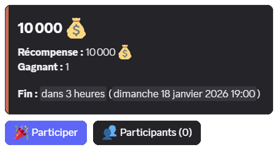

Your entry is then counted for the draw at the end of the giveaway.

::hint{ type="info" }
  We do not currently offer any feature letting a member enter a giveaway several times.

  Every participant in a giveaway therefore has the same chance of winning.
::

### Leaving

If you have joined a giveaway but no longer want to take part before it ends, you can click the "**Enter**" button again.

A confirmation is then requested: click the "**Leave**" button to confirm.

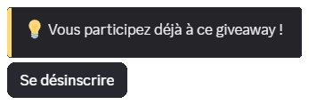

::hint{ type="warning" }
  If a collection condition (role, money or item) is set on the giveaway and you decide to leave, the collected element is not given back to you.
::

### Viewing the participants

If the giveaway's creator allowed it, you can see the list of participants by clicking the giveaway's "**Participants**" button.

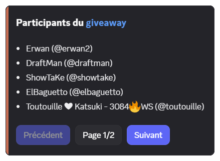

The interface is split into pages depending on the number of participants. You can then click the "**Previous**" or "**Next**" buttons, or choose the page number with the "**Page**" button.

::hint{ type="info" }
  If you are an administrator, you also have access to the "**Remove**" button, which deletes a member's entry. More information in the [dedicated section](#removing-a-participant).
::

## Access to the /giveaway command

The \</giveaway> command requires the **Administrator** permission by default.

You can, however, open this command to certain roles or members, regardless of their permissions on the server.

To do so, you can find more information on this documentation page:

::card
---
title: Managing command permissions
icon: material-symbols:build
to: /docs/installation#configuring-commands
target: _blank
color: '#cd6e57'
---
  Configure slash command permissions on your server.
::

## Creating a giveaway

You can create a giveaway using the \</giveaway create> command, filling in the command's options:

| Option | Description | Required |
|--------|-------------|-------------|
| `type` | The [type of reward](#overview). | ✅ Yes |
| `duration` | The duration of the giveaway, between one minute and one month (e.g. 2h, 7d) or a date (e.g. tomorrow at 5pm). | ✅ Yes |
| `winners` | The number of winners, between 1 and 10 (up to 50 for [premium](/premium) <:icon_premium:1096140508625125417> servers). | ✅ Yes |
| `title` | The title of the giveaway. | ❌ No |
| `channel` | The text channel where the giveaway is sent. | ❌ No (the command's channel by default) |

::hint{ type="info" }
  You can run up to 3 giveaways at the same time. [Premium](/premium) <:icon_premium:1096140508625125417> servers have no limit.
::

Once the \</giveaway create> command has been run, you are asked for the giveaway's reward:

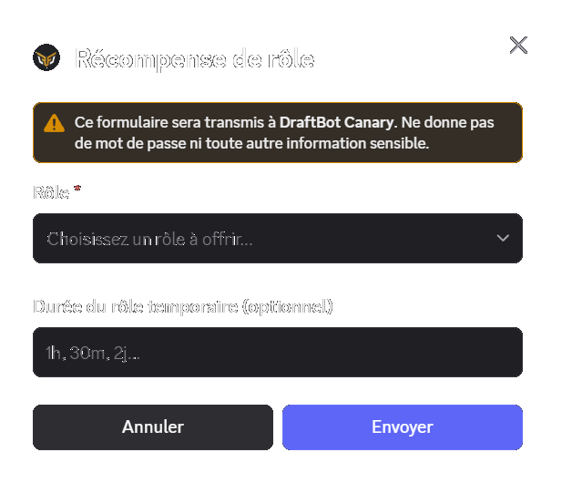

### Previewing the giveaway

Once the reward has been set, a preview of the giveaway is displayed. It lets you configure and edit it before publishing.

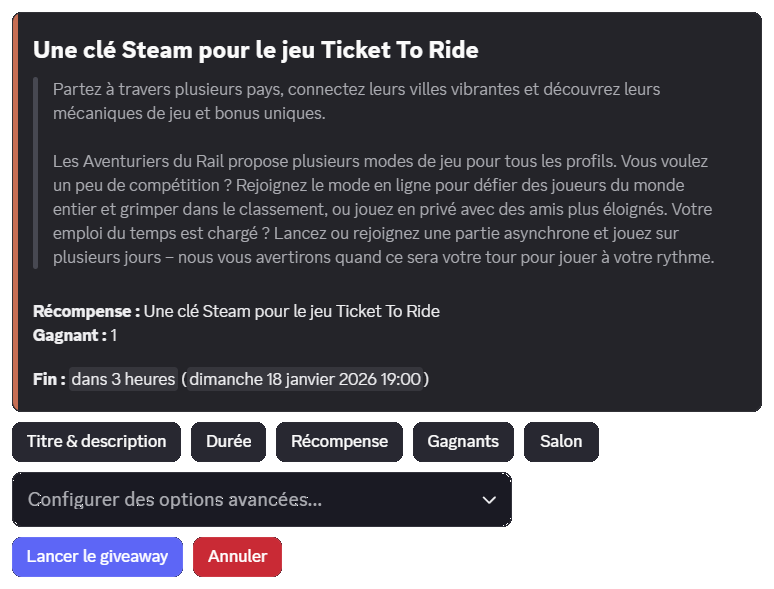

### Configuring the options

From the preview interface, you can configure options with the buttons available as well as the "Configure advanced options…" selector.

Every option is detailed in the [dedicated section](#giveaway-options).

### Publishing the giveaway

When you want to publish it, click the "**Launch the giveaway**" button.

::hint{ type="info" }
  Once the giveaway is over, the creator receives a direct message from <@DraftBot> telling them who won and reminding them of the reward.
::

## Giveaway options

### Title and description

You can set a title that is used in the giveaway message as well as in the messages sent to team members (end message, logs, etc.).

::hint{ type="info" }
  If no title is set, the name of the reward is used to name the giveaway.
::

You can also set a description to describe your reward to the participants.

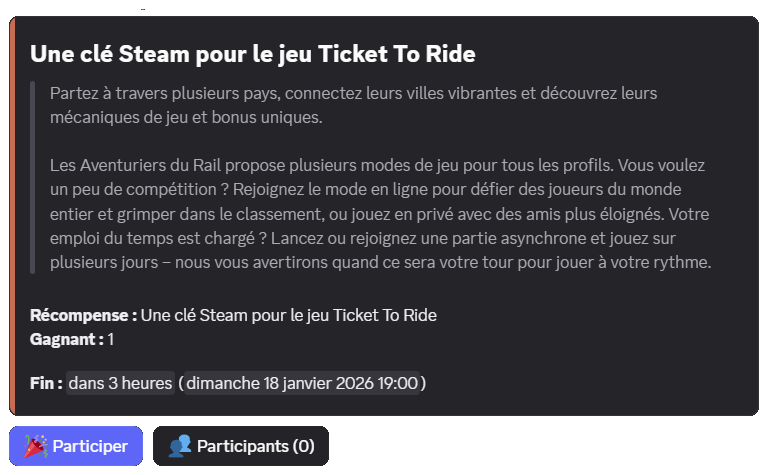

### Duration

The duration is the **time given to members** to enter a giveaway.

You can specify:
- either a duration, such as `1h`, `7 days` or `2 weeks`
- or a date, such as `tomorrow at 8pm` or `20/01 at 10am`.

::hint{ type="info" }
  The duration of the giveaway must be between one minute and one month.
::

### Reward

You can select **one of these rewards** for a giveaway:

- Experience in the [levels](/docs/engagement/levels) system.
- Money in the [economy](/docs/engagement/economy) system.
- An item from the [inventory](/docs/engagement/inventory) system.
- A role (temporary or not).
- A custom reward.

### Winners

You have to set the number of winners for your reward.

::hint{ type="info" }
  You can choose up to 10 winners. [Premium](/premium) <:icon_premium:1096140508625125417> servers can go up to 50 winners.
::

### Channel

You have to set a text channel to send the giveaway to. You can either use an existing channel or create a dedicated one.

::hint{ type="info" }
  By default, the channel used is the one where the \</giveaway create> command is run.
::

#### Selecting an existing channel

You can select an existing channel with the channel selector.

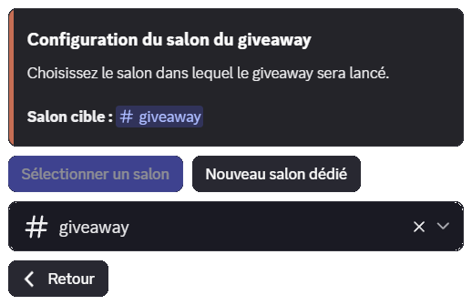

::hint{ type="warning" }
  The giveaway's creator and <@DraftBot> must have the **Send Messages** and **View Channel** permissions. <@DraftBot> must also have the **Embed Links** permission.
::

#### Creating a channel at publication time

::hint{ type="warning" }
  You need the **Manage Channels** permission to create a channel this way.
::

You can ask <@DraftBot> to create a dedicated channel at publication time by clicking the "New dedicated channel" button. You can then set a custom name and its category.

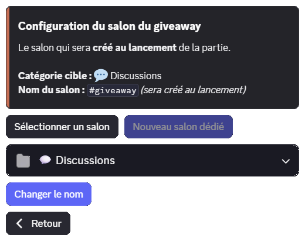

### Host

The host tells participants which member is offering the reward.

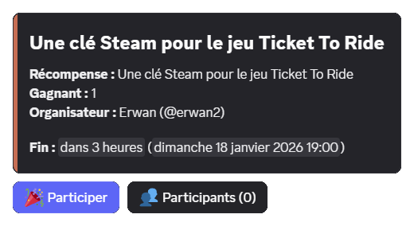

::hint{ type="warning" }
  The host must be present on the server at configuration time to be selected.
::

::hint{ type="info" }
  The host's username is only displayed on the message and has no other effect on the giveaway.
::

### Condition

You can set an access condition to enter the giveaway:

| Condition | Description |
|-----------|-------------|
| [Item](/docs/engagement/inventory) | Owning an item, which can optionally be taken away. |
| [Level](/docs/engagement/levels) | Minimum or maximum level required. |
| [Money](/docs/engagement/economy) | Minimum or maximum amount of money required, which can optionally be charged. |
| Roles | Holding (or not) one or more roles, which can optionally be taken away. |

::hint{ type="warning" }
  If an element (item, level or roles) is taken away to enter, it is not given back if the member [leaves](#leaving) or does not win the giveaway.
::

### Images

You can add a thumbnail as well as a main image to your giveaway to brighten it up.

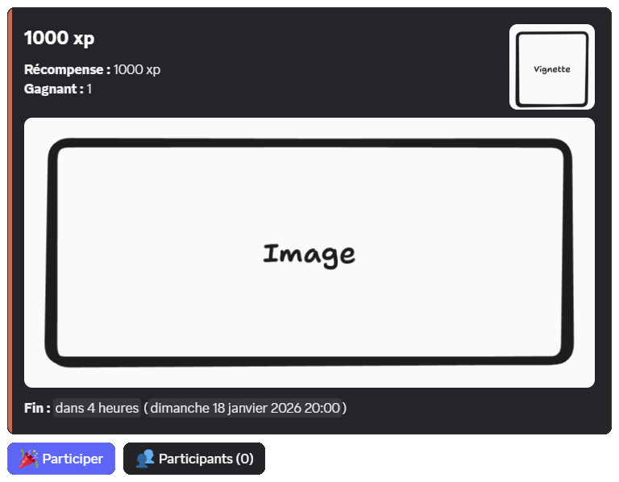

### Mentions

You can set roles to be notified when the giveaway is published.

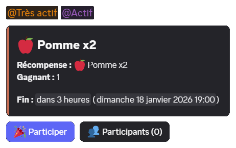

::hint{ type="info" }
  - You can set up to **10** mentioned roles.
  - Without the **Mention @everyone, @here and All Roles** permission, you can only mention roles that every member is allowed to mention.
::

### Color

::hint{ type="info" }
  This option is reserved for [premium](/premium) <:icon_premium:1096140508625125417> servers.
::

You can set the sidebar color of the embed to match your server's or the reward's style.

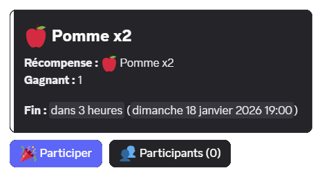

### Participants button

The "**Participants**" button, enabled by default, lets members [see the list of participants](#viewing-the-participants).

You can remove this button. Members will then only see the total number of participants.

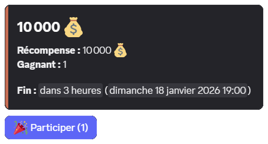

::hint{ type="info" }
  Server administrators can always see the list of participants with the \</giveaway participants> command.
::

## Managing an existing giveaway

### Ending a giveaway

You can end a giveaway before its original end time with the \</giveaway end> command, giving the [ID](/docs/misc/finding-an-id#message-id) or the link of the message.

The draw then takes place immediately and the winner or winners are announced in the giveaway's channel.

### Rerolling a giveaway

To designate a new winner on a finished giveaway, you can use the \</giveaway reroll> command, giving the [ID](/docs/misc/finding-an-id#message-id) or the link of the giveaway message.

::hint{ type="info" }
  You can replace a specific winner using the command's `winner` option.
::

::hint{ type="warning" }
  Rewards that have already been handed out are not taken back from the previous winners automatically.
::

### Removing a participant

You can remove a participant from a giveaway with the \</giveaway participants> command or the "**Participants**" button (if enabled), then click "**Remove a participant**".

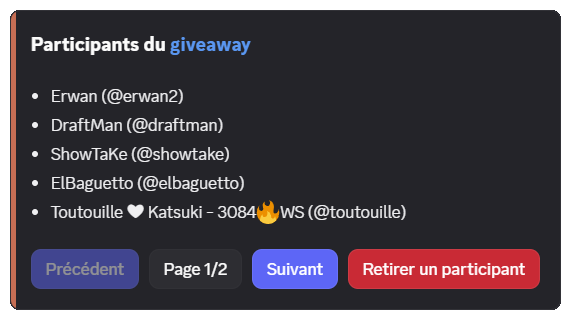

::hint{ type="info" }
  The member who is removed receives **no notification**, but they can still **enter again** before the draw ends.
::
