## Game profile

The \</profile> command displays your profile and the game usernames you have linked to it. To check someone else's, name them in the `member` option.
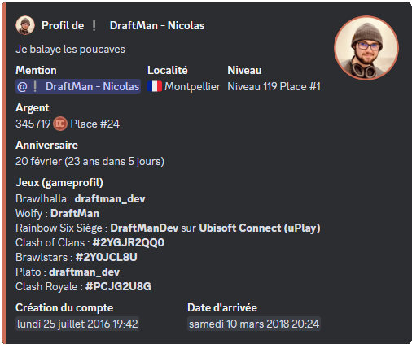

## Linking your usernames to DraftBot

For your game usernames to appear on your profile, you first have to link them to it.

Here are the two ways of doing so.

::tabs
  ::tab{ label="From the panel" }
    [⫸ Open the **DraftBot** panel](/dashboard/user/profil)

    To link your game to your Discord profile, go to the configuration page of your [profile](/dashboard/user/profil).

    Then scroll down and you will be able to link your different games.

    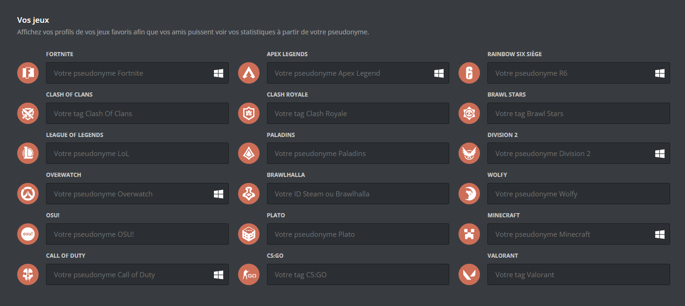
  ::

  ::tab{ label="Using the /gameprofile command" }
    To link your game to your Discord profile, run the \</gameprofile> command, then select your `game`, your `username` and the `platform`.

    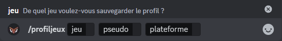
  ::
::

## The different types of identifier

Some games do not identify players by a username, but by a **TAG** or an **identifier** specific to the game:

- Clash of Clans: `TAG` (e.g. #ABC123)
- Clash Royale: `TAG` (e.g. #J8UOYV92C)
- Brawl Stars: `TAG` (e.g. #GYCLLP0PU)
- CS:GO: `TAG` (e.g. #AHKMX-F8TA)
- Brawlhalla: `ID` (e.g. draftman_dev)
- Valorant: `TAG` (e.g. ls62#0069)

::collapse{ label="How to find your identifier on Brawlhalla" }
  To find your tag on Brawlhalla, follow these steps:

  1. Launch Steam.
  2. Go to your Steam profile.
  3. Click "Edit".
  4. Add your username in the `CUSTOM URL` section.
::

## Game statistics

### /stats brawlhalla
To get your Brawlhalla statistics, run the \</stats brawlhalla> command and enter the user's TAG or mention them.

- **Clan**: the name of the clan the player belongs to.

- **Level**: the player's overall level.

- **Rank**: the player's ranking in competitive modes.

- **Playtime**: the total time spent playing Brawlhalla.

- **Your games**: the total number of games played by the player.

- **Best legend**: the legend (character) the player performs best with, or uses most often.

- **Best weapon**: the weapon the player has had the most success with, or prefers to use.

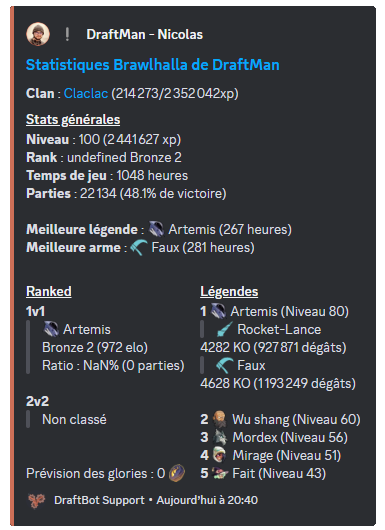

### /stats brawlstars
To get your Brawl Stars statistics, run the \</stats brawlstars> command and enter the user's TAG or mention them.

- **All the brawlers**: the full list of playable characters (brawlers) the player owns, with their levels, rarities and special abilities.

- **Club**: the name of the club the player belongs to.

- **Number of trophies**: the total trophies collected by the player.

- **Number of blings**: an in-game currency used to buy skins and other cosmetic items to customize brawlers.

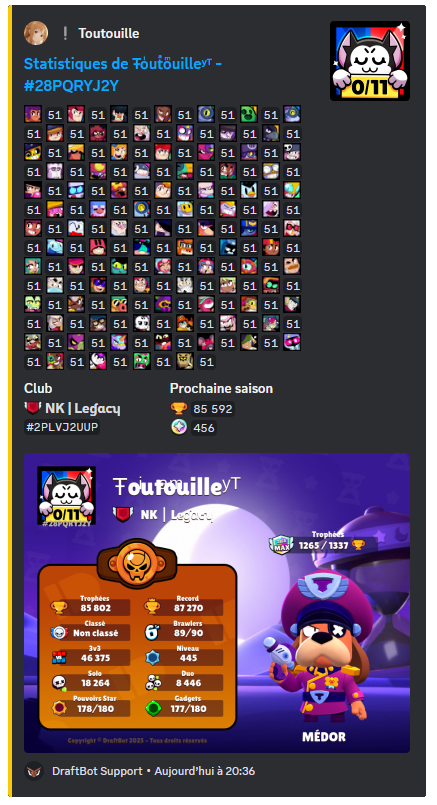

### /stats clashofclans
To get your Clash of Clans statistics, run the \</stats clashofclans> command and enter the user's TAG or mention them.

- **Village level**: the overall level of your village, which grows as you upgrade your buildings and troops.

- **Player tag**: the player's identifier.

- **Clan**: the name of the clan the player belongs to.

- **Capital contributions**: how many resources or how much effort the player has contributed to building or upgrading the clan capital.

- **Clan war preferences**: indicates whether the player takes part in clan wars.

- **War stars**: the total number of stars the player has earned in clan wars.

- **Troops donated**: the number of troops the player has given to their clan mates.

- **Troops received**: the number of troops the player has received from their clan mates.

- **Town Hall**: the player's current Town Hall level.

- **Builder huts**: the number of builder huts available.

- **Heroes**: the heroes.

- **Troops**: the different troops available for attack and defence.

- **Super Troops**: the upgraded versions of the normal troops.

- **Builder base troops**: the troops specific to the builder base.

- **Spells**: the different spells.

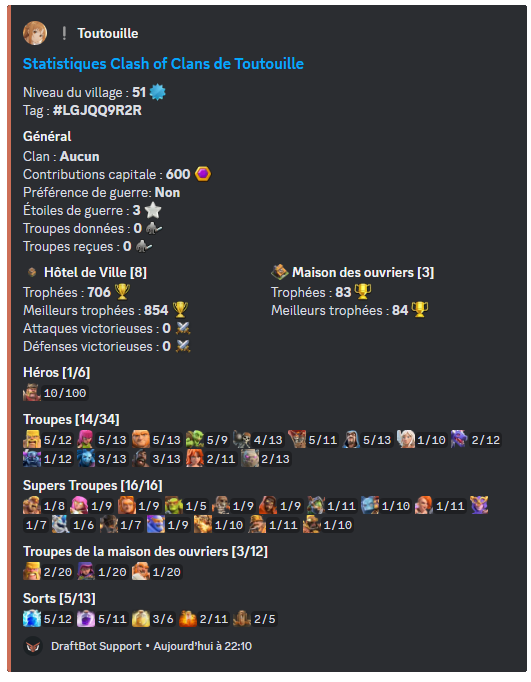

### /stats clashroyale
To get your Clash Royale statistics, run the \</stats clashroyale> command and enter the user's TAG or mention them.

- **Level**: your account's overall level.
- **Tag**: the player's tag.
- **Arena**: the area you fight in.
- **Clan**: the player's clan.
- **Troops donated**: the total number of cards you have given to your clan mates.
- **Troops received**: how many cards you have received from the members of your clan.
- **Clan cards collected**: the total cards earned during clan wars.
- **Number of trophies**: the number of trophies currently held.
- **Best trophies**: the player's trophy record.
- **Number of wins**: counts every one of your victories in battle.
- **Losses**: the number of matches lost.
- **Draws**: the number of matches ending without a winner.

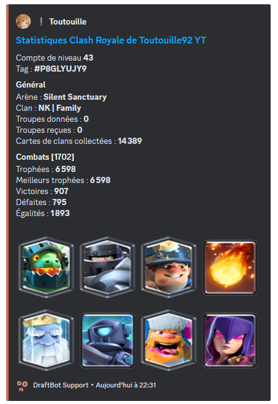

### /stats osu
To get your osu! statistics, run the \</stats osu> command and enter the user's username or mention them.

- **Number of games played**: the total number of games you have played.
- **Ranked score**: the score accumulated in ranked maps only.
- **Accuracy**: a percentage calculated from how precise your hits are compared with the perfect timing of the notes.
- **Performance points**: your overall skill level.
- **Rank counts**: how many times you have reached each rank (SS, S, A, etc.) in your games.
- **Total playtime**: the total time you have spent playing.
- **Registration date**: the date you created your account.

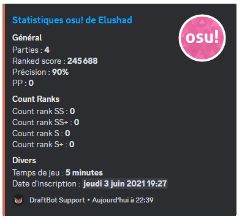

### /stats paladins
To get your Paladins statistics, run the \</stats paladins> command and enter the user's username or mention them.

- **Level**: the experience level reached.
- **Title**: a rank or honorary distinction earned from in-game achievements or performance.
- **Number of achievements**: counts the total achievements unlocked.
- **Number of masteries**: how many skills or abilities the Paladin has fully mastered.
- **Number of games**: the total number of games played.
- **Number of wins**: the number of games won.
- **Number of losses**: the number of games lost.
- **Number of leaves**: counts how many times the player left a game before it ended.
- **Ratio**: usually calculated by dividing the number of wins by the number of losses, this ratio measures overall performance.
- **Platform**: the device or system used to play.
- **Hours in game**: the total time spent playing.
- **Account creation**: the date the account was created.

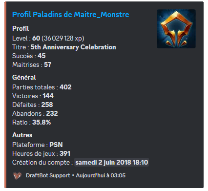

### /stats wolfy
To get your Wolfy statistics, run the \</stats wolfy> command and enter the user's username or mention them.

- **Level**: reflects your progress and the experience you have accumulated.
- **Number of games won**: shows your strategic effectiveness and your victories.
- **Kills**: shows the total number of kills carried out.
- **Average deaths per game**: measures your ability to survive during games.
- **Favourite role**: highlights the role you prefer, or the one you get the best results with.
- **Game history**: gives a detailed overview of your past performance so you can track your progress.

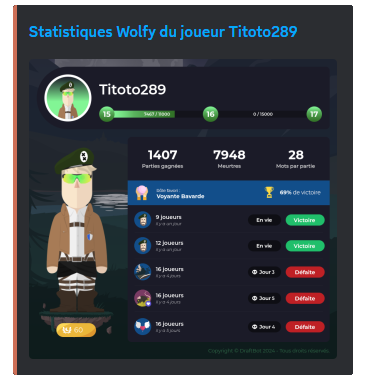

### /stats chess
To get your Chess.com statistics, run the \</stats chess> command and enter the user's username or mention them.

- **League**: the user's current league.
- **Rapid mode**: the ELO rating in rapid games (10 - 30 minutes).
- **Blitz**: the ELO rating in Blitz games (3 - 5 minutes).
- **Bullet**: the ELO rating in Bullet games (1 minute).
- **Puzzles**: statistics about the puzzles solved by the member.

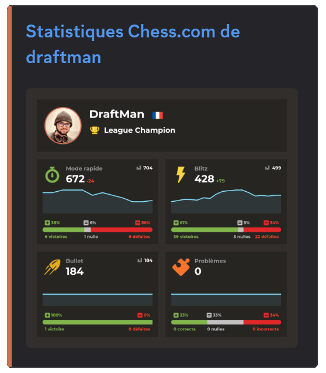

