## Games

### /bingo

::card
---
title: Bingo
icon: twemoji:bullseye
to: /docs/games-and-events/bingo
target: _blank
color: '#dd2e44'
---
  Run gripping bingo games where your members have to guess a secret number!
::

### /chifumi

The \</chifumi> command gives you access to this **two-player** game. It is an adaptation of the classic **Rock-Paper-Scissors**: a head-to-head where each player picks one of these three moves.

How the game works:

- **Rock** beats **scissors** (by blunting them).
- **Scissors** beat **paper** (by cutting it).
- **Paper** beats **rock** (by wrapping it).

You can play this game with the person of **your choice**, at **random**, or against **DraftBot**.

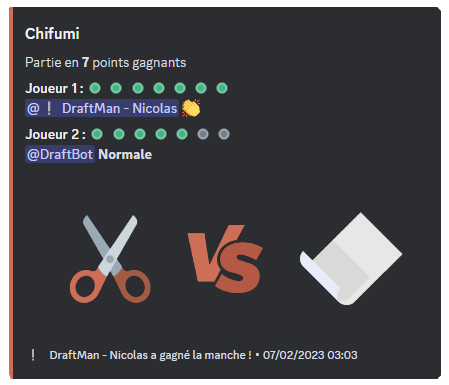

::hint{ type="info" }
  You can choose the difficulty mode: "Easy", "Normal" or "Hard". Depending on your choice, DraftBot will be harder to beat.
::

::hint{ type="info" }
  You can also choose how many rounds you want (1 to 7 rounds).
::

### /tictactoe

The \</tictactoe> command gives you access to this **two-player** game. It is a thinking game where you have to line up **3 identical symbols** before your opponent, horizontally, vertically or diagonally. Each player has their own symbol, a cross for one, a circle for the other.

You can play this game with the person of **your choice**, at **random**, or against **DraftBot**.

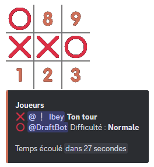

::hint{ type="info" }
  You can choose the difficulty mode: "Easy", "Normal" or "Hard". Depending on your choice, DraftBot will be harder to beat.
::

### /hangman

The \</hangman> command gives you access to this **single-player** thinking game. The goal is to guess which letters make up the **secret word**.

On every mistake, **a little figure** is drawn step by step, and if it is completed, you are hanged and you have lost.

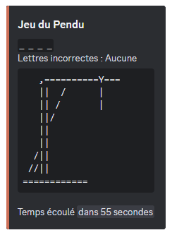

::hint{ type="info" }
  Even though the game is for a single player, other members can help you find the secret word.
::

### /connect4

The \</connect4> command gives you access to this **two-player** game. It is a strategy game where you have to line up **4 tokens in a row** of the same color on a grid of 6 rows and 7 columns. Taking turns, both players drop a token in the column of their choice.

You can play this game with the member of **your choice**, at **random**, or against **DraftBot**.

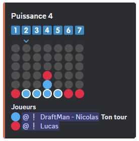

::hint{ type="info" }
  You can choose the difficulty mode: "Easy", "Normal" or "Hard". Depending on your choice, DraftBot will be harder to beat.
::

### /minesweeper

The \</minesweeper> command gives you access to this **single-player** thinking game. The goal is to locate mines hidden in a grid representing a virtual minefield.

The game gives clues based on **the number** of mines present in the neighbouring cells.

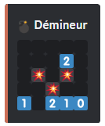

::hint{ type="info" }
  You can choose the difficulty mode: "Easy", "Normal" or "Hard". Depending on your choice, the grid gets bigger.
::

### /colormind

The \</colormind> command gives you access to this logic game for **a single player**. It is the equivalent of **Mastermind**: the goal is to find the right color combination.

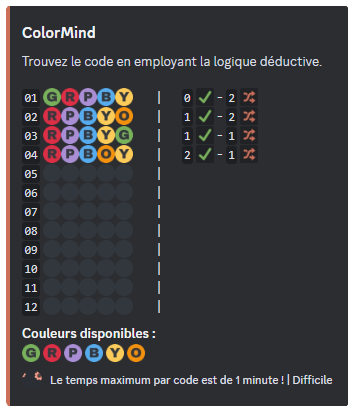

::hint{ type="info" }
  You can choose the difficulty mode: "Easy", "Normal" or "Hard". Depending on your choice, the number of colors to find increases.
::

::hint{ type="info" }
  The same color may appear several times in a combination.
::

## Utilities

### /survey

There are three commands available with \</survey>:

- \</survey create> ➜ Create and start a survey.
- \</survey results> ➜ See the results of a survey.
- \</survey finish> ➜ End a survey.

When creating the survey with the \</survey create> command, you have to set **the question** of the survey as well as the **different answers** (10 answers max). To enter the answers, you have to put them between **quotation marks** if they contain spaces.

::hint{ type="info" }
  You can, if you want, set the duration of the survey and choose the channel where it is started.
::

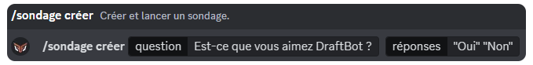

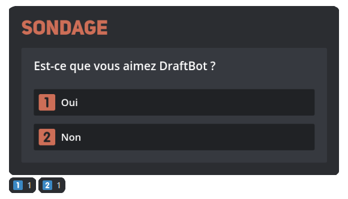

### /event

There are three commands available with \</event>:

- \</event create> ➜ Create and start an event.
- \</event restart> ➜ Restart an event.
- \</event end> ➜ End an event.

With the \</event create> command, you need to set **a name** for your event, the **maximum number** of participants, as well as **the time** at which the event starts.

To take part, members have to click **the reaction** that appears.

::hint{ type="info" }
  You can, if you want, set a role that your members receive at the end of the event to prove they took part, and choose the channel where the event is started.
::

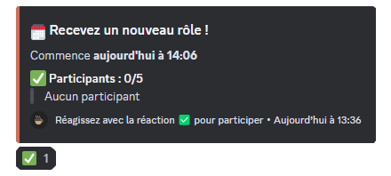

### /couple

The \</couple> command simply lets you **create a couple** on your server. DraftBot retrieves the avatars of the chosen **"Romeo"** and **"Juliet"**, and at the same time gives the couple a name.

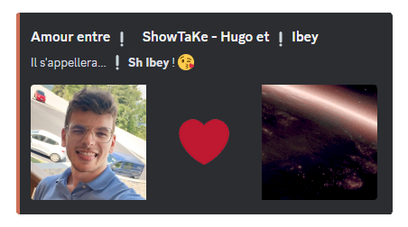

### /joke

The \</joke> command gives you access to various **jokes** provided by [Blagues API](https://www.blagues-api.fr/). The punchlines are hidden; clicking on them reveals them.

Three subcommands are available:

- \</joke random> ➜ Display a random joke.
- \</joke type> ➜ Display a joke of a specific type.
- \</joke favorites> ➜ Display your favourite jokes.

The different joke types are: General, Dark humor, Developer, 18+, Redneck, Blondes.

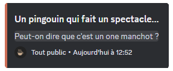

::hint{ type="info" }
  Every joke displayed has a 🤍 button to add it to your **favourites**. Click the ❤️ button again to remove it. You can save up to **200 favourite jokes** and view them at any time through \</joke favorites>.
::

::hint{ type="warning" }
  The **Dark humor** and **18+** types are disabled by default. Members with the **Administrator** permission can enable or disable each joke type on their server through a button available from any of the joke commands.
::

::hint{ type="info" }
  When a joke type is disabled by the server administrators, the favourite jokes of that type are automatically hidden in \</joke favorites>.
::

::hint{ type="info" }
  The jokes come from the community project [Blagues API](https://www.blagues-api.fr/), where jokes are added automatically from community votes. Feel free to contribute your own jokes!
::

### /rolldice

The \</rolldice> command lets you roll dice. Give the number of dice (X) and the number of sides (Y), separated by the letter "d" (e.g. XdY ➜ 1d10).

- You can add a modifier (Z) (`+`, `-` or `x`) (e.g. 1d10 **+5**).
- You can add options: `-H` to keep only the highest or `-L` for the lowest (e.g. 3d10+5 **-L**).

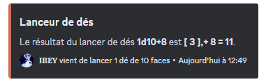

::hint{ type="info" }
  The number of dice cannot exceed 100.
::

### /tv

The \</tv> command gives you information about **a film or a series** available on [The Movie Database](https://www.themoviedb.org/) (TMDB). All you have to do is give the name of the film or series you are looking for after the command.

You will receive the following information:

- The title of the film or series.
- The synopsis.
- The genre(s).
- The release date.
- The average rating given by users.

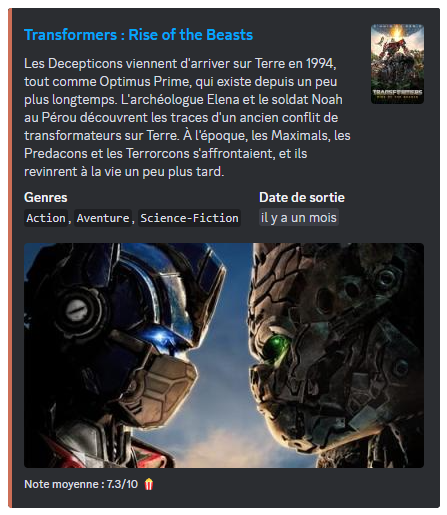

### /interact

The \</interact> command lets you react with various reactions handled by DraftBot.

::collapse{ label="See the predefined reactions" }
  - **baka:** Call someone a baka.
  - **blow-kiss:** Blow a kiss to someone.
  - **bonk:** Bonk someone.
  - **cuddle:** Cuddle up to someone.
  - **kick:** Kick someone.
  - **hug:** Send a hug to someone.
  - **pat:** Pat someone.
  - **yeet:** Yeet someone.
  - **tickle:** Tickle someone.
  - **wink:** Wink at someone.
  - **dance:** Dance with someone.
  - **kiss:** Send kisses to someone.
  - **stare:** Stare at someone.
  - **punch:** Punch someone.
  - **slap:** Slap someone.
  - **bite:** Bite someone.
  - **feed:** Feed someone.
  - **poke:** Poke someone.
  - **carry:** Carry someone.
  - **laugh:** Laugh with someone.
  - **wave:** Wave at someone.
  - **handshake:** Shake someone's hand.
  - **hold-hands:** Hold someone's hand.
  - **shoot:** Shoot at someone.
  - **high-five:** High-five someone.
::
