The **Suggestions** module lets your members put forward ideas the community can vote on, and that moderators can then accept, refuse or plan. It comes with a reward system to recognize contributors.

## Usage

### Submitting a suggestion

Open the [suggestions menu](#the-suggestions-menu) with the \</suggest> command, then click the "New suggestion" button.

**DraftBot** then opens a pop-up where you can fill in:

- Title ➜ The title to give your suggestion. It is also used to reference it in the [suggestions menu](#the-suggestions-menu).
- Description ➜ The body of your suggestion, where you can go into detail to explain it better to the other members.

::hint{ type="info" }
  Once your suggestion is written, DraftBot displays a confirmation message. At that point, you can edit your submission, [add an image](#adding-an-image) to it, confirm it, or cancel it:

  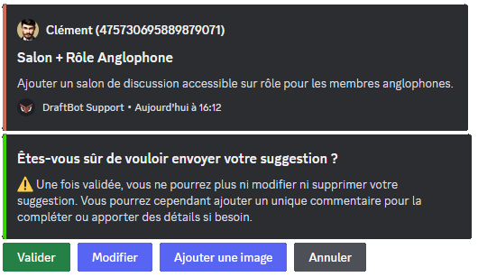
::

::hint{ type="success" }
  Want to add more to your suggestion? No problem: DraftBot lets you include a [comment](#commenting-on-a-suggestion), and even an [illustration](#adding-an-image)!

  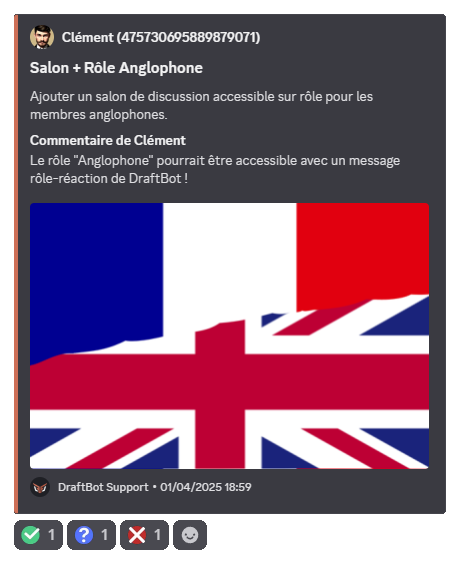
::

### The suggestions menu

To open the suggestions menu, run the \</suggest> command.

A menu then opens. It lets you:
- submit new suggestions,
- comment on one of your suggestions,
- [delete](#deleting-a-suggestion) one of your pending suggestions (if the option is [enabled](#members)),
- open one of your suggestions (by clicking its title), or
- check the state of your suggestions (number of votes, status).

You can also decide whether to be notified when the [status](#managing-suggestions) of one of your suggestions changes (if the "Enable notifications" option is [enabled](#moderation)).

::hint{ type="info" }
  To avoid cluttering your channels, the command runs discreetly: the message that ran the command is deleted immediately, and DraftBot's reply is only visible to the person who ran it!
::

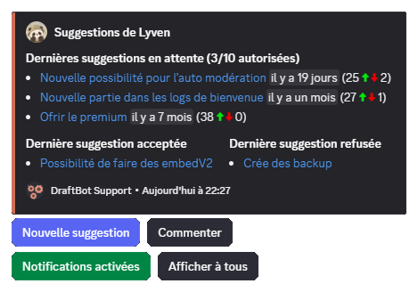

### Adding an image

You can attach an image to your suggestion by dropping the file in the area provided, or by clicking the "`browse`" button in DraftBot's "`Send a suggestion`" window (image below).

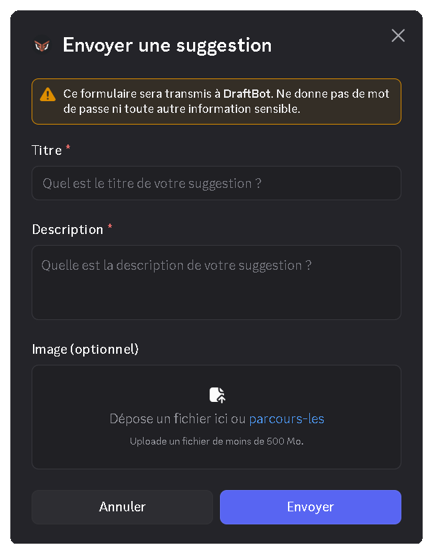

### Commenting on a suggestion

Did you forget something when sending your suggestion?

**DraftBot** lets you comment on your suggestions by clicking "Comment" in the [suggestions menu](#the-suggestions-menu).

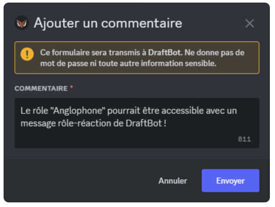

Once the comment has been added, it appears at the bottom of your suggestion message:

### Deleting a suggestion

Changed your mind? If the administrator has [enabled the option](#members), the "Delete" button of the [suggestions menu](#the-suggestions-menu) lets you remove one of your **pending** suggestions yourself, without going through a moderator.

Select the suggestion concerned, then confirm: **DraftBot** deletes its message in the reception channel, as well as the [thread](#automatic-discussion-threads) that may have been attached to it.

::hint{ type="warning" }
  Deletion is **permanent**. Once accepted, refused or planned, a suggestion can no longer be deleted by its author.
::

### Managing suggestions

As a moderator, you can **accept**, **refuse** or **plan** a suggestion in two clicks or through a command.

::hint{ type="warning" }
  You need the "Manage Messages" permission to accept, refuse or plan a suggestion.
::

::collapse{ label="Accepting a suggestion"}
  Has a suggestion received enough votes, and/or caught your eye? You can accept it, which stops the vote and validates the suggestion. There are two ways of doing so:

  ::tabs
    ::tab{ label="Quick access" }
      On desktop, right-click (on mobile, long-press) the suggestion you want to accept, then open the "Apps" line. You will then be able to accept the suggestion.

      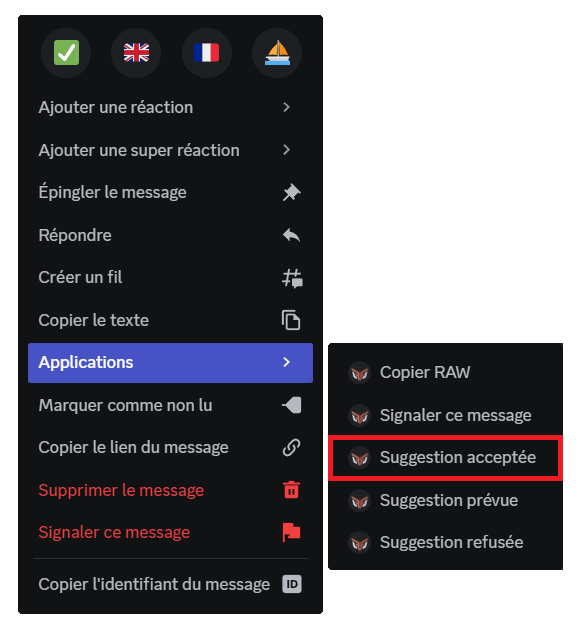
    ::

    ::tab{ label="Command" }
      The \</suggestmod accept> command also lets you accept a suggestion. To do so, you need to enter the [ID](/docs/misc/finding-an-id#message-id) of the message of the suggestion to accept.
    ::
  ::
  Whichever method you use, you can add a reason for accepting if you want to.

  ::hint{ type="info" }
    If you have enabled the "Set the thread of accepted suggestions" option, the suggestion is automatically moved to the thread you defined.
  ::
::

::collapse{ label="Refusing a suggestion"}
  Has a suggestion received a lot of negative votes, or is it simply not feasible? You can refuse it, which stops the vote and invalidates the suggestion. There are two ways of doing so:

  ::tabs
    ::tab{ label="Quick access" }
      On desktop, right-click (on mobile, long-press) the suggestion you want to refuse, then open the "Apps" line. You will then be able to refuse the suggestion.

      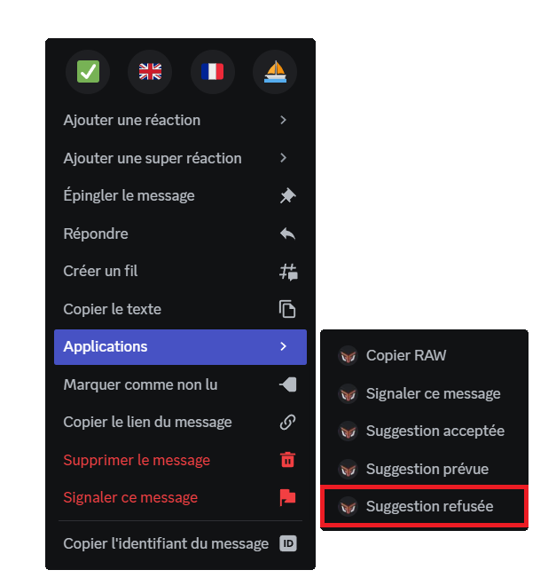
    ::

    ::tab{ label="Command" }
      The \</suggestmod refuse> command also lets you refuse a suggestion. To do so, you need to enter the [ID](/docs/misc/finding-an-id#message-id) of the message of the suggestion to refuse.
    ::
  ::
  Whichever method you use, you must give a reason for the refusal to go through.

  ::hint{ type="info" }
    If you have enabled the "Set the thread of refused suggestions" option, the suggestion is automatically moved to the thread you defined.
  ::
::

::collapse{ label="Planning a suggestion"}
  Has a suggestion been retained and is its implementation planned? You can mark it as "planned", which stops the vote. This status can be given directly to an ongoing suggestion, or to a suggestion that has already been accepted. There are two ways of doing so:

  ::tabs
    ::tab{ label="Quick access" }
      On desktop, right-click (on mobile, long-press) the suggestion you want to plan, then open the "Apps" line. You will then be able to mark the suggestion as "planned".

      
    ::

    ::tab{ label="Command" }
      The \</suggestmod planned> command also lets you plan a suggestion. To do so, you need to enter the [ID](/docs/misc/finding-an-id#message-id) of the message of the planned suggestion. Finally, you can give a reason to explain this choice, or provide details about it.
    ::
  ::
::

::hint{ type="info" }
  The status of a suggestion can be changed **at any time**, by right-click or by command, even after it has been processed. To reopen the vote, set the suggestion back to pending through \</suggestmod pending>.
::

::hint{ type="success" }
  Whenever the state of a suggestion changes, the member who sent it is notified by DraftBot through direct messages, if they have [enabled notifications](#the-suggestions-menu) in their suggestions menu.
::

## Suggestion leaderboard

::hint{ type="info" }
  This feature is reserved for [premium](/premium) <:icon_premium:1096140508625125417> servers.
::

The \</suggestmod top> command displays a leaderboard of suggestions, according to the following criteria:

- Order by:
    - number of positive votes
    - number of negative votes
    - ratio (relation between positive and negative votes)

- Filter: sorts suggestions by a keyword.

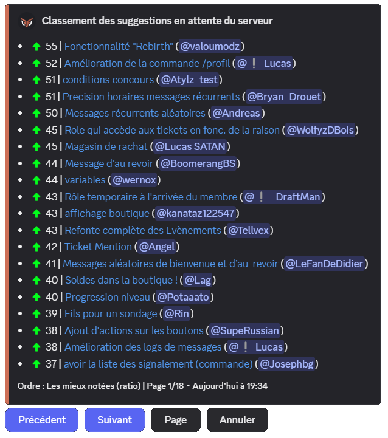

## Keyword search

The \</suggestmod search> command lets you search for suggestions from their title. ([premium](/premium) <:icon_premium:1096140508625125417>)

## Configuration

::tabs
  ::tab{ label="From the panel" }
    [⫸ Open the **DraftBot** panel](/dashboard/first/suggestions)

    To enable the module, click the button in the top right corner. Every configuration option then appears and stays a few clicks away.

    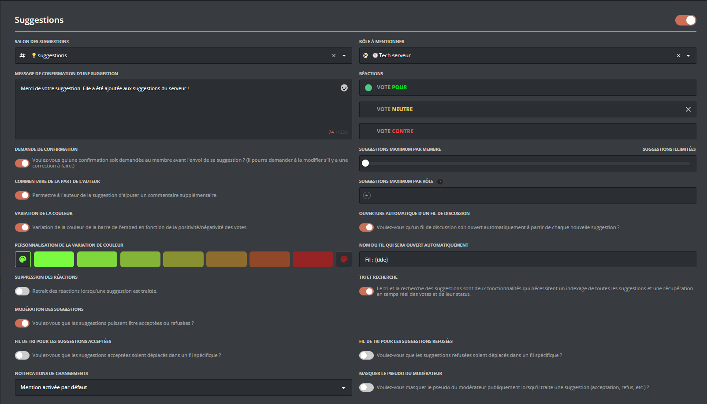

    ::hint{ type="warning" }
      Once your changes are done, remember to save them with the "Save" button at the bottom of the page!
    ::
  ::

  ::tab{ label="Using the /config command" }
    ::hint{ type="info" }
      To go straight to this module's configuration, without going through the main menu, you can run the \</config Suggestions> command!
    ::

    Once the command has been run, DraftBot displays a message containing:
    - **information** about the current state of the module,
    - **action buttons** to change each part of the configuration (detailed in the sections below).

    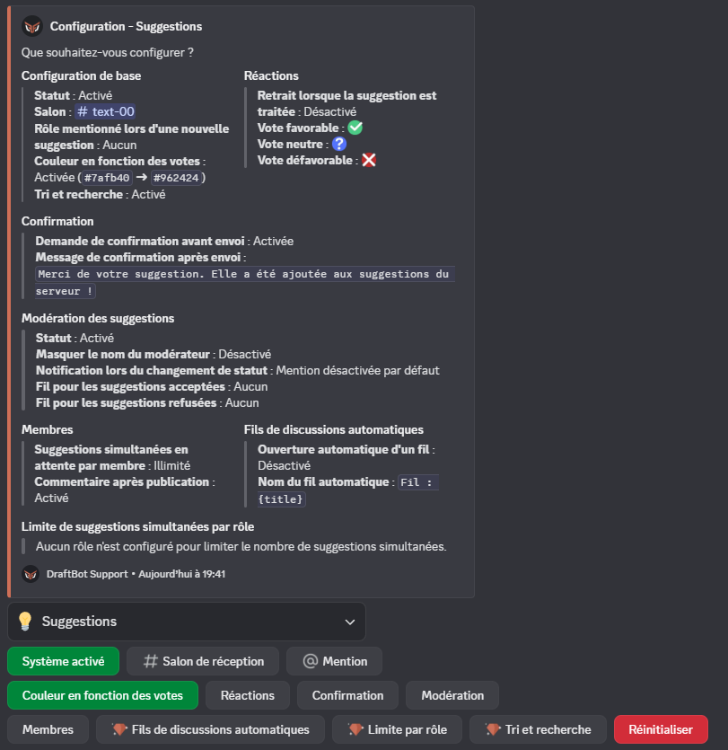
  ::
::

::hint{ type="warning" }
  **Required permissions** in the suggestion reception channel: **View Channel**, **Send Messages**, **Embed Links**, **Add Reactions** and **Manage Messages** (for moderation). Without these permissions, the module cannot work properly.
::

### Reception channel

::tabs
  ::tab{ label="From the panel" }
    [⫸ Open the **DraftBot** panel](/dashboard/first/suggestions)

    To change the \<#channel> where the suggestions sent by members are posted, choose it in the panel's selector.

    

    ::hint{ type="info" }
      If you cannot find the channel in the list, remember to refresh the page!
    ::
  ::

  ::tab{ label="Using the /config command" }
    Click the "Suggests channel" button, then enter the \<#channel> you want:

    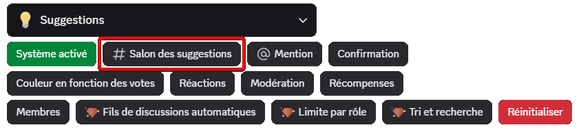
  ::
::

::hint{ type="info" }
  You can set this channel to read-only, so that suggestions always stay easy to find!
::

### Mention

::tabs
  ::tab{ label="From the panel" }
    [⫸ Open the **DraftBot** panel](/dashboard/first/suggestions)

    Select the role to mention when a new suggestion is published.

    
  ::

  ::tab{ label="Using the /config command" }
    Click the "Mention" button to set the role to mention. The selected role receives a notification whenever a new suggestion is posted.

    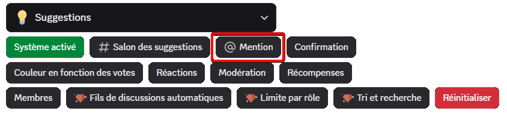
  ::
::

### Delay between suggestions

::tabs
  ::tab{ label="From the panel" }
    [⫸ Open the **DraftBot** panel](/dashboard/first/suggestions)

    **DraftBot** lets you set a **number of suggestions** allowed over a given period (1 suggestion every 30 minutes, or 3 per day, for example), as well as exempt roles, which are not affected by this restriction.

    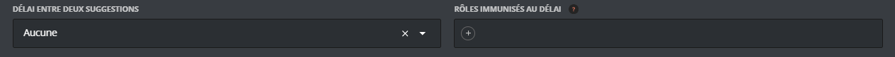
  ::

  ::tab{ label="Using the /config command" }
    Click the "Members" button to open the member management menu.

    You can choose between:
    - Setting a delay between two suggestions
    - Setting roles exempt from that delay

    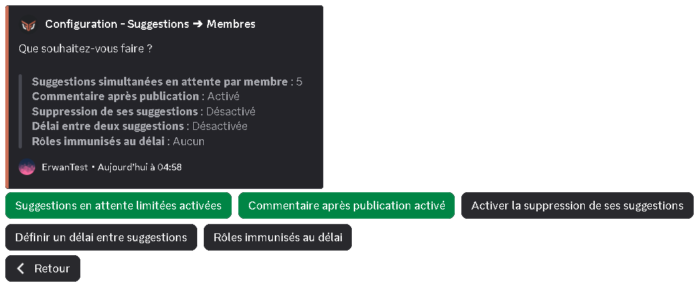
  ::
::

### Color based on votes

::tabs
  ::tab{ label="From the panel" }
    [⫸ Open the **DraftBot** panel](/dashboard/first/suggestions)

    **DraftBot** can automatically vary the color of a suggestion depending on the ratio of positive / neutral / negative votes.

    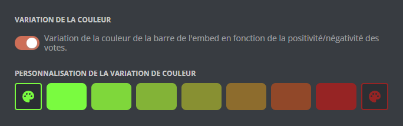

    ::hint{ type="info" }
      [Premium](/premium) <:icon_premium:1096140508625125417> servers can customize the gradient used to show how popular a suggestion is.
    ::
  ::

  ::tab{ label="Using the /config command" }
    Click the "Color based on votes" button to open the color management menu.

    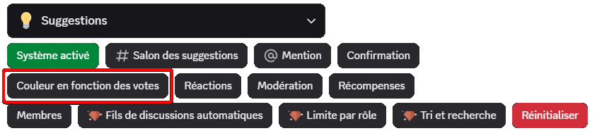

    From this menu, you can:
    - Enable / disable the automatic gradient of suggestions
    - Change the colors <:icon_premium:1096140508625125417>

    
  ::
::

::hint{ type="info" }
  By default, DraftBot gradually varies the color of the suggestion, from red (more negative votes than positive ones) to green (more positive votes than negative ones), depending on the gap between the votes.
::

### Reactions

::tabs
  ::tab{ label="From the panel" }
    [⫸ Open the **DraftBot** panel](/dashboard/first/suggestions)

    Choose the emojis that represent the members' votes.

    

    You can also decide to hide the suggestion's reactions once it has been processed.

    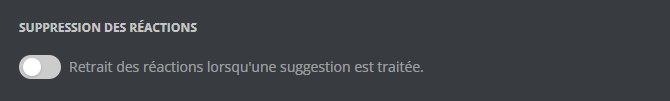
  ::

  ::tab{ label="Using the /config command" }
    Click the "Reactions" button to open the configuration menu.

    

    From this menu, you can:
    - Enable / disable the removal of reactions after processing
    - Set the emojis used for favourable, neutral and unfavourable votes

    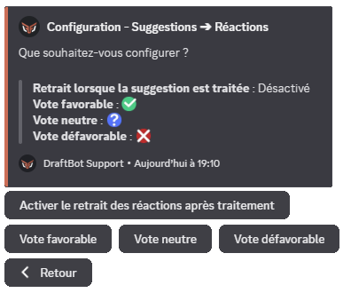
  ::
::

::hint{ type="success" }
  As well as Discord emojis, you can use your server's custom emojis, and even its animated emojis if you have [set some up](https://support.discord.com/hc/en-us/articles/360041139231-Adding-Emojis)!
::

### Confirmation

::tabs
  ::tab{ label="From the panel" }
    [⫸ Open the **DraftBot** panel](/dashboard/first/suggestions)

    From this menu, you can:
    - Choose whether the author of a suggestion has to confirm it *before* sending
    - Customize the confirmation message sent to the member *after* their suggestion has been published

    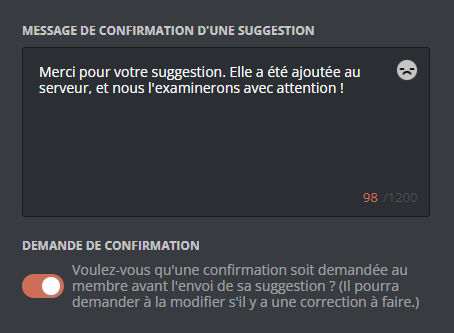
  ::

  ::tab{ label="Using the /config command" }
    Click the "Confirmation" button to open the configuration menu.

    

    From this menu, you can:
    - Choose whether the author of a suggestion has to confirm it *before* sending
    - Customize the confirmation message sent to the member *after* their suggestion has been published

    
  ::
::

You can customize the confirmation message with several variables:

| Variable | Description | Example |
|----------|-------------|---------|
| `{title}` | Title of the suggestion | Questionnaire system |
| `{count}` | Number of ongoing suggestions for the member | 3 |
| `{max}` | Maximum number of suggestions allowed at the same time | 5 |

*In addition to the [other variables](/docs/misc/variables) already available globally!*

### Moderation

This section lets you:
- Set whether suggestions can be processed (Suggestions sorting)
- Set whether the moderator who changes a suggestion's status is anonymized
- Set the default state of notifications, or disable them globally
- Set a thread to file every accepted suggestion in
- Set a thread to file every refused suggestion in

::hint{ type="warning" }
  If you disable suggestions sorting, **you will no longer be able to accept/refuse/plan suggestions**.
::

::hint{ type="info" }
  For notifications, you can choose between: disabled by default, enabled by default, or completely disabled.
::

::tabs
  ::tab{ label="From the panel" }
    [⫸ Open the **DraftBot** panel](/dashboard/first/suggestions)

    
  ::

  ::tab{ label="Using the /config command" }
    Click the "Moderation" button to open the configuration menu.

    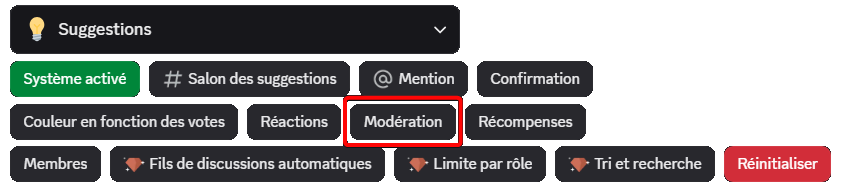

    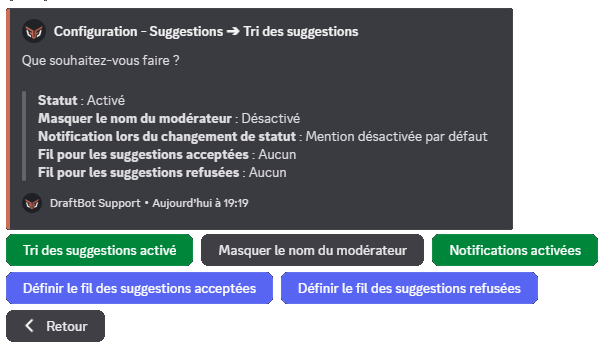
  ::
::

### Members

This section lets you:
- Limit how many pending suggestions a member can have (unlimited by default)
- Set whether the author of a suggestion can add a [comment](#commenting-on-a-suggestion) to it
- Set whether the author of a suggestion can [delete](#deleting-a-suggestion) it themselves while it is pending (disabled by default)

::tabs
  ::tab{ label="From the panel" }
    [⫸ Open the **DraftBot** panel](/dashboard/first/suggestions)

    Set the limit you want by moving the slider, and enable or disable the "Enable self-deletion of suggestions" option.

    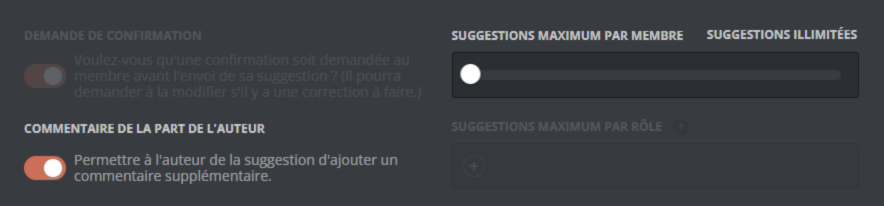

    ::hint{ type="success" }
      By default, the number of pending suggestions per member at the same time is unlimited!
    ::
  ::

  ::tab{ label="Using the /config command" }
    Click the "Members" button to open the configuration menu.

    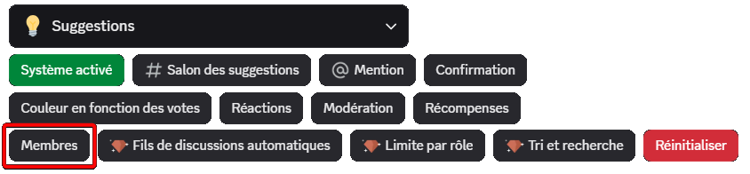

    
  ::
::

### Automatic discussion threads

::hint{ type="info" }
  This feature is reserved for [premium](/premium) <:icon_premium:1096140508625125417> servers.
::

DraftBot can automatically create a thread attached to each suggestion, letting the author and the moderators interact together. You can enable or disable this feature and customize how the threads are named.

The thread name can be customized with the following variable:

| Variable | Description | Example |
|----------|-------------|---------|
| `{title}` | Title of the suggestion | Questionnaire system |

*In addition to the [other variables](/docs/misc/variables) already available globally!*

::tabs
  ::tab{ label="From the panel" }
    [⫸ Open the **DraftBot** panel](/dashboard/first/suggestions)

    
  ::

  ::tab{ label="Using the /config command" }
    

    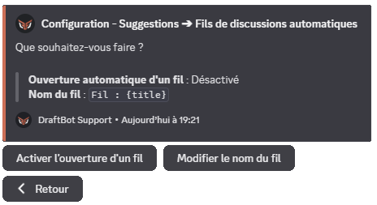
  ::
::

### Limit per role

::hint{ type="info" }
  This feature is reserved for [premium](/premium) <:icon_premium:1096140508625125417> servers.
::

This feature lets you set different limits on simultaneous pending suggestions depending on the roles members hold.

::hint{ type="success" }
  To favour your most active members, use this option together with roles granted by the [level system](/docs/engagement/levels#creating-a-reward) 😉
::

::tabs
  ::tab{ label="From the panel" }
    [⫸ Open the **DraftBot** panel](/dashboard/first/suggestions)

    
  ::

  ::tab{ label="Using the /config command" }
    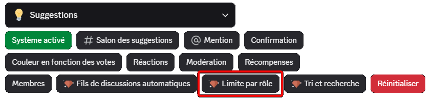

    
  ::
::

### Sorting and search

::hint{ type="info" }
  This feature is reserved for [premium](/premium) <:icon_premium:1096140508625125417> servers.
::

This option enables the indexing of suggestions, which makes [advanced search](#keyword-search) and suggestion sorting possible.

::tabs
  ::tab{ label="From the panel" }
    [⫸ Open the **DraftBot** panel](/dashboard/first/suggestions)

    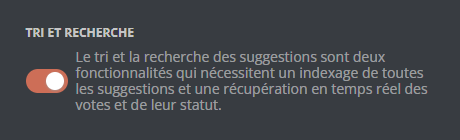
  ::

  ::tab{ label="Using the /config command" }
    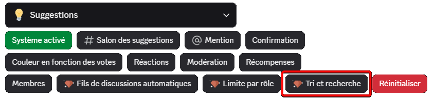
  ::
::

## Rewards

DraftBot can automatically reward the author of a suggestion when they reach a certain number of accepted, refused, pending or planned suggestions.

### Creating a reward

When creating one, you set:

1. **Suggestion status**: accepted, pending, refused or planned
2. **Number of suggestions**: the threshold that triggers it
3. **Reward type**: role, money, experience, inventory item or custom
4. **Specific settings** depending on the type chosen

::tabs
  ::tab{ label="From the panel" }
    [⫸ Open the **DraftBot** panel](/dashboard/first/suggestions)

    In the "Rewards" section, click "Create a reward":

    
  ::

  ::tab{ label="Using the /config command" }
    Open the "Suggestions" menu > "Rewards" > "Create a reward", then follow the configuration steps.

    
  ::
::

::tabs
  ::tab{ label="Role" }
    Assign a role to the member who reaches the target. You can choose a **permanent** or **temporary** role at creation time.

    **Settings:**
    - The role to assign
    - The duration (for a temporary role only)

    ::hint{ type="warning" }
      The selected role must have been created beforehand and must be accessible to DraftBot (it must not sit higher than DraftBot's highest role).
    ::

    ::hint{ type="info" }
      Unlike level rewards, roles are **never removed** automatically if the suggestion's status changes later.
    ::
  ::

  ::tab{ label="Money" }
    Give money from the [economy system](/docs/engagement/economy) to the member.

    **Settings:**
    - Amount to grant

    ::hint{ type="warning" }
      The economy system must be **enabled** on your server to use this reward type.
    ::
  ::

  ::tab{ label="Experience" }
    Give experience points from the [level system](/docs/engagement/levels).

    **Settings:**
    - Amount of XP to grant

    ::hint{ type="warning" }
      The level system must be **enabled** on your server to use this reward type.
    ::

    ::hint{ type="success" }
      If the XP gain makes the member level up, they automatically receive the level rewards and an announcement is sent (if configured).
    ::
  ::

  ::tab{ label="Inventory item" }
    Give one or more [inventory items](/docs/engagement/inventory) to the member.

    **Settings:**
    - The item to grant
    - The quantity (up to 1 million)

    ::hint{ type="info" }
      If you have not created any item yet, you first need to [set up your inventory](/docs/engagement/inventory) from the panel's Inventory module.
    ::
  ::

  ::tab{ label="Custom reward" }
    Offer a reward **outside Discord**: promotional codes, physical goodies, special mentions, etc.

    **Settings:**
    - Name/description of the reward (up to 250 characters)

    ::hint{ type="success" }
      **How does it work?** When a member obtains this reward, **you receive a direct message notification from DraftBot** with the member's details. You can then hand the reward over yourself.
    ::

    ::hint{ type="warning" }
      Make sure your direct messages are open so you can receive notifications!
    ::
  ::
::

### Reward announcements

Once your rewards have been created, configure where and how to announce that they have been obtained.

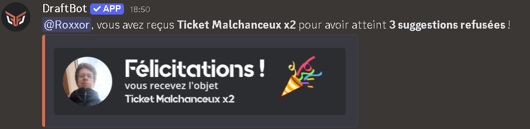

- **Dedicated channel**: choose a specific channel for the announcements.
- **Custom message**: customize the message with the [variables available globally](/docs/misc/variables), as well as `{reward}`, `{target.count}` and `{target.type}` to display the reward obtained.

**Default message**: `{user}, here is your reward for reaching **{target.count} {target.type}**!`

::tabs
  ::tab{ label="From the panel" }
    [⫸ Open the **DraftBot** panel](/dashboard/first/suggestions)

    In the "Rewards" section:

    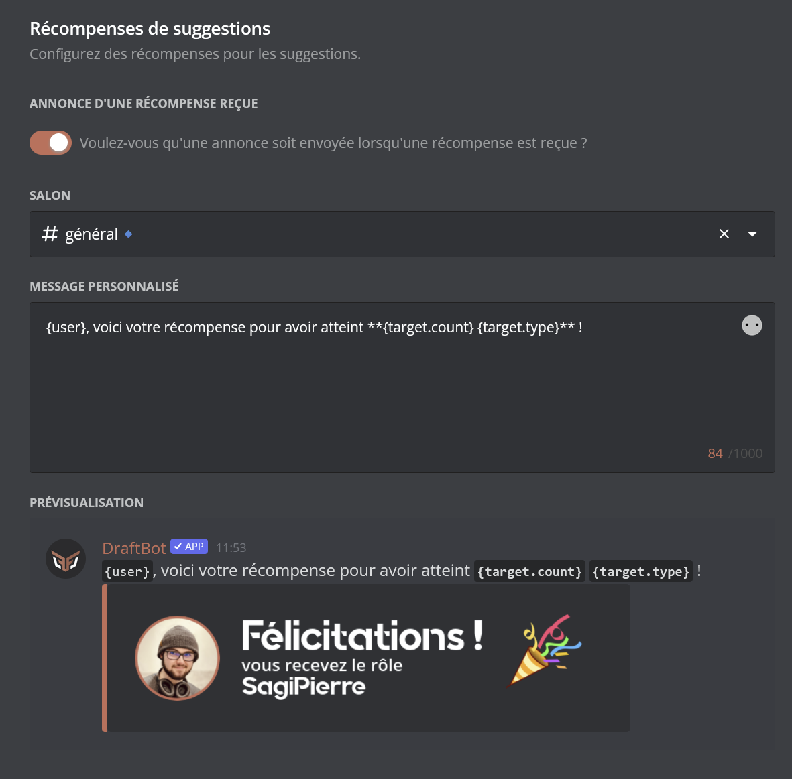
  ::

  ::tab{ label="Using the /config command" }
    Open the "Suggestions" menu > "Rewards" > "Rewards announcements".

    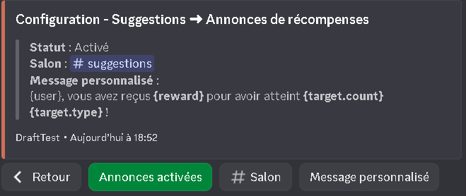
  ::
::

::hint{ type="warning" }
  **Required permissions**: to send announcements, DraftBot needs the following permissions in the chosen channel: **View Channel**, **Send Messages**, **Embed Links** and **Attach Files**. If these permissions are removed, announcements are disabled automatically.
::
