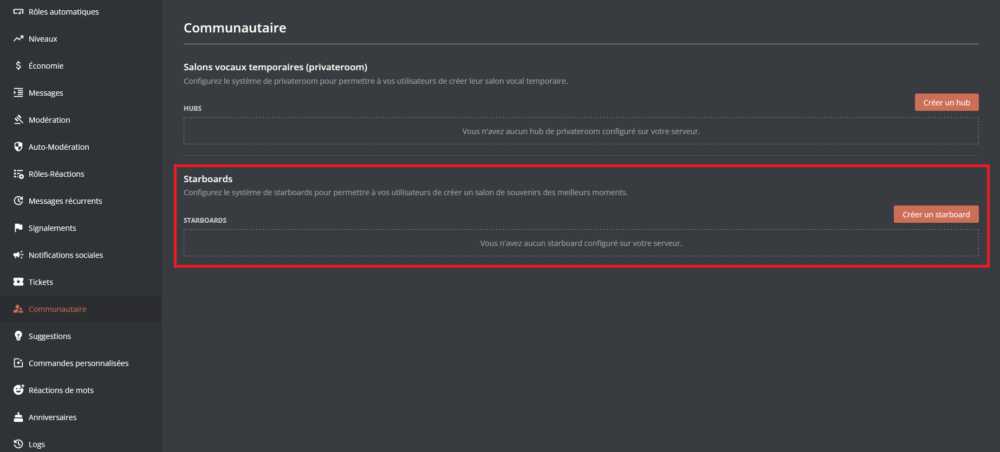
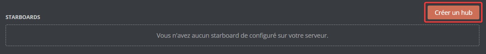
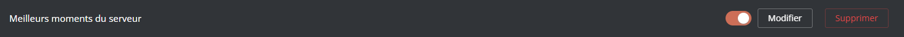
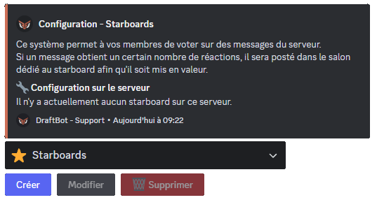
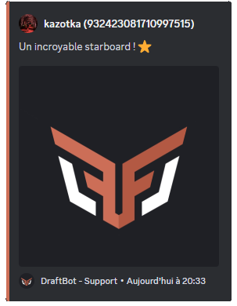
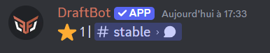

## How does it work?

The starboard system highlights messages receiving a certain number of `⭐` reactions, which DraftBot then displays in a dedicated channel, chosen or created during the configuration.

::hint{ type="info" }
  **Polls**, **stickers** and **forwarded messages** appear in the highlighted messages, even if the author is no longer part of the server.
::

## Configuring the system

::tabs
  ::tab{ label="From the panel" }
    [⫸ Open the **DraftBot** panel](/dashboard/first/community)

    Scroll down the list of systems and you will find the section dedicated to starboards.

    

    ### Creating a starboard

    To create a starboard, scroll down to the part dedicated to starboards and click "Create a hub". DraftBot then offers you a configuration menu to set up your first starboard.

    

    ::hint{ type="info" }
      You can then edit or delete the existing starboards through the "Edit" and "Delete" buttons.

      You can also disable your starboard while keeping it, by unticking the box to the left of the "Edit" button.
      
    ::
  ::

  ::tab{ label="Using the /config command" }

    ### Creating a starboard

    To configure the starboard directly on Discord, use the \</config> command, then select the "Starboard" tab. After clicking the "Create" button, let the questions guide you to set up the starboard in your server's image.

    You can in particular set the starboard's channel as well as its name.
    Customizing the emoji is reserved for [premium](/premium) <:icon_premium:1096140508625125417> servers.

    

    ::hint{ type="info" }
      You can then edit or delete the existing starboards through the "Edit" and "Delete" buttons.
    ::
  ::
::

## Available options

### Channel

- **Conditions per channel**: changes how many reactions are needed to publish a message, individually per channel.

- **Channels that can be highlighted**: chooses the channels whose messages can appear in the starboard.

### Reaction

- **Emoji**: changes the starboard's default emoji (<:icon_premium:1096140508625125417>)

- **Minimum reactions**: sets a minimum number of reactions (between 1 and 25).

- **Withdrawal of one's own reactions**: removes the starboard emoji reaction left by authors on their own messages.

- **Ignore messages from bots**: prevents bots' messages from being highlighted.

::hint{ type="info" }
  Features marked with the <:icon_premium:1096140508625125417> symbol are reserved for [premium](/premium) <:icon_premium:1096140508625125417> servers.
::

### Roles

- **Roles that can be highlighted**: sets which roles' messages can appear in the starboard.

- **Roles that can vote**: sets which roles' reactions are counted before a message is highlighted.

### Customization

- Changes the content of the message, and chooses whether it is sent in an **embed** or not.

- If the embed is enabled, its color can be changed. (<:icon_premium:1096140508625125417>)

::hint{ type="info" }
  Features marked with the <:icon_premium:1096140508625125417> symbol are reserved for [premium](/premium) <:icon_premium:1096140508625125417> servers.
::

You can customize the message sent in the configured channel with several variables:

| Variable | Description | Example |
|----------|-------------|---------|
| `{emoji}` | Starboard emoji | ⭐ |
| `{emoji.count}` | Number of reactions | 15 |
| `{message.url}` | Link to the message | https://discord.com/... |

*In addition to the [other variables](/docs/misc/variables) already available globally!*

## The different formats

::tabs
  ::tab{ label="Message with an embed" }
    
  ::

  ::tab{ label="Message without an embed" }
    
  ::
::

