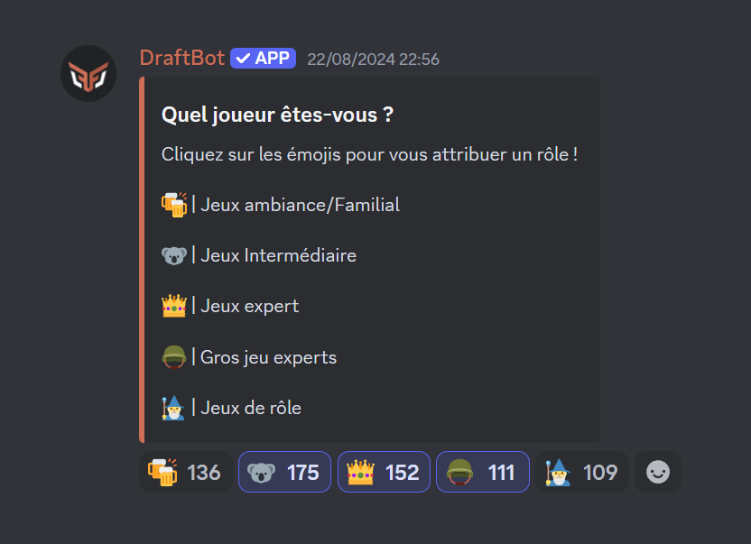
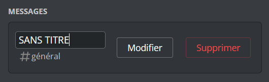
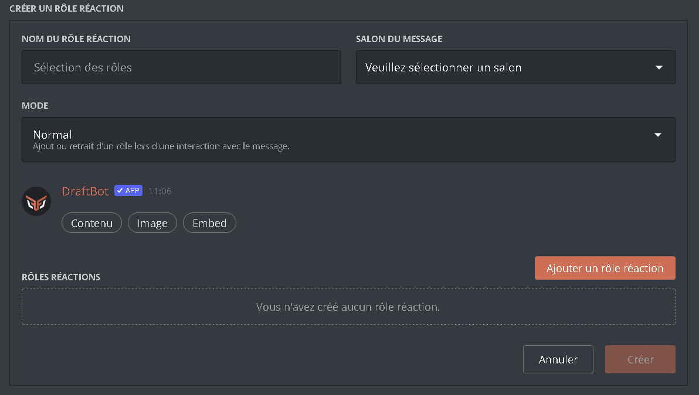
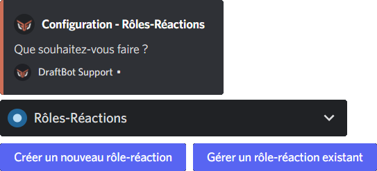
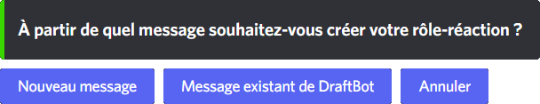
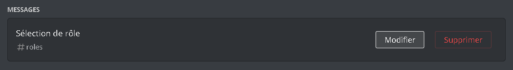
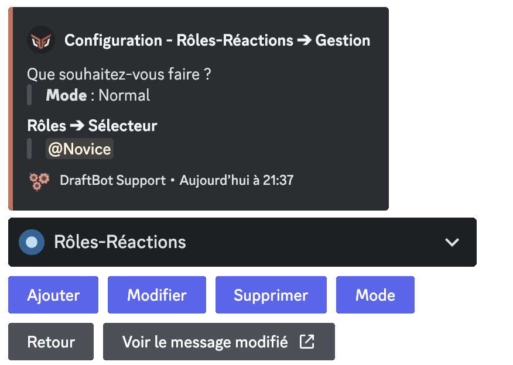

## Overview

A message with reaction-roles lets you give your users a message accompanied by reactions they can use to assign roles to themselves.

## Creating a reaction-role

::tabs
  ::tab{ label="From the panel" }
    [⫸ Open the **DraftBot** panel](/dashboard/first/roles-reactions)

    To configure the reaction-roles system, open the configuration page and select the server you want.

    First, select the channel the reaction-role message is sent to, using the selector above the Embed Creator.

    Here are the different ways of setting the message members interact with to receive a role:

    - By creating a new message and/or an embed with the Embed Creator in the middle of the page.
    - By using a **DraftBot** message created beforehand. To retrieve it, click the "`Retrieve a message`" button in the top right corner of the page. Then give the channel the message is in, as well as the [ID of the message](/docs/misc/finding-an-id#message-id) to retrieve. Then click "Retrieve".

    Then add your emoji and role pairings. You can add up to 10 per message.

    ::hint{ type="info" }
      Premium doubles the limit and lets you add up to 20 reaction-roles per message.
    ::

    You can change the message's reaction-role mode with the selector just below the Embed Creator.

    ::hint{ type="info" }
      You can name your reaction-roles. To do so, go to the list of existing reaction-roles, then change the name of the reaction-role by clicking "UNNAMED".

      
    ::

    
  ::

  ::tab{ label="Using the /config command" }
    To create a reaction-role, open \</config>, then the "🧿 Reaction-Roles" section (*in the selector*). Then click "Create a new reaction-role".

    

    Once that is done, several choices are available:

    - **New message** ➜ **DraftBot** creates an embed with a custom title.
    - **Existing message from DraftBot** ➜ The bot retrieves a **DraftBot** message that has already been sent.

    ::hint{ type="warning" }
      To create a reaction-role from a message that has already been sent, you need to obtain its [ID](/docs/misc/finding-an-id#message-id).
    ::

    ::hint{ type="info" }
      If you want to create a message for your reaction-role, here are the different options:

      - **Through the \</say> command**: sends a simple message under **DraftBot**'s identity.
      - **Through the Embed Creator on the [panel](/dashboard/first/messages)**: allows the complete and easy creation of a fully customizable message or embed.
    ::

    

    ::hint{ type="warning" }
      Reaction-roles can only be added to messages sent by **DraftBot**.
    ::

    The whole creation is then guided by **DraftBot**. It asks you for the role to be added when someone interacts with the message, and for the reaction-role's format.

    ::hint{ type="info" }
      A role can be granted temporarily by choosing buttons as the format.
    ::

    ::hint{ type="success" }
      Congratulations! The reaction-role is now created. We can now add other roles to it and carry on customizing it.
    ::
  ::
::

## Managing a reaction-role

::tabs
  ::tab{ label="From the panel" }
    [⫸ Open the **DraftBot** panel](/dashboard/first/roles-reactions)

    To manage an existing reaction-role, first open the panel through the link above, then the "Reaction-Roles" section.

    On the right of the page, you will find the list of every reaction-role existing on the server. To edit one, click "Edit".

    You can then edit reaction-roles in different ways:

    - By editing the reaction-role's message with the Embed Creator in the middle of the page.
    - By changing the reaction-role's mode with the selector just below the Embed Creator.
    - By adding, editing or deleting a reaction-role in the section below the mode selector.

    ::hint{ type="success" }
      Finally, click "Edit": your reaction-role is updated!
    ::

    
  ::

  ::tab{ label="Using the /config command" }
    To manage your reaction-role, open \</config>, then the "🧿 Reaction-Roles" section (*in the selector*). Then click "Manage an existing reaction-role".

    ::hint{ type="info" }
      To open the reaction-role, you have to give the [ID](/docs/misc/finding-an-id#message-id) of the message containing it.
    ::

    ### Adding or removing a role from your reaction-role

    To add a new role to your reaction-role, click "Add". **DraftBot** then asks you for the role to add as well as the format.

    To remove a role from its reaction-role, click "Delete". The bot then asks for the role to remove.

    ### Editing a reaction-role

    If you want to change the role a member receives when interacting with a button, a reaction or a role option in a selector, click "Edit". **DraftBot** invites you to select the role to change and the one you want to replace it with.

    ### The different modes

    Modes change the way your members can select roles and the way they keep them.
    To change a reaction-role's mode, click "Mode".

    The only mode available for every format is the *Normal* mode (the role is added or removed when interacting with the message).

    - **Reversed**: the role is removed when the reaction is added, and added when the reaction is removed.
    - **Simple**: the role is added or removed when the reaction is added, and the reaction is removed immediately.
    - **Addition of the definitive role**: the user's reaction is removed when the role is added, and the role cannot be removed.
    - **Withdrawal of the definitive role**: the user's reaction is removed when the role is removed, and the role cannot be taken back.

    

    ::hint{ type="success" }
      You now know how to manage your reaction-role!
    ::
  ::
::
