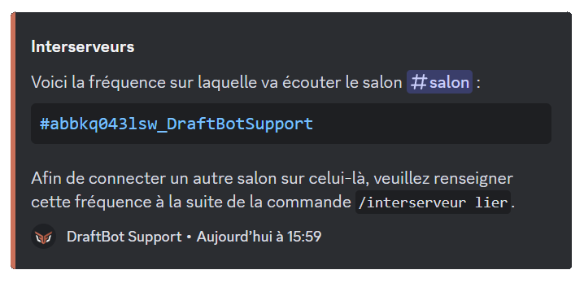
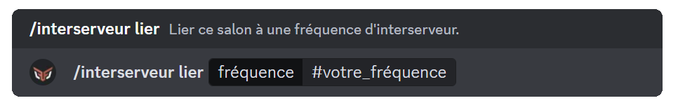

## The principle

An interserver links **two channels belonging to different servers**: every message written in one is automatically copied into the other by DraftBot, under its author's identity. Your members can therefore talk with the members of another server without having to join it.

The link relies on a **frequency**: a unique code generated in the first channel, which you then enter in the second one to connect them.

## Available commands

DraftBot gives you **three commands** to manage your interservers.

### /interserver generate

The \</interserver generate> command [creates a **unique frequency**](#creating-a-frequency) for your channel.

::hint{ type="info" }
  Each frequency belongs to one channel and cannot be duplicated.
::

### /interserver link

Once the frequency has been created, use \</interserver link> in the **second channel** you want to link to the first one.

::hint{ type="info" }
  The messages sent in one channel are automatically replicated in the other one through DraftBot.
::

### /interserver manage

The \</interserver manage> command lets you **check the frequency** of a channel or change its existing link.

::hint{ type="info" }
  This command is useful for checking your configurations or finding an existing frequency.
::

## Setting up an interserver

Here is the step-by-step process for linking two separate channels.

### Creating a frequency

- Use \</interserver generate> in the **first channel**.
- A unique frequency is created and displayed by DraftBot.

::hint{ type="success" }
  **Congratulations!** The frequency is ready, you can now link a second channel!
::

### Linking a second channel

- In the channel you want to connect, use \</interserver link>.
- Give the **frequency of the first channel** to establish the link.

### Checking or managing the link

- Use \</interserver manage> to check the frequency or change the connection.
- Every piece of information about the link is displayed.

::hint{ type="success" }
  **Congratulations!** The interserver is now set up on your server!
::

## Additional information

- You cannot link two channels of the **same server**.
- You can set up **1** interserver. [Premium](/premium) <:icon_premium:1096140508625125417> servers have no limit.
- Messages from bots and webhooks are ignored.
- A channel cannot be linked to more than one frequency.

::hint{ type="warning" }
  A cooldown applies to sending messages; it is there as a safety measure to prevent abuse.
::
