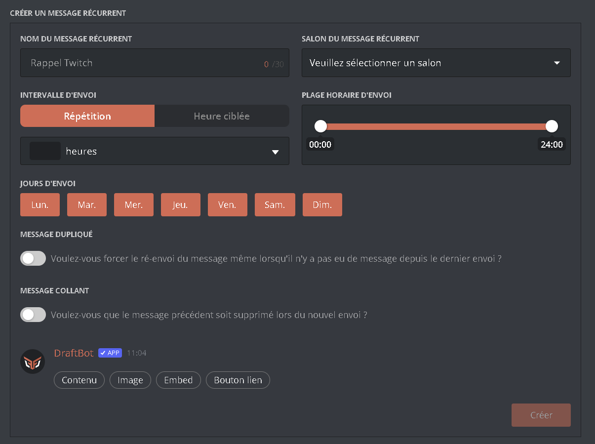
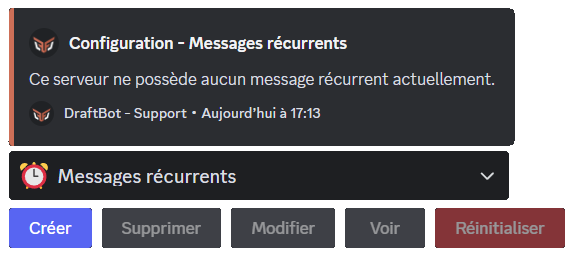
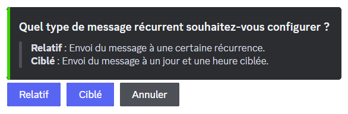
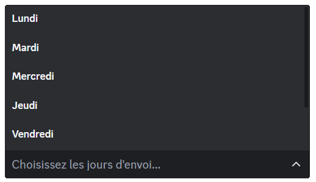
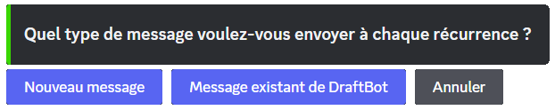

## Creating a repeat message

::tabs
  ::tab{ label="From the panel" }

    [⫸ Open the **DraftBot** panel](/dashboard/first/repeat-messages)

    You can configure a whole range of options:

    - `"Repeat message name"` ➜ Give your message a name to find it in the list of all your repeat messages!

    ::hint{ type="info" }
      This name is not visible to the members of your server.
    ::

    - `"Repeat message channel"` ➜ Select the channel the message is sent to.
    - `"Sending interval"` ➜ Choose the type of interval.

    ::tabs
      ::tab{ label="Repetition" }
        ➜ *The message is sent at a set recurrence.*

        Start by entering the recurrence at which you want your message to be sent.

        You can then limit the times at which your repeat message is sent. To do so, set a time range in "Sending time".

        ::hint{ type="info" }
          This means that during the time range you set here, your message is sent at each recurrence you configured in the previous step.
        ::
      ::

      ::tab{ label="Target time" }
        ➜ *The message is sent on a target day and time.*

        Simply set the time at which you want your message to be sent in the selector.

        ::hint{ type="info" }
          *The time is based on [the French time zone](https://time.is/Paris)*.
        ::
      ::
    ::

    - `"Days of sending"` ➜ You can restrict the sending of the message to certain days of the week.

    ::hint{ type="info" }
      In the basic configuration, every day is a sending day.
    ::

    - `"Duplicated message"` ➜ Once this option is enabled, the repeat message is not sent if there has been no message since the last time it was sent.
    - `"Sticky message"` ➜ When the repeat message is sent, the bot automatically deletes the previous one ([premium](/premium/) <:icon_premium:1096140508625125417>)

    
  ::

  ::tab{ label="Using the /config command" }

    ::hint{ type="warning" }
      During the configuration, if you want a message containing an embed, you can select a message you have already created. To do so, go to the [panel](/dashboard/first/messages), in the "message" category.
    ::

    To begin, run the \</config> command, then select ":alarm_clock: Repeat messages" in the selector. Finally, click `"Create"`. DraftBot then guides you through the whole procedure:

    

    ### Naming your repeat message

    The first thing to do is name your message. This name is what tells it apart in the list of your repeat messages.

    ::hint{ type="info" }
      This name is not visible to the members of your server.
    ::

    ### Sending interval

    The next thing to do is set how often the message is sent. You can choose between two types of interval:

    ***Relative**: the message is sent at a set recurrence.*

    ***Targeted**: the message is sent on a target day and time.*

    

    ::tabs
      ::tab{ label="Relative" }

        ### Sending time

        Start by entering the recurrence at which you want your message to be sent.

        You can then limit the times at which your repeat message is sent. The bot asks you for a time range during which the message should be sent.

        ::hint{ type="info" }
          This means that during the time range you set here, your message is sent at each recurrence you configured in the previous step.
        ::

        ### Days of sending

        You can also decide to limit the sending of your repeat message to certain days. To do so, choose the days the message **should be sent** on in the selector.

        
      ::

      ::tab{ label="Targeted" }

        ### Sending time

        Start by entering the time at which you want your message to be sent.

        ::hint{ type="info" }
          *The time is based on [the French time zone](https://time.is/Paris)*.
        ::

        ### Days of sending
        You can also decide to limit the sending of your repeat message to certain days. To do so, choose the days the message __should be sent__ on in the selector.

        
      ::
    ::

    ### Setting the message

    To add your message, you have two options:

    - Select an existing message by obtaining its [ID](/docs/misc/finding-an-id#message-id).
    - Create a message directly through the `"New message"` button.

    ::hint{ type="info" }
      Feel free to use Discord's [Markdown](https://support.discord.com/hc/en-us/articles/210298617-Markdown-Text-101-Chat-Formatting-Bold-Italic-Underline).
    ::

    ::hint{ type="warning" }
      This message offers little customization. That is why we advise you to create a fully customized message from the [panel](/dashboard/first/messages) and then select it through its [ID](/docs/misc/finding-an-id#message-id).
    ::

    

    #### Selecting the channel

    Finally, select the channel the message should be sent to.

    #### Additional options

    The bot finishes by asking you a few questions:

    - Do you want the repeat message not to be sent when it is the last message in the channel? ➜ This avoids having the same message several times in a row when there has been no activity since the last time it was sent.

    - Do you want the last message sent to be deleted? ➜ This feature keeps the latest version of the message at the bottom of the channel and keeps the channel tidier. ([premium](/premium/) <:icon_premium:1096140508625125417>)

    ::hint{ type="success" }
      Congratulations! Your repeat message is now created and configured! :tada:
    ::
  ::
::

