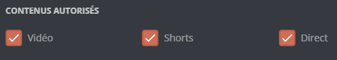
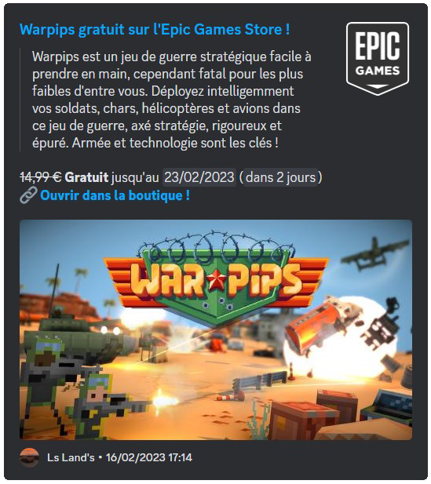
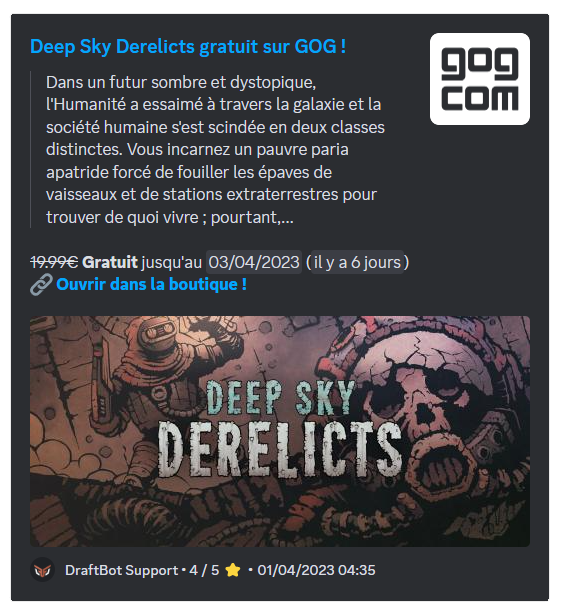
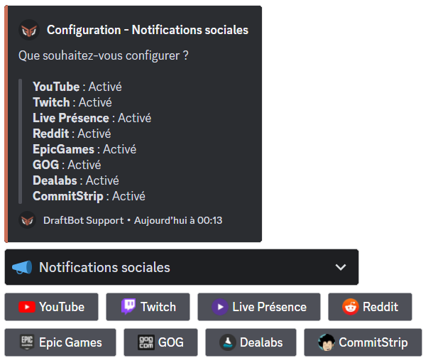

## Modules

### YouTube

This module **displays** a message when a [`YouTube`](https://www.youtube.com/) **video is published.**

The announcement is fully **customizable**. Administrators can therefore configure **a notified role**, enable **publication on other servers**, choose the **color** of the announcement embed ([premium](/premium) <:icon_premium:1096140508625125417>), as well as other visual elements.

::hint{ type="info" }
  You can add **a single [YouTube](https://www.youtube.com/) channel**. [Premium](/premium) <:icon_premium:1096140508625125417> servers can have up to 5.
::

You can select the **types of videos** that are published, in the YouTube channel's configuration. You can therefore add videos, shorts and live streams.

You can customize the announcement message with several variables:

| Variable | Description | Example |
|----------|-------------|---------|
| `{video.author}` | Channel name | DraftBot |
| `{video.title}` | Video title | How to use DraftBot |
| `{video.url}` | Video link | https://youtube.com/... |

*In addition to the [other variables](/docs/misc/variables) already available globally!*

### Twitch

::hint{ type="info" }
  This feature is reserved for [premium](/premium) <:icon_premium:1096140508625125417> servers.
::

**Twitch social notifications** send a **customizable** message when a **live stream starts**. A server can configure up to **5 different Twitch social notifications**.

::hint{ type="info" }
  To avoid embed spam, a 30-minute delay applies between two announcements from the same person.
::

You can customize the announcement message with several variables:

| Variable | Description | Example |
|----------|-------------|---------|
| `{stream.author}` | Channel name | StreamerName |
| `{stream.title}` | Stream title | Development stream |
| `{stream.game}` | Game being streamed | Just Chatting |
| `{stream.url}` | Stream link | https://twitch.tv/... |
| `{stream.start_at}` | Start time | 2 hours ago |
| `{stream.tags}` | Stream tags | english, development |

*In addition to the [other variables](/docs/misc/variables) already available globally!*

### Reddit

This module displays a notification when something is published in a **subreddit**. As with the other social notification modules, the message sent is fully customizable: it can therefore be sent as a **classic message or as an embed**.

::hint{ type="info" }
  You can only configure one [Reddit](https://www.reddit.com/) notification. [Premium](/premium) <:icon_premium:1096140508625125417> servers extend that limit to 10.
::

Here is an example of a notification message:

::hint{ type="info" }
  To make the **Minimum upvotes** option work for every server, a minimum delay of **15** minutes between the publication on Reddit and DraftBot's announcement has been put in place.
::

You can customize the announcement message with several variables:

| Variable | Description | Example |
|----------|-------------|---------|
| `{post.subreddit}` | Subreddit name | r/discord |
| `{post.title}` | Post title | Question about DraftBot |
| `{post.description}` | Post description | How do I set up… |
| `{post.url}` | Post link | https://reddit.com/... |

*In addition to the [other variables](/docs/misc/variables) already available globally!*

### Epic Games

This module sends an announcement when a free game is available on the [Epic Games Store](https://store.epicgames.com/).

::hint{ type="info" }
  The mentioned role, the color of the announcement and the sending channel can all be customized.
::

### Steam

This module sends an announcement when a free game is available on [Steam](https://store.steampowered.com/).

::hint{ type="info" }
  The mentioned role, the color of the announcement and the sending channel can all be customized.
::

### GOG

This module sends an announcement when a free game is available on [GOG](https://www.gog.com/).

::hint{ type="info" }
  The mentioned role, the color of the announcement and the sending channel can all be customized.
::

### Dealabs

This module sends a notification when a discount becomes "hot". This is the stage at which the deal is judged worthwhile by the site's users. You can also select specific categories of deals to send (for example: Tech, Fashion, etc.).

::hint{ type="info" }
  You can select up to **2** specific categories. [Premium](/premium) <:icon_premium:1096140508625125417> servers have no limit.
::

::hint{ type="info" }
  The mentioned role, the color of the announcement and the sending channel can all be customized.
::

### RSS feeds

An **RSS feed** is an address provided by a website, automatically listing its latest publications. This module lets DraftBot watch such a feed and announce every new publication on your server.

There are three ways of finding a site's RSS feed:

1. **Spot the RSS icon**

    Some sites mark their feed with this logo <:flux_rss:1402873518705868800>, usually placed in the header, the footer, the sidebar or the menu. Click it to open the feed.

2. **Guess the feed address**

    If no icon is visible, try adding one of these suffixes to the site's address — they are the most common ones:

    - `/feed/`
    - `/rss/`
    - `/rss.xml`

    For example, for the site `example.com`, try `example.com/feed/`.

3. **Generate the feed with rss.app**

    For sites that offer no feed at all, go to [rss.app](https://rss.app/). Paste the site's address in the generator, click "generate", and you will get a usable feed.

::hint{ type="info" }
  To avoid spam, a 10-minute delay applies between two announcements.
::

You can customize the announcement message with several variables:

| Variable | Description | Example |
|----------|-------------|---------|
| `{feed.name}` | Feed name | DraftBot Blog |
| `{feed.url}` | Feed link | https://draftbot.fr/... |

*In addition to the [other variables](/docs/misc/variables) already available globally!*

## Configuration

You can enable every type of social notification separately.

::tabs
  ::tab{ label="From the panel" }
    [⫸ Open the **DraftBot** panel](/dashboard/first/social-notifs)

    On this page, you can enable and disable social notifications as you like. There are two types:
    - The **tabs**, which can be configured for several channels or forums.
    - The **modules**, which enable notifications requiring very little configuration.

    
  ::

  ::tab{ label="Using the /config command" }
    To add an announcement for an event (a video or a post being published, a live stream starting, etc.), run the \</config> command and select the **Social notifications** system. You will then reach the tab below.

    

    Select the platform of your choice and configure it by following the prompts.
  ::
::

## Additional information

You will find the maximum number of announcements per platform in [the DraftBot Premium comparison](/premium#diff), in the **Social notifications** part.

