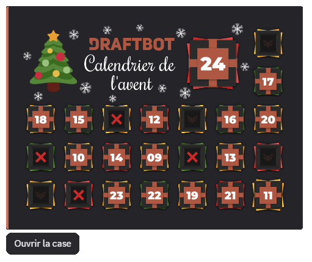

::hint{ type="info" }
  The Advent calendar can be configured from 25 November to 24 December.
::

## Opening a calendar box

To open your box of the day, use the \</calendar> command during December.

::hint{ type="success" }
  Each member can open **one box per day**, matching the current date. Opened boxes stay open, while missed ones are marked with a cross.
::

## Daily surprises

The Advent calendar lets you offer different types of surprises to your members:

::tabs
  ::tab{ label="Role" }
    You can let your members obtain roles (temporary or permanent) when they open a calendar box.

    Choose:
    - The calendar day (1 to 24)
    - The role to assign
    - The stacking mode: **Cumulative** or **Evolving**
    - The duration of the role *(for a temporary role)*

    ::hint{ type="info" }
      **Cumulative role:** cumulative roles are kept when the member receives a new role.

      **Evolving role**: evolving roles follow one another, each new role replacing the previous one.
    ::

    ::hint{ type="warning" }
      **Required permissions**: to assign roles, DraftBot needs:
      - The **"Manage Roles"** permission
      - A role **higher** in the hierarchy than the roles to assign

      The selected role must have been created on your server beforehand. If these conditions are not met, the member is notified but does not receive the role.
    ::
  ::

  ::tab{ label="Experience" }
    If the [level system](/docs/engagement/levels) is enabled on your server, you can reward your members with experience.

    Choose:
    - The calendar day (1 to 24)
    - The amount of experience to grant

    ::hint{ type="warning" }
      The level system must be **enabled** on your server to use this type of surprise.
    ::

    ::hint{ type="success" }
      Ideal for boosting the progress of your most active members over the Christmas period!
    ::
  ::

  ::tab{ label="Money" }
    If the [economy system](/docs/engagement/economy) is enabled, you can reward your members with the server's virtual money.

    Choose:
    - The calendar day (1 to 24)
    - The amount of money to grant

    ::hint{ type="warning" }
      The economy system must be **enabled** on your server to use this type of surprise.
    ::
  ::

  ::tab{ label="Inventory item" }
    Reward your members with custom [inventory items](/docs/engagement/inventory).

    Choose:
    - The calendar day (1 to 24)
    - The item to grant (among the existing ones, or create a new one)
    - The quantity of that item

    ::hint{ type="warning" }
      Members cannot exceed the limit of **1,000,000 copies** of the same item. If that limit is reached, the item cannot be added.
    ::
  ::

  ::tab{ label="Custom surprise" }
    Offer rewards **outside Discord**: promotional codes, game keys, physical goodies, subscriptions, etc.

    Choose:
    - The calendar day (1 to 24)
    - The name/description of the surprise

    ::hint{ type="success" }
      **How does it work?** When a member obtains this surprise, **you receive a direct message notification from DraftBot** with the member's details (username, ID, server). You can then hand the reward over however you like.
    ::

    ::hint{ type="warning" }
      Make sure your direct messages are open so you can receive notifications! If your DMs are closed or if you have left the server, the reward cannot be handed over and the member receives nothing.
    ::

    ::hint{ type="info" }
      Ideal for one-off rewards: access to a private channel, a coaching session, custom goodies, etc.
    ::
  ::
::

::hint{ type="success" }
  You can add **2 surprises per box**, and DraftBot picks one **at random**. [Premium](/premium) <:icon_premium:1096140508625125417> servers can add up to **25 per box**!
::

## Consecutive openings

Reward your members' regularity with the consecutive openings system! Members who open their box every day without a break can receive bonus rewards.

The streak is calculated as follows:

- Every day a member opens their box **without a break**, their streak increases by 1
- If a member **skips a day**, their streak resets to 1
- The streak can carry on **from one year to the next** (the 24 December box followed by the 1 December box of the following year keeps the streak going)

**Example:**
- Opening the boxes of 1, 2, 3 and 4 December → streak of 4
- No opening on 5 December
- Opening the 6 December box → streak of 1 (reset)

::hint{ type="info" }
  The bonus is announced in a hidden message, so nobody knows the reward in advance.
::

### Granting modes

Two granting modes are available for each reward:

| Mode | Description | Example |
|------|-------------|---------|
| **Unique mode** | The reward is obtained only once, when the target is reached | "Loyal" role at 7 consecutive openings |
| **Multiple mode** | The reward is obtained every time the target is reached again | 100 coins every 5 consecutive openings |

::hint{ type="info" }
  **Repeatable**: for rewards in unique mode, you can enable the "repeatable" option to let members earn the reward again if they break their streak and then reach the target once more.
::

### Counting the openings

You can choose how consecutive openings are counted:

- **All years combined**: openings from previous years are counted
- **Current year only**: only this year's openings count (useful for targets of 24 days or fewer)

::hint{ type="warning" }
  The consecutive openings streak resets if a member **misses a day**. For example, if they open the boxes of 1, 2 and 4 December (without opening the one of 3 December), their streak restarts at 1.
::

::hint{ type="success" }
  Servers can create up to **3 consecutive openings rewards**. [Premium](/premium) <:icon_premium:1096140508625125417> servers can create up to **10**!
::

## Customization

### Custom message

You can customize the message displayed when a member opens a calendar box. The following variables are available:

| Variable | Description | Example |
|----------|-------------|---------|
| `{day}` | Day number of the opened box | 15 |
| `{gift}` | Gift received in the opened box | 10,000 💰 |
| `{streak.count}` | Current number of consecutive openings | 7 |
| `{streak.record}` | The member's consecutive openings record | 15 |

*In addition to the [other variables](/docs/misc/variables) already available globally!*

### Consecutive openings message

A separate message can be set for consecutive openings rewards, with the following additional variables:

| Variable | Description | Example |
|----------|-------------|---------|
| `{day}` | Day number of the opened box | 15 |
| `{streak.count}` | Current number of consecutive openings | 7 |
| `{streak.record}` | The member's consecutive openings record | 15 |
| `{streak.reward}` | Name of the reward obtained | "Loyal" role |

*In addition to the [other variables](/docs/misc/variables) already available globally!*

### Custom background image

[Premium](/premium) <:icon_premium:1096140508625125417> servers can set a custom background image (10 MB maximum).

::hint{ type="success" }
  **Recommended dimensions**: 1740 x 1260 pixels. You can also add a semi-transparent grey filter to improve readability.
::

## Configuring the Advent calendar

::tabs
  ::tab{ label="From the panel" }

    [⫸ Open the **DraftBot** panel](/dashboard/first/advent-calendar)

    Click the button in the top right corner to enable the Advent calendar.
  ::

  ::tab{ label="Using the /config command" }
    If you would rather do the whole setup from Discord, you can use the \</config> command, then go to the **"Advent calendar"** tab.
  ::
::
