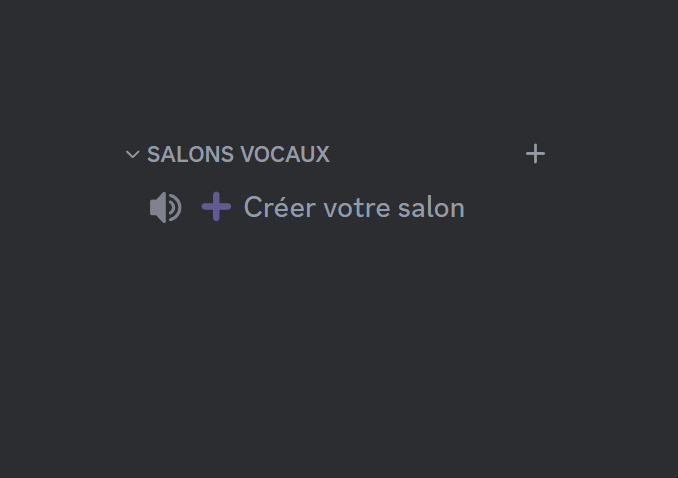
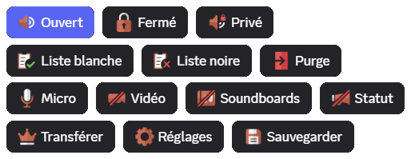
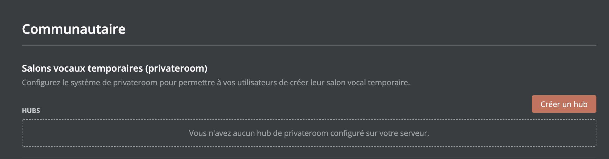
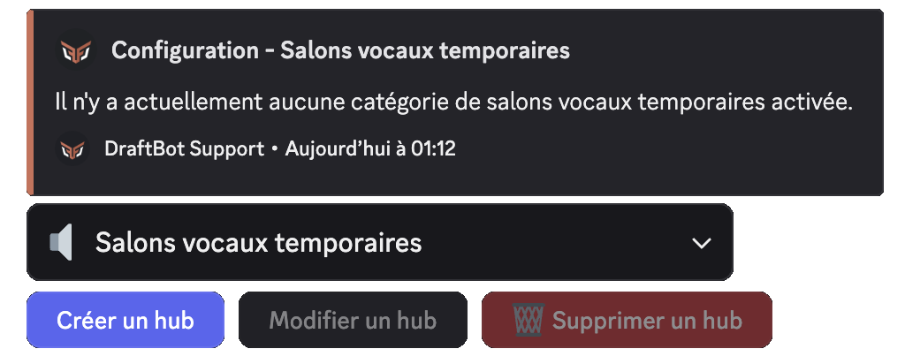
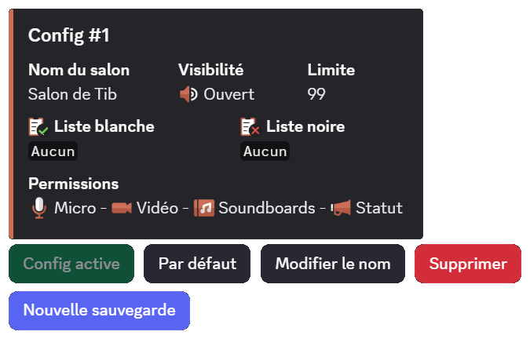

## Using temporary channels

To get your voice channel, you have to join the **hub**: a slightly special voice channel, which is not there for talking but for creating your own channel. As soon as you join it, DraftBot automatically moves you to a new channel of your own. By default it is named `➕ Create your channel`.

When you create a temporary voice channel, you can configure it through a [message](#using-the-settings-embed) *(this option can be disabled)*.

When the last member present in the channel disconnects, the temporary channel is deleted automatically by **DraftBot**.

## Using the settings embed

When you create a voice channel, an embed appears in the **voice channel's text chat**. It contains every moderation permission tied to the voice channel.

- **Open**: this option opens the channel to every member, except those on the **blacklist** and the default overrides.

::hint{ type="info" }
  In open mode, the users on the whitelist have the microphone, video and soundboard permissions.
::

- **Closed**: this option locks the channel to every member, except those on the **whitelist** and the default overrides.

- **Private**: this option locks and hides the channel from every member, except those on the **whitelist** and the default overrides.

- **Whitelist**: this option adds members who are **allowed to join** the channel whatever the mode (Open, Closed, Private) and who receive every microphone, video and soundboard permission.

- **Blacklist**: this option adds members who **cannot join** the voice channel.

::hint{ type="info" }
  When a member or a role is added to a temporary channel's blacklist, the people concerned are disconnected automatically.
::

- **Temporary Exclude**: this option **temporarily excludes** a member from the voice channel. The excluded member is disconnected immediately and cannot join the channel until the next session. This button is only available when a **save is active**. See the [Configuration saves](#configuration-saves) section for more details.

- **Purge**: purging disconnects every member present in the channel except those on the whitelist, the channel's owner, the moderators and the administrators. A confirmation with the list of members concerned is displayed before the action.
- **Microphone**: this option enables or disables the microphone for every participant in the voice channel.
- **Video**: as with the previous option, it allows or denies the permission to use the camera or screen sharing for every participant in the voice channel.
- **Soundboard**: this option enables or disables the use of soundboards for every participant in the voice channel.
- **Status**: this option allows or denies participants the ability to set the voice channel's status.

::hint{ type="info" }
  After every change, **DraftBot** confirms the new permission in a message only you can see. That message also lists the members who are not affected by it, because a role, the **Administrator** permission or a channel override already grants (or denies) them that permission elsewhere. For the **Microphone**, it also reminds you that members already connected will have to reconnect, as Discord does not allow anything else.
::

- **Settings**: this option opens a form for changing the voice channel's **name**, its **member limit** (from 0 to 99, where 0 means no limit) and its **voice region**. The options present in the form depend on the configuration chosen by the administrator (see [Settings options](#settings-options)). This lets members customize their channel **without needing the "Edit the channel" permission** in the creator's permissions, nor the **2FA** Discord requires on community servers.

::hint{ type="warning" }
  Discord limits channel changes to **2 times every 10 minutes**. **DraftBot** displays how many changes are left and a waiting time if the limit is reached.
::

- **Transfer**: this option transfers the voice channel's management rights to someone else.

::hint{ type="info" }
  If the owner leaves the voice channel and **channel requisition** has been enabled by an administrator, any user can take over ownership by pressing the **Transfer** button.
::

::hint{ type="danger" }
  Transferring ownership in a voice channel is permanent.
  You will lose access to the **voice channel**'s configuration embed.
::

- **Saves** <:icon_premium:1096140508625125417>: this option lets you **save** and **load** complete voice channel configurations. See the [Configuration saves](#configuration-saves) section for more details.

## Configuring the system

### Creating a hub
The temporary voice channel system can be configured through the \</config> command or through the web panel.

::tabs
  ::tab{ label="From the panel" }
    [⫸ Open the **DraftBot** panel](/dashboard/first/community)

    Go to the panel, then to the [Community](/dashboard/first/community) category.

    
  ::

  ::tab{ label="Using the /config command" }
    Run the \</config> command, then select `Voice channels` ➔ `Create a hub` from the dropdown menu.

    
  ::
::

::hint{ type="info" }
  By default, you can only create one hub. [Premium](/premium) <:icon_premium:1096140508625125417> servers have no limit.
::

::hint{ type="success" }
  **Congratulations, you have just created your hub!**
::

## Managing your hub
Now that your hub is set up, you can configure it in more advanced ways.

### Enabling / disabling a hub
A hub can be enabled and disabled to choose whether users are allowed to create voice channels.

::tabs
  ::tab{ label="From the panel" }
    [⫸ Open the **DraftBot** panel](/dashboard/first/community)

    In the list of hubs, an enable/disable button is available to the left of the `Edit` button.

    ::hint{ type="info" }
      If the module is enabled, clicking this button disables it. Conversely, if it is disabled, clicking it enables the module.
    ::
  ::

  ::tab{ label="Using the /config command" }
    Run the \</config> command, then select `Voice channels` ➔ `Edit a hub` from the dropdown menu.

    After clicking the button, you will see that your hub is enabled thanks to the green button named `System enabled`.

    ::hint{ type="info" }
      If the module is enabled, clicking this button disables it. Conversely, if it is disabled, clicking it enables the module.
    ::
  ::
::

::hint{ type="warning" }
  Even if the module is disabled, the voice channel that served as the hub does not disappear. It simply becomes an ordinary voice channel.
::

### Category
To keep your server organized, you can change the category DraftBot creates members' voice channels in.

::tabs
  ::tab{ label="From the panel" }
    [⫸ Open the **DraftBot** panel](/dashboard/first/community)

    Go to the panel, then to the [Community](/dashboard/first/community) category. Then click `Temporary voice channels (privateroom)` and finally the `Edit` button.

    Several options are available in the category section.

    - **Create**: DraftBot sets up a new category for you.
    - **Select**: you designate an existing category, by its name or its [ID](/docs/misc/finding-an-id).
  ::

  ::tab{ label="Using the /config command" }
    Run the \</config> command, then select `Voice channels` ➔ `Edit a hub` ➔ `Category` from the dropdown menu.

    After clicking the button, a confirmation message appears. Click `Yes` if you want to apply the change.

    You can choose between:

    - **New category**: DraftBot sets up a new category for you.
    - **Use an existing category**: you enter the name or ID of the category.
  ::
::

### Changing the hub
You can change the voice channel that serves as the hub, that is, the one that triggers the creation of a temporary channel when a member joins it.

::tabs
  ::tab{ label="From the panel" }
    [⫸ Open the **DraftBot** panel](/dashboard/first/community)

    Go to the panel, then to the [Community](/dashboard/first/community) category. Then click `Temporary voice channels (privateroom)` and finally the `Edit` button.

    Several options are available in the "creation channel" section.

    - **Create**: DraftBot sets up a new creation voice channel for you.
    - **Select**: you designate an existing voice channel, by its name or its [ID](/docs/misc/finding-an-id).
  ::

  ::tab{ label="Using the /config command" }
    Run the \</config> command, then select `Voice channels` ➔ `Edit a hub` ➔ `Hub (channel)` from the dropdown menu.

    After clicking the button, a confirmation message appears. Click `Yes` if you want to apply the change.

    You can choose between:

    - **New channel**: DraftBot sets up a new creation voice channel for you.
    - **Use an existing channel**: you enter the name or ID of the voice channel to use.
  ::
::

### Voice channel name format

To make voice channels look better, you can customize the format of temporary voice channel names by adding words, emojis and variables.

::tabs
  ::tab{ label="From the panel" }
    [⫸ Open the **DraftBot** panel](/dashboard/first/community)

    Go to the panel, then to the [Community](/dashboard/first/community) category. Then click `Temporary voice channels (privateroom)` and finally the `Edit` button.

    You can use variables from the list below:
  ::

  ::tab{ label="Using the /config command" }
    Run the \</config> command, then select `Voice channels` ➔ `Edit a hub` ➔ `Channel names` from the dropdown menu.

    You will be able to choose several variables among those listed below.
  ::
::

::collapse{ label="List of variables" }

  - `{user}` to display the member's nickname on the server.
  - `{user.username}` to display the member's Discord name.
  - `{user.tag}` to display the nickname with the member's tag (Username#0000).
  - `{index}` to number the channel.
  - `{random-word}` to assign a random word from a list of **DraftBot** words.
  - `{custom-word}` to assign a random word from a customizable list.

  ::hint{ type="info" }
    The `{custom-word}` variable has to be configured from the panel.
  ::
::

::hint{ type="info" }
  This feature is reserved for [premium](/premium) <:icon_premium:1096140508625125417> servers.
::

### Default permissions
You can set the default permissions applied to temporary voice channels.

::tabs
  ::tab{ label="From the panel" }
    [⫸ Open the **DraftBot** panel](/dashboard/first/community)

    Go to the panel, then to the [Community](/dashboard/first/community) category. Then click `Temporary voice channels (privateroom)` and finally the `Edit` button.

    Several options are available in the channel permissions section.

    - **Those of the category**: DraftBot takes the category's permissions and applies them to the user's temporary voice channel.

    - **Those of the creation channel**: DraftBot takes the hub's permissions and applies them to the user's temporary voice channel.
  ::

  ::tab{ label="Using the /config command" }
    Run the \</config> command, then select `Voice channels` ➔ `Edit a hub` ➔ `Default permissions` from the dropdown menu.

    You can choose between two options:

    - **Those of the category**: DraftBot takes the category's permissions and applies them to the user's temporary voice channel.

    - **Those of the creation channel**: DraftBot takes the hub's permissions and applies them to the user's temporary voice channel.
  ::
::

### Creator's permissions
DraftBot gives your users a high level of customization for their temporary voice channels, while letting you, as an administrator, define precisely which customization options they have at their disposal.

- **Create an invitation**: lets the creator create invitations for the voice channel.
- **Edit the channel**: grants permission to change the channel's settings.
- **Change permissions**: allows every channel setting to be changed. The creator will be able to create overrides and grant or deny permissions to the members and roles of their choice.
- **Priority speaker**: the sound of every participant is lowered when the channel's creator speaks.
- **Set voice channel status**: the creator will be able to set the voice channel's status.
- **Use soundboards**: gives the ability to use soundboards.

::hint{ type="info" }
  To use `priority speaker`, the microphone activation has to be in "[Push-to-Talk](https://support.discord.com/hc/en-us/articles/211376518-Voice-Input-Modes-101-Push-to-Talk-Voice-Activity)" mode.
::

::hint{ type="danger" }
  **If you grant the `Change permissions` permission, creators will be able to give themselves permissions, which could compromise your server's security. We recommend granting this permission only if you are sure you know what you are doing!**
::

::tabs
  ::tab{ label="From the panel" }
    [⫸ Open the **DraftBot** panel](/dashboard/first/community)

    Go to the panel, then to the [Community](/dashboard/first/community) category. Then click `Temporary voice channels (privateroom)` and finally the `Edit` button.

    Several options are available in the "channel creator's permissions" section.
  ::

  ::tab{ label="Using the /config command" }
    Run the \</config> command, then select `Voice channels` ➔ `Edit a hub` ➔ `Creator's permissions` from the dropdown menu.

    The list of the different permissions then appears.
  ::
::

### Member limit
You can set the limit of members allowed to join a user's temporary voice channel.

::tabs
  ::tab{ label="From the panel" }
    [⫸ Open the **DraftBot** panel](/dashboard/first/community)

    Go to the panel, then to the [Community](/dashboard/first/community) category. Then click `Temporary voice channels (privateroom)` and finally the `Edit` button.

    You will be able to set the limit in the "user limit" section.
  ::

  ::tab{ label="Using the /config command" }
    Run the \</config> command, then select `Voice channels` ➔ `Edit a hub` ➔ `Members limit` from the dropdown menu.

    You will be able to choose any value between **0** and **99**.

    ::hint{ type="info" }
      If you want no limit at all, enter 0.
    ::
  ::
::

### Permanent channels
Permanent channels are channels that stay even after the user has left a voice channel. This feature stops DraftBot from deleting the voice channel. It is often used by server owners who want to create a voice channel without using the system.

::hint{ type="info" }
  Note that DraftBot adds it to the permanent channels automatically through the \</config> command.
::

::tabs
  ::tab{ label="From the panel" }
    [⫸ Open the **DraftBot** panel](/dashboard/first/community)

    Go to the panel, then to the [Community](/dashboard/first/community) category. Then click `Temporary voice channels (privateroom)` and finally the `Edit` button.

    You will be able to add or remove permanent channels in the "permanent channels" section.
  ::

  ::tab{ label="Using the /config command" }
    Run the \</config> command, then select `Voice channels` ➔ `Edit a hub` ➔ `Permanent channel` from the dropdown menu.

    A menu for adding or removing permanent channels appears.
  ::
::

## Settings embed
Users can configure their voice channels directly through an interface located in the text chat of their temporary voice channel.

::tabs
  ::tab{ label="From the panel" }
    [⫸ Open the **DraftBot** panel](/dashboard/first/community)

    Go to the panel, then to the [Community](/dashboard/first/community) category. Then click `Temporary voice channels (privateroom)` and finally the `Edit` button.

    You will be able to configure it in the "Channel configuration" section.
  ::

  ::tab{ label="Using the /config command" }
    Run the \</config> command, then select `Voice channels` ➔ `Edit a hub` ➔ `Settings embed enabled` from the dropdown menu.

    After clicking the button, you will see that your hub is enabled thanks to the green button named `System enabled`.

    ::hint{ type="info" }
      If the module is enabled, clicking this button disables it. Conversely, if it is disabled, clicking it enables the module.
    ::
  ::
::

### Access roles
This option allows one or more roles to join temporary voice channels by default. It is these roles' permissions that are changed when the owner changes their channel's visibility (`Open`, `Closed`, `Private`).

::hint{ type="info" }
  You can select up to **5 access roles**, which cannot be added to the whitelist or the blacklist by the channel's owner.
::

::hint{ type="info" }
  By default, **@everyone** has access to temporary voice channels.
::

::tabs
  ::tab{ label="From the panel" }
    [⫸ Open the **DraftBot** panel](/dashboard/first/community)

    Go to the panel, then to the [Community](/dashboard/first/community) category. Then click `Temporary voice channels (privateroom)` and finally the `Edit` button.

    You will be able to configure it in the "Access roles for temporary channels" section, by selecting **@everyone** or up to **5 roles**.
  ::

  ::tab{ label="Using the /config command" }
    Run the \</config> command, then select `Voice channels` ➔ `Edit a hub` ➔ `Access roles` from the dropdown menu.

    You can choose between two options.

    - **@everyone**: by default, everyone can join a temporary voice channel. (unless the owner sets the voice channel to `Closed` or `Private`)
    - **Custom roles**: choose up to **5 roles** you have already set up. If **@everyone** does not have access to the category or to the creation channel, **DraftBot** offers you the roles that do have access straight away.
  ::
::

### Settings access roles
Roles can be configured so that they can or cannot change the settings embed, even if they are the channel's creator.

::tabs
  ::tab{ label="From the panel" }
    [⫸ Open the **DraftBot** panel](/dashboard/first/community)

    Go to the panel, then to the [Community](/dashboard/first/community) category. Then click `Temporary voice channels (privateroom)` and finally the `Edit` button.

    You will be able to configure it in the "Roles with/without access to the configuration menu" section.
  ::

  ::tab{ label="Using the /config command" }
    Run the \</config> command, then select `Voice channels` ➔ `Edit a hub` ➔ `Settings access roles` from the dropdown menu.

    You will be able to add or remove allowed or disallowed roles.
  ::
::

### Moderator roles
Members holding a moderator role **automatically have access to every temporary voice channel** and **cannot be added to the blacklist** by the channel's creator. They can also **rename** any temporary voice channel, regardless of the [settings options](#settings-options) configured by the administrator.

::tabs
  ::tab{ label="From the panel" }
    [⫸ Open the **DraftBot** panel](/dashboard/first/community)

    Go to the panel, then to the [Community](/dashboard/first/community) category. Then click `Temporary voice channels (privateroom)` and finally the `Edit` button.

    You will be able to configure it in the "Moderator roles" section.
  ::

  ::tab{ label="Using the /config command" }
    Run the \</config> command, then select `Voice channels` ➔ `Edit a hub` ➔ `Moderator roles` from the dropdown menu.

    You will be able to add or remove moderator roles.
  ::
::

### Untouchable roles
Members holding an untouchable role **cannot be added to the whitelist or the blacklist** by the channel's creator. Unlike moderator roles, they do not automatically have access to the channels.

::tabs
  ::tab{ label="From the panel" }
    [⫸ Open the **DraftBot** panel](/dashboard/first/community)

    Go to the panel, then to the [Community](/dashboard/first/community) category. Then click `Temporary voice channels (privateroom)` and finally the `Edit` button.

    You will be able to configure it in the "Untouchable roles" section.
  ::

  ::tab{ label="Using the /config command" }
    Run the \</config> command, then select `Voice channels` ➔ `Edit a hub` ➔ `Untouchable roles` from the dropdown menu.

    You will be able to add or remove untouchable roles.
  ::
::

### Whitelisted member permissions
This option lets you decide whether the members on the whitelist can access the following four permissions.

- <:micro:1146811975280627783> **Microphone**
- <:video:1146811983870558298> **Video**
- <:soundboard:1146811981504970762> **Soundboards**
- <:status:1391998728415477771> **Status**

::tabs
  ::tab{ label="From the panel" }
    [⫸ Open the **DraftBot** panel](/dashboard/first/community)

    Go to the panel, then to the [Community](/dashboard/first/community) category. Then click `Temporary voice channels (privateroom)` and finally the `Edit` button.

    You will be able to configure it in the "Whitelisted member permissions" section.
  ::

  ::tab{ label="Using the /config command" }
    Run the \</config> command, then select `Voice channels` ➔ `Edit a hub` ➔ `Whitelisted member permissions` from the dropdown menu.

    You will be able to add or remove the four permissions.
  ::
::

### Customizing the settings buttons
You can customize the embed's settings buttons. This lets you disable settings buttons so that your members do not use them.

::tabs
  ::tab{ label="From the panel" }
    [⫸ Open the **DraftBot** panel](/dashboard/first/community)

    Go to the panel, then to the [Community](/dashboard/first/community) category. Then click `Temporary voice channels (privateroom)` and finally the `Edit` button.

    You will be able to configure it in the "Configuration menu buttons enabled" section.
  ::

  ::tab{ label="Using the /config command" }
    Run the \</config> command, then select `Voice channels` ➔ `Edit a hub` ➔ `Customize settings buttons` from the dropdown menu.

    You will be able to enable or disable the buttons of your choice.
  ::
::

### Settings options

You can choose precisely which options your members can change through the embed's **Settings** button. The three options available are:

- **Channel name**
- **User limit**
- **Voice region**

::hint{ type="info" }
  Unticking an option removes it from the settings form: members will no longer be able to change it themselves.
::

::tabs
  ::tab{ label="From the panel" }
    [⫸ Open the **DraftBot** panel](/dashboard/first/community)

    Go to the panel, then to the [Community](/dashboard/first/community) category. Then click `Temporary voice channels (privateroom)` and finally the `Edit` button.

    You will find the **Settings options** option, which lets you select the fields displayed in the settings modal.
  ::

  ::tab{ label="Using the /config command" }
    Run the \</config> command, then select `Voice channels` ➔ `Edit a hub` ➔ `Settings options` from the dropdown menu.

    You will be able to tick or untick each of the options displayed in the settings modal.
  ::
::

### Channel requisition

When this option is enabled, the members present in a temporary voice channel can **take over ownership** of the channel if the owner has left it, by clicking the **Transfer** button. The member who requisitions it becomes the channel's new owner.

::hint{ type="info" }
  If this option is disabled, members cannot take over a channel whose owner has left.
::

::tabs
  ::tab{ label="From the panel" }
    [⫸ Open the **DraftBot** panel](/dashboard/first/community)

    Go to the panel, then to the [Community](/dashboard/first/community) category. Then click `Temporary voice channels (privateroom)` and finally the `Edit` button.

    You will find the **Requisition** option, which lets members take over an inactive temporary voice channel.
  ::

  ::tab{ label="Using the /config command" }
    Run the \</config> command, then select `Voice channels` ➔ `Edit a hub` ➔ `Channel requisition enabled` from the dropdown menu.

    The button toggles between enabled and disabled.
  ::
::

### Saves
This option enables or disables the **configuration saves** system for temporary voice channels.

::hint{ type="info" }
  This feature is reserved for [premium](/premium) <:icon_premium:1096140508625125417> servers.
::

::tabs
  ::tab{ label="From the panel" }
    [⫸ Open the **DraftBot** panel](/dashboard/first/community)

    Go to the panel, then to the [Community](/dashboard/first/community) category. Then click `Temporary voice channels (privateroom)` and finally the `Edit` button.

    You will find the **Saves** option, which lets members save the configuration of their temporary voice channel.
  ::

  ::tab{ label="Using the /config command" }
    Run the \</config> command, then select `Voice channels` ➔ `Edit a hub` ➔ `Saves` from the dropdown menu.

    The button toggles between enabled and disabled.
  ::
::

## Configuration saves

::hint{ type="info" }
  This feature is reserved for [premium](/premium) <:icon_premium:1096140508625125417> servers and has to be enabled by an administrator in the hub's configuration.
::

Saves let members **save** and **load** complete configurations of their temporary voice channel. This includes:

- The channel's **visibility** (open, closed, private)
- The **member limit**
- The **channel name**
- The **whitelist and blacklist** (members and roles), automatically updated in the default save on every addition or removal
- The **permissions** (microphone, video, soundboard, status)

Each member can have up to **5 saves** per hub.

::hint{ type="info" }
  The **Temporary Exclude** button temporarily excludes a member from the voice channel without affecting the saves. Unlike the blacklist, the exclusion is not kept in the saves and ends with the next session.
::

### Creating a save
By clicking the **Saves** button and then **New save**, you have two options:

- **Current configuration**: records your channel's current configuration (visibility, permissions, lists, limit, name).
- **Blank configuration**: creates a save with the server's default settings.

A preview of the configuration is displayed before confirmation.

### Loading a save
Select a save in the dropdown menu, then click **Load** to apply that configuration to your current voice channel. Every permission, list and setting of the save is applied.

### Default save
You can set a save as the **default** one. It is then loaded automatically every time you create a new temporary voice channel.

::hint{ type="info" }
  When a default save is set, every change to the channel is kept from one channel to the next (change of visibility, of permissions, etc.).
::

### Managing saves
From the interface, you can:

- **Change the name** of a save
- **Delete** a save (with confirmation)
- **Set as default** a save

### Importing a save

You can **import a save from another hub or another server** where you have existing saves. The process takes several steps:

1. Select the source **server**
2. Select the source **hub**
3. Select the **save** to import

::hint{ type="warning" }
  When importing from another server, the **roles** present in the whitelist/blacklist are not imported (they belong to the original server). Only the **members** are kept, if they are present on the destination server.
::
