## What is the Counter?

The Counter is a collaborative counting system: your members send numbers in a dedicated channel, following an unbroken numeric sequence.

Each member has to send the number following the previous one. If an error is detected (wrong number, consecutive messages, invalid format), **DraftBot** automatically applies the rules configured by the administrators.

Counting is handled entirely by **DraftBot**, which analyses every message sent in the configured channel.

> ***DraftBot** watches the channel continuously. On every message, it checks the number, the author, the format and the active rules before accepting or rejecting the count.*

## Taking part in the Counter

The Counter is a collaborative counting game where the members of your server count together from **1 towards infinity**. The principle is simple: each member sends the next number in the dedicated channel.

- **Sequential counting**: send the number immediately following the previous one (1, 2, 3, 4...)
- **Mandatory alternation**: you cannot send two consecutive numbers. Another member has to count between your two messages, unless your server allows [consecutive messages](#consecutive-messages)
- **Message format**: send only the expected number (unless discussions are allowed)

::hint{ type="info" }
  The current number and the Counter statistics can be viewed through the \</counter> command.
::

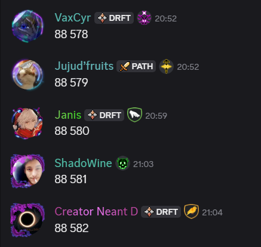

### Discussions allowed

Counting is good, but counting while chatting is even better!

If your server allows discussions (enabled by default), you can add text after the number:

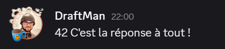

::hint{ type="info" }
  Discussions can be configured to allow or forbid line breaks in your messages. By default, line breaks are **forbidden**.
::

## Checking the leaderboard

To check your progress and the server leaderboard, use the \</counter> command.

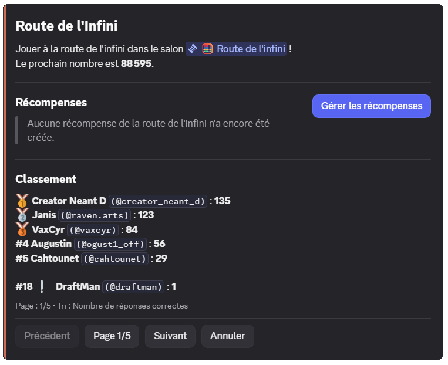

The command displays:
- The next number to send
- The rewards available (if configured)
- The leaderboard of the best participants
- Your position in the leaderboard

::hint{ type="info" }
  You can sort the leaderboard by **number of correct answers** or **number of errors** using the command's `sort` option.
::

## Rewards

### Reward types

Motivate your members by offering them rewards when they reach certain numbers! Rewards are visible in the \</counter> command.

- **Specific number**: the reward is granted once, at a precise number (for example at number 1000)
- **Multiple**: the reward is granted at every multiple of a number (for example every 100, so at 100, 200, 300, etc.)

| Type | Description | Example |
|------|-------------|---------|
| **Permanent role** | Grants a Discord role for good | "Expert Counter" role at number 1000 |
| **Temporary role** | Grants a role for a limited time | "Temporary Champion" role at every multiple of 500 |
| **Money** | Money from the [economy system](/docs/engagement/economy) | 5000 coins at number 100 |
| **Experience** | XP points from the [level system](/docs/engagement/levels) | 1000 XP at number 250 |
| **Inventory item** | One or more [inventory items](/docs/engagement/inventory) | 3x "Badge of honour" at number 500 |
| **Custom reward** | A reward you hand out yourself | Promo code, special mention, etc. |

::hint{ type="info" }
  When a reward is based on the server's [economy system money](/docs/engagement/economy), it can come:
  - **From creation**: the money is created for the occasion
  - **From the server bank**: the money comes from the money collected through errors (see [Error handling](#error-handling))
::

::hint{ type="info" }
  You can create up to **3 rewards**. [Premium](/premium) <:icon_premium:1096140508625125417> servers can create up to **10 rewards**!
::

### Limiting repeated wins

On a reward whose target is a **multiple**, you can prevent a single member from taking every tier:

| Option | Description |
|--------|-------------|
| **Not twice in a row** | If the same member triggers the tier twice in a row, the reward is not granted again. They can win it again at the following tier |
| **Win limit** | A member can only win this reward a set number of times, from **1 to 1000** |

In both cases, the member concerned is warned by a message in the [reward announcement channel](#reward-announcements), if it is configured.

::hint{ type="info" }
  In the \</config> command, these two options are called **"Consecutive wins"** and **"Win limit"** respectively.
::

::hint{ type="info" }
  These options are reserved for [premium](/premium) <:icon_premium:1096140508625125417> servers, and are only offered **on rewards of the "Multiple" type**.
::

### Mystery rewards

To keep an element of surprise, you can hide part of a reward in the \</counter> command:

| Hidden element | Effect |
|----------------|-------|
| **Hide the reward** | The content of the reward is replaced by "🎁 Mystery reward", but the tier stays visible |
| **Hide the target number** | The tier becomes "At a certain number" or "At regular intervals", but the reward stays visible |

You can hide one of the two elements, or both.

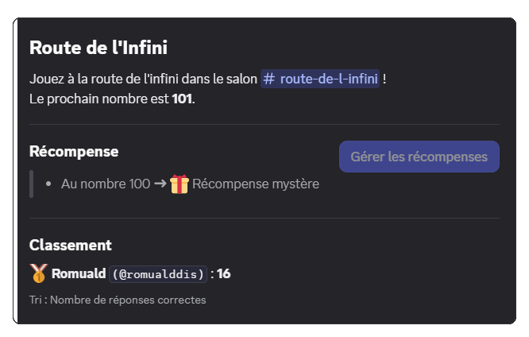

::hint{ type="info" }
  Unlike the options above, hiding is available on **every server**, and for both target types (specific number or multiple).
::

::tabs
  ::tab{ label="From the panel" }
    [⫸ Open the **DraftBot** panel](/dashboard/first/infinite-road)

    When creating or editing a reward, the **"Hide in /counter"** part appears as soon as you have chosen the reward type. Enable the elements you want to hide from your members.

    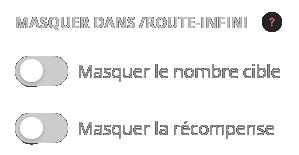

    ::hint{ type="warning" }
      Remember to confirm with the "Create" (or "Edit") button, then to save your changes with the "Save" button at the bottom of the page!
    ::
  ::

  ::tab{ label="Using the /counter command" }
    If you are a Counter animator or an administrator, the \</counter> command displays a **"Manage rewards"** button. It lets you:

    - Create, edit or delete a reward
    - Reset **every** reward

    When editing a reward, the **"Hidden elements"** button lets you select what you want to hide.

    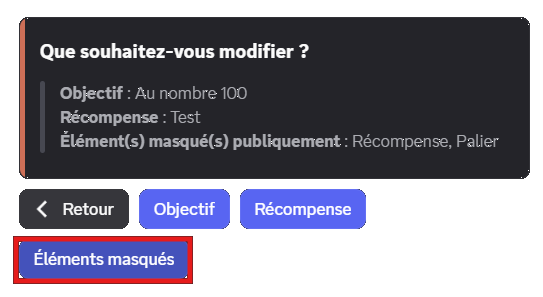
  ::
::

## Triggers

Triggers automate special actions when certain numbers are reached. Unlike rewards, triggers do not grant anything to members but create events in the channel.

| Action | Description |
|--------|-------------|
| **Temporary message** | Sends a customizable message that is deleted automatically after 8 seconds |
| **Reaction** | Automatically adds a reaction to the number's message |
| **Pinning** | Automatically pins the message in the channel |

::hint{ type="info" }
  You can create up to **3 triggers** for free. [Premium](/premium) <:icon_premium:1096140508625125417> servers can create up to **10 triggers**!
::

## Animator roles

Animators have special permissions to manage the Counter without penalties:

- **Invalid messages tolerated**: they can send messages containing no number without triggering an error
- **Editing the number**: they can correct the current number in case of a mistake, through interactive buttons
- **Reward management**: direct access to the reward configuration through \</counter>

::hint{ type="info" }
  Members with the **Administrator** permission automatically have all of these privileges without needing an animator role.
::

### Interactive buttons for animators

When an animator makes a mistake, buttons appear to handle the situation:

- **"I made a mistake"**: applies the normal penalties, as if they were an ordinary member
- **"Edit the current number"**: changes the current number to the one you sent
- **"Delete this message"**: simply deletes your mistaken message

## Error handling

The system automatically detects four types of errors. You then choose **which ones** trigger an additional action (reset, money removal, temporary role).

| Targeted error | Description |
|---------------|-------------|
| **Invalid number** | The member sends an incorrect number (43 instead of 42, for example) |
| **Invalid message** | The message contains no number, or does not follow the discussion rules |
| **Consecutive messages** | The member sends more numbers in a row than the [Consecutive messages](#consecutive-messages) option allows, without another member counting in between |
| **Command sent** | The member runs a command in the counting channel |

### Resetting the counter

If enabled, the counter restarts from **1** and a message explains who caused the reset.

::hint{ type="info" }
  By default, resetting on error is **disabled**. Even if you enable it, it only applies to the error types you have selected in the configuration.
::

#### Reset message

The message sent on reset is customizable (**1000 characters maximum**) with the following variables:

| Variable | Description | Example |
|----------|-------------|---------|
| `{infiniteroad.number}` | The next number expected after the reset | 1 |
| `{infiniteroad.error_type}` | The type of error that caused the reset | an **incorrect number** |

*In addition to the [other variables](/docs/misc/variables) already available globally!*

**Default message**: `❌ {user} ruined the Counter by sending {infiniteroad.error_type}! The counter has been reset, the next number is **{infiniteroad.number}**.`

::tabs
  ::tab{ label="From the panel" }
    [⫸ Open the **DraftBot** panel](/dashboard/first/infinite-road)

    Enable the "Enable reset on error" option: the "Custom reset message" part then appears right below.

    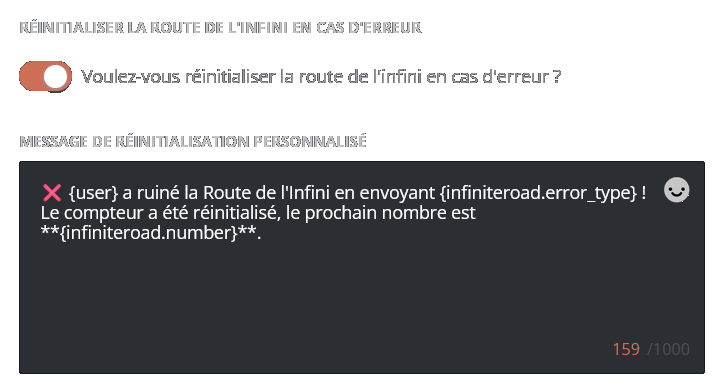
  ::

  ::tab{ label="Using the /config command" }
    Open the \</config> command, then the "Counter" tab. Then press the "Errors" button, followed by "Reset message".

    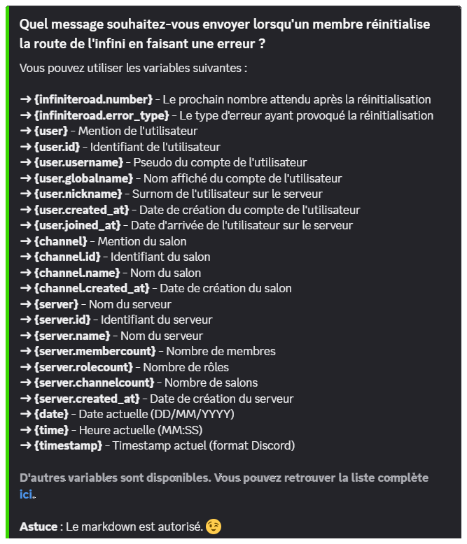
  ::
::

::hint{ type="info" }
  Markdown is allowed in this message.
::

### Money removal

If the [economy system](/docs/engagement/economy) is enabled, you can take money away from members who make certain errors (disabled by default). Two modes are available:

- **Definitive**: the money is destroyed and disappears for good (default mode)
- **Collect**: the money is transferred to the **server bank** (DraftBot's money) and can be redistributed through rewards

::hint{ type="info" }
  By default, if you enable this option, **200 coins** are removed **definitively**. The removal only applies to the error types you have selected.
::

::hint{ type="warning" }
  If the economy system is disabled while money removal is enabled, this option is disabled automatically and you receive a notification.
::

### Temporary punishment role

You can automatically assign a temporary role to members who make certain errors (a "Naughty corner" role for 10 minutes, for example). As with the other actions, the role is only assigned for the error types you have selected.

## Display modes

The Counter offers three modes for displaying messages in the dedicated channel:

| Mode | How it works | Advantages |
|------|----------------|-----------|
| **Classic** | The member's message stays as it is | Authenticity, possibility of adding a validation reaction |
| **DraftBot** | The message is deleted then sent again by DraftBot | Prevents later editing, uniform format |
| **Webhook** | The message is deleted then sent again with the member's identity | Prevents later editing, keeps the member's visual identity |

::hint{ type="info" }
  The **DraftBot** and **Webhook** modes stop members from editing their message after sending it, guaranteeing the integrity of the count.
::

### Message formats

When you use the **DraftBot** or **Webhook** modes, two display formats are available:

- **Message** (default): plain text display, customizable with variables
- **Embed**: display in a Discord embed with or without color, customizable with variables

#### Customization variables

The message format is fully customizable with dynamic variables:

- `{number}`: the current number
- `{discussion}`: the discussion text (if allowed)

**Default format**: `{user}: {number} {discussion}`

::hint{ type="info" }
  Format customization is reserved for [premium](/premium) <:icon_premium:1096140508625125417> servers.
::

### System color

The system color applies both to the messages resent in the **Embed** format and to the display of the \</counter> command. By default, it is **#CD6E57** (orange).

::hint{ type="info" }
  Color customization is reserved for [premium](/premium) <:icon_premium:1096140508625125417> servers.
::

### Validation reaction

In **Classic** mode, you can configure a reaction that is added automatically to every message containing a valid number (disabled by default). Use a standard emoji (✅, ⭐) or a custom emoji from your server.

::hint{ type="warning" }
  If the configured emoji is deleted or becomes unavailable, the reaction is disabled automatically and you receive a notification.
::

## Discussions

You can allow members to add text after the number:

- **Allow discussions**: enables or disables the possibility of writing after the number (enabled by default)
- **Allow line breaks**: allows line breaks in discussions (disabled by default)
- **Ignore messages without numbers**: if enabled, messages containing no number are simply ignored instead of triggering an error (disabled by default)

### Consecutive messages

By default, the same member cannot send two numbers in a row: another member has to count between their two messages. You can lift this rule from that same **Discussions** part:

- **Allow consecutive messages**: lets the same member send several numbers in a row (disabled by default)
- **Number of consecutive messages allowed**: how many numbers the same member can send in a row, **from 2 to 20**

Beyond that limit, the **Consecutive messages** error is triggered as usual.

## Configuring the Counter

::tabs
  ::tab{ label="From the panel" }

    [⫸ Open the **DraftBot** panel](/dashboard/first/infinite-road)

    To enable the module, the first step is to click "Set up in a few seconds" and go through the quick setup:

    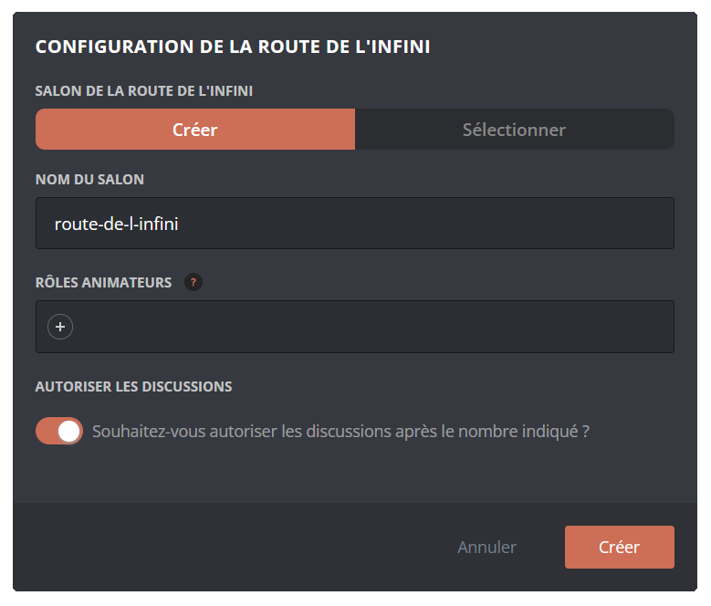

    A configuration assistant then guides you through the setup steps:

    1. **Choosing the channel**: create a new channel or use an existing one
    2. **Animator roles**: set the roles with special permissions (optional)
    3. **Display mode**: choose between Classic, DraftBot or Webhook
    4. **Format**: select Message or Embed

    Once configured, every feature appears:

    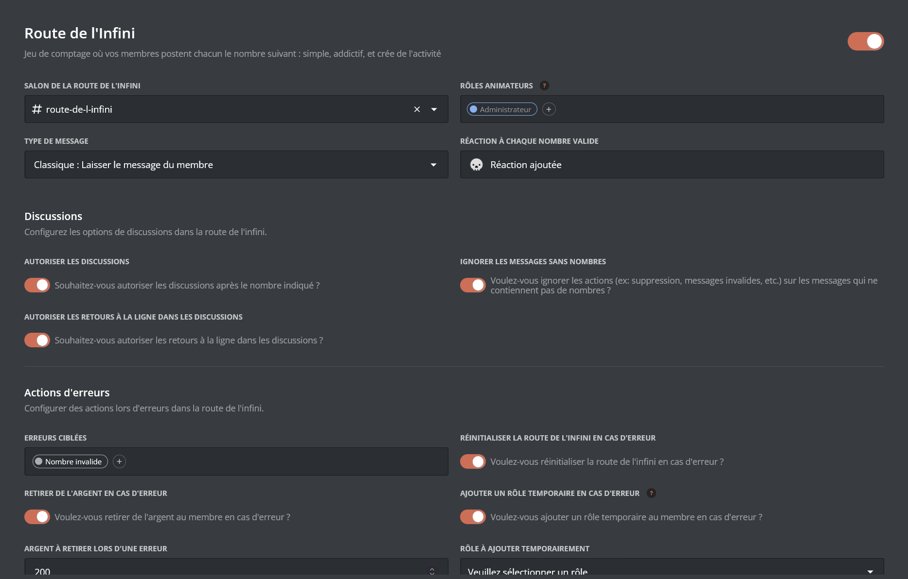

    ::hint{type="warning"}
      Once your changes are done, remember to save them with the "Save" button at the bottom of the page!
    ::
  ::

  ::tab{ label="Using the /config command" }

    If you would rather do the whole setup from Discord, you can use the \</config> command, then go to the "Counter" tab. The menu then looks like this:

    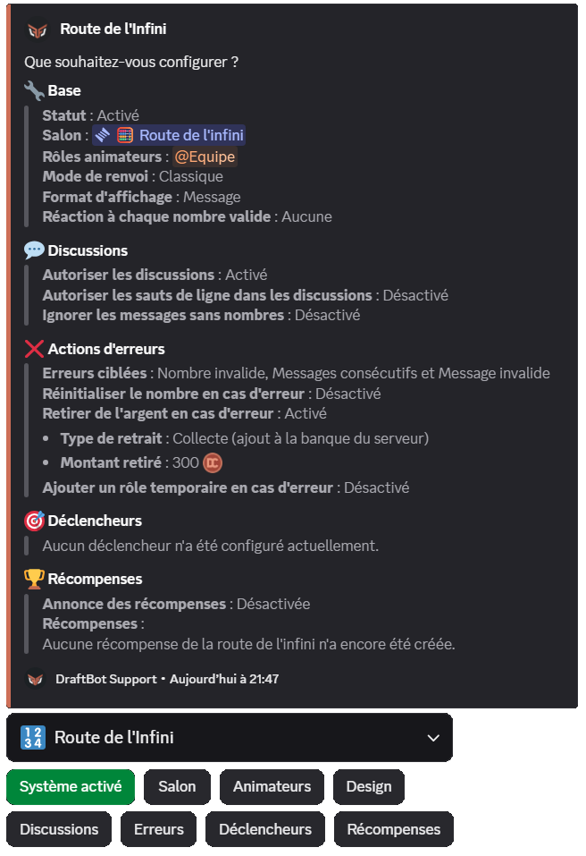

    The body of the **message** lets you see the **current state** of your Counter at a glance, while the **buttons** below let you **change its configuration**.

    ::collapse{ label="Animators" }
      Configure the roles with special permissions to manage the Counter. Members with these roles can:
      - Edit the current number.
      - Manage rewards (roles, money, items, etc.).
      - Send invalid messages without having their message deleted or receiving a penalty.
    ::

    ::collapse{ label="Discussions" }
      Manage the options related to discussions:
      - Allow or forbid discussions after the number
      - Allow or forbid line breaks in discussions
      - Ignore or penalize messages without numbers
      - Allow several consecutive messages from the same member, and set how many

      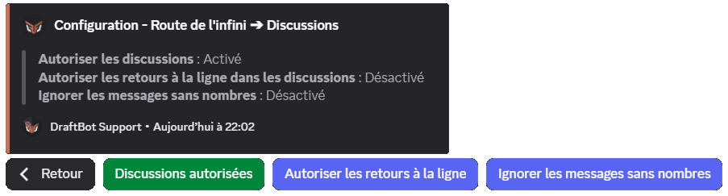
    ::

    ::collapse{ label="Errors" }
      Configure error handling:
      - **Error types**: choose which errors trigger actions
      - **Reset**: set the counter back to 1 on error
          - Custom reset message
      - **Money removal**: take money away from the members at fault
          - Withdrawal type: Definitive or Collect
          - Amount withdrawn per error
      - **Temporary role**: assign a temporary punishment role

      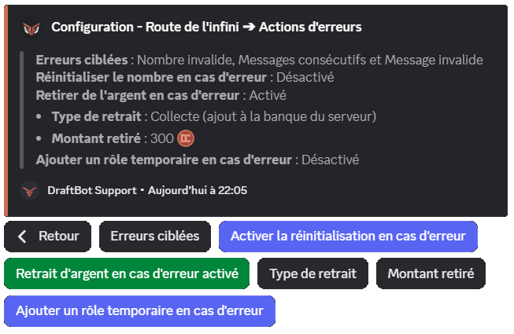
    ::

    ::collapse{ label="Triggers" }
      Create, edit or delete triggers:
      - Set a condition (specific number or multiple)
      - Choose the actions (temporary message, reaction, pinning)
      - Customize the message with variables

      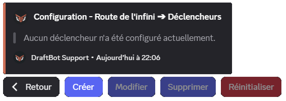
    ::

    ::collapse{ label="Rewards" }
      Manage the Counter's rewards:
      - Create, edit or delete rewards
      - Hide the tier or the reward in \</counter>
      - Configure reward announcements
      - Customize the announcement message

      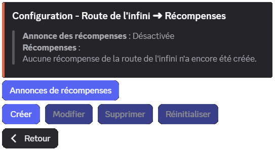
    ::

    ::hint{ type="info" }
      Features marked with the <:icon_premium:1096140508625125417> symbol are reserved for [premium](/premium) <:icon_premium:1096140508625125417> servers.
    ::
  ::
::

### Reward announcements

Configure where and how to announce that a reward has been obtained (disabled by default):

- **Dedicated channel**: choose a specific channel for the announcements
- **Custom message**: customize the announcement message with `{number}`, `{reward}` to display the reward obtained, as well as the [other variables](/docs/misc/variables) available globally

**Default message**: `{user}, here is your reward for sending the number **{number}** on the Counter!`

::hint{ type="info" }
  By default, reward announcements are **disabled**. Remember to enable them and to choose a channel so that your members are notified!
::

::hint{ type="warning" }
  **Required permissions**: to send announcements, DraftBot needs the following permissions in the chosen channel: **View Channel**, **Send Messages**, **Embed Links** and **Attach Files**. If these permissions are removed, announcements are disabled automatically.
::

### Creating a reward

1. **Target type**: specific number or multiple
2. **Target value**: the number or multiple that triggers it
3. **Reward type**: role, money, XP, item, or custom
4. **Specific settings** depending on the type chosen
5. **Elements to hide** in \</counter> (see [Mystery rewards](#mystery-rewards))

::tabs
  ::tab{ label="From the panel" }

    [⫸ Open the **DraftBot** panel](/dashboard/first/infinite-road)

    In the "Rewards" section, click **"Create a reward"**:

    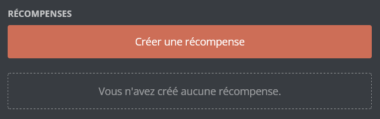
  ::

  ::tab{ label="Using the /config command" }
    Through the \</config> command, open the "Counter" menu > "Rewards" > "Create a reward", then follow the configuration steps.

    
  ::
::

::tabs
  ::tab{ label="Role" }
    Assign a permanent or temporary role to the member who reaches the target.

    **Settings:**
    - The role to assign
    - Duration (for a temporary role only)

    ::hint{ type="warning" }
      The selected role must have been created beforehand and must be accessible to DraftBot (it must not sit higher than DraftBot's highest role).
    ::

    ::hint{ type="info" }
      Unlike level rewards, roles are **never removed** automatically if the counter is reset.
    ::
  ::

  ::tab{ label="Money" }
    Give money from the [economy system](/docs/engagement/economy) to the member.

    **Settings:**
    - Amount to grant
    - Source: creation or server bank

    **Server bank:**
    If you choose the server bank, the money comes from DraftBot's money (collected through errors). If the bank does not hold enough money, the maximum amount available is granted.

    ::hint{ type="warning" }
      The economy system must be **enabled** on your server to use this reward type.
    ::
  ::

  ::tab{ label="Experience" }
    Give experience points from the [level system](/docs/engagement/levels).

    **Settings:**
    - Amount of XP to grant

    ::hint{ type="warning" }
      The level system must be **enabled** on your server to use this reward type.
    ::

    ::hint{ type="success" }
      If the XP gain makes the member level up, they automatically receive the level rewards and an announcement is sent (if configured).
    ::
  ::

  ::tab{ label="Inventory item" }
    Give one or more [inventory items](/docs/engagement/inventory) to the member.

    **Settings:**
    - The item to grant
    - The quantity (up to 1 million)

    ::hint{ type="info" }
      If you have not created any item yet, you first need to [set up your inventory](/docs/engagement/inventory) from the panel's Inventory module.
    ::
  ::

  ::tab{ label="Custom reward" }
    Offer a reward **outside Discord**: promotional codes, physical goodies, special mentions, etc.

    **Settings:**
    - Name/description of the reward (up to 250 characters)

    ::hint{ type="success" }
      **How does it work?** When a member obtains this reward, **you receive a direct message notification from DraftBot** with the member's details. You can then hand the reward over yourself.
    ::

    ::hint{ type="warning" }
      Make sure your direct messages are open so you can receive notifications!
    ::
  ::
::

## Migrating from Countr

If you were already running the Counter through Countr, you can import your members' counting data into DraftBot!

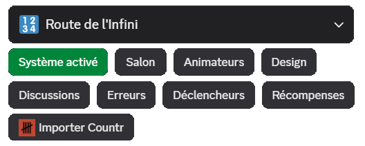

1. On your Discord server, use the Countr command: \</data export scores>
2. Countr sends you a JSON file containing all of the data
3. In DraftBot, click **"Import Countr"** through \</config> or the panel
4. Send the JSON file received from Countr
5. Confirm the import

::hint{ type="warning" }
  **Important**: the existing data in the Counter is **replaced** by the imported data. This action cannot be undone.
::

::hint{ type="info" }
  Make sure Countr is still present on your server when exporting the data.
::
