**DraftBot**'s moderation systems are there to help you run your server. Here you will find everything you need to use them, from simple moderation commands to predefined sanctions!

## Sanctions

### Ban

Banning a member removes them from the server: they will not be able to come back until the sanction is lifted. You can also ban them temporarily, in which case the ban is lifted automatically when the delay expires. If you simply want to remove them while leaving them the option of coming back, use a [kick](#kick) instead.

You can ban a member through the \</ban> command.

After choosing the user and giving a reason, several additional optional settings are available:

| Option | Description |
|--------|-------------|
| `[time]` | to set a ban duration |
| `[deleted_messages]` | to set how far back the member's messages should be deleted (7 days maximum) |
| `[image1]` | to upload a first image |
| `[image2]` | to upload a second image |
| `[image3]` | to upload a third image |

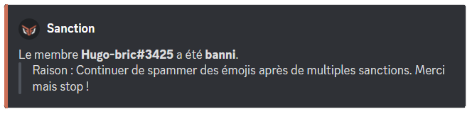

If you want to revoke a member's ban, you can unban them with the \</unban> command or from the **`"Bans"`** tab of your Discord server.

::hint{ type="info" }
  **DraftBot** can only ban a member if you have the **`"Ban Members"`** permission, or if one of your roles is allowed to use the \</ban> command on your server.
::

::hint{ type="info" }
  **DraftBot** needs the **`"Ban Members"`** permission, and its role has to sit **above** that of the targeted member in the server's role list.
::

### Kick

Kicking a member makes them leave the server, but they can come back with a new invitation. If you want to stop them for good, use a [ban](#ban) instead.

**You can kick a member** from your server with the \</kick> command.

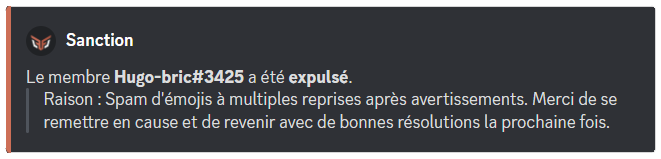

::hint{ type="info" }
  **DraftBot** can only kick a member if you have the **`"Kick Members"`** permission, or if one of your roles is allowed to use the \</kick> command on your server.
::

::hint{ type="info" }
  **DraftBot** needs the **`"Kick Members"`** permission, and its role has to sit **above** that of the targeted member in the server's role list.
::

::hint{ type="info" }
  You can attach up to **3 images** to the sanction (JPEG/PNG/GIF formats).
::

### Warn

**You can warn a member** with the \</warn> command. The member then receives a direct message with the reason for their warning. If, on the contrary, you want to record a remark only moderators can see, without notifying the member, use a [note](#note).

::hint{ type="warning" }
  The member only receives their warning by direct message if they accept direct messages from the server.
::

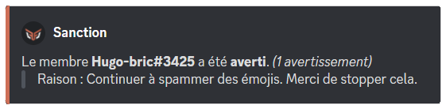

::hint{ type="info" }
  **DraftBot** can only warn a member if you have the **`"Manage Messages"`** permission, or if one of your roles is allowed to use the \</warn> command on your server.
::

::hint{ type="info" }
  You can attach up to **3 images** to the sanction (JPEG/PNG/GIF formats).
::

### Mute

**You can silence a member** with the \</mute> command.

::hint{ type="info" }
  You can, if you want, release a member from their silence with the \</unmute> command.
::

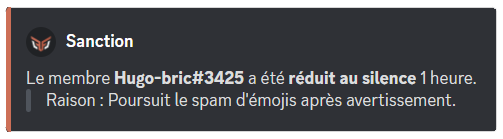

::hint{ type="info" }
  **DraftBot** can only mute a member if you have the **`"Timeout Members"`** permission, or if one of your roles is allowed to use the \</mute> command on your server.
::

::hint{ type="info" }
  **DraftBot** needs the **`"Timeout Members"`** permission, and its role has to sit **above** that of the targeted member in the server's role list.
::

::hint{ type="warning" }
  A mute cannot last more than **28 days**.
::

::hint{ type="info" }
  You can attach up to **3 images** to the sanction (JPEG/PNG/GIF formats).
::

### Note

**You can add a note to a member in their sanction history** with \</note>.
This adds a comment about a member, visible to moderators, without warning the member by direct message.

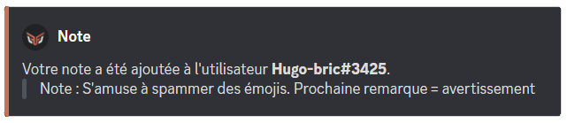

::hint{ type="info" }
  **DraftBot** can only give a note about a member if you have the **`"Manage Messages"`** permission, or if one of your roles is allowed to use the \</note> command on your server.
::

::hint{ type="info" }
  You can attach up to **3 images** to the sanction (JPEG/PNG/GIF formats).
::

## Managing sanctions

### Sanction history

You can see **every sanction** on your server with \</sanctions list>.

The command offers several filtering options to narrow down your search:

| Options | Description |
|---------|-------------|
| `[user]` | Display only the sanctions of a specific member |
| `[sanction]` | Filter by type of sanction (warn, temporary mute, kick, ban, temporary ban, note) |
| `[search]` | Search within the reasons of the sanctions |
| `[moderator]` | Display only the sanctions applied by a specific moderator |

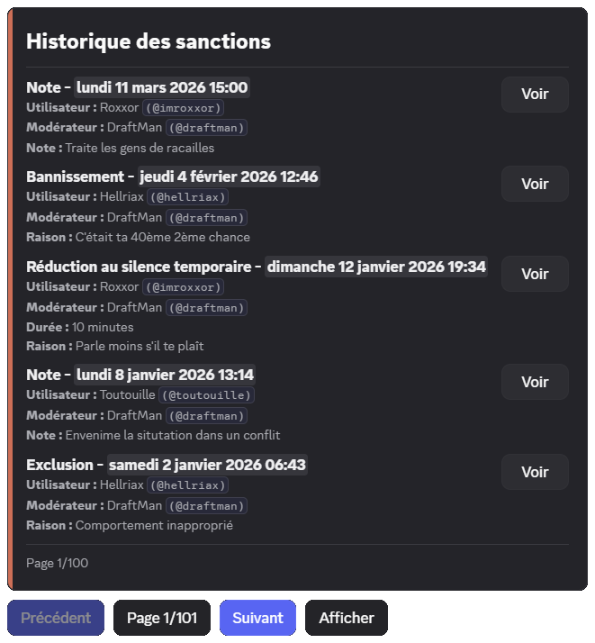

The interactive interface lets you navigate between sanctions with pagination buttons. From this list, you can:

| Action | Description |
|--------|-------------|
| **View** | Display the full details of a sanction |
| **Show** | Share the sanction publicly in the channel (this button is hidden if the [Sanctions displayed by default](#options) option is already enabled) |

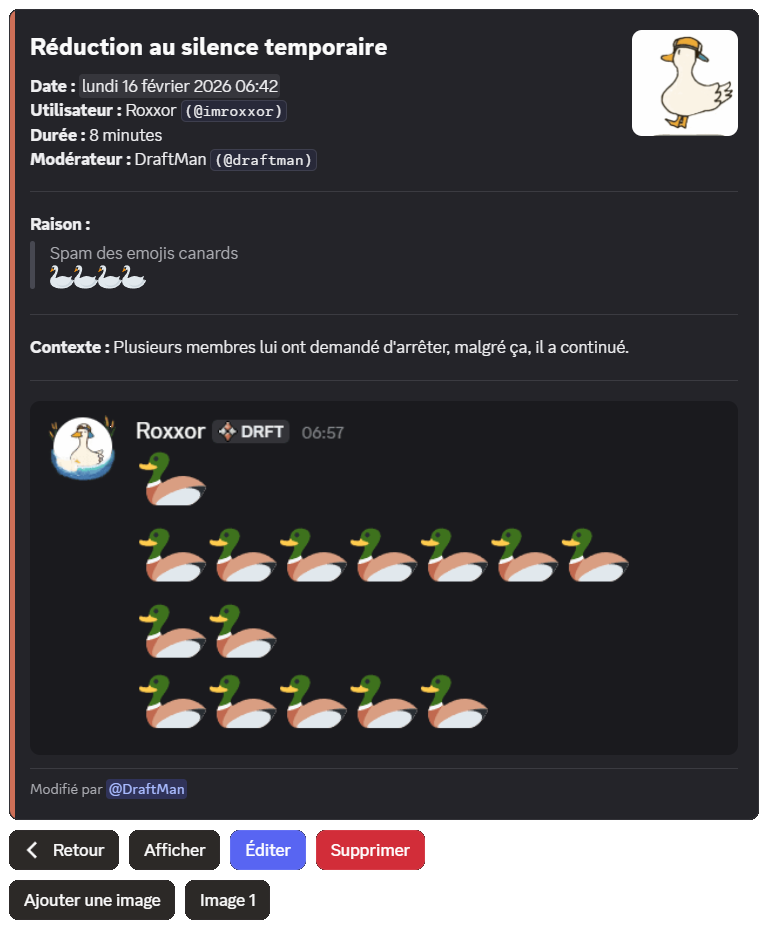

### Removing sanctions

You can **remove a sanction from a member** of your server with the \</sanctions remove> command. You can also reset every sanction of a member at once through \</adminreset sanctions member>.

::hint{ type="info" }
  Likewise, if you want to remove every sanction of every member of your server, you can use \</adminreset sanctions server>.
::

::hint{ type="warning" }
  Note that the \</adminreset sanctions member> and \</adminreset sanctions server> commands cannot be undone.
::

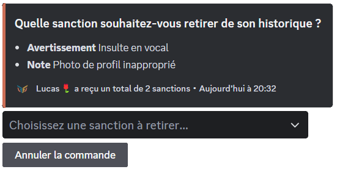

### Editing a sanction

From the sanction history (\</sanctions list>), click **"View"** to open the details of a sanction.

You can then:

| Action | Description |
|--------|-------------|
| **Edit** | the reason and the context of the sanction |
| **Add/remove images** | (up to 3 per sanction, JPEG/PNG/GIF formats) |
| **Delete** | the sanction |

::hint{ type="info" }
  The **context** field adds extra information to a sanction (links, internal notes, circumstances). It is only visible to moderators.
::

::hint{ type="info" }
  Changes are tracked: the list of moderators who have edited the sanction is displayed in its details.
::

### Editing an active sanction

When a sanction such as a mute or a temporary ban is **still active**, you can "**Edit the duration**".

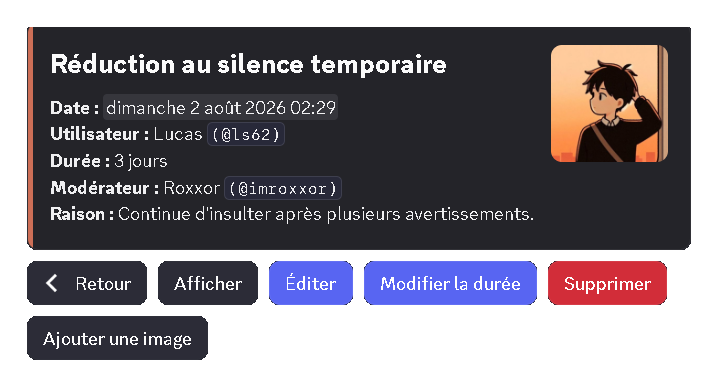

A window then opens, in which you can enter:
- **A new duration**: the remaining duration you want to give the sanction (for example: 30m, 1h, 3d).
- **An end date**: the date the sanction ends (for example: 12/08/2026 6:00 pm).

::hint{ type="info" }
  A new duration is always counted **from now**, not from the date of the original sanction. So if you enter 30m, the member keeps their sanction for 30 more minutes.
::

## Options

With the moderation options, you can configure various aspects of moderation, as described in the sections below.

### Send a DM when a sanction is applied

::tabs
  ::tab{ label="From the panel" }
    [⫸ Open the **DraftBot** panel](/dashboard/first/moderation)

    Once on the **DraftBot** panel, go to the moderation section and its options. All you have to do is enable the options you want!

    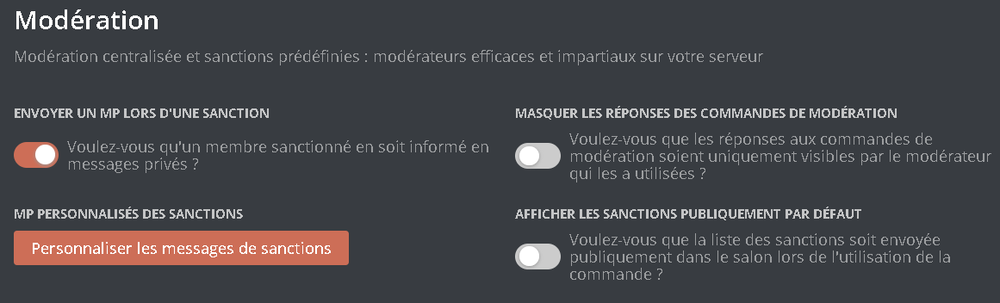

    If the "**Send a DM when a sanction is applied**" option is enabled, the user receives a direct message for every sanction against them.

    ::hint{ type="warning" }
      Once you are done, remember to save your changes with the `"Save"` button at the bottom of the page.
    ::
  ::

  ::tab{ label="Using the /config command" }
    First go to the `"🔨 Moderation"` category of the \</config> command, then press **`"Sanction DMs"`**.

    

    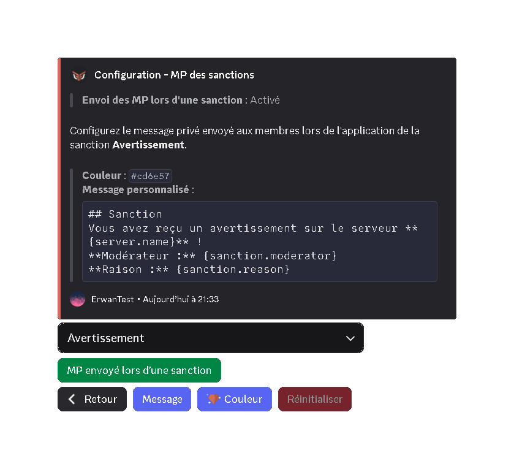

    If the "**Send a DM when a sanction is applied**" option is enabled, the user receives a direct message for every sanction against them.
  ::
::

### Custom sanction DMs

::tabs
  ::tab{ label="From the panel" }
    [⫸ Open the **DraftBot** panel](/dashboard/first/moderation)

    Once on the **DraftBot** panel, go to the moderation section and its options.

    

    You can then configure the **custom sanction DMs** you want:

    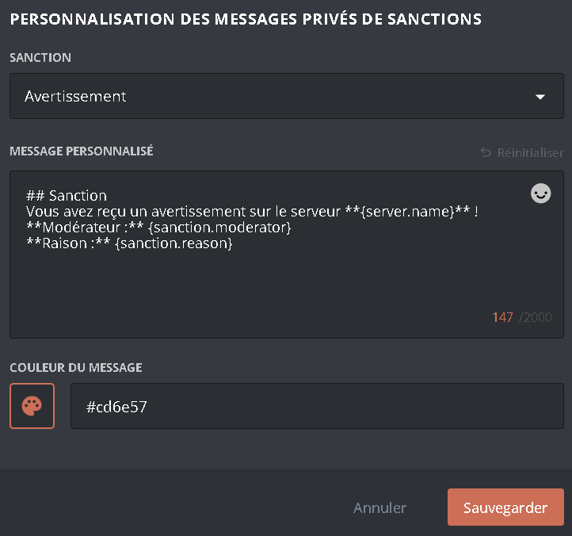

    - **Sanction:** the message sent by DM for the chosen sanction.
    - **Custom message:** the text in the embed's description.
    - **Color (<:icon_premium:1096140508625125417>):** the color of the left border of the embed that is sent.

    ::hint{ type="info" }
      Features marked with the <:icon_premium:1096140508625125417> symbol are reserved for [premium](/premium) <:icon_premium:1096140508625125417> servers.
    ::

    ::hint{ type="warning" }
      Once you are done, remember to save your changes with the `"Save"` button at the bottom of the page.
    ::
  ::

  ::tab{ label="Using the /config command" }
    First go to the `"🔨 Moderation"` category of the \</config> command, then press **`"Sanction DMs"`**.

    

    

    By pressing the selector labelled **`"Warn"`**, you can choose the sanction you want to configure.

    You can then choose between:

    - **Message:** the text in the embed's description.
    - **Color (<:icon_premium:1096140508625125417>):** the color of the left border of the embed that is sent.
    - **Reset:** resets the current configuration.

    ::hint{ type="warning" }
      **Warning:** when you **reset** the configuration, you **cannot undo** the action.
    ::

    ::hint{ type="info" }
      Features marked with the <:icon_premium:1096140508625125417> symbol are reserved for [premium](/premium) <:icon_premium:1096140508625125417> servers.
    ::

    If the "**Send a DM when a sanction is applied**" option is enabled, the user receives a direct message for every sanction.
  ::
::

### Hide command answers

::tabs
  ::tab{ label="From the panel" }
    [⫸ Open the **DraftBot** panel](/dashboard/first/moderation)

    Once on the **DraftBot** panel, go to the moderation section and its options.

    

    If the "**Hide command answers**" option is enabled, then when a moderator takes a moderation action such as \</mute> or \</ban>, the bot's reply stays **invisible** to the other users.

    ::hint{ type="warning" }
      Once you are done, remember to save your changes with the `"Save"` button at the bottom of the page.
    ::
  ::

  ::tab{ label="Using the /config command" }
    First go to the `"🔨 Moderation"` category of the \</config> command, then press **`"Options"`**.

    

    If the "**Hide command answers**" option is enabled, then when a moderator takes a moderation action such as \</mute> or \</ban>, the bot's reply stays **invisible** to the other users.
  ::
::

### Display sanctions by default

::tabs
  ::tab{ label="From the panel" }
    [⫸ Open the **DraftBot** panel](/dashboard/first/moderation)

    Once on the **DraftBot** panel, go to the moderation section and its options.

    

    If the "**Display sanctions by default**" option is enabled, then when a moderator runs a command such as \</sanctions list>, the bot's reply is **visible** to every member of the channel. If it is disabled, the reply is only visible to the moderator who ran the command.

    ::hint{ type="warning" }
      Once you are done, remember to save your changes with the `"Save"` button at the bottom of the page.
    ::
  ::

  ::tab{ label="Using the /config command" }
    First go to the `"🔨 Moderation"` category of the \</config> command, then press **`"Options"`**.

    

    If the "**Display sanctions by default**" option is enabled, then when a moderator runs a command such as \</sanctions list>, the bot's reply is **visible** to every member of the channel. If it is disabled, the reply is only visible to the moderator who ran the command.
  ::
::

## Predefined sanctions

A predefined sanction is **a preconfigured sanction that centralizes different moderation actions into a single command: \</mod>**. You choose the sanction to apply as well as its reason. This makes the sanctions your moderators can apply both easier and more consistent.

::tabs
  ::tab{ label="From the panel" }
    [⫸ Open the **DraftBot** panel](/dashboard/first/moderation)

    1. Click **`"Create a predefined sanction"`**. You can then choose the sanction to apply as well as the reason given when it is used. You can also set a name shown when selecting the predefined sanction in the \</mod> command.

    2. You can also choose which roles can use this sanction without having the required permission.

    Example: role A can apply the kick for advertising without having the permission to kick members.

    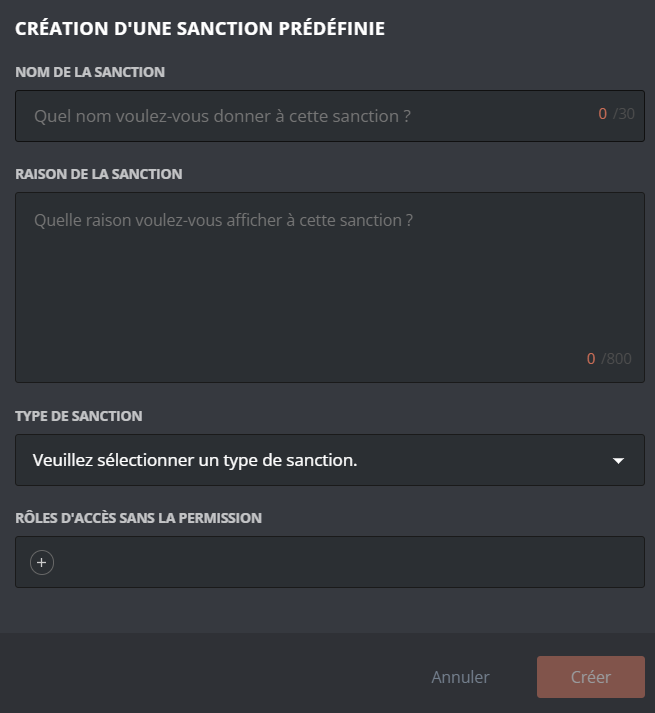

    ::hint{ type="info" }
      If the chosen sanction is a **ban** *(permanent or temporary)*, a "**Del. messages**" option appears.
    ::

    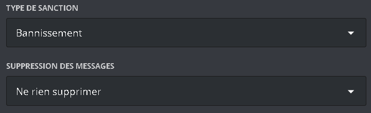

    ::hint{ type="warning" }
      Once you are done, remember to save your changes with the `"Save"` button at the bottom of the page.
    ::

    ::hint{ type="success" }
      Congratulations! This predefined sanction is now available and can be used through the \</mod> command.
    ::
  ::

  ::tab{ label="Using the /config command" }
    First go to the `"🔨 Moderation"` category of the \</config> command, then press **`"Predefined sanctions"`**.

    

    #### Creating a predefined sanction

    To create a predefined sanction, click `"Create"`. You can then choose the sanction to apply as well as the reason given when it is used. You can also set a name shown when selecting the predefined sanction in the \</mod> command.

    ::hint{ type="info" }
      You can also designate a role able to apply this sanction without necessarily having the permission for it. Example: role A can apply the kick for advertising without having the permission to kick members.
    ::

    If you have chosen a **ban** *(permanent or temporary)*, **DraftBot** also asks you for the period over which the member's messages should be deleted.

    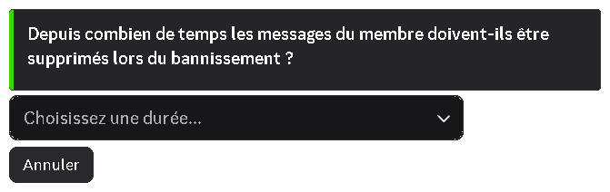

    #### Managing an existing predefined sanction

    To delete a predefined sanction, click `"Delete"`; **DraftBot** then asks you to select the sanction to remove.

    To edit an existing predefined sanction, click `"Edit"`: you can change its name, its reason, its sanction and its allowed roles.

    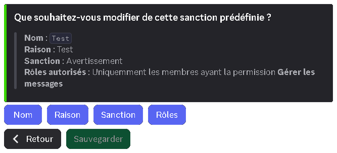

    ::hint{ type="info" }
      You can also remove every predefined sanction by clicking `"Reset"`.
    ::

    ::hint{ type="warning" }
      Note that these actions cannot be undone; once carried out, there is no way back.
    ::
  ::
::

::hint{ type="success" }
  **Well done!** You have configured your predefined sanctions!
::

You can add the **reports** system to use them more effectively!

::card
---
title: Reports
icon: twemoji:police-car-light
to: /docs/security/reports
target: _blank
color: '#ff4e28'
---
  Has a user noticed inappropriate behavior on your server? Let them report it to you with DraftBot's report system!
::

You can also automate your sanctions through **auto-moderation**!

::card
---
title: Auto-moderation
icon: twemoji:shield
to: /docs/security/auto-moderation
target: _blank
color: '#22427C'
---
  Set up automatic moderation rules to secure your server!
::

