## The principle

On Discord, a role is a keyring your staff carries at all times. Whoever holds the account holds the keys: a booby-trapped link, a malicious browser extension, a stolen session, and the attacker instantly inherits everything the member could do.

Secure roles move that keyring into a safe. Your moderators keep their badge and their color, but the permissions themselves are only placed on their account **during a session**, and only after an additional authentication (fingerprint, facial recognition, 2FA code). Once the session ends, the permissions go back into the safe.

::hint{ type="success" }
  The difference is stark on a large server: without this system, a compromised staff account can delete channels *(the history is lost for good)* or launch a wave of bans. With it, the stolen account simply no longer carries the permissions worth stealing.
::

This system does not replace Discord's 2FA, it complements it. Discord's 2FA protects **logging into the account**. Secure roles protect **the use of the permissions**, including when the login is already compromised.

## The parts of the system

Four different notions, often confused. Telling them apart avoids 90% of configuration mistakes.

| Element | What it is | Where to find it |
|---------|--------------|-----------------|
| **Display role** | The visible role: name, color, position in the member list. No sensitive permission. | On the member, **at all times** |
| **Permissions role** | The discreet role that actually holds the sensitive permissions. | On the member, **only during a session** |
| **Access** | A given member's right to claim a permissions role. This is what is enabled, disabled and expires. | **Member access** section |
| **Session** | The period during which the permissions are actually active, after authentication. | **Sessions** section |

::hint{ type="info" }
  A member can have access **without** a display role: this is the case when you grant individual access to someone who is not part of the usual team. Conversely, carrying the display role grants no permission as long as no access exists.
::

Only one session can be active at a time per member and per server. Authenticating again automatically closes the previous one.

## Protecting a role

**DraftBot** analyses your roles and flags the ones holding dangerous permissions: this is the **Risky roles** section. From there, a **Secure** button starts the configuration, both from the [panel](/dashboard/first/permguard) and through \</config>.

A role is judged risky as soon as it carries **at least one** of these 13 permissions:

| | |
|----------------------|--|
| **Administrator** | Manage Roles |
| Manage Server | Manage Channels |
| Manage Messages | Manage Webhooks |
| Ban Members | Kick Members |
| Timeout Members | Mention @everyone, @here and All Roles |
| Manage Expressions | Manage Events |
| Create Events |  |
| | |

::hint{ type="info" }
  Roles managed by an integration *(a bot's role, a boost role, a role tied to a subscription)* are never offered: Discord keeps control of them and **DraftBot** cannot touch them. If a bot on your server holds sensitive permissions, it has to be handled separately.
::

You can secure **2 roles**, or **10** on [premium](/premium) <:icon_premium:1096140508625125417> servers. A role that does not appear in the risky roles *(because it does not carry any sensitive permission yet)* can also be prepared by hand from **Manual setup**, in the **Configured roles** section. Both routes share the same quota.

::tabs
  ::tab{ label="From the panel" }
    [⫸ Open the **DraftBot** panel](/dashboard/first/permguard)

    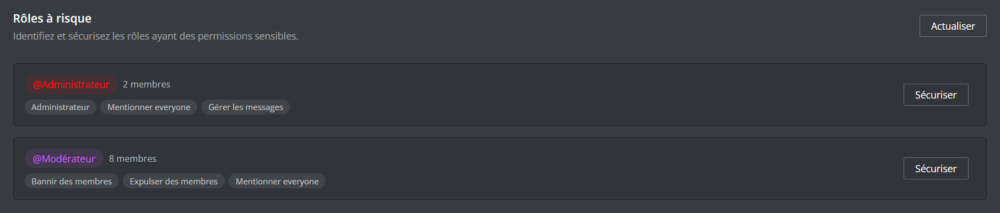
  ::

  ::tab{ label="Using the /config command" }
    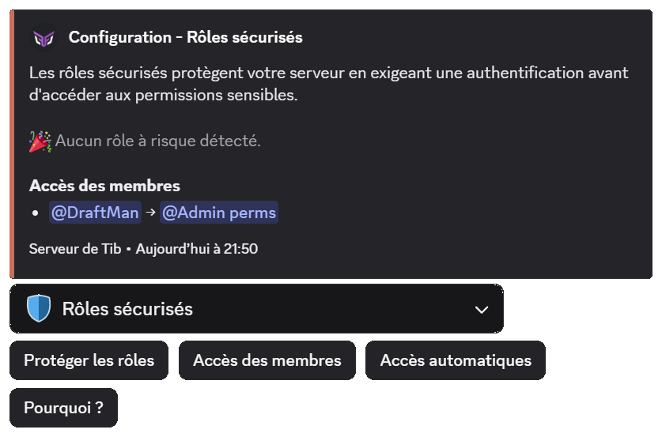
  ::
::

::hint{ type="warning" }
  A role carried by more than **10 members** (25 on [premium](/premium) <:icon_premium:1096140508625125417> servers) cannot be secured. This is not a technical limit but a choice: this system is designed for a small circle holding heavy powers, not for a community role. Bots and the owner do not count towards that total.
::

The first question asked is the most important of the whole configuration, and it is also the one with the most invisible consequences.

### Moving the permissions

Under the name **Move permissions to a new role**, **DraftBot** creates a discreet role, transfers the sensitive permissions to it, and leaves the original role intact: same name, same color, same position. Your staff sees no difference day to day.

This is the recommended strategy, and the only one that unlocks the rest of the system.

### Keeping the permissions

Under the name **Keep permissions and remove the role**, no new role is created. The original role **is** the permissions role: it is removed from members and only comes back for the duration of a session.

::hint{ type="danger" }
  If this role also opens private channels, your members **lose access to them at the end of every session** and get it back on the next login. On an active server, that means a staff channel appearing and disappearing several times a day. Only choose this option if your private channels are opened by other roles.
::

What each strategy allows:

|  | Move permissions | Keep permissions |
| --- | :---: | :---: |
| Badge and color kept outside a session | Yes | No |
| Private channels accessible outside a session | Yes | No |
| [Authentication on use](#your-staffs-day-to-day) | Yes | **No** |
| Recovery of channels that became invisible | Yes | No |
| Re-registration in the **DraftBot** systems | Yes | No |
| Adjusting the protected permissions afterwards | Yes | No |

::hint{ type="warning" }
  You can change strategy later, but switching to **Keep permissions** disables authentication on use for that role. **DraftBot** tells you how many members are affected before applying.
::

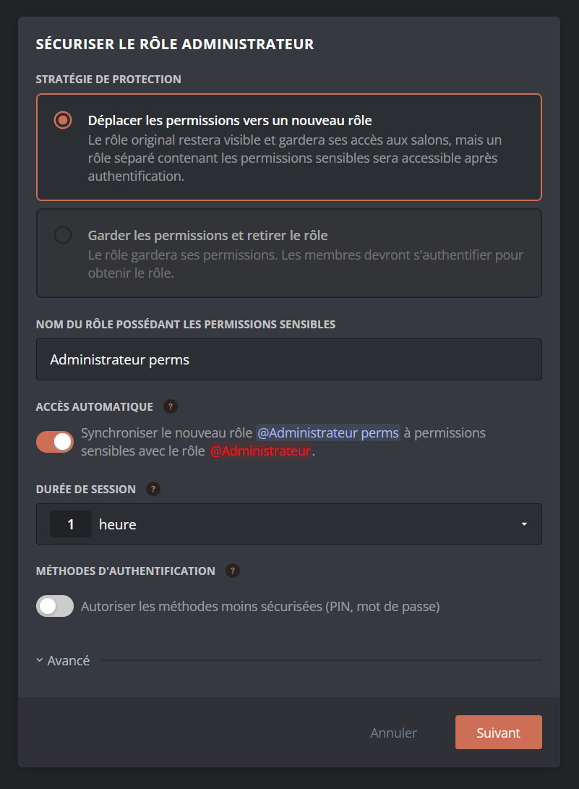

Two complementary steps then appear depending on the role being handled, and they deserve to be understood rather than confirmed automatically:

- **Channels that became invisible:** the *Administrator* permission makes **every** channel visible, including those where the role has no explicit right. By moving it, those channels disappear for your members. **DraftBot** detects them and explicitly grants the right to view, write and join voice there. The sensitive permissions themselves stay in the safe.
- **DraftBot systems:** several features recognized your staff through *Administrator*: ticket staff, reports, Counter animators, private channel moderators, auto-moderation exemptions. **DraftBot** offers to re-register the display role in their allow lists, so that day-to-day work carries on without an open session.

::hint{ type="info" }
  These two recoveries are also offered afterwards for roles that are already configured: the **Recent improvements** button through \</config>, and the **Fix or update** banner on the [panel](/dashboard/first/permguard). Each proposal can be applied or ignored independently.
::

Finally comes the **member selection**. Everyone carrying the role is offered, with an indication of who has already configured an authentication method.

::hint{ type="danger" }
  **Unticking a member is not neutral: they lose the role.** Depending on the strategy chosen, they keep the display role without the permissions, or lose the role outright. Only untick the members whose powers you really want to take away.
::

## Your staff's day-to-day

There are two ways for a member to activate their permissions, and the choice changes the day-to-day feel a great deal.

- **Logging in beforehand:** with the \</secure-roles> command, the member authenticates, their permissions activate for the duration of the session, they work, then they log out. As long as they are not logged in, the protected commands **do not even appear** in their list.

- **Authentication on use:** the commands stay visible, and **DraftBot** asks for authentication at the exact moment the member runs a sensitive command, \</ban> for example. They confirm, the command runs. The level of security is identical, but there is no preliminary step to think about.

::hint{ type="danger" }
  **Authentication on use only covers DraftBot commands.** To act directly through the Discord interface *(dragging a role onto a member, deleting a channel, banning from the right-click menu)*, the member first has to open a session with \</secure-roles>. This is the most commonly misunderstood detail of the system.
::

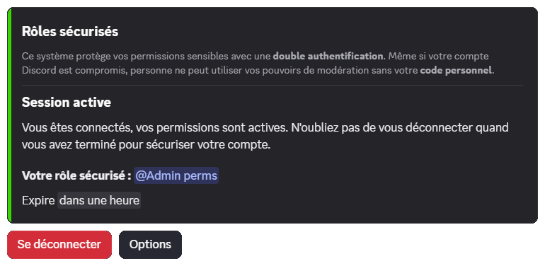

To make the commands visible without granting the permissions, **DraftBot** needs a dedicated Discord authorization, limited to the server concerned and to managing command visibility alone. It is only requested once, in a window that opens at activation time.

::hint{ type="warning" }
  In that window, **leave the server's box ticked** and confirm with the right Discord account: these are the two most frequent causes of failure. It stays valid for 10 minutes and closes on its own once the authorization has been granted.
::

::hint{ type="info" }
  Activation requires **you** to have *Manage Server* and *Manage Roles*, and your highest role to sit above the display role concerned. It is your authorization that Discord checks, not only **DraftBot**'s.
::

You can disable authentication on use at any time, and enable it again afterwards. Disabling it is not trivial: the members currently logged in are **logged out**, the protected commands become **invisible** again, and everyone goes back through \</secure-roles> before acting. **DraftBot** tells you how many sessions will be cut before confirming.

## Choosing your method

Each member configures their method **once only**, from \</secure-roles> or the [Security](/dashboard/user/security) area of the panel. It is then valid on every server where they have access.

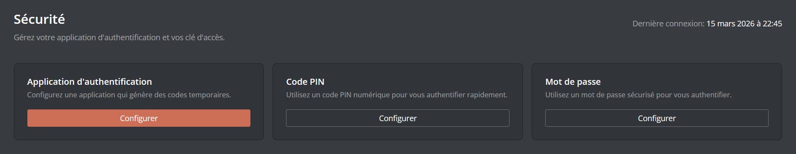

| Method | Level | In practice |
|---------|--------|-------------|
| **Passkey** | Secure | Fingerprint, facial recognition, Windows code or physical key. Instant confirmation, nothing to type. The best choice for daily use. |
| **Authenticator app** | Secure | 6-digit code through Google Authenticator, Authy, Dashlane. Works everywhere. |
| **PIN code** | Alternative | 6 to 8 digits. Vulnerable to shoulder surfing and to repeated attempts. |
| **Password** | Alternative | 10 characters minimum, uppercase, lowercase and digits. |

::hint{ type="info" }
  Administrators can allow only the secure methods on a given role. If your server protects heavy permissions, that is the setting to favour: a passkey is both safer **and** faster than a PIN code.
::

::tabs
  ::tab{ label="Passkey" }
    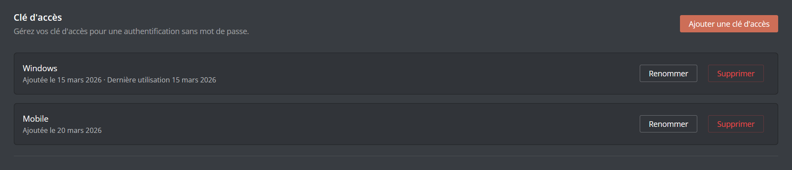

    You can register **several keys**, for example one on your phone and one on your computer. Each of them can be renamed and deleted individually.
  ::

  ::tab{ label="Authenticator app" }
    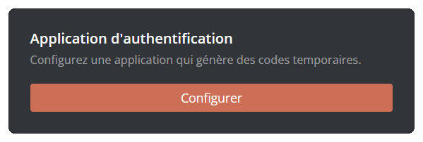

    A QR code is presented to you, along with a manual entry code if your app cannot scan or is not on your phone.
  ::

  ::tab{ label="PIN code" }
    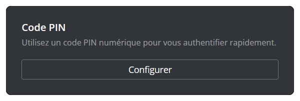

    Codes that are too predictable *(123456, 000000)* are refused.
  ::

  ::tab{ label="Password" }
    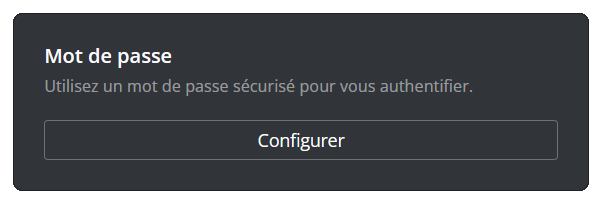
  ::
::

::hint{ type="warning" }
  Changing or adding a method requires confirming with a method that is already configured. **Deleting** a method, on the other hand, never requires confirmation: this is deliberate, so that nobody stays locked out. Deleting your **last** method, however, revokes all of your secure access, on every server.
::

## What is not protected

No security system is absolute. Knowing its blind spots is better than discovering them:

- **The server owner:** Discord grants them every right unconditionally, regardless of roles. Configuring an authentication on that account does not protect it. This is the structural weak point of every Discord server.

::hint{ type="danger" }
  If your server matters, make the owner account a vault account: it is only used for the actions that genuinely require ownership *(transferring the server, deleting it)*. Day-to-day work happens from a secondary administrator account, itself covered by secure roles. If you are currently the only administrator, create that secondary account **before** considering an ownership transfer.
::

- **A member holding the same permission elsewhere:** if a moderator obtains *Kick Members* through a second, unsecured role, the protection no longer applies to them: Discord already grants them the permission, there is nothing to unlock. On a large server with dozens of stacked roles, this is the most frequent leak. **DraftBot** watches the display roles and warns you if a sensitive permission reappears on them.

- **Permissions set channel by channel:** a right granted directly in a channel's settings does not go through roles, and therefore not through this system.

- **Bots:** a compromised bot acts with its own permissions. Audit them separately.

## Setting access properly

The settings are explained directly in the interface. Here is how to weigh them up instead:

- **Session duration:** 15 minutes by default, adjustable from 5 minutes to 8 hours. A short duration narrows the window for exploiting a stolen account, but multiplies the authentications. In practice: short for administration, longer for a moderation team in the middle of a raid. A passkey makes reconnections nearly painless, which makes short durations workable.

- **Automatic access:** giving someone the display role creates their access on its own, and taking it away revokes it. Recommended as soon as your staff changes regularly: without it, every recruitment requires an extra manual action, and every departure leaves one behind.

- **Expiry and inactivity (<:icon_premium:1096140508625125417>):** two safety nets for large servers: an end date for temporary reinforcements, and an automatic revocation for a member who no longer logs in. This is what prevents the silent build-up of dormant access, a prime target for a compromise.

- **Session viewing:** lets a role read the session log in read-only mode, without granting it *Manage Server*. Useful for a supervision team or for former administrators who keep an eye on things.

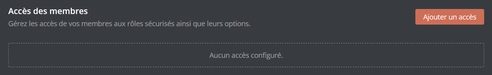

The **Member access** section is there for special cases: granting a permission to someone without giving them the display role, or treating a member differently from the rest of the team. Each access inherits the role's settings and can **override** them: a badge then marks the changed value, and a button restores the role's one. Expect up to **10 accesses per role**, or **25** with [premium](/premium) <:icon_premium:1096140508625125417>.

::hint{ type="info" }
  A member you grant access to without them having configured an authentication receives a direct message and has **24 hours** to deal with it. After that delay, their access is disabled and has to be re-enabled manually.
::

## Going back

Nothing is permanent: a secure role can be deleted from **Configured roles**. Two options are then offered, and they answer opposite intentions:

- **Transfer the permissions to the display role:** the sensitive permissions are given back to the visible role, which your members carry at all times. You are back to the situation before the protection: the powers become permanently active again, without authentication.
- **Delete the permissions role:** the discreet role disappears from the server along with the permissions it contained.

The two options are independent and can be combined. In every case, the accesses are deleted and the permissions role is removed from those who carried it.

::hint{ type="warning" }
  If you tick **neither one nor the other**, the permissions role stays on your server with its permissions intact, but **DraftBot** no longer manages it. It becomes an ordinary role that any administrator can assign, without any authentication. Nobody carries it at that moment, but remember to delete it or empty it if you do not plan to reuse it.
::

## Watching and reacting

**DraftBot** does not just block, it warns you. Secure role alerts go to your **emergency logs**, independently of the classic logs module, and mention your administrators.

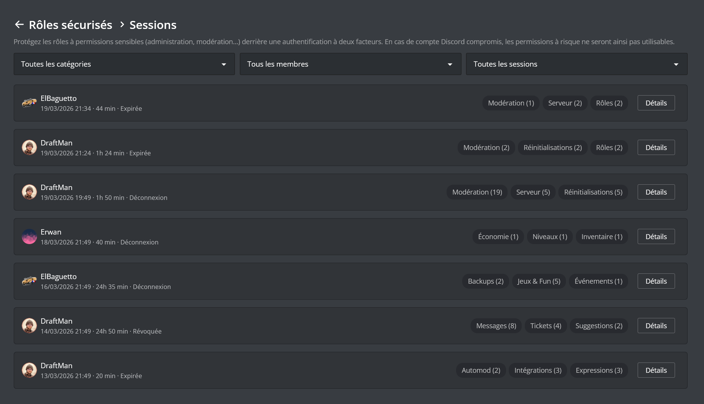

The **session log** answers the question that matters afterwards: who did what, when, and with which permission. Each session lists its timestamped actions, their target, their reason, nickname changes, and a color-coded risk level. You can filter by member, period, action category, authentication method or role.

On an ongoing session, **End session** immediately removes the member's permissions and forces them to authenticate again. Useful when facing suspicious behavior live.

::hint{ type="info" }
  The number of deleted messages settles after a few minutes. Discord groups successive deletions by the same moderator before reporting the real total, so **DraftBot** waits for the end of the grouping to display the right figure.
::

::hint{ type="warning" }
  You cannot end your own session, nor that of a member whose secure role sits above or at the same level as yours. The hierarchy rule also applies to the configuration: you only manage the roles located **strictly below** your highest role.
::
