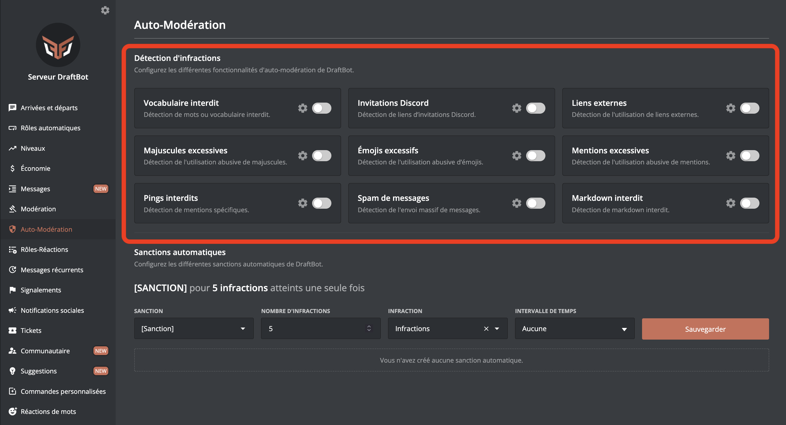
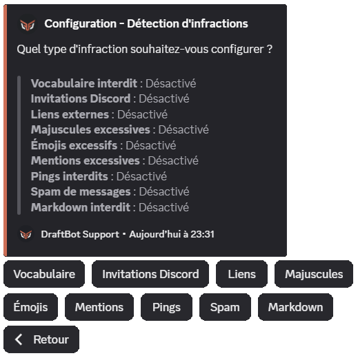
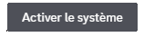
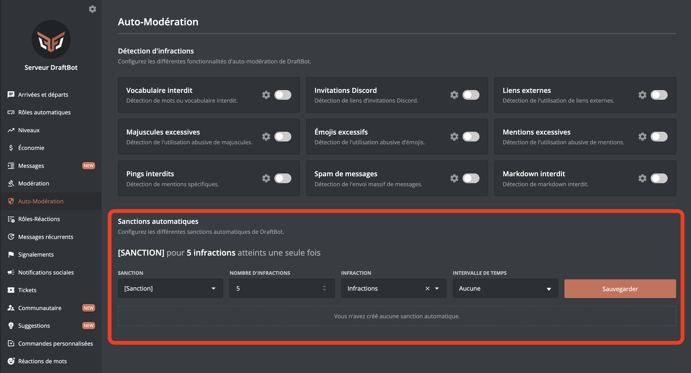
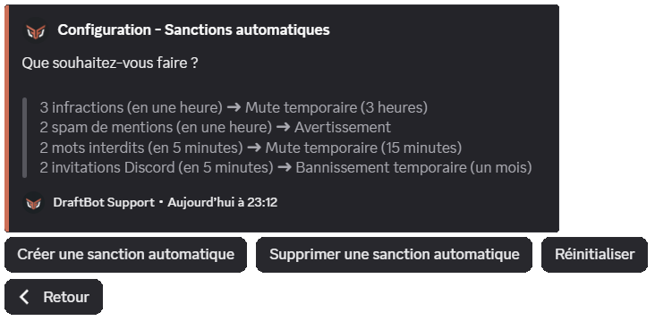

## Infractions detection

**Infractions** are what triggers auto-moderation: sending a forbidden word, a forbidden link, etc. [**Sanctions**](#automatic-sanctions) are the moderation actions: warning the member, kicking them, banning them, etc.

::tabs
  ::tab{ label="From the panel" }
    [⫸ Open the **DraftBot** panel](/dashboard/first/auto-moderation)

    Go to the **`🛡️ Auto-moderation`** section.

    

    Click the :gear: icon of a module to configure it, and enable it with the button to the right of the :gear:.

    ::hint{ type="warning" }
      Once it is configured, remember to save your changes with the **`Save`** button at the bottom of the page.
    ::
  ::

  ::tab{ label="Using the /config command" }
    First go to the **`🔨 Moderation`** category of the \</config> command, then press **`Infractions detection`**.

    You can then configure the different modules:

    

    ::hint{ type="info" }
      Once in the module of your choice, **remember to enable the system** through the first button:

      
    ::
  ::
::

Every module includes these options, so they can be configured independently:

- **Silent mode**: if enabled, DraftBot does not reply to the infraction with an explanatory message.
- **Ignored channels**: channels where auto-moderation is disabled.
- **Ignored roles**: roles ignored by auto-moderation.

::hint{ type="info" }
  **Administrators** as well as the other **bots** on the server are automatically ignored by auto-moderation.
::

### Forbidden vocabulary

You can choose expressions (words) that DraftBot blocks.

Adding a ``*`` at the beginning and/or the end of the word blocks words with a partial match: `cat*` detects `cats`, `c a t`, `caaaaaat` or `c.a.t`.

- The **message blocking** option blocks messages before they are sent, thanks to Discord's AutoMod system <:automod:1369109533284106260>, while still counting the infraction in the member's history. As AutoMod also analyses **voice channel statuses**, an infraction detected there is flagged as such in its reason: *"Detected in a voice channel status."*

::hint{ type="warning" }
  Only the **first 1000 words** are supported, because of a Discord limitation.
::

- If the **censorship** option is enabled, DraftBot resends the blocked message through a webhook with the user's name, their profile picture and the censored expression.

### Discord invitations

This module forbids invitation links from being posted in your server's channels (invitations to your own server are not blocked).

- The **allowed invitations** option sets invitations that auto-moderation ignores.

- The **immune servers** option extends the previous one to every possible invitation of a particular server, by giving its [ID](/docs/misc/finding-an-id#server-id).

::hint{ type="info" }
  This option is a feature reserved for [premium](/premium) <:icon_premium:1096140508625125417> servers.
::

- If the **censorship** option is enabled, DraftBot resends the message through a webhook with the user's name, their profile picture and the censored invitation link.

::hint{ type="info" }
  Every invitation is analysed. Those leading to your server or to one of its voice channels are ignored automatically.
::

### External links

This module forbids links from being posted on your server.

- The **allowed/forbidden domain names** option forbids or ignores only certain links by giving the domain name; `draftbot.fr`, for example.

- If the **censorship** option is enabled, DraftBot resends the message through a webhook with the user's name, their profile picture and the censored link.

### Excessive uppercase

This module limits how much uppercase there is in messages.

- The **percentage of uppercase** is the maximum share of uppercase characters allowed in a message.

- The **minimum number of characters** is how many characters a message has to contain for auto-moderation to take it into account.

### Excessive emojis

This module limits the use of emojis in messages.

- The **percentage of emojis in the message** is the minimum share of emojis a message has to contain for auto-moderation to take it into account.

- The **minimum number of emojis** is how many emojis a message has to contain for auto-moderation to take it into account.

### Forbidden pings

This module forbids specific members or roles from being mentioned.

Select the mentions you want to forbid in the **members or roles** field.

- The **message blocking** option blocks messages containing the forbidden mention before they are sent, thanks to Discord's AutoMod system <:automod:1369109533284106260>, while still counting the infraction in the member's history.

### Excessive mentions

This module prevents mention spam.

- The **time interval** is the period during which the number of mentions sent by a member must not exceed the set limit.

- The **mention limit** is the maximum number of mentions a member can send during the set time interval.

::hint{ type="info" }
  A role mention counts as **3** user mentions.
::

- If the **remove** option is enabled, DraftBot deletes the messages containing the mention spam. Be careful, this causes ghost mentions.

::hint{ type="info" }
  A ghost mention, or *ghost ping*, is a mention notification with no way to see the mention.
::

- The **message blocking** option blocks messages before they are sent, thanks to Discord's AutoMod system <:automod:1369109533284106260>, while still counting the infraction in the member's history.

::hint{ type="info" }
  Mentions are counted separately for each member.
::

::hint{ type="warning" }
  If mention blocking through **Discord** is enabled, mentions are counted per **message**, independently of the system offered by DraftBot. What is more, mentions coming from **replies** are **not counted**.
::

### Message spam

This module prevents message spam.

- The **time interval** is the period during which the number of messages sent by a member must not exceed the set limit.

- The **message limit** is the maximum number of messages allowed per member during the set time interval.

::hint{ type="info" }
  Messages are counted separately for each member.
::

### Forbidden Markdown

This module blocks the use of the Markdown of your choice among:
- Code block
- Inline code
- Masked link
- Spoiler
- Header
- Subtext
- List
- Quote

If **Return without Markdown** is enabled, DraftBot resends the blocked message through a webhook, with the user's name and profile picture, with the Markdown removed (enabled by default).

::hint{ type="info" }
  You will find the details of the different Markdown types on [this page](/docs/misc/markdown).
::

## Automatic sanctions

Automatic sanctions apply moderation actions to members automatically after a set number of [**infractions**](#infractions-detection).

::tabs
  ::tab{ label="From the panel" }
    [⫸ Open the **DraftBot** panel](/dashboard/first/auto-moderation)

    You can then configure the automatic sanctions.

    

    ::hint{ type="warning" }
      Once your changes are done, remember to save them with the **`Save`** button on the right of the page.
    ::
  ::

  ::tab{ label="Using the /config command" }
    First go to the **`🔨 Moderation`** category of the \</config> command, then press **`Automatic sanctions`**.

    You can then configure the automatic sanctions:

    
  ::
::

- **Sanction**: the type of sanction applied when the automatic sanction is triggered (a warn, for example).
- **Number of infractions**: once this number of infractions is reached, the automatic sanction is applied.

::hint{ type="info" }
  Infractions are counted separately for each member.
::

- **Infraction**: sets which type of infraction is counted for the automatic sanction.
- **Time interval**: the automatic sanction triggers if the number of infractions set above is reached during this time interval.

::hint{ type="info" }
  You can configure up to 10 automatic sanctions. [Premium](/premium) <:icon_premium:1096140508625125417> servers can have 50.
::

::hint{ type="info" }
  When you choose a **ban** *(permanent or temporary)* as the automatic sanction, you can also choose "**Del. messages**". This lets you decide whether to delete the user's messages over a certain period *(last hour, last 6 hours, last 12 hours, last 24 hours, last 3 days or last 7 days)*.
::

