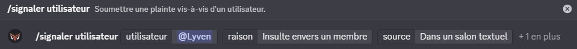
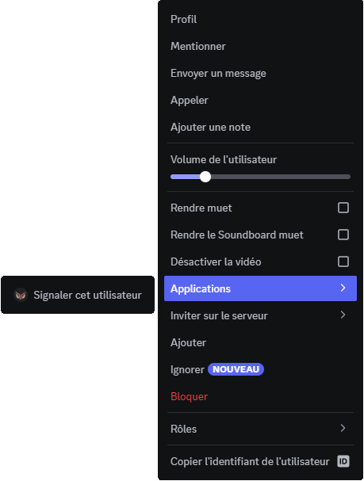
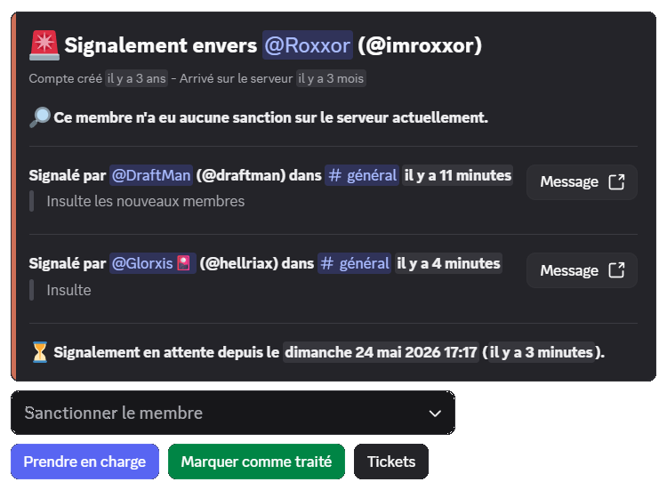
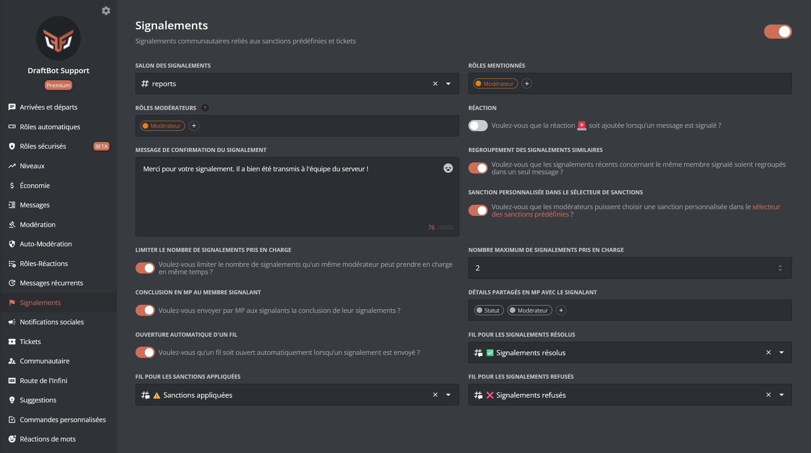
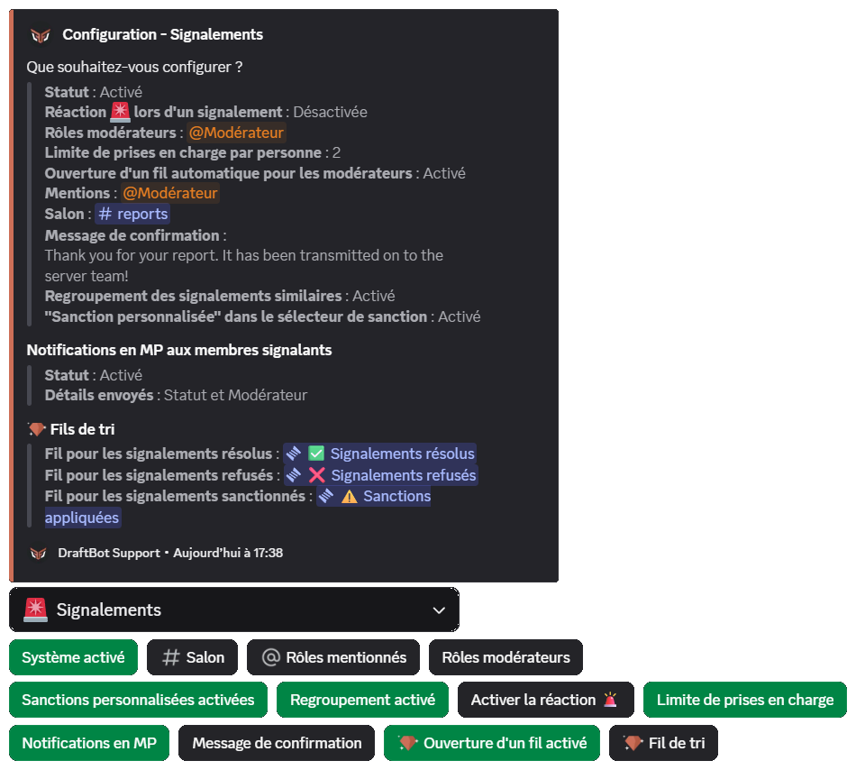
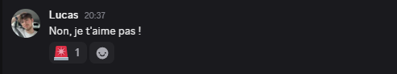

## Usage

To make a report, run the \</report> command. You then select the user or the message breaking the rules that have been set on the server.

When reporting a **user**, the `source` option indicates where the infraction was observed (text channel, voice channel, direct message or elsewhere).

You can also attach a screenshot (PNG, JPEG or GIF) or a video (MP4, WebM, MOV, within the size limit allowed by the server's boost level) through the `image` option, available on both variants of the command.

If the reported message was published by an application, DraftBot identifies and displays the member actually behind the content.

You can also go through Discord's context menu: right-click a member → **Apps** → **Report this user**, or right-click a message → **Apps** → **Report this message**. A form then opens to enter the reason and the source (for a user).

## Managing reports

Once someone has reported a user or a message, you receive a **report message** in the channel you have set beforehand:

The message gathers the useful information about the reported member (date they joined the server, date the account was created, quick access to the sanction history through the **View sanctions** button, displayed only to the member who clicks it) as well as the context of the report (channel, source, link to the reported message).

You then have several options:

- "**Take charge**" ➜ Indicates that you are handling the report. If another moderator has already taken charge of the report, a confirmation is requested before adding you to it.

- "**Mark as processed**" ➜ Closes the report.

You can then select the outcome to give the report among the following options: **Member sanctioned**, **Report solved**, and **Report rejected**. If the reported member has been sanctioned within the past hour (through `/ban`, `/mod` or otherwise), DraftBot offers to link that sanction to the report in one click. Once the outcome has been selected, you can add an optional **context**, visible on the report message and also sent to the reporting member by DM if the corresponding detail is enabled in the notification configuration.

- "**Tickets**" ➜ Displays the tickets already linked to the report and lets you open a new one for the reported member or the member behind the report (only available if the ticket system is enabled).

- "**Sanction the member**" ➜ Sanctions the reported member directly through a **predefined sanction** or a **custom sanction** (**Note**, **Warn**, **Kick**, **Mute**, **Ban**). For a temporary custom sanction, you also give a duration (formats `1h`, `30m`, `2d`, etc.). You can delete the member's recent messages over a predefined window (1h, 6h, 12h, 24h, 3 days, 7 days), attach images to the sanction, and add a **context**: this context is recorded in the member's sanction history (never sent to the sanctioned member) and completed automatically with a link to the report message. The selector only appears if at least one predefined sanction is recorded, or if the **Custom sanction** option is enabled in the configuration.

::hint{ type="info" }
  Once the report is closed (solved, rejected or sanctioned), the action buttons are replaced by a single **Put the report back on hold** button, which restores the initial actions.
::

## Integrations
The report system integrates several features to offer a pleasant and practical user experience.

### Predefined sanctions
The system integrates predefined sanctions to sanction reported people, saving you from running the \</mod> command every time.

::hint{ type="info" }
  The predefined sanctions system has to be configured.
::

::card
---
title: Predefined sanctions
icon: twemoji:shield
to: /docs/security/moderation#predefined-sanctions
target: _blank
color: '#22427C'
---
  A predefined sanction is a preconfigured sanction that centralizes different moderation actions into a single command.
::

### Tickets
The system also integrates tickets. It can open a ticket for the reported member or the reporting member, to talk things through or find out more about the subject of the report.

::hint{ type="info" }
  The ticket system has to be configured.
::

::card
---
title: Tickets
icon: twemoji:ticket
to: /docs/community/tickets#configuration
target: _blank
color: '#ff4e28'
---
  Give your members the ability to create tickets so they can have a private conversation with your server's team.
::

## Configuration
To enable the report system, you first have to configure it. There are several ways of doing so.

### Enabling the system
First of all, for your members to be able to report a user or a message, the system has to be enabled.

::tabs
  ::tab{ label="From the panel"}
    [⫸ Open the **DraftBot** panel](/dashboard/first/reports)

    You will then find a grey button on the left, on the same line as the title. Click it to enable the system.

    
  ::

  ::tab{ label="Using the /config command" }
    Run the \</config> command, then select `Report` from the dropdown menu.

    You will then find a blue button labelled `Enable the system`. Click it to enable the system.

    
  ::
::

### Reaction
You can configure a reaction that tells the other members, or the message's recipient, that it has been reported.

::tabs
  ::tab{ label="From the panel"}
    [⫸ Open the **DraftBot** panel](/dashboard/first/reports)

    You will find the option in the "Reaction" section.
  ::

  ::tab{ label="Using the /config command" }
    Run the \</config> command, then select `Report` ➔ `Enable the reaction 🚨` from the dropdown menu.
  ::
::

### Automatic thread
For the best organization, you can configure a thread to be opened automatically whenever a user or a message is reported.

::hint{ type="info" }
  This feature is reserved for [premium](/premium) <:icon_premium:1096140508625125417> servers.
::

::tabs
  ::tab{ label="From the panel"}
    [⫸ Open the **DraftBot** panel](/dashboard/first/reports)

    You will find the option in the "Automatic thread opening" section.
  ::

  ::tab{ label="Using the /config command" }
    Run the \</config> command, then select `Report` ➔ `Enable thread opening` from the dropdown menu.
  ::
::

### Mentioned roles
To stay informed, you can add one or more roles mentioned on every new report. The global mentions `@everyone` and `@here` are supported as well.

::tabs
  ::tab{ label="From the panel"}
    [⫸ Open the **DraftBot** panel](/dashboard/first/reports)

    You will find the option in the "Mentioned roles" section.
  ::

  ::tab{ label="Using the /config command" }
    Run the \</config> command, then select `Report` ➔ `Mentioned roles` from the dropdown menu.
  ::
::

### Receiving reports
Every member report can be centralized in a single channel.

::tabs
  ::tab{ label="From the panel"}
    [⫸ Open the **DraftBot** panel](/dashboard/first/reports)

    You will find the option in the "Reports channel" section.
  ::

  ::tab{ label="Using the /config command" }
    Run the \</config> command, then select `Report` ➔ `Channel` from the dropdown menu.
  ::
::

### Managing reports
To make report management easier, you can grant access to a specific role for handling reports.

::tabs
  ::tab{ label="From the panel"}
    [⫸ Open the **DraftBot** panel](/dashboard/first/reports)

    You will find the option in the "Moderator roles" section.
  ::

  ::tab{ label="Using the /config command" }
    Run the \</config> command, then select `Report` ➔ `Moderator roles` from the dropdown menu.
  ::
::

### Limit of claims per moderator
To spread the load between moderators and stop a single one from blocking the ongoing reports, you can set the maximum number of reports the same person can take charge of at the same time (between 1 and 10).

::tabs
  ::tab{ label="From the panel"}
    [⫸ Open the **DraftBot** panel](/dashboard/first/reports)

    You will find the option in the "Limit of claims per person" section.
  ::

  ::tab{ label="Using the /config command" }
    Run the \</config> command, then select `Report` ➔ `Limit of claims per person` from the dropdown menu.
  ::
::

### Grouping similar reports
When this option is enabled, reports targeting the same member within a short interval (15 minutes) are grouped, to avoid having several nearly identical messages in the reports channel. New reports enrich the existing message instead.

::tabs
  ::tab{ label="From the panel"}
    [⫸ Open the **DraftBot** panel](/dashboard/first/reports)

    You will find the option in the "Grouping similar reports" section.
  ::

  ::tab{ label="Using the /config command" }
    Run the \</config> command, then select `Report` ➔ `Enable grouping` from the dropdown menu.
  ::
::

### Custom sanctions
As well as predefined sanctions, you can let moderators apply a **custom sanction** from the "Sanction the member" selector of the report message (note, warn, kick, mute, ban, with free reason and duration).

::tabs
  ::tab{ label="From the panel"}
    [⫸ Open the **DraftBot** panel](/dashboard/first/reports)

    You will find the option in the `"Custom sanction" in the sanction selector` section.
  ::

  ::tab{ label="Using the /config command" }
    Run the \</config> command, then select `Report` ➔ `Enable custom sanctions` from the dropdown menu.
  ::
::

### DM notifications for reporting members
You can automatically inform the members who made a report, by direct message, when it is **closed** (solved, rejected or sanctioned). You choose which details to send them among: **Status**, **Moderator**, **Context** and **Sanction**. If no detail is selected, the member only receives the confirmation that their report has been processed.

::hint{ type="info" }
  Members can disable these notifications themselves through a button present directly on the message received by DM.
::

::tabs
  ::tab{ label="From the panel"}
    [⫸ Open the **DraftBot** panel](/dashboard/first/reports)

    You will find the option in the "DM notifications for reporting members" section.
  ::

  ::tab{ label="Using the /config command" }
    Run the \</config> command, then select `Report` ➔ `DM notifications` from the dropdown menu.
  ::
::

### Confirmation message
You can customize the confirmation message telling your users that their reports have been sent.

::tabs
  ::tab{ label="From the panel"}
    [⫸ Open the **DraftBot** panel](/dashboard/first/reports)

    You will find the option in the "Report confirmation message" section.
  ::

  ::tab{ label="Using the /config command" }
    Run the \</config> command, then select `Report` ➔ `Confirmation message` from the dropdown menu.
  ::
::

You can customize your message with several variables specific to reports:

| Variable | Description | Example |
|----------|-------------|---------|
| `{target}` | Reported member | @draftman |
| `{target_message.url}` | Link to the reported message | https://discord.com/... |
| `{reason}` | Reason for the report | Spam |

::hint{ type="info" }
  This list is not exhaustive; other [global variables](/docs/misc/variables) are available as well.
::

### Sorting thread
You can sort your processed reports into several threads for better organization.

Here are the different threads:
- Thread for solved reports
- Thread for sanctioned reports
- Thread for rejected reports

::hint{ type="info" }
  This feature is reserved for [premium](/premium) <:icon_premium:1096140508625125417> servers.
::

::tabs
  ::tab{ label="From the panel"}
    [⫸ Open the **DraftBot** panel](/dashboard/first/reports)

    You will find the option in these sections:

    - "Thread for solved reports"
    - "Thread for sanctioned reports"
    - "Thread for rejected reports"
  ::

  ::tab{ label="Using the /config command" }
    Run the \</config> command, then select `Report` ➔ `Sorting thread` from the dropdown menu.
  ::
::
