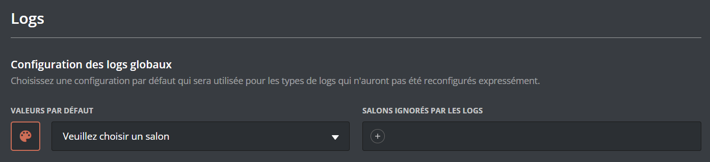
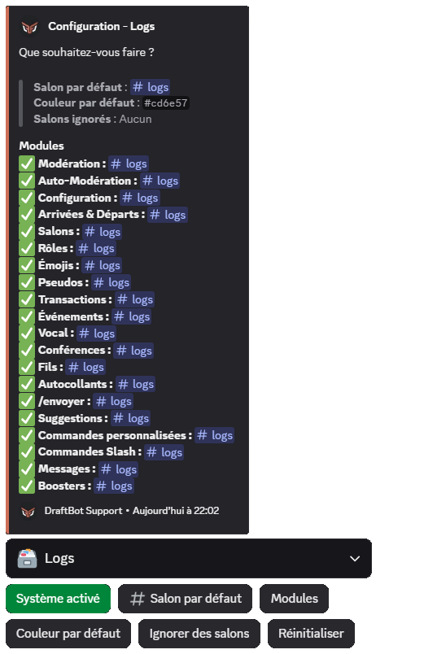
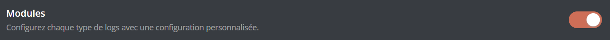
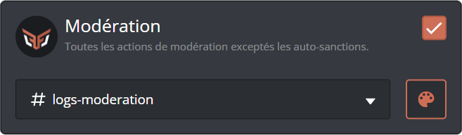
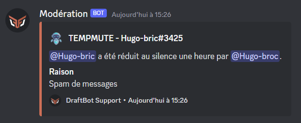
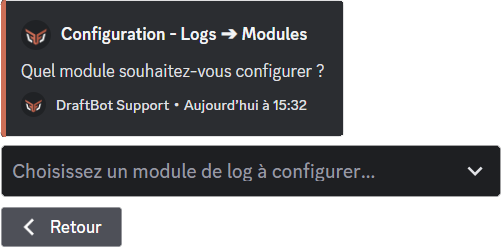

## What is it?

Logs are a history of the actions taken on your server. They let you find an action you are curious about, or see who did what.

Logs are embeds sent not by **DraftBot**, but by webhooks. A webhook lets you send a message with a custom profile picture, name and content.
> ***DraftBot** manages its own webhooks and the messages sent with them. If you delete its log webhook, it recreates it automatically when the next log is sent.*

## General configuration

::tabs
  ::tab{ label="From the panel" }
    [⫸ Open the **DraftBot** panel](/dashboard/first/logs)

    To configure **DraftBot**'s logs, go to the "Logs" category of the panel.

    At the top of the page you will find the configuration of the default global logs.

    You can configure the default color of the logs with the paint palette, the default channel with the dropdown menu, and the ignored channels by pressing "+".

    
  ::

  ::tab{ label="Using the /config command" }
    You can configure the logs with the \</config> command, then going to the "Logs" tab of the selector.

    **DraftBot** then displays the current configuration:
    - *Default channel* ➜ The channel logs are sent to if no channel has been set individually for each log.
    - *Default color* ➜ The color of the logs if no color has been set individually for each log.
    - *Ignored channels* ➜ Channels ignored by the logs: you get no log of the actions taken in them.

    The "*Modules*" category summarizes the configuration of each log.

    For each module, it displays:
    - Whether the log is enabled (✅) or not (❌)
    - The sending channel
    - The color
    - Custom [destinations](#destinations), if you have configured any

    Below this message you will find the buttons for configuring the logs:
    - ***Enable the system*** / ***System enabled*** ➜ To enable or disable the log system.
    - ***Default channel*** ➜ The channel logs are sent to if no channel has been set individually for each log.
    - ***Modules*** ➜ To configure each log individually.
    - ***Default color*** ➜ To configure the color of the logs if no color has been set individually for each log.
    - ***Ignore channels*** ➜ To configure the channels ignored by the logs: you get no log of the actions taken in them.
    - ***Reset*** ➜ To reset the whole log configuration.

    ::hint{ type="warning" }
      The "Reset" button cannot be undone: there is no way to cancel the action or to recover your previous configuration.
    ::

    ::hint{ type="info" }
      Blue buttons mean that their configuration has to be completed in full for the log system to work, during the first setup.
    ::

    
  ::
::

## Configuration per module

::tabs
  ::tab{ label="From the panel" }
    [⫸ Open the **DraftBot** panel](/dashboard/first/logs)

    To configure **DraftBot**'s log modules, go to the "Logs" category of the panel, then enable the modules.

    During the first setup, every log is greyed out (meaning they are disabled).

    Enable the logs you want to set up individually to reach their configuration.

    

    You can then configure your module:
    - To change the sending channel: open the dropdown menu and select the channel you want.
    - To change the log's profile picture when it is sent: click **DraftBot**'s logo. (<:icon_premium:1096140508625125417>)
    - To change the log's color when it is sent: click the paint palette and select the color you want. (<:icon_premium:1096140508625125417>)

    ::hint{ type="info" }
      Features marked with the <:icon_premium:1096140508625125417> symbol are reserved for [premium](/premium) <:icon_premium:1096140508625125417> servers.
    ::

    

    Example of a moderation log received on the server:

    
  ::

  ::tab{ label="Using the /config command" }
    You can configure the logs individually with the \</config> command, then going to the "Logs" tab of the selector.

    In the buttons below the message, select "Modules".

    

    Once the module has been selected, let **DraftBot** guide you to finish configuring it!
    - To change the sending channel: give the mention or the ID of the channel you want.
    - To change the log's profile picture when it is sent: send an image meeting the requirements given in the description of the corresponding question. (<:icon_premium:1096140508625125417>)
    - To change the log's color when it is sent: give a color code in hexadecimal format. (<:icon_premium:1096140508625125417>)
    - To choose where the logs are sent: click the `Destination` button (see the [Destinations](#destinations) section).

    ::hint{ type="info" }
      Features marked with the <:icon_premium:1096140508625125417> symbol are reserved for [premium](/premium) <:icon_premium:1096140508625125417> servers.
    ::

    ::hint{ type="success" }
      The module is configured! You now have access to this module's logs in the channel you set.
    ::

    Example of a moderation log received on the server:

    
  ::
::

### Available modules

Each module has a different purpose. Choose the ones matching your needs to run your server better and find your way around your logs more easily.

We advise making your logs accessible to moderators only.

#### Configurations
- **Configuration**: configuration of your server's DraftBot systems (including the panel).
- **Joins & Leaves**: logs of members joining or leaving your server.
- **Channels**: creation, editing or deletion of channels on your server.
- **Roles**: creation, editing or deletion of roles on your server.
- **Emojis**: creation, editing or deletion of emojis on your server.
- **Stickers**: creation, editing or deletion of stickers on your server.

#### Users
- **Nicknames**: changes to your members' nicknames on your server.
- **Transactions**: transactions in the economy system, or item exchanges between your members.
- **Events**: messages during community events or games on your server.
- **Voice**: messages when a member leaves, joins or moves between voice channels, as well as the actions taken in **temporary voice channels** from the settings embed: visibility changes, permission management, whitelist/blacklist updates, transfers and requisitions, renamings, user limit changes, and purges.
- **Stages**: messages when a stage starts, is edited or ends.
- **Threads**: creation, editing or deletion of threads on your server.
- **/say**: use of DraftBot's /say or /embed command.
- **Suggestions**: submission and sorting of the suggestions sent on the server through DraftBot.
- **Custom Commands**: execution of custom commands on your server.
- **Slash Commands**: execution of DraftBot slash commands on your server. (DraftBot only)
- **Messages**: editing or deletion of messages on your server. (<:icon_premium:1096140508625125417>)
- **Boosters**: boosts gained and lost on the server. (<:icon_premium:1096140508625125417>)

::hint{ type="info" }
  Features marked with the <:icon_premium:1096140508625125417> symbol are reserved for [premium](/premium) <:icon_premium:1096140508625125417> servers.
::

## Destinations

By default, a module's logs are sent to the **server channel** you configured for it. The `Destination` button adds two outputs to it, and can disable the server channel so that logs are only sent outside:

- **Another server**: a **Discord webhook**. As the destination channel can belong to another server, role and channel mentions are replaced there by their name.
- **External API**: the URL of your choice, called with an **HTTP POST** in JSON format, with up to **3 headers** to pass an authentication key, for example.

At least one destination always has to stay active: the server channel can only be disabled once one of the other two has been configured **and** enabled.

::hint{ type="info" }
  These two destinations send logs outside your server. They are reserved for [premium](/premium) <:icon_premium:1096140508625125417> servers, and only the **server owner** can configure them or disable the server channel.
::
