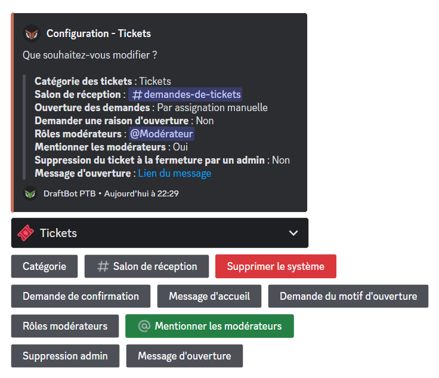
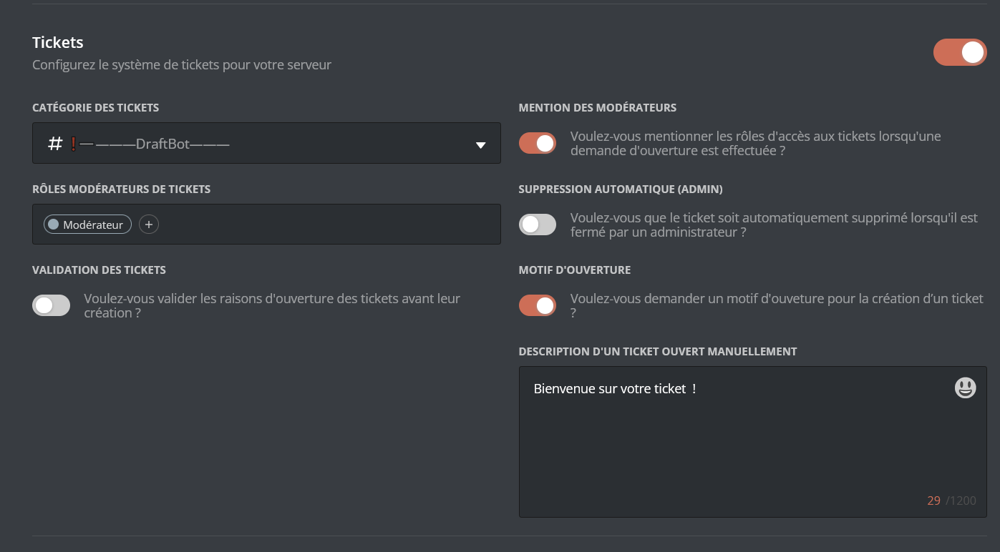
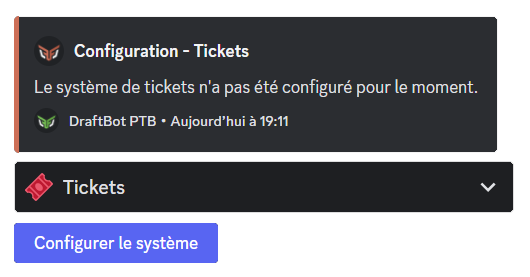
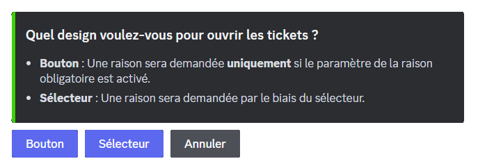

### Creating a ticket

You can create or request the creation of a ticket using the \</ticket> command.

::hint{ type="info" }
  The `reason` variable, although optional, can be made mandatory by the server managers. It is best to always fill it in.
::

### Ticket moderation

Administrators and ticket moderators have the following commands, giving them additional control over ticket access:

- \</ticketmod open> ➜ Opens a ticket for a member.
- \</ticketmod add> ➜ Grants a third member access to the ticket.
- \</ticketmod remove> ➜ Removes a member's access to the ticket.

### Reception channel

The ticket reception channel receives members' ticket requests, whether they are made through the \</ticket> command or through an **opening message**.

::hint{ type="info" }
  Receiving ticket requests in this channel requires opening requests to be set to **Manual** mode.
::

## Configuration

::tabs
  ::tab{ label="From the panel" }

    [⫸ Open the **DraftBot** panel](/dashboard/first/tickets)

    

    On the panel, in the **Community** category, the **Tickets** part offers the same configuration options as the slash commands on Discord. The opening message will be configurable on the panel soon.

    > ⚠️ Once your changes are done, remember to save them with the "Save" button at the bottom of the page.

    - **Ticket category** ➜ Sets the category tickets are created in. The category has to have been created beforehand. Remember to refresh the panel page if you have created a category in the meantime.

    - **Mention moderators** ➜ Enables the automatic mention of moderators when a ticket is opened.

    - **Ticket moderator roles** ➜ Adds or removes roles without the Administrator permission that will have access to tickets. Several roles can be added.

    - **Auto delete (admin)** ➜ When this option is enabled, tickets are deleted straight away if an administrator closes a ticket.

    - **Ticket validation** ➜ When validation is enabled, ticket requests are forwarded to the **reception channel** and have to be accepted or refused by the **ticket moderators** or administrators.

    - **Opening reason** ➜ Sets whether members have to give a reason for opening the ticket when using \</ticket>. Enabling it is recommended to avoid ticket-creation abuse or requests with no particular reason.
  ::

  ::tab{ label="Using the /config command" }
    To configure the ticket system, you can use the \</config> command and then click the "Tickets" section.

    ::hint{ type="warning" }
      If the system is not configured, a single "Configure the system" button is visible. Click it to start the configuration.
    ::

    

    > **Category** ➜ Sets the category tickets are created in. You can ask DraftBot to create it automatically for you, or use an existing one.

    > **Reception channel** ➜ Sets the channel that receives ticket opening requests. If validation is in **Automatic** mode, only the history of ticket closures and deletions is displayed in this channel. You can ask DraftBot to create the channel automatically, or use an existing one.

    ::hint{ type="info" }
      The ticket reception channel is by default in the category you specified, but it can be moved to another category.
    ::

    > **Delete the system** ➜ Resets the system and brings back the "Configure the system" button.

    ::hint{ type="warning" }
      This action cannot be undone, the whole configuration will be lost.
    ::

    > **Confirmation request** ➜ Changes the confirmation message displayed when a ticket is requested (only editable if ticket validation is in **Manual** mode). You can choose DraftBot's "Default" presentation or your own custom text by clicking "Edit".

    > **Opening reason request** ➜ Requires members to give a reason for opening the ticket. The reason given appears in the ticket's welcome message as well as in the opening request if ticket validation is in **Manual** mode.

    > **Welcome message** ➜ Changes the description of a ticket's welcome message **only** when it has been opened through the \</ticketmod open> command. When a ticket is opened through the \</ticket> command, the welcome message description contains the reason given by the member.

    > **Moderator roles** ➜ Adds or removes roles without the "Administrator" permission that will have access to tickets. Several roles can be added.

    > **Mention moderators** ➜ Enables or disables the automatic mention of the roles set as moderator roles whenever a new ticket is opened. If this option is enabled, every moderator role is mentioned. It is currently not possible to choose which specific roles to mention among the list of moderator roles.

    > **Admin delete** ➜ Tickets are deleted straight away if a server administrator closes a ticket.
  ::
::

### Opening message

The opening message lets members select a predefined opening reason from a button or a selector to request a ticket. It can be used as an alternative or a complement to the \</ticket> command.
When configuring it for the first time, through the \</config> command in the **Tickets** section and then clicking "Opening message", you have to select the type of opening message you want:

- **Button** ➜ This mode lets you configure a single opening reason, displayed as the button's text.

- **Selector** ➜ This mode lets you add several ticket opening reasons. By following the bot's instructions and questions, you can customize the name of the reasons, their associated emojis and descriptions.

::hint{ type="info" }
  You can use a message created beforehand in the [Embed Creator](/dashboard/first/embeds) on the panel by clicking "Existing message" on the question asked after selecting the type of opening message, to customize the presentation embed however you like, or through the \</say> command.
::

