## Configuration

::tabs
  ::tab{ label="From the panel" }
    [⫸ Open the **DraftBot** panel](/dashboard/first/custom-commands)

    Fill in the various fields (name, description, actions, etc.), click the "Create" button, and your custom command is ready to use straight away!

    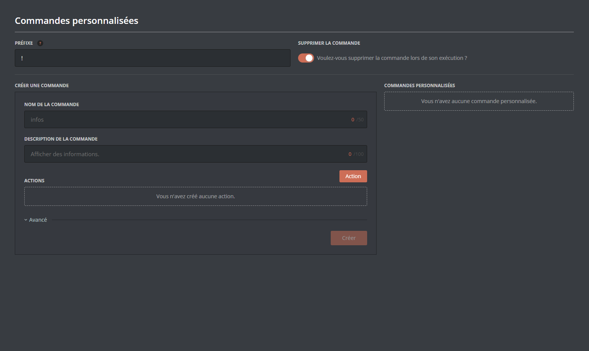

    ::hint{ type="success" }
      For more customization, expand the "**Advanced**" menu!
    ::

    ::hint{ type="info" }
      Need to edit or delete a command?

      No problem! Click "Edit" or "Delete":

      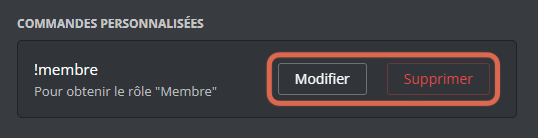
    ::
  ::

  ::tab{ label="Using the /config command" }
    You can create a custom command with the \</config> command, then going to the "Custom commands" tab of the selector.
    DraftBot then asks you for:

    - The **name** of the command,
    - The **description** of the command,
    - The [action(s)](#actions) your command has to carry out,
    - The [allowed/forbidden](#advanced-options) roles or channels,
    - Whether the command should [appear](#advanced-options) in \</help> or not,
    - Whether you want to add a [slow mode](#advanced-options) to your command,
    - Whether you want to set a [condition](#advanced-options) for using it.

    ::hint{ type="info" }
      When you run a custom command, the text that triggered it stays in the channel. If you want **DraftBot** to delete your command, you can enable the corresponding option in \</config>, going to the "Custom commands" tab of the selector, then enabling the "Enable command deletion" button.
    ::
  ::
::

## Actions

Actions are the heart of your custom command, and they come in 4 types:

::tabs
  ::tab{ label="Message" }
    **Send a message**

    *When the command is run, DraftBot sends a message.*

    ::hint{ type="info" }
      The message can contain markdown and variables. If you configure it from the [Panel](/dashboard/first/custom-commands), you can even add embeds to it!
    ::

    ::collapse{ label="Show an example:" }
      Here is a **Send a message** action, configured from the [Panel](/dashboard/first/custom-commands):

      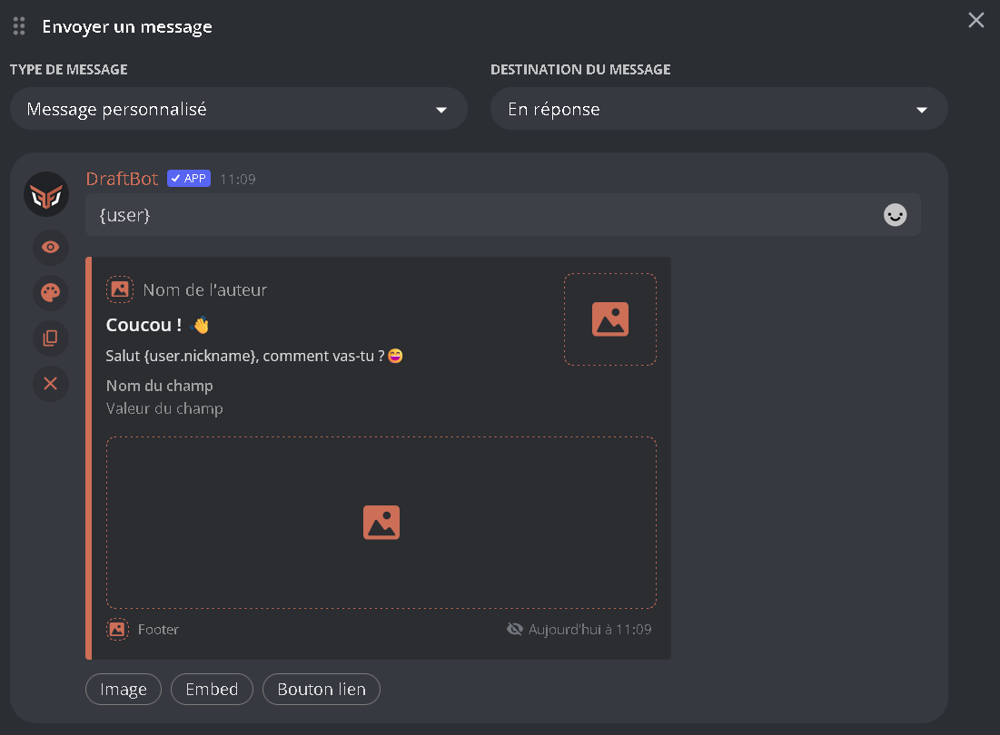

      When the command is run, this is what you get:

      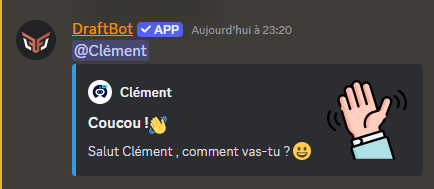
    ::
  ::

  ::tab{ label="Roles" }
    1. **Add roles**

        *When the command is run, DraftBot assigns the selected role(s).*

        ::collapse{ label="Show an example:" }
          Here is a command using the **"Add roles"** action:

          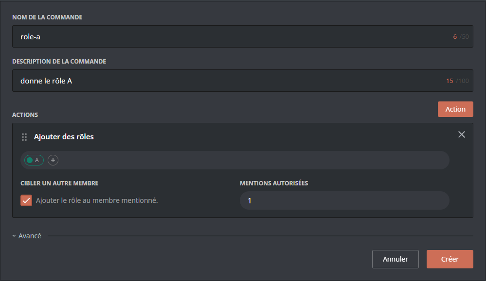

          ::hint{ type="success" }
            If I write `!role-a @DraftBot` on Discord, the member DraftBot receives the \<@A> role!
          ::

          ::hint{ type="info" }
            💡 For clarity, feel free to combine this action with a **Send a message** action, so that DraftBot can tell the member they have received a new role!
          ::
        ::

    2. **Add a temporary role**

        *When the command is run, DraftBot assigns a role, then removes it after a time of your choice.*

        ::collapse{ label="Show an example:" }
          From the [Panel](/dashboard/first/custom-commands), setting the exact duration you want is very easy:

          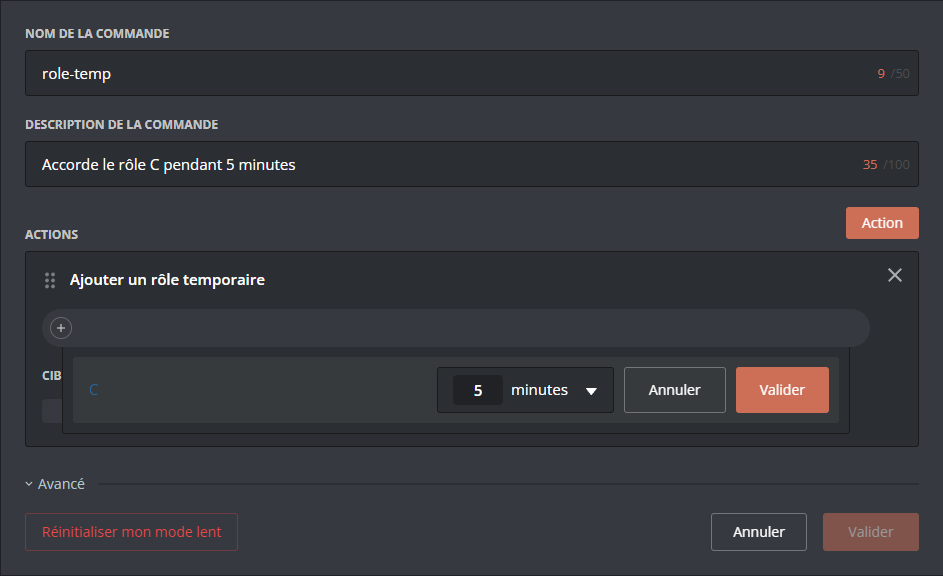

          ::hint{ type="success" }
            If I write `!role-temp` on Discord, I receive the \<@C> role!

            Then, after 5 minutes, the role is removed from me automatically.
          ::
        ::

    3. **Remove roles**

        *When the command is run, DraftBot removes the selected role(s).*

        ::collapse{ label="Show an example:" }
          Here is a function that removes the \<@A> role from a member, by mentioning them:

          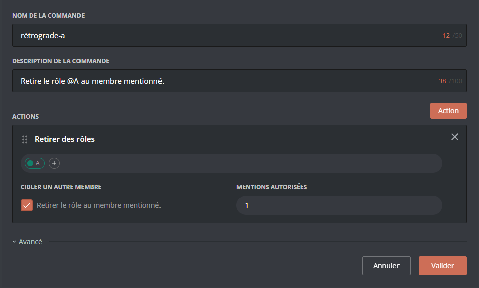

          ::hint{ type="success" }
            If I write `!demote-a @DraftBot` on Discord, the member \<@DraftBot> instantly loses the \<@A> role!
          ::
        ::

        ::hint{ type="info" }
          If you want the command to apply directly to the member using it, simply untick the "target another member" box.

          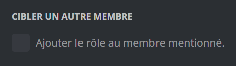
        ::
  ::

  ::tab{ label="Inventory / Economy" }
    1. **Shop article**

        *By using this command, the member buys the selected item.*

        ::collapse{ label="Show an example:" }
          The following command lets its user buy an item:

          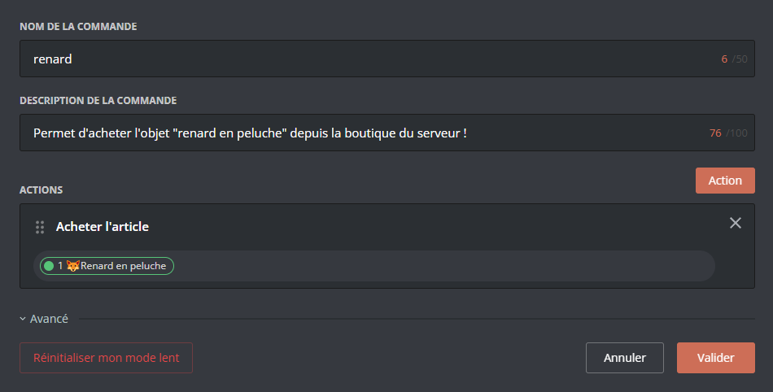

          ::hint{ type="success" }
            If I write `!fox` on Discord, the item **"🦊 Plush fox"** appears in my inventory (and its price is deducted from my money)!
          ::

          ::hint{ type="info" }
            DraftBot leaves you free to write the purchase confirmations yourself:

            So remember to combine this action with the **Send a message** action!
          ::
        ::

    2. **Add money**

        *When the command is run, DraftBot adds a set amount of money to the member.*

        ::collapse{ label="Show an example:" }
          Here is a `!donation` command, which adds 10💰 to a mentioned member:

          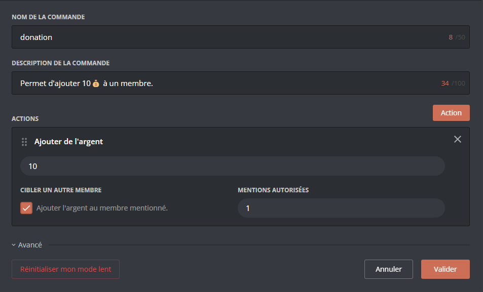

          ::hint{ type="success" }
            If I write `!donation @DraftBot` on Discord, the member \<@DraftBot> instantly receives 10💰!
          ::

          ::hint{ type="info" }
            You can also decide that this command adds the amount to the member using it, rather than to a mentioned member. To do so, untick the "target another member" box.
          ::
        ::
  ::
::

## Advanced options

### Where to find them?

::tabs
  ::tab{ label="From the panel" }
    ::hint{ type="info" }
      From the [Panel](/dashboard/first/custom-commands), you can bring up these options by clicking "Advanced", below your actions.
      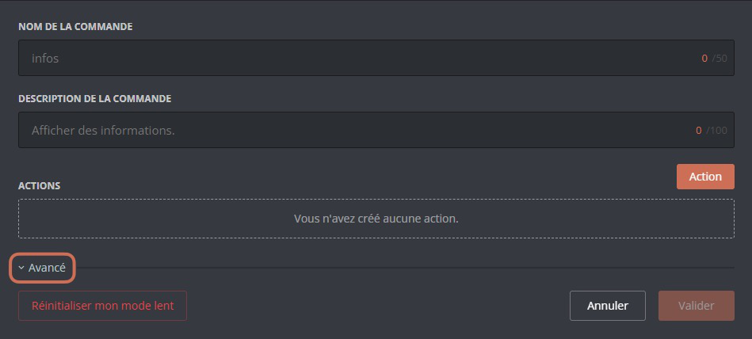
    ::
  ::

  ::tab{ label="Using the /config command" }
    ::hint{ type="success" }
      The advanced options are offered to you directly by DraftBot while configuring the command: just follow the prompts!
    ::
  ::
::

### What do they do?

The advanced options fall into 4 categories:

::tabs
  ::tab{ label="Restrictions" }
    Access to a command can be restricted by two criteria:

    1. **Restrict by roles**

        You can reserve the use of a command for certain specific roles, or on the contrary forbid it only to certain specific roles.

        ::hint{ type="warning" }
          Users with the **Administrator** permission can use the command whatever the allowed or forbidden roles.
        ::

    2. **Restrict by channels**

        In the same way, you can restrict the use of your command to certain specific channels, or forbid it in certain specific channels.

        ::hint{ type="info" }
          To switch between the "allow" and "forbid" modes, click "**ALLOWED/FORBIDDEN**".

          The active mode is written in white, while the other one is greyed out.

          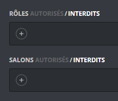
        ::
  ::

  ::tab{ label="Hiding" }
    If you do not want the command to appear in \</help>, you can enable this button:

    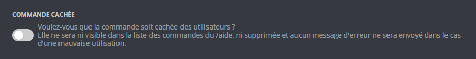

    ::hint{ type="warning" }
      When the command is hidden, it does not return an error message if it is used incorrectly!
    ::
  ::

  ::tab{ label="Slow mode" }
    If you want to apply a *"cooldown"* to your custom command, you can set it up flexibly by giving the following information:
    - `Number of uses`: how many times the same user can use it before triggering a cooldown
    - `Slow mode duration`: how long the cooldown lasts before the user can use the command again.

    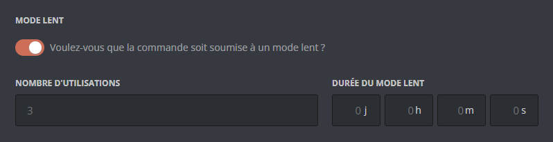

    ::hint{ type="success" }
      If you are a moderator or an administrator, you can reset your own number of uses of a command! To do so, go to the [Panel](/dashboard/first/custom-commands) and click "**Edit**" next to the command in question.

      A "**Reset my slow mode**" button appears at the bottom left of the screen:

      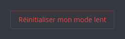
    ::
  ::

  ::tab{ label="Conditions" }
    You can make access to your command conditional on prerequisites:
    - `Inventory item`: the member can only use the command if they own the set item.
    - `Money`: the member can only use the command if they hold the set amount of money.
    - `Level`: only the members of a certain level can use the command.

    ::hint{ type="info" }
      For the "inventory item" and "money" options, you can decide whether the item (or the amount) is deducted from the member's inventory or not.
    ::

    ::hint{ type="success" }
      Thanks to the [Panel](/dashboard/first/custom-commands), you can configure all of this in a few clicks:
      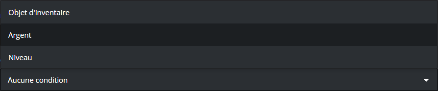
    ::
  ::
::

## Going further

### Arguments

You can make the messages of your custom commands more personal and more relevant by using arguments!

::hint{ type="info" }
  An "argument" is a piece of information you give when using a command.

  For example, in the command `!compliment @DraftBot cool`, `@DraftBot` is the first argument, and `cool` is the second one.
::

Here are the argument variables available with **DraftBot**:

| Variable | Description | Example |
|----------|-------------|---------|
| `{args.1}` | First argument | @DraftBot |
| `{args.2}` | Second argument | cool |
| `{args.N}` | Nth argument (up to 20) | foo |
| `{args.1+}` | Every argument from the first one | @DraftBot cool |
| `{args.2+}` | Every argument from the second one | cool |
| `{args.all}` | Every argument | @DraftBot cool |
| `{args.count}` | Number of arguments | 2 |

**Features:**
- Support for [modifiers](#variables): `{args.1?uppercase}`
- Default values: `{args.1:default=none}`
- Syntax consistent with the other variables

::collapse{ label="💡 Example:" }
  Let's take the command `!compliment @DraftBot cool` again.

  If I want my "**Send a message**" action to make DraftBot say "@DraftBot is really cool", I have to set DraftBot's message like this: `{args.1} is really {args.2}`.

  ::hint{ type="info" }
    If I want the command to work with several words in a row, I just have to use `{args.2+}`!
  ::

  ::hint{ type="success" }
    You can combine this with modifiers: `{args.1} is {args.2+?uppercase}` gives "@DraftBot is REALLY COOL"!
  ::
::

### Variables

You can customize your message actions with variables:

| Variable | Description | Example |
|----------|-------------|---------|
| `{money}` | Money | 1,234 |
| `{money.record}` | Money record | 5,678 |
| `{money.currency_icon}` | Currency icon | 💰 |
| `{money.rank}` | Position in the leaderboard | 3 |
| `{money.next_user}` | Member above in the leaderboard | @DraftBot |
| `{money.next_user.id}` | ID of the member above in the leaderboard | 318312854816161792 |
| `{money.next_user.money}` | Amount of money of the member above in the leaderboard | 2,500 |
| `{money.next_user.money_diff}` | Money difference with the member above in the leaderboard | 2,500 |
| `{money.to_position:position=N}` | Money needed to reach position N in the leaderboard | 1,200 |
| `{level}` | Level | 25 |
| `{level.rank}` | Position in the leaderboard | 5 |
| `{level.next_user}` | Member above in the leaderboard | @DraftBot |
| `{level.next_user.id}` | ID of the member above in the leaderboard | 318312854816161792 |
| `{level.next_user.xp}` | Amount of experience of the member above in the leaderboard | 2,500 |
| `{level.next_user.xp_diff}` | Experience difference with the member above in the leaderboard | 15,389 |
| `{level.next_user.level}` | Level of the member above in the leaderboard | 2,500 |
| `{level.next_user.level_diff}` | Level difference with the member above in the leaderboard | 2 |
| `{xp}` | Total experience | 12,500 |
| `{xp.current_level}` | Experience of the current level | 250 |
| `{xp.next_level}` | Experience needed to reach the next level | 750 |
| `{xp.to_level:level=N}` | Experience needed to reach level N | 15,000 |
| `{xp.to_position:position=N}` | Experience needed to reach position N in the leaderboard | 5,000 |
| `{birthday}` | Birth date | 15 March |
| `{birthday.next}` | Next birthday | In 2 months |
| `{age}` | The user's age | 25 years old |

*In addition to the [other variables](/docs/misc/variables) already available globally!*
