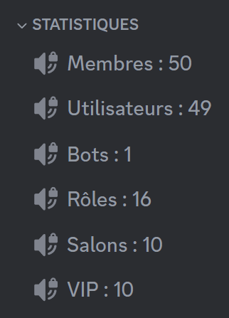
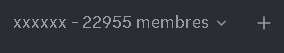

## What statistics channels look like

### Voice channels



### Category



::hint{ type="info" }
  Statistics channels refresh every **15 minutes**. [Premium](/premium) <:icon_premium:1096140508625125417> servers get a **10-minute** refresh.
::

## Creating a statistics channel

::tabs
  ::tab{ label="From the panel" }
    [⫸ Open the **DraftBot** panel](/dashboard/first/community)

    **Creating a channel**

    To create a statistics channel, click the "**Create a channel**" button. You can then choose a target.

    ::collapse{ label="Show / hide the list of targets" }

      | **NAME** | **EXPLANATION** |  |
      |---------|-----------------|--|
      | **Members** | Every user *(humans and bots)* on your server. |  |
      | **Members (without bots)** | Every human user on your server. |  |
      | **Bots** | Every bot user on your server. |  |
      | **Roles** | Every role on your server. |  |
      | **Channels** | Every channel on your server. |  |
      | **Members with a role** | Every member holding a certain role on your server. |  |
      | **Category exhibitions** | Every channel in a given category. |  |
      | **Custom API** | Data from a web API. | <:icon_premium:1096140508625125417> |
    ::

    **Configuring the channels**

    When you decide to edit a statistics channel, a series of settings appears. You can **Edit** or **Delete** the channels of your choice.
  ::

  ::tab{ label="Using the /config command" }

    **Creating a channel**

    To create a statistics channel, go to the **Statistics channels** menu of the /config command. If you have no other statistics channel configured, **DraftBot** offers you two buttons to click:

    - **Quick Configuration**
    - **Advanced Configuration**

    ::hint{ type="info" }
      If you choose **Category** as the channel type and you want to use an **existing category**, you have to give **DraftBot** the [ID](/docs/misc/finding-an-id) of that category.
    ::

    Once the method has been chosen (quick or advanced), you have to select the counter's target (members, bots, a specific role, etc.).

    ::collapse{ label="Show / hide the list of targets" }

      | **NAME** | **EXPLANATION** |  |
      |---------|-----------------|--|
      | **Members** | Every user *(humans and bots)* present on your server. |  |
      | **Members (without bots)** | Every human user present on your server. |  |
      | **Bots** | Every bot present on your server. |  |
      | **Roles** | Every role on your server. |  |
      | **Channels** | Every channel on your server. |  |
      | **Members with a role** | Every member holding a certain role on your server. |  |
      | **Category exhibitions** | Every channel in a given category. |  |
      | **Custom API** | Data from a web API. | <:icon_premium:1096140508625125417> |
    ::

    Once you have created your channel, you can then configure your channels.
  ::
::

## Customizing the name format

### Channel


You can change the name of a voice channel to whatever you want, as long as it comes before the " : ".

### Category


You can change the name of a category to whatever you want, as long as it comes before the " – ".

::hint{ type="warning" }
  Be careful not to touch the member counter, otherwise you will have to redo the configuration.
::

## Custom API

::hint{ type="info" }
  This feature is reserved for [premium](/premium) <:icon_premium:1096140508625125417> servers.
::

The **Custom API** target displays a statistic coming from an **external service**, through an HTTP/HTTPS request to a web API.

To configure a **custom API**, you first have to give:

- **The API's URL**: for example `https://api.draftbot.fr/base/stats`
- **The path to the numeric value:** for example `guilds`

This can be used, for example, to display:

- The number of users registered on a website
- Any other numeric value reachable through an API

::hint{ type="info" }
  A few important points to note:

  - The API has to be reachable through an **HTTP GET** request.

  - Credentials can be included directly in the URL, but **custom headers are not supported at this time**.

  - Check that the response does contain a **numeric value**.

  - A **10-minute** delay applies between each refresh.
::

### Format

The API has to return a JSON object containing a usable value.

**Example of a valid response**
```
{"count": 42}
```

In this example, DraftBot displays `42` in the statistics channel.

::hint{ type="info" }
  The value has to be a number; strings and complex objects are not supported.
::

### A concrete example

If your API is reachable at:

```
https://api.draftbot.fr/base/stats
```

and returns:

```
{"guilds":1008140,"users":53253590}
```

The channel can display, for example:

```
👤 Servers: 1008140
```

