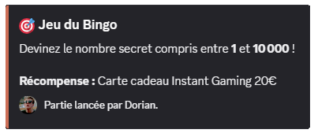
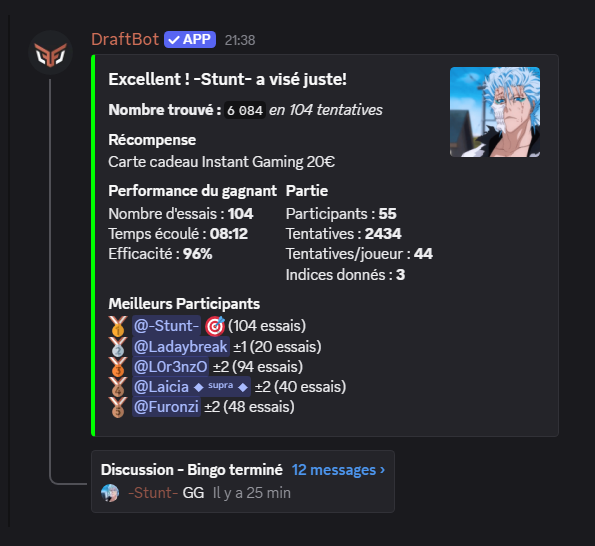
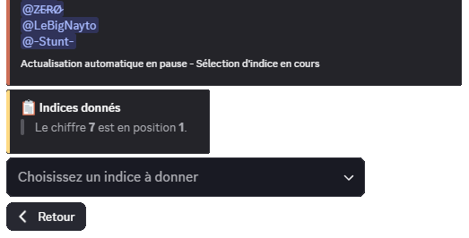
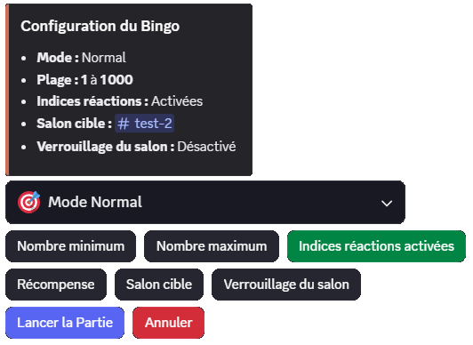
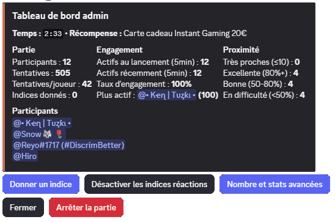

## What is Bingo?

**Bingo** is a competitive guessing game where players have to find a **secret number** chosen by DraftBot. Every attempt brings you closer to the mystery number thanks to the hints given by the bot!

::hint{ type="success" }
  Be the **first to guess** the secret number to win and appear in the game's statistics!
::

### Joining a game

When a bingo game is started in a channel, an announcement message appears with:
- The **number range** the secret number is in
- The **game mode** (Normal or Timed)
- The **duration** (in Timed mode)
- A potential **reward** (optional)

### Making an attempt

To take part, **send a number** in the channel where the game is taking place.

::hint{ type="info" }
  Bingo is a **deduction game**! The bot does **NOT** tell you whether your attempt is too high or too low. You have to work out the secret number by watching the other players' attempts and the hints given.
::

::hint{ type="info" }
  Every attempt is recorded and used to calculate your **performance statistics**: number of tries, time elapsed, efficiency, and how close you got to the number.
::

### Proximity reactions

If **reaction hints** are enabled, DraftBot can react with emojis when you are **very close** to the secret number:

| Emoji | Meaning | Proximity |
|-------|---------------|-----------|
| 🔥 | **Burning!** | You are extremely close (≤0.5% of the range) |
| ♨️ | **Very hot!** | You are very close (≤1.5% of the range) |
| 🌡️ | **Hot!** | You are close (≤5% of the range) |
| ❄️ | **Lukewarm** | You are in the zone (≤10% of the range) |

::hint{ type="warning" }
  Proximity reactions only appear if **at least 30 seconds** have passed since the last reaction. They are not given on every attempt!
::

### Winning the game

The **first player to guess** the secret number wins the game! A victory message celebrates your success.

::hint{ type="warning" }
  People with access to the **admin dashboard** (the creator and administrators) **cannot take part** in the game once they have seen the secret number.
::

## Dynamic hints

During the game, **hints** can be given **manually by the host** through the [admin dashboard](#admin-dashboard) to help players get closer to the secret number.

| Hint type | Description | Example |
|---------------|-------------|---------|
| **Parity** | Indicates whether the number is even or odd | "The number is **even**" |
| **Median comparison** | Compares the number to the median of the range | "The number is **below 500**" |
| **Number of digits** | Reveals how many digits make up the number | "The number has **3** digits" |
| **Value range** | Gives a narrowed range | "The number is between **400** and **600**" |
| **Digit sum** | Reveals the sum of all digits | "The sum of the digits is **15**" |
| **Contained digit** | Reveals one or more digits present | "The number contains the digit **7**" |
| **Divisibility** | Indicates which numbers it is divisible by | "The number is divisible by **5**" |
| **Closest player** | Shows who got the closest | "@Player got the closest with **523**" |
| **Digit position** | Reveals the position of a specific digit | "The digit **5** is at position **2**" |
| **Repeated digits** | Indicates whether any digits repeat | "All the digits are **different**" |
| **Collective wisdom** | Analysis of attempts around the median | "**70%** of players tried above 500 - they were right!" |

::hint{ type="info" }
  Hints are sent as **messages in the channel** by the host. They are visible to every player and help them collectively get closer to the secret number.
::

## Game modes

Bingo offers two game modes to suit what you are after:

### Normal Mode

The game carries on until a player finds the number or until there is **no activity for 5 minutes**.

- ⏰ Unlimited duration (as long as there is activity)
- 🔄 The inactivity timer resets on every attempt
- 🎯 Ideal for relaxed games

### Timed Mode ⏱️

Players have a **limited time** (configurable from 1 to 120 minutes) to find the number.

- ⏳ Visible countdown
- 🏃 Time pressure to build suspense
- 🎲 Strategy required to make the most of your attempts

::hint{ type="success" }
  **Timed Mode** is perfect for creating urgency and giving the game some pace!
::

## End-of-game statistics

At the end of each game, detailed statistics are displayed for every player:

## Running a game

To run a bingo game on your server, use the \</bingo> command.

::hint{ type="warning" }
  Bingo is **not compatible** with the **Counter**. You cannot start a bingo game in a channel used for the [Counter](/docs/engagement/counter).
::

::hint{ type="info" }
  A server can only run one game at a time. [Premium](/premium) <:icon_premium:1096140508625125417> servers can run up to 5 games at the same time.
::

### Number range

Set the **minimum number** and the **maximum number** the secret number is chosen between.

::hint{ type="info" }
  - **Allowed range**: from **-10,000,000** to **10,000,000**
  - The minimum number must be lower than the maximum number
  - **Negative numbers** are accepted!
::

::hint{ type="success" }
  For a quick, approachable game, use a range of **1 to 100**. For a tougher challenge, go up to **1 to 1000** or more!
::

### Game mode

Choose between:
- **Normal Mode**: unlimited game, stopping after 5 minutes of inactivity
- **Timed Mode**: configurable time limit (1 to 120 minutes)

### Proximity reactions

Enable **proximity reactions** so that DraftBot reacts with temperature emojis on players' messages when they get close to the secret number.

::hint{ type="info" }
  Proximity reactions (🔥 ♨️ 🌡️ ❄️) help players know when they are in the right zone, without revealing the number directly! They only appear if the player is within 10% of the range, and at most every 30 seconds.
::

### Reward

Set an optional reward to motivate your members! Several types are available:

| Type | Description | Distribution |
|------|-------------|--------------|
| **Role** | Grants a Discord role | Automatic |
| **Temporary role** | Role with a limited duration (1 min to 1 month) | Automatic |
| **Money** | DraftBot currency | Automatic |
| **Experience** | XP points for the level system | Automatic |
| **Item** | Added to the winner's inventory | Automatic |
| **Custom** | Free text (an in-real-life gift, for example) | The creator receives a DM |

::hint{ type="info" }
  With the **custom** reward, you receive a direct message from DraftBot with the winner's details so that you can hand the reward over yourself.
::

### Target channel

Choose where your game takes place:

**Option 1: select an existing channel**
- The game is started in a channel of your choice
- You need the required permissions in that channel

**Option 2: new dedicated channel**
- DraftBot automatically creates a new channel
- Choose the category and customize the name
- The channel is created when the game starts

::hint{ type="info" }
  To create a new channel, you need the **Manage Channels** permission.
::

::hint{ type="success" }
  If you choose a category, DraftBot automatically suggests a sensible channel name based on the names of the existing channels in that category!
::

### Channel lock

For very active servers, enable the **channel lock**, which is triggered automatically at the end of the game:

**Features:**
- 🔒 **Automatic locking**: the channel is locked to prevent new messages
- ⏱️ **Unlocking delay**: configurable between **5 and 300 seconds** (20s by default)
- 💬 **Thread creation**: an option to automatically create a thread after the victory so that members can react to the bingo result.

::hint{ type="info" }
  The **channel lock** requires the **Manage Permissions** permission in the target channel. The game's creator always keeps the ability to write in the locked channel.
::

## Admin dashboard

The game's creator and the server administrators have access to an **admin dashboard** by using \</bingo> while a game is in progress.

::hint{ type="info" }
  The dashboard **refreshes automatically every 3 seconds** to display real-time data.
::

::hint{ type="info" }
  If a game is already in progress in the current channel and you are its creator or have the **Administrator** permission, you go straight to the **admin dashboard**.
::

### Advanced statistics

Administrators can access even more detailed statistics through the **"Number and advanced stats"** button:

**Player engagement:**
- Recently active players (5 minutes before the game)
- Players active at launch
- Overall engagement rate
- Effectiveness of the hints given
- Number of players making progress

**Proximity to the secret number:**
- Very close players (≤10 difference)
- Players with excellent accuracy (80%+)
- Players with good accuracy (50-80%)
- Struggling players (<50%)

**Performance records:**
- Player closest to the number
- Most active player
- Best efficiency ratio
- Longest streak of improvements

::hint{ type="warning" }
  This feature is **disabled if a reward is set**, to prevent cheating. Only **server administrators** can access it.
::
