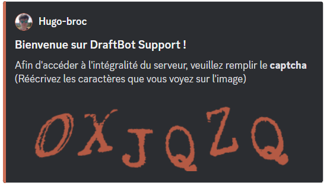

::hint{ type="info" }
  **Avant d'activer le captcha**, sachez que Discord propose déjà de quoi filtrer les arrivées : le **niveau de vérification** du serveur (adresse e-mail, numéro de téléphone, ancienneté du compte) et, en mode Communauté, l'**écran de règles** et l'**onboarding**. Ces réglages n'ajoutent aucune étape pour vos membres et suffisent à la plupart des serveurs.

  Le captcha de DraftBot garde son intérêt si votre serveur n'est pas en mode Communauté, ou si vous souhaitez une barrière supplémentaire par-dessus ces protections.
::

::hint{ type="warning" }
  Si votre serveur utilise le **règlement natif de Discord** (celui que les nouveaux membres doivent accepter avant d'accéder au serveur, activé via le mode Communauté), le captcha de DraftBot n'apparaîtra qu'une fois ce règlement accepté.
::

## Configuration

Vous pouvez configurer le système de captcha sur votre serveur à l'aide de la commande \</config>, en vous rendant ensuite dans l'onglet "Captcha" du sélecteur.

Vous pourrez alors :

- **Activer ou désactiver** le captcha
- **Choisir** l'un des 4 niveaux de sécurité (facile, moyen, complexe et très complexe)
- **Créer ou sélectionner** le salon de vérification dans lequel les captchas seront envoyés
- **Créer ou sélectionner** un rôle attribué aux membres n'ayant pas encore validé le captcha
- **Sélectionner** (facultatif) un rôle attribué aux membres ayant validé le captcha

::hint{ type="info" }
  La configuration du système de captcha n'est pas encore disponible sur le panel de **DraftBot**.
::

## Utilisation du captcha

Lorsqu'un nouveau membre rejoindra votre serveur Discord, un message apparaîtra dans le salon que vous avez défini pour le captcha.

Le membre devra alors réécrire les caractères sur l'image qui lui est destinée pour accéder au serveur.

::hint{ type="info" }
  Le message d'arrivée ne s'envoie qu'après la validation du règlement du système de communauté Discord et du captcha de DraftBot.
::

::hint{ type="warning" }
  Si le membre ne répond pas au bout de 2 minutes ou qu'il échoue plus de 3 fois au captcha, il sera automatiquement expulsé !
::
