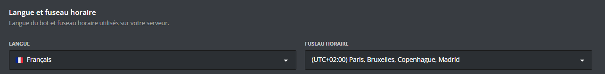
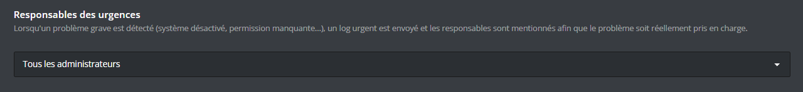

Vous pouvez y accéder en [**`cliquant ici`**](/dashboard/first/settings).

### Langue et fuseau horaire

Cette section vous permet de définir la **langue du bot** ainsi que le **fuseau horaire** utilisés sur votre serveur. Ces réglages influencent notamment l'affichage des dates et des horaires dans les messages envoyés par DraftBot.

- **Langue** : choisissez la langue dans laquelle DraftBot s'exprimera sur votre serveur.
- **Fuseau horaire** : sélectionnez le fuseau horaire correspondant à votre serveur pour que les horodatages soient cohérents.

::hint{ type="info" }
  Ce réglage change la langue globale du bot pour l'ensemble du serveur. Il ne s'agit pas d'une préférence individuelle par membre.
::

### Responsables des urgences

Lorsqu'un problème grave est détecté sur votre serveur (système désactivé, permission manquante, etc.), DraftBot envoie un **message urgent** dans le salon de logs et mentionne les responsables désignés afin que le problème soit réellement pris en charge.

Vous avez le choix entre deux options :

- **Tous les administrateurs** : tous les membres ayant la permission Administrateur sur le serveur seront mentionnés.
- **Liste personnalisée** : vous choisissez vous-même les membres qui seront mentionnés.

::hint{ type="warning" }
  Pensez à bien configurer les responsables des urgences : si personne n'est désigné, les problèmes critiques risquent de passer inaperçus et de perturber le bon fonctionnement de DraftBot sur votre serveur.
::