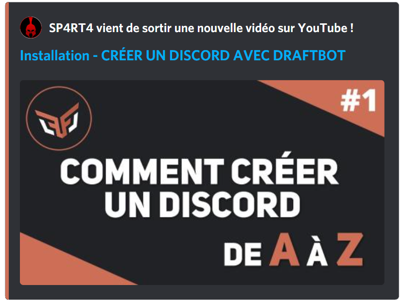
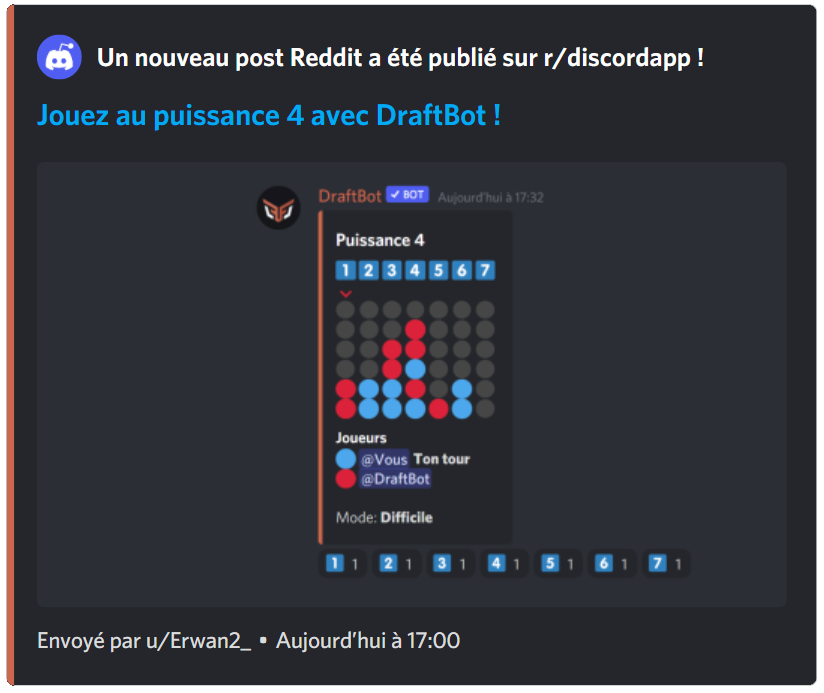
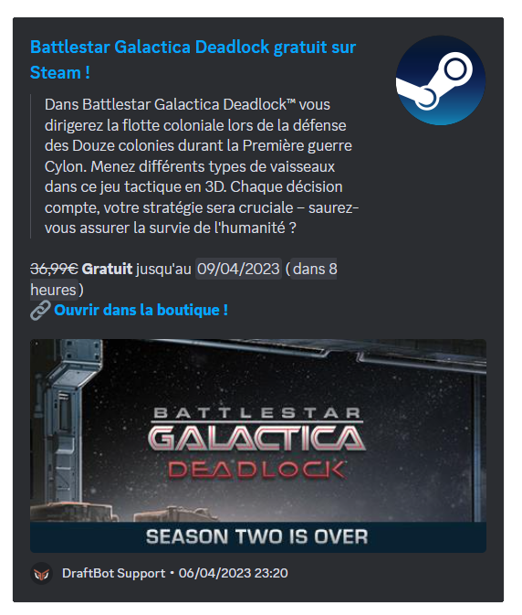
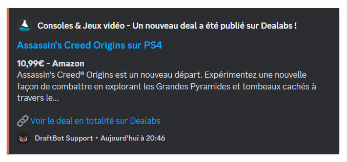
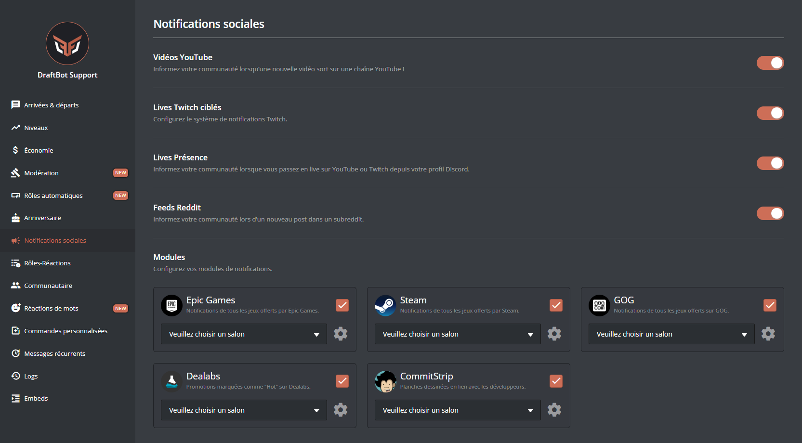

## Modules

### YouTube

Ce module permet **d'afficher** un message lors de la **publication d'une vidéo [`YouTube`](https://www.youtube.com/).**

L'annonce est entièrement **personnalisable**. Cela permet donc aux administrateurs de configurer **un rôle notifié**, activer **la publication sur d'autres serveurs**, choisir la **couleur** de l'embed d'annonce ([premium](/premium) <:icon_premium:1096140508625125417>), ainsi que d'autres éléments visuels.

::hint{ type="info" }
  Vous pouvez ajouter **une seule chaîne [YouTube](https://www.youtube.com/)**. Les serveurs [premium](/premium) <:icon_premium:1096140508625125417> peuvent en avoir jusqu'à 5.
::

Vous avez la possibilité de sélectionner les **types de vidéos** qui seront publiées, dans la configuration de la chaîne YouTube. Ainsi, vous pouvez ajouter les vidéos, les shorts et les lives.

Vous pouvez personnaliser le message d'annonce avec différentes variables :

| Variable | Description | Exemple |
|----------|-------------|---------|
| `{video.author}` | Nom de la chaîne | DraftBot |
| `{video.title}` | Titre de la vidéo | Comment utiliser DraftBot |
| `{video.url}` | Lien de la vidéo | https://youtube.com/... |

*En plus des [autres variables](/docs/autres/variables) déjà disponibles globalement !*

### Twitch

::hint{ type="info" }
  Cette fonctionnalité est réservée aux serveurs [premium](/premium) <:icon_premium:1096140508625125417>.
::

**Les notifications sociales Twitch** permettent d'envoyer un message **personnalisable** lors du **lancement d'un live**. Un serveur peut configurer jusqu'à **5 notifications sociales Twitch différentes** .

::hint{ type="info" }
  Afin d'éviter un spam d'embed, un délai de 30 minutes a été mis en place entre deux annonces de la même personne.
::

Vous pouvez personnaliser le message d'annonce avec différentes variables :

| Variable | Description | Exemple |
|----------|-------------|---------|
| `{stream.author}` | Nom de la chaîne | StreamerName |
| `{stream.title}` | Titre du live | Live de développement |
| `{stream.game}` | Jeu en live | Just Chatting |
| `{stream.url}` | Lien du live | https://twitch.tv/... |
| `{stream.start_at}` | Date de début | il y a 2 heures |
| `{stream.tags}` | Tags du live | français, développement |

*En plus des [autres variables](/docs/autres/variables) déjà disponibles globalement !*

### Reddit

Ce module permet d'afficher une notification lors d'une publication dans un **subreddit**. Comme pour les autres modules de notifications sociales, le message envoyé est entièrement personnalisable : il pourra donc être envoyé sous forme de **message classique ou sous forme d'embed**.

::hint{ type="info" }
  Vous ne pouvez configurer qu'une seule notification [Reddit](https://www.reddit.com/). Les serveurs [premium](/premium) <:icon_premium:1096140508625125417> étendent leur limite jusqu'à 10.
::

Voici un exemple de message de notification :

::hint{ type="info" }
  Dans le but de rendre opérationnelle l'option **Upvotes minimum** pour l'ensemble des serveurs, un délai minimal de **15** minutes entre la publication sur Reddit et l'annonce par DraftBot a été instauré.
::

Vous pouvez personnaliser le message d'annonce avec différentes variables :

| Variable | Description | Exemple |
|----------|-------------|---------|
| `{post.subreddit}` | Nom du subreddit | r/discord |
| `{post.title}` | Titre du post | Question sur DraftBot |
| `{post.description}` | Description du post | Comment configurer... |
| `{post.url}` | Lien du post | https://reddit.com/... |

*En plus des [autres variables](/docs/autres/variables) déjà disponibles globalement !*

### Epic Games

Ce module permet d'envoyer une annonce lorsqu'un jeu gratuit est disponible sur l'[Epic Games Store](https://store.epicgames.com/fr/).

::hint{ type="info" }
  Le rôle mentionné, la couleur de l'annonce ainsi que le salon d'envoi peuvent être personnalisés.
::

### Steam

Ce module permet d'envoyer une annonce lorsqu'un jeu gratuit est disponible sur [Steam](https://store.steampowered.com/?l=french).

::hint{ type="info" }
  Le rôle mentionné, la couleur de l'annonce ainsi que le salon d'envoi peuvent être personnalisés.
::

### GOG

Ce module permet d'envoyer une annonce lorsqu'un jeu gratuit est disponible sur [GOG](https://www.gog.com/).

::hint{ type="info" }
  Le rôle mentionné, la couleur de l'annonce ainsi que le salon d'envoi peuvent être personnalisés.
::

### Dealabs

Ce module permet d'envoyer une notification lorsqu'une réduction devient "hot" (brûlante). Il s'agit du stade où la promotion est jugée intéressante par les utilisateurs du site. Vous pouvez également sélectionner des catégories précises d'annonces à envoyer (exemples : High-Tech, Mode, etc...).

::hint{ type="info" }
  Vous pouvez sélectionner jusqu'à **2** catégories précises. Les serveurs [premium](/premium) <:icon_premium:1096140508625125417> n'ont pas de limite.
::

::hint{ type="info" }
  Le rôle mentionné, la couleur de l'annonce ainsi que le salon d'envoi peuvent être personnalisés.
::

### Flux RSS

Un **flux RSS** est une adresse fournie par un site web, qui recense automatiquement ses dernières publications. Ce module permet à DraftBot de surveiller un tel flux et d'annoncer chaque nouvelle publication sur votre serveur.

Pour trouver le flux RSS d'un site, trois méthodes s'offrent à vous :

1. **Repérer l'icône RSS**

    Certains sites signalent leur flux par ce logo <:flux_rss:1402873518705868800>, généralement placé dans l'en-tête, le pied de page, la barre latérale ou le menu. Cliquez dessus pour accéder au flux.

2. **Deviner l'adresse du flux**

    Si aucune icône n'est visible, essayez d'ajouter l'un de ces suffixes à l'adresse du site — ce sont les plus courants :

    - `/feed/`
    - `/rss/`
    - `/rss.xml`

    Par exemple, pour le site `exemple.com`, testez `exemple.com/feed/`.

3. **Générer le flux avec rss.app**

    Pour les sites qui ne proposent aucun flux, rendez-vous sur [rss.app](https://rss.app/). Collez l'adresse du site dans le générateur, cliquez sur "générer", et vous obtiendrez un flux utilisable.

::hint{ type="info" }
  Afin d'éviter le spam, un délai de 10 minutes est appliqué entre deux annonces.
::

Vous pouvez personnaliser le message d'annonce avec différentes variables :

| Variable | Description | Exemple |
|----------|-------------|---------|
| `{feed.name}` | Nom du flux | Blog DraftBot |
| `{feed.url}` | Lien du flux | https://draftbot.fr/... |

*En plus des [autres variables](/docs/autres/variables) déjà disponibles globalement !*

## Configuration

Vous pouvez activer séparément tous les types de notifications sociales.

::tabs
  ::tab{ label="Depuis le panel" }
    [⫸ Accéder au panel de **DraftBot**](/dashboard/first/social-notifs)

    Dans cette page, vous pouvez activer et désactiver à votre guise les notifications sociales. Il en existe deux types :
    - Les **onglets**, qui peuvent être configurés pour plusieurs chaînes ou forums.
    - Les **modules**, qui activent des notifications ne demandant que très peu de configuration.

    
  ::

  ::tab{ label="Via la commande /config" }
    Pour ajouter une annonce lors d'un évènement (publication d'une vidéo, d'un post, lancement d'un live, etc.), exécutez la commande \</config> et sélectionnez le système **Notifications sociales**. Vous accéderez alors à l'onglet ci-dessous.

    

    Sélectionnez la plateforme de votre choix et configurez-la en vous laissant guider.
  ::
::

## Informations complémentaires

Vous retrouverez le nombre maximum d'annonces par plateformes sur [le comparatif de DraftBot Premium](/premium#diff) dans la partie **Notifications sociales**.

