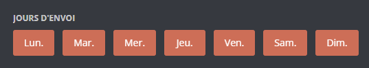

# Rappel

## Créer un rappel

Pour créer un rappel, vous devez exécuter la commande `rappel create (Titre) (Temps)`.    Il vous suffit ensuite de choisir si le rappel doit vous être envoyé dans le même salon ou en message privé.

.png>)


Attention, il est possible d'en créer 3 simultanément et 10 rappels simultanément pour les utilisateurs premium.



Félicitations, vous avez créé un rappel ! DraftBot vous mentionnera le moment venu :tada:


## Supprimer un rappel

Pour supprimer un rappel, il vous suffit d'exécuter la commande `rappel remove "Titre"`.

## Voir les rappels

Vous pouvez voir vos rappels avec la commande `rappel list`.
