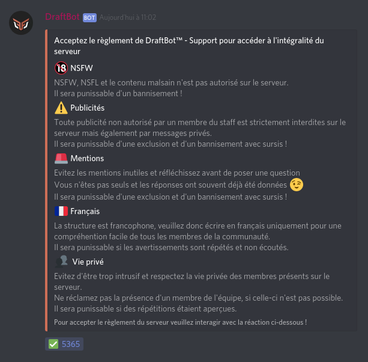

# Règlement

## Création du règlement

Commencez par créer votre règlement en utilisant la commande `!reglement` ou `@DraftBot#0535 reglement`

Par la suite il vous demandera quel est le rôle que vous souhaitez attribuer aux membres qui attesteront avoir pris connaissance de ce règlement. Répondez alors simplement le nom du rôle que vous souhaitez associer à la validation.


Si vous ne souhaitez pas notifier toutes les personnes qui ont d'ores et déjà le rôle destiné au règlement, vous pouvez simplement répondre le nom du rôle. Cela fonctionnera tout aussi bien que la mention.



En retirant la réaction ✅ les membres perdent également le rôle associé.


**Astuce :** _Afin de profiter au maximum de cet outil, nous vous conseillons d'empêcher le rôle @everyone d'accéder aux principaux salons du serveur, excepté celui d'accueil, et de permettre l'accès aux autres salons uniquement au rôle qui sera obtenus par le règlement. Ainsi, seules les personnes ayant pris connaissance des règles pourront réellement accéder au serveur._ 

## Ajout de règles

Pour conserver une communauté stable il est nécéssaire de mettre en place un système de règles à suivre. Vous pourrez facilement en ajouter à votre règlement grâce à la commande `!adminrules` ou `@DraftBot#0535 adminrules`

| Arguments | Description |
| :--- | :--- |
| argument | L'argument est l'action que vous souhaitez faire : **ajouter** et **retirer** une règle de votre règlement |
| message | I'argument message représente l'id du message où se trouves le règlement  |

Une fois ces deux arguments renseignés, le **DraftBot** vous demandera le titre de la règle et la description détaillé de cette règle 

Une fois votre règlement crée vous devriez avoir quelque chose comme ça :

