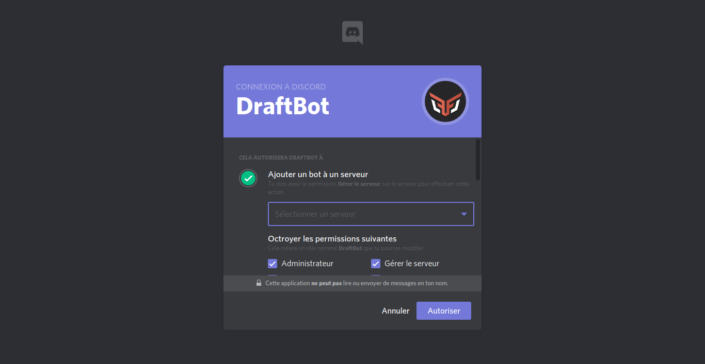

# Installation

## Invitation

#### Commençons par inviter DraftBot sur le serveur.

Vous pouvez l'inviter depuis le site : [www.draftbot.fr](https://www.draftbot.fr)


Félicitations, le 𝗗𝗿𝗮𝗳𝘁𝗕𝗼𝘁 est maintenant ajouté à votre serveur !


## Installation

#### Une fois DraftBot ajouté à votre serveur, il faut lui donner les permissions dont il a besoin.

Commencez par vous rendre dans les paramètres de votre serveur, dans la catégorie « Rôles » :

Activez les paramètres du rôle dont 𝗗𝗿𝗮𝗳𝘁𝗕𝗼𝘁 a besoin pour exécuter les commandes que vous voudrez utiliser. Le plus simple étant de lui donner la permission « Administrateur » :

| Permission | Inutile | Facultative | Essentielle | Recommandée |
| :--- | :---: | :---: | :---: | :---: |
| Afficher séparément | X |  |  |  |
| Mentionner ce rôle |  | X |  |  |
| Administrateur |  | X |  | 𝗫 |
| Voir les logs | X |  |  |  |
| Gérer le serveur |  |  |  |  |
| Gérer les rôles |  |  | X | 𝗫 |
| Gérer les salons |  |  | X | 𝗫 |
| Expulser des membres |  |  | X | 𝗫 |
| Bannir des membres |  |  | X | 𝗫 |
| Créer une invitation |  | X |  |  |
| Changer de pseudo | X |  |  |  |
| Gérer les pseudos |  | X |  |  |
| Gérer les émojis | X |  |  |  |
| Gérer les Webhooks |  |  | X | 𝗫 |
| Lire & voir les salons |  |  | X | 𝗫 |
| Envoyer des messages |  |  | X | 𝗫 |
| Envoyer des TTS | X |  |  |  |
| Gérer les messages |  |  | X | 𝗫 |
| Intégrer des liens |  |  | X | 𝗫 |
| Joindre des fichiers |  |  | X | 𝗫 |
| Voir les anciens messages |  |  | X | 𝗫 |
| Mentionner @everyone |  | X |  |  |
| Utiliser des émojis externes |  |  | X | 𝗫 |
| Se connecter en vocal |  |  | X | 𝗫 |
| Parler en vocal |  |  | X | 𝗫 |
| Couper le micro de membres |  | X |  |  |
| Mettre en sourdine |  | X |  |  |
| Déplacer des membres |  | X |  |  |
| Utiliser la détection de voix |  | X |  | X |
| Voix prioritaire |  | X |  |  |


Si 𝗗𝗿𝗮𝗳𝘁𝗕𝗼𝘁 n'est pas Administrateur, il faudra également penser à lui attribuer les permissions dans les salons où il devra agir.


Si vous souhaitez que 𝗗𝗿𝗮𝗳𝘁𝗕𝗼𝘁 puisse attribuer des rôles, assurez-vous que ceux-ci soient inférieurs dans la hiérarchie des rôles du serveur :

> Dans notre cas par exemple, 𝗗𝗿𝗮𝗳𝘁𝗕𝗼𝘁 sera capable d'attribuer les Deuxième, Troisième et Quatrième rôles, mais ne pourras pas donner le Premier rôle.

Grâce à cette installation et si vous avez choisis de faire confiance à 𝗗𝗿𝗮𝗳𝘁𝗕𝗼𝘁 en le laissant Administrateur, vous ne devriez pas rencontrer de problème. L'installation primaire est à présent terminée, vous pouvez passer à la « Configuration ».

