# 🎂 Anniversaires

## Votre anniversaire

Vous pouvez définir votre anniversaire via <mark style="color:blue;">[le panel de Draftbot](https://www.draftbot.fr)</mark> ou avec la commande <mark style="color:orange;">/anniversaire définir \[date] </mark>. Il vous suffira de mettre dans l'argument <mark style="color:orange;">\[date]</mark> votre date d'anniversaire. 

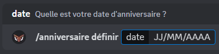

Vous pouvez également voir la liste des dix prochains anniversaires définis sur le serveur grâce à la commande <mark style="color:orange;">/anniversaire liste</mark>.


Attention, pour changer votre date de naissance, il y a un délai d'attente progressif *(il augmente à chaque changement)*.

- 1er changement : 1 jour
- 2ème : 2 jours
- 3ème : 6 mois
- 4ème et plus : 1 an


## Modifier la visibilité de votre anniversaire

Grâce aux commandes <mark style="color:orange;">/anniversaire activer</mark> & <mark style="color:orange;">/anniversaire désactiver</mark>, vous pouvez *(par serveur individuel)* activer ou désactiver la visibilité de votre anniversaire. Vous pouvez aussi modifier ces paramètres depuis le panel.

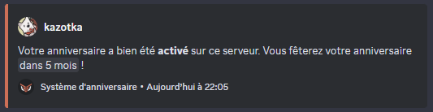


Vous pouvez désactiver la visibilité de votre anniversaire sur tous les serveurs avec la commande <mark style="color:orange;">/anniversaire retirer</mark>.


## Configuration des anniversaires sur le serveur




Grâce à la commande <mark style="color:orange;">/config \[système:Anniversaires]</mark> vous pouvez paramétrer plusieurs options du système d'anniversaire.

Avec les boutons présentés ci-dessous, vous pouvez :

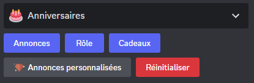

## <mark style="color:blue;">Annonces</mark>

Grâce au bouton <mark style="color:blue;">"Annonces"</mark>, vous pouvez paramétrer l'envoi d'un message général à tous les membres lors du jour de leur anniversaire.

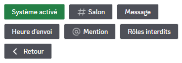

- En cliquant sur le bouton "Système activé/désactivé", vous pouvez activer ou désactiver le système d'annonce d'anniversaire.
- Avec le bouton "Salon", vous pouvez choisir le salon dans lequel le bot enverra l'annonce d'anniversaire.
- Grâce au troisième bouton "Message", vous pouvez paramétrer le message d'annonce.


Lorsque vous voulez paramètrer le message d'anniversaire, vous pouvez choisir entre prendre le message par défaut et un message personnalisé. Si vous prenez la deuxième option, vous pouvez utiliser les variables ci-dessous et le markdown de Discord.

Variables disponibles

Membre :

- `{​user}` ➜ Mention du membre
- `{​user.id}` ➜ Identifiant du membre
- `{​user.tag}` ➜ Tag du membre (Pseudo#0000)
- `{​user.username}` ➜ Pseudo du membre
- `{​user.nickname}` ➜ Surnom ou pseudo du membre
- `{birthday}` ➜ Date d'anniversaire du membre *(uniquement si le système est activé)*

Serveur :

- `{​server}` ou `{​server.name}` ➜ Nom du serveur
- `{​server.id}` ➜ Identifiant du serveur
- `{​server.membercount}` ➜ Nombre de membres sur le serveur

Salon  :

- `{​channel}` ➜ Mentions du salon
- `{​channel.id}` ➜ Identifiant du salon
- `{​channel.name}` ➜ Nom du salon

Temps :

- `{​date}` ➜ Date actuelle (JJ/MM/AAAA)
- `{​time}` ➜ Heure actuelle (HH:MM)
- `{​timestamp}` ➜ Timestamp actuel en secondes



- Avec l'aide du quatrième bouton "Heure d'envoi", vous pouvez définir l'heure à laquelle le message d'annonce d'anniversaire sera envoyé dans le salon que vous aurez défini au préalable. 
- Grâce à ce cinquième bouton "Mention", vous pouvez décider de mentionner un rôle dans le message d'annonce.
- Pour finir, avec le bouton "Rôles interdits", vous pouvez interdire l'annonce d'un anniversaire à tous les membres qui possèderont ce rôle. 

## <mark style="color:blue;">Rôle</mark>

Avec l'option <mark style="color:blue;">"Rôle"</mark>, vous pouvez décider de donner un rôle de votre choix aux membres le jour de leurs anniversaire.

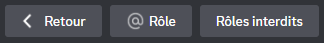

- Grâce au bouton "Rôle", vous pouvez choisir un rôle temporaire qui mettra en avant le membre qui fêtera son anniversaire. Celui-ci conservera temporairement le rôle jusqu'à la fin de la journée.
- Avec le bouton "Rôles autorisés/interdits", vous pouvez activer/désactiver la possibilité qu'un membre récupère le rôle temporaire le jour de son anniversaire grâce à un rôle autorisés/interdit.

## <mark style="color:blue;">Cadeaux</mark>

Vous pouvez accéder aux différents paramètres de cette option en cliquant sur le bouton <mark style="color:blue;">"Cadeaux"</mark> :

Proposez une magnifique surprise à vos membres le jour de leur anniversaire ! Ils seront sûrement ravis par votre générosité !

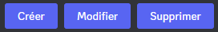

En cliquant sur le bouton "Créer", vous pouvez choisir entre les quatre options ci-dessous pour créer une récompense ou un cadeau à offrir à vos membres qui fêteront leur anniversaire :

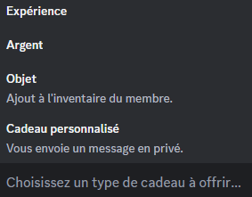

Dans le menu déroulant, vous avez accès à plusieurs options, vous pouvez lire leurs explications ci-dessous :

- La première option du menu déroulant "Expérience", vous pouvez donner de l'<mark style="color:blue;">[expérience](https://docs.draftbot.fr/modules/niveaux)</mark> en cadeau à un membre.
- La deuxième option du menu déroulant "Argent", vous permet de donner de l'<mark style="color:blue;">[argent](https://docs.draftbot.fr/modules/economie)</mark> au membre qui fêtera son anniversaire.
- Grâce à la troisième option "Objet", vous pouvez donner un <mark style="color:blue;">[objet d'inventaire](https://docs.draftbot.fr/modules/economie#objets-dinventaire)</mark> à la personne qui fête son anniversaire.  
- La dernière option "Cadeaux personnalisés", vous permet d'envoyer un message privé à la personne qui fête son anniversaire, cette fonctionnalité est pratique si par exemple, vous souhaitez lui offrir un Nitro ou alors juste lui écrire un petit message.

*Avec les deux boutons restant du menu des <mark style="color:blue;">"Cadeaux"</mark>, vous pouvez modifier et supprimer les paramètres enregistrés avec l'aide du premier bouton :*

- À l'aide du deuxième bouton "Modifier", vous pouvez modifier les options préalablement configurées.
- Troisième et finalement avec le bouton "Supprimer", vous pouvez réinitialiser l'entièreté du système de "Cadeaux".

## <mark style="color:blue;">Annonces personnalisées *(Avantage premium ✨)*</mark>

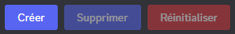

- Premièrement, avec le bouton "Créer", vous pouvez accéder à deux options :

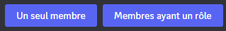

- Avec l'option "Un seul membre", vous pouvez créer une annonce personnalisée lors de l'anniversaire de ce membre uniquement.
- À l'aide de l'option "Membres ayant un rôle", vous pouvez créer une annonce personnalisée lors de l'anniversaire de tous les membres qui posséderont le rôle.

*Avec les deux boutons restant du menu des <mark style="color:blue;">"Annonces personnalisées"</mark>, vous pouvez supprimer et réinitialiser les paramètres enregistrés avec l'aide du premier bouton :*

- Avec le bouton "Supprimer", vous pouvez supprimer une annonce personnalisée que vous aurez créée auparavant.
- Grâce au bouton "Réinitialiser", vous pouvez réinitialiser l'entièreté du système d'<mark style="color:blue;">"Annonces personnalisées"</mark>.





Grâce au <mark style="color:blue;">[panel de Draftbot](https://www.draftbot.fr/dashboard/)</mark> vous pouvez paramétrer plusieurs options du système d'anniversaire.

*Avec les boutons présentés ci-dessous, vous pouvez :*
Comme vous le voyez sous vos yeux, vous avez accès aux fonctionnalités suivantes : <mark style="color:blue;">Message d'annonce</mark>, <mark style="color:blue;">Rôle temporaire</mark>, <mark style="color:blue;">Cadeaux d'anniversaire</mark> et <mark style="color:blue;">Annonces personnalisées</mark> *(Avantage premium ✨)*.

## <mark style="color:blue;">Message d'annonce</mark>



Par défaut, cette option est désactivée. Vous devrez donc l'activer dans la catégorie "Anniversaire".

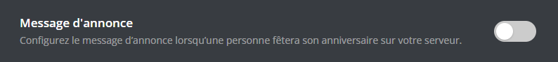


Lorsque l'option est activée, vous avez accès à des options de personnalisation ainsi que d'une prévisualisation. Dans les points ci-dessous, se trouvent des descriptions concernant les options personnalisables.

- Avec la première option "Salon", vous pouvez choisir le salon dans lequel le bot enverra l'annonce d'anniversaire.
- Avec l'aide de la deuxième option "Heure d'envoi", vous pouvez définir l'heure à laquelle le message d'annonce d'anniversaire sera envoyé dans le salon que vous aurez défini au préalable. 
- Grâce à la troisième option "Mention", vous pouvez décider de mentionner un rôle dans le message d'annonce.
- Pour finir, avec le bouton "Rôles autorisés/interdits", vous autorisez/bloquez l'annonce d'un anniversaire à tous les membres qui possède au moins un des rôles autorisés ou interdits.


N'oubliez pas que vous pouvez cliquer sur les boutons interdits/autorisés pour bien définir la fonctionnalité que vous souhaitez utiliser.

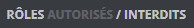

- Grâce à la dernière option "Message", vous pouvez paramétrer le message d'annonce.


Lorsque vous voulez paramètrer le message d'anniversaire, vous pouvez choisir entre prendre le message par défaut et un message personnalisé. Si vous prenez la deuxième option, vous pouvez utiliser les variables ci-dessous et le markdown de Discord.

Variables disponibles

Membre :

- `{​user}` ➜ Mention du membre
- `{​user.id}` ➜ Identifiant du membre
- `{​user.tag}` ➜ Tag du membre (Pseudo#0000)
- `{​user.username}` ➜ Pseudo du membre
- `{​user.nickname}` ➜ Surnom ou pseudo du membre
- `{birthday}` ➜ Date d'anniversaire du membre *(uniquement si le système est activé)*

Serveur :

- `{​server}` ou `{​server.name}` ➜ Nom du serveur
- `{​server.id}` ➜ Identifiant du serveur
- `{​server.membercount}` ➜ Nombre de membres sur le serveur

Salon  :

- `{​channel}` ➜ Mentions du salon
- `{​channel.id}` ➜ Identifiant du salon
- `{​channel.name}` ➜ Nom du salon

Temps :

- `{​date}` ➜ Date actuelle (JJ/MM/AAAA)
- `{​time}` ➜ Heure actuelle (HH:MM)
- `{​timestamp}` ➜ Timestamp actuel en secondes



## <mark style="color:blue;">Rôle temporaire</mark>

Avec l'option <mark style="color:blue;">"Rôle temporaire"</mark>, vous pouvez gérer le fait d'un membre recevra un rôle exclusif uniquement le jour de son anniversaire.

- Grâce à l'option "Rôle temporaire", vous pouvez choisir un rôle temporaire qui mettra en avant le membre qui fêtera son anniversaire. Celui-ci conservera temporairement le rôle jusqu'à la fin de la journée.
- Avec le bouton "Rôles autorisés/interdits", vous pouvez activer/désactiver la possibilité qu'un membre récupère le rôle temporaire le jour de son anniversaire grâce à un rôle autorisé/interdit.

## <mark style="color:blue;">Cadeaux d'anniversaire</mark>

Proposez une magnifique surprise à vos membres le jour de leur anniversaire ! Ils seront sûrement ravis par votre générosité !

En cliquant sur le bouton "Créer", vous pouvez choisir entre les quatre options dans le menu déroulant pour créer une récompense ou un cadeau à offrir à vos membres qui fêteront leur anniversaire :

Dans le menu déroulant, vous avez accès à plusieurs options, vous pouvez lire leurs explications ci-dessous :

- La première option du menu déroulant "Expérience", vous pouvez donner de l'<mark style="color:blue;">[expérience](https://docs.draftbot.fr/modules/niveaux)</mark> en cadeau à un membre.
    
- Avec la deuxième option du menu déroulant "Monnaie", vous permet de donner de l'argent au membre qui fêtera son anniversaire. Vous pouvez vous <mark style="color:blue;">[référer](economie.md)</mark> au système d'économie.
- Grâce à la troisième option "Objet d'inventaire", vous pouvez donner un <mark style="color:blue;">[objet d'inventaire](https://docs.draftbot.fr/modules/economie#objets-dinventaire)</mark> à la personne qui fête son anniversaire.  
- La dernière option "Personnalisés", vous permet d'envoyer un message privé à la personne qui fête son anniversaire, cette fonctionnalité est pratique si par exemple, vous souhaitez lui offrir un Nitro ou alors juste lui écrire un petit message.

## <mark style="color:blue;">Annonces personnalisées *(Avantage premium ✨)*</mark>

- Premièrement, grâce à l'option "Membre ou rôle", vous pouvez paramétrer une annonce selon si un ou des membres ont un rôle. Ou bien, individuellement avec seulement la mention du membre.

- Deuxièmement, vous pouvez avec l'option "Salon textuel" choisir dans quel salon textuel l'annonce sera envoyée.

- Finalement, vous pouvez créer un message avec l'outil de création de message ou bien d'Embed de DraftBot.

