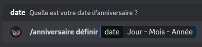
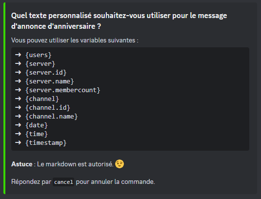

# 🎂 Anniversaires

## Votre Anniversaire

Vous pouvez définir votre anniversaire via [le pannel de Draftbot](https://www.draftbot.fr) ou avec la commande <mark style="color:orange;">/anniversaire définir \[date] </mark>. Il vous suffira de mettre dans l'argument <mark style="color:orange;">\[date]</mark> votre date d'anniversaire. 

Vous pouvez également voir la liste de tous les anniversaires définis sur le serveur grâce à la commande <mark style="color:orange;">/anniversaire liste</mark>.


Attention, pour changer votre date de naissance, il y a un cooldown progressif *(il augmente à chaque changement)*.

- 1er changement : 1 jour
- 2ème : 2 jours
- 3ème : 6 mois
- 4 et plus : 1 an


## Modifier la visibilité de votre anniversaire

Grâce aux commandes <mark style="color:orange;">/anniversaire activer</mark> & <mark style="color:orange;">/anniversaire désactiver</mark> vous pouvez *(par serveur individuel)* activer ou désactiver la visibilité de votre anniversaire.


Vous pouvez désactiver la visibilité de votre anniversaire sur tous les serveurs avec la commande <mark style="color:orange;">/anniversaire retirer</mark>.


## La configuration




Grâce à la commande <mark style="color:orange;">/config \[système:anniversaires]</mark> vous pouvez paramétrer plusieurs options du système d'anniversaire.

Avec les boutons présentés ci-dessous, vous pouvez :

## Annonces

*Vous pouvez accéder à différents paramètres en cliquant sur le bouton "Annonces" :*

- En cliquant sur le premier bouton *(Système activer/désactiver)*, vous pouvez activé ou désactiver le système d'annonce d'anniversaire.
- Avec le deuxième bouton *(Salon)*, vous pouvez choisir le salon dans lequel le bot enverra l'annonce d'anniversaire.
- Grâce au troisième bouton *(Message)*, vous pouvez paramétrer le message d'annonce.


Lorsque vous voulez paramètre le message d'anniversaire, vous pouvez choisir entre prendre le message par défaut et un message personnalisé. Si vous prenez la deuxième option, n'oubliez pas d'utiliser les variables ci-dessous et le markdown de Discord.



- Avec l'aide du quatrième bouton *(Heure d'envoi)*, vous pouvez définir leur à laquelle le message d'annonce d'anniversaire sera envoyer dans le salon que vous aurez défini au préalable. 
- Grâce à ce cinquième bouton *(Mention)*, vous pouvez décider de mentionner un rôle lors dans l'annonce qui sera envoyer lorsque quelle qu'un faitera son anniversaire.
- Pour conclure avec le sixième bouton *(Rôles interdits)*, vous bloquer l'annonce d'un anniversaire à tous les membres qui possède le rôle. 

## Rôle

- Grâce au premier bouton *(Rôle)*, vous pouvez choisir un rôle qui mettera en avant le membre qui faite son anniversaire. Celui-ci conservera le rôle tout la journée de son anniversaire.
- 

## Cadeaux

- 
- 
- 
- 

## Annonces personnalisées

- 
- 
- 





WORK IN PROGRESS ...


