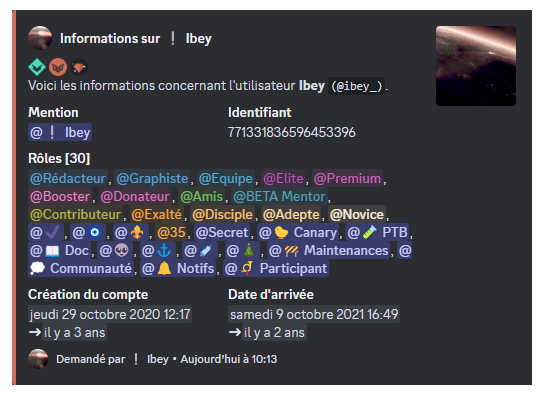
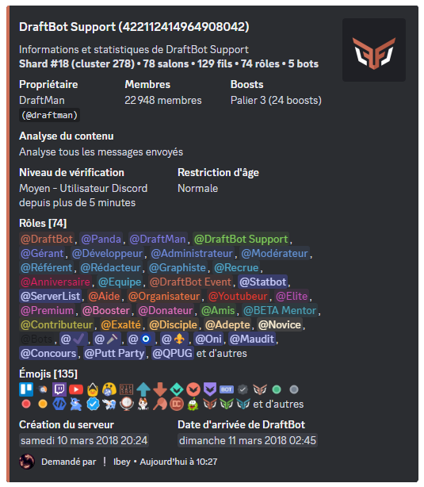
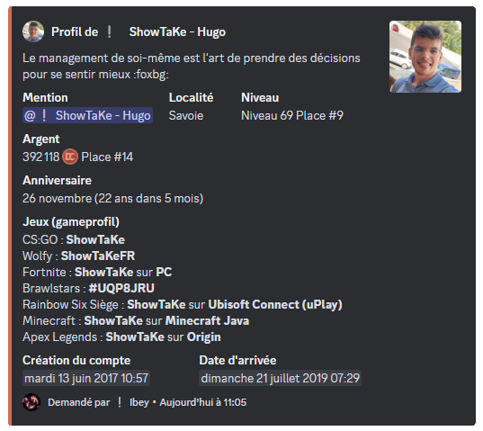

# Commandes d'informations

## /info utilisateur

La commande <mark style="color:orange;">/info utilisateur</mark> vous permet d'obtenir les informations détaillées d'un utilisateur :

- L'identifiant de l'utilisateur.
- Les différents rôles qu'il possède sur le serveur.
- La date d'arrivée sur le serveur.
- La date de création de son compte.
- Les badges de DraftBot : le premium, les membres de l'équipe de DraftBot.
- Les badges de Discord : la HypeSquad, les partenaires, développeur actif, développeur de bot certifié de la première heure, etc.


Si l'utilisateur n'est pas présent sur votre serveur, la date d'arrivée et les rôles ne seront pas affichés.



Il est possible de voir les informations d'un utilisateur autre que le vôtre en utilisant son **pseudonyme** ou son **identifiant** après la commande. Par exemple : <mark style="color:orange;">/info utilisateur [utilisateur]</mark>.


## /info serveur

La commande <mark style="color:orange;">/info serveur</mark> vous permet d'obtenir les informations détaillées de votre serveur Discord :

- Le nom du serveur.
- Le shard et le cluster où il se trouve dans la page "<mark style="color:blue;">[Statuts](https://www.draftbot.fr/statuts)</mark>".
- Le pseudonyme du propriétaire.
- Le nombre de membres, de salons, de fils, de rôles, d'émojis, de bots et de boosts.
- Le niveau de sécurité : la vérification et la restriction d'âge.
- La date de création du serveur.
- La date d'arrivée de DraftBot sur le serveur.

## /info rôle

La commande <mark style="color:orange;">/info rôle</mark> vous permet d'obtenir les informations détaillées sur un rôle bien précis :

- L'identifiant du rôle.
- Le code couleur héxadécimal du rôle.
- S'il est mentionnable ou non.
- Le nombre de membres qui le possède.
- Les permissions qu'il possède.
- Sa position hiéarchique parmi les autres rôles.

## /info salon

La commande <mark style="color:orange;">/info salon</mark> vous permet d'obtenir les informations détaillées sur un salon ou une catégorie bien précis :

- L'identifiant du salon ou de la catégorie.
- Le sujet du salon.
- Le nom du serveur et son identifiant.
- La catégorie où le salon se trouve.
- Le nombre de membres qui ont la permission de voir le salon.
- Les permissions de DraftBot.
- La date de création du salon ou de la catégorie.


Pour distinguer les différents types de salons et catégories, une icône apparaîtra à côté de leur nom : une icône "#" pour les salons textuels, une icône "📁" pour les catégories, une icône "🔊" pour les salons vocaux, une icône "📢" pour les salons d'annonces.


## /profil

La commande <mark style="color:orange;">/profil</mark> vous permet d'obtenir les informations détaillées sur le profil d'un membre du serveur :

- La mention du membre.
- La localité.
- Le niveau et le rang dans le classement du serveur.
- L'argent en sa possession sur le serveur.
- La date de son anniversaire, si elle a été activée et rendue visible.
- Les profils de jeux : son pseudonyme sur les différents jeux et les plateformes.
- La date de création du compte.
- La date d'arrivée sur le serveur.


Vous pouvez ajouter une description sur votre profil avec la commande <mark style="color:orange;">/description</mark>.



Il est possible de voir le profil d'un utilisateur autre que le vôtre en utilisant son **pseudonyme** ou son **identifiant** après la commande. Par exemple : <mark style="color:orange;">/profil [membre]</mark>.
