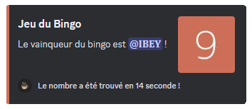
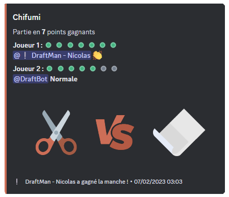
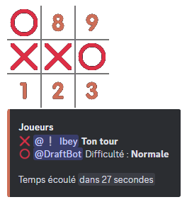
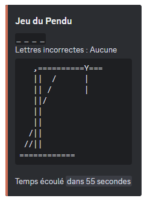
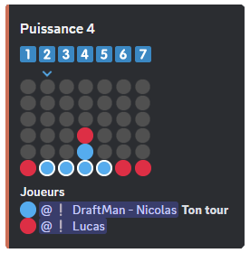
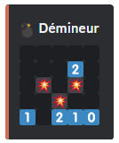

# Commandes de jeux et fun

## /bingo

## /chifumi

## /morpion

La commande <mark style="color:orange;">/morpion</mark> vous permet d'accéder à ce jeu à **deux joueurs**. C'est un jeu de réflexion qui a pour but d'aligner avant son adversaire **3 symboles identiques** horizontalement, verticalement ou en diagonale. Chaque joueur à son propre symbole, une croix pour l'un, un cercle pour l'autre.

Vous pouvez jouer à ce jeu avec la personne de **votre choix**, de façon **aléatoire**, ou avec **DraftBot**.


Vous avez la possibilité de choisir le mode de difficulté : "Facile", "Normale" ou "Difficile". En fonction de votre choix, DraftBot sera plus compliqué à vaincre.


## /pendu

## /puissance4

La commande <mark style="color:orange;">/puissance4</mark> vous permet d'accéder à ce jeu à **deux joueurs**. Il s'agit d'un jeu de stratégie qui a pour but d'aligner **une suite de 4 pions** de même couleur sur une grille comptant 6 rangées et 7 colonnes. A tour de rôle, les deux joueurs placent un pion dans la colonne de leur choix.

Vous pouvez jouer à ce jeu avec la personne de **votre choix**, de façon **aléatoire**, ou avec **DraftBot**.


Vous avez la possibilité de choisir le mode de difficulté : "Facile", "Normale" ou "Difficile". En fonction de votre choix, DraftBot sera plus compliqué à vaincre.


## /demineur

La commande <mark style="color:orange;">/demineur</mark> vous permet d'accéder à ce jeu de réflexion **d'un seul joueur**. Le but est de localiser des mines cachées dans une grille représentant un champ de mines virtuel.

Il donne au joueur des indices basés sur **la numérotation** des mines voisines dans chaque champ.


Vous avez la possibilité de choisir le mode de difficulté : "Facile", "Normale" ou "Difficile". En fonction de votre choix, la grille s'agrandira.


## /colormind

