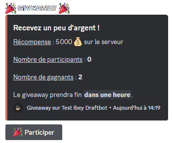
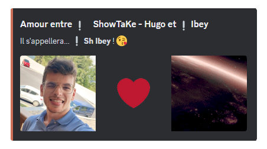
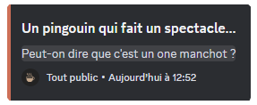
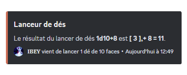
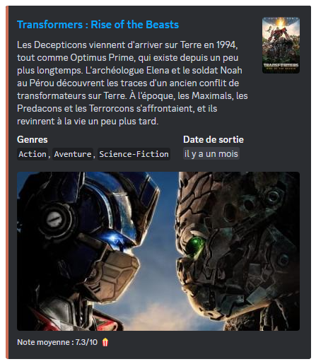

# Commandes de jeux & fun

## /bingo

La commande <mark style="color:orange;">/bingo</mark> vous permet d'accéder à ce jeu de hasard, **tous les membres** peuvent y participer. Il suffit qu'un utilisateur ait accès à la commande pour lancer le jeu et définit le **nombre maximum**. 

DraftBot choisira un nombre aléatoire **entre 1 et le nombre choisi** par l'utilisateur, le but des membres est de retrouver ce **nombre aléatoire**.


Vous avez la possibilité d'activer le système **d'indice**.


## /chifumi

La commande <mark style="color:orange;">/chifumi</mark> vous permet d'accéder à ce jeu à **deux joueurs**. Il s'agit d'une adaptation du classique **Pierre-Feuille-Ciseaux**, c'est un face à face dont les joueurs choisissent entre ces trois coups.

Le déroulement du jeu :
* **La pierre** bat **les ciseaux** (en les émoussant).
* **Les ciseaux** battent **la feuille** (en la coupant).
* **La feuille** bat **la pierre** (en l'enveloppant).

Vous pouvez jouer à ce jeu avec la personne de **votre choix**, de façon **aléatoire**, ou avec **DraftBot**.


Vous avez la possibilité de choisir le mode de difficulté : "Facile", "Normale" ou "Difficile". En fonction de votre choix, DraftBot sera plus compliqué à vaincre.



Vous pouvez également choisir le nombre de tours que vous souhaitez (1 à 7 tours).


## /morpion

La commande <mark style="color:orange;">/morpion</mark> vous permet d'accéder à ce jeu à **deux joueurs**. C'est un jeu de réflexion qui a pour but d'aligner avant son adversaire **3 symboles identiques** horizontalement, verticalement ou en diagonale. Chaque joueur à son propre symbole, une croix pour l'un, un cercle pour l'autre.

Vous pouvez jouer à ce jeu avec la personne de **votre choix**, de façon **aléatoire**, ou avec **DraftBot**.


Vous avez la possibilité de choisir le mode de difficulté : "Facile", "Normale" ou "Difficile". En fonction de votre choix, DraftBot sera plus compliqué à vaincre.


## /pendu

La commande <mark style="color:orange;">/pendu</mark> vous permet d'accéder à ce jeu de réflexion **d'un seul joueur**. Le but est de deviner quelles sont les lettres qui composent le **mot secret**.

En cas d'erreur, **un petit bonhomme** se dessine petit à petit et s'il est complété, cela signifira que vous êtes pendu et que vous avez perdu.


Même si le jeu est pour un seul joueur, d'autres membres peuvent vous aider à trouver le mot secret.


## /puissance4

La commande <mark style="color:orange;">/puissance4</mark> vous permet d'accéder à ce jeu à **deux joueurs**. Il s'agit d'un jeu de stratégie qui a pour but d'aligner **une suite de 4 pions** de la même couleur sur une grille comptant 6 rangées et 7 colonnes. A tour de rôle, les deux joueurs placent un pion dans la colonne de leur choix.

Vous pouvez jouer à ce jeu avec le membre de **votre choix**, de façon **aléatoire**, ou avec **DraftBot**.


Vous avez la possibilité de choisir le mode de difficulté : "Facile", "Normale" ou "Difficile". En fonction de votre choix, DraftBot sera plus compliqué à vaincre.


## /demineur

La commande <mark style="color:orange;">/demineur</mark> vous permet d'accéder à ce jeu de réflexion **d'un seul joueur**. Le but est de localiser des mines cachées dans une grille représentant un champ de mines virtuel.

Il donne au joueur des indices basés sur **la numérotation** des mines voisines dans chaque champ.


Vous avez la possibilité de choisir le mode de difficulté : "Facile", "Normale" ou "Difficile". En fonction de votre choix, la grille s'agrandira.


## /colormind

La commande <mark style="color:orange;">/colormind</mark> vous permet d'accéder à ce jeu de logique pour **un seul joueur**. Il est l'équivalent du jeu **Mastermind**, le but consiste à trouver la bonne combinaison de couleur.


Vous avez la possibilité de choisir le mode de difficulté : "Facile", "Normale" ou "Difficile". En fonction de votre choix, le nombre de couleur à trouver augmentera.



Il se peut qu'il y ait plusieurs fois la même couleur dans une combinaison.


## /sondage

## /concours

Vous avez plusieurs types de concours, aussi dit **"giveaway"**, à proposer avec la commande <mark style="color:orange;">/concours</mark> :

* <mark style="color:orange;">/concours créer argent</mark> ➜ Faire gagner de l'argent dans un giveaway.
* <mark style="color:orange;">/concours créer expérience</mark> ➜ Faire gagner de l'expérience dans un giveaway.
* <mark style="color:orange;">/concours créer item</mark> ➜ Faire gagner un objet dans un giveaway.
* <mark style="color:orange;">/concours créer personnalisé</mark> ➜ Faire gagner une récompense personnalisée dans un giveaway.
* <mark style="color:orange;">/concours créer rôle</mark> ➜ Faire gagner un rôle dans un giveaway.

Pour chacun des cas, vous allez devoir **un nom** à votre giveaway, le nombre de **gagnants**, la **durée** du concours, une **quantité** (pour l'argent, l'expérience, ainsi que l'objet après l'avoir défini), choisir une **récompense personnalisée** ou un **rôle**.

Vous pouvez également effectuer d'autres commandes :

* <mark style="color:orange;">/concours terminer</mark> ➜ Lancer la fin d'un giveaway.
* <mark style="color:orange;">/concours relancer</mark> ➜ Désigner un nouveau gagnant pour un giveaway.


Vous avez la possibilité, si vous le souhaitez, de choisir le salon où le giveaway sera lancé.


## /evenement

Vous avez trois types de commandes avec la commande <mark style="color:orange;">/evenement</mark> :

* <mark style="color:orange;">/evenement créer</mark> ➜ Créer et lancer un évènement.
* <mark style="color:orange;">/evenement relancer</mark> ➜ Relancer un évènement.
* <mark style="color:orange;">/evenement terminer</mark> ➜ Mettre fin à un évènement.

Avec la commande <mark style="color:orange;">/evenement créer</mark>, vous allez avoir besoin de définir **un nom** à votre évènement, le **nombre maximum** de participants, ainsi que **le temps** pour savoir quand commencera l'évènement.

Pour participer, les membres devront cliquer sur **la réaction** qui apparaîtra.


Vous avez la possibilité, si vous le souhaitez, de définir un rôle que vos membres recevront à la fin de l'évènement afin de prouver leur participation et de choisir le salon où l'évènement sera lancé.


## /couple

La commande <mark style="color:orange;">/couple</mark> vous permet tout simplement de **créer un couple** sur votre serveur. DraftBot récupéra les avatars du **"Roméo"** et de la **"Juliette"** choisi, et il donnera par la même occasion un nom au couple défini.

## /blague

La commande <mark style="color:orange;">/blague</mark> vous permet d'accéder à différentes types de **blagues** disponibles sur <mark style="color:blue;">[Blagues API](https://www.blagues-api.fr/)</mark> qui est une API rassemblant les **meilleures blagues françaises**. Les réponses des blagues seront cachées, il vous suffira de cliquer sur la zone cachée pour que les réponses vous soient révélées.

Les différents types de blagues :
* Tout public.
* Humour noir.
* Développeur.
* 18+.
* Beauf.
* Blondes.


Vous avez la possibilité de gérer les types de blagues afin de les autoriser ou non sur votre serveur.


## /lancer-dés

La commande <mark style="color:orange;">/lancer-dés</mark> vous permet d'effectuer un lancer de dés. Indiquez le nombre de dés (X) et le nombre de faces (Y), séparés par la lettre « d » (Ex : XdY ➜ 1d10). 

* Vous pouvez ajouter un modificateur (Z) (`+`, `-` ou `x`) (Ex : 1d10 **+5**).
* Vous pouvez compléter avec des options : `-H` pour garder que le plus haut ou `-L` pour le plus bas (Ex : 3d10+5 **-L**).

## /tv

La commande <mark style="color:orange;">/tv</mark> vous permet d'accéder à des informations sur **un film ou une série** disponible sur le site <mark style="color:blue;">[The Movie Database](https://www.themoviedb.org/)</mark> (TMDB) grâce à **une API**. Ainsi il vous suffira de définir le nom du film ou de la série que vous recherchez à la suite de la commande.

Vous recevrez les informations suivantes :
* Le titre du film ou de la série.
* Le synopsis.
* Le(s) genre(s).
* La date de sortie.
* La note moyenne donnée par les utilisateurs.

