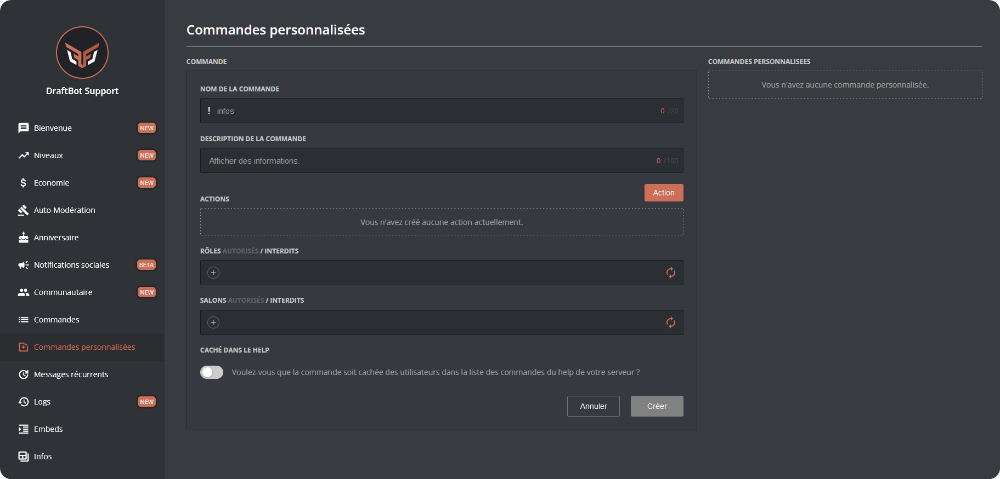

# 🪄 Commandes personnalisées

## Configuration

<!-- Depuis Discord -->


Vous pouvez créer une commande personnalisée avec la commande <mark style="color:orange;">/config</mark>, en vous rendant ensuite dans l'onglet "Commandes personnalisées" du sélecteur.\
DraftBot vous demandera alors les informations suivantes :

* Nom de la commande
* Description de la commande
* Restreindre ou interdire la commande à certains rôles
* Restreindre ou interdire la commande à certains salons
* Le / les types d'actions que vous souhaitez ajouter à la commande personnalisée :
  * Envoyer un message
  * Ajouter ou retirer un ou des rôle(s)
  * Ajouter un rôle temporaire
  * Faire un achat dans la boutique
* Si vous souhaitez ou non que la commande soit affichée dans le <mark style="color:orange;">/aide</mark>.


Lorsque vous exécutez une commande personnalisée, votre texte de déclenchement de commande reste dans le salon. Si vous souhaitez que **DraftBot** supprime votre commande, vous pouvez activer l'option correspondante dans <mark style="color:orange;">/config</mark>, en vous rendant dans l'onglet "Commandes personnalisées" du sélecteur, puis en activant le bouton "Activer la suppression des commandes".




[<mark style="color:blue;">Accéder au panel de</mark> <mark style="color:blue;"></mark><mark style="color:blue;">**DraftBot**</mark>](https://draftbot.fr/dashboard)

Pour créer une commande personnalisée, rendez-vous dans la catégorie "Commandes personnalisées" du panel.\
Remplissez ensuite les divers champs (nom, description, actions...) puis cliquez sur le bouton "Créer" en bas à droite de votre commande personnalisée.


Besoin de modifier ou de supprimer une commande ?\
Pas de problème ! Cliquez sur "Modifier" ou "Supprimer" sur le côté droit. 




## Arguments

Les commandes personnalisées vous offrent la possibilité d'ajouter des arguments dans vos messages.

Voici les différentes variables d'arguments possibles avec **DraftBot** :

> `$1` ➜ Première valeur saisie après la commande.\
> `$2` ➜ Deuxième valeur saisie après la commande.\
> `$1+` ➜ Tout ce qui est saisi après la commande.\
> `$2+` ➜ Tout ce qui est saisi après la commande sauf la première valeur.


**Exemple de commande personnalisée avec des arguments :**

* Message configuré : `$1 est maintenant $2+`
* Commande de l'utilisateur : `!adjectif @Jules fort et beau`
* Réponse de DraftBot : @Jules _est maintenant_ fort et beau


## Variables

Les commandes personnalisées vous offrent également la possibilité d'ajouter des variables dans vos messages.

Ouvrez le menu déroulant pour voir les différentes variables :

Variables disponibles

> **Membre** :
> `{​user}` ➜ Mention du membre\
> `{​user.id}` ➜ Identifiant du membre\
> `{​user.tag}` ➜ Tag du membre *(Pseudo#0000)*\
> `{​user.username}` ➜ Pseudo du membre\
> `{​user.nickname}` ➜ Surnom ou pseudo du membre\
>
> `{​level}` ➜ Niveau du membre *(uniquement si le système de niveaux est activé)*\
> `{​level.rank}` ➜ Place du membre *(uniquement pour les messages dans le système de niveaux)*
>
> `{​money}` ➜ Argent du membre *(uniquement si le système d'économie est activé)*\
> `{​money.rank}` ➜ Place du membre *(uniquement si le système d'économie est activé)*
>
> `{birthday}` ➜ Date d'anniversaire du membre *(uniquement si le système est activé)*
>
> **Serveur** :
> `{​server}` ou `{​server.name}` ➜ Nom du serveur\
> `{​server.id}` ➜ Identifiant du serveur\
> `{​server.membercount}` ➜ Nombre de membres sur le serveur
>
> **Salon**  :
> `{​channel}` ➜ Mentions du salon\
> `{​channel.id}` ➜ Identifiant du salon\
> `{​channel.name}` ➜ Nom du salon
>
> **Temps** :
> `{​date}` ➜ Date actuelle (JJ/MM/AAAA)\
> `{​time}` ➜ Heure actuelle (HH:MM)\
> `{​timestamp}` ➜ Timestamp actuel en secondes

