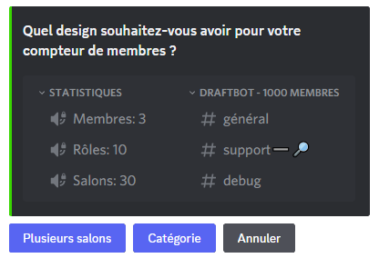

# Configuration

Lors de la configuration de la fonctionnalité en vous rendant dans la commande <mark style="color:orange;">/config</mark> ➜ **"🧮 Compteur de membres"**, vous aurez le choix entre deux design :

- **En plusieurs salons** : Sous la forme de salons vocaux qui pourra indiquer le nombre de membres, salons, rôles, etc.
- **En catégorie** : Sous la forme d'une catégorie où sera affiché uniquement le nombre de membres.


Un délai de **10 minutes** est imposé entre chaque actualisation. 



Faites bien attention à ne pas toucher au compteur de membres, sinon vous serez obligé de refaire une nouvelle configuration. Tous les caractères avant les " : " pour les compteurs vocaux et avant le " - " pour la catégorie peuvent être modifiés.


# Salons vocaux

Une fois le design choisi, pour le cas présent, ce sera le design avec **les salons vocaux**. Vous devrez soit sélectionner une catégorie existante, soit faire une nouvelle catégorie pour que **les différents salons des statistiques** puissent être créés.

Diverses questions s'offriront à vous afin que **DratfBot** puisse finaliser la création de ces salons :

- L'affichage du nombre de **Membres présents** sur votre serveur (Utilisateurs + Bots).
- L'affichage du nombre **d'utilisateurs présents** sur votre serveur (Humains).
- L'affichage du nombre de **Bots présents** sur votre serveur (Bots).
- L'affichage du nombre de **Rôles créés** sur votre serveur (Rôles totaux).
- L'affichage du nombre de **Salons créés** sur votre serveur (Salons totaux).
- L'affichage du nombre de membres ayant un **rôle spécifique**.


Une fois que vous aurez répondu à l'ensemble de ces questions, votre compteur de membres en forme de salons vocaux sera prêt !


# Catégorie

Pour configurer le compteur de membres sous la forme d'une catégorie, il vous suffit de faire la commande <mark style="color:orange;">/config</mark> ➜ **"🧮 Compteur de membres"** et de cliquer sur le bouton **"Catégorie"**.

Une question vous sera posée dans le but de savoir si vous souhaitez comptabiliser les bots parmi le nombre de membres.


Il ne vous manquera plus que de changer le nom de la catégorie **"xxxxxx"** comme vous le souhaitez, en plus d'ajouter de nouveaux salons, sans dérégler le compteur de membres dans la catégorie.
