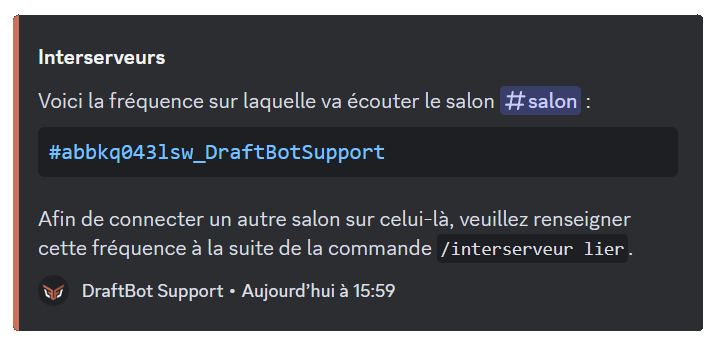

# Interserveur

La fonctionnalité d'interserveurs permet à deux salons distincts de communiquer grâce à la simulation créée par DraftBot qui, prenant l'apparence de l'utilisateur, transmets les messages dans les salons connectés au vôtre.

### Les commandes
**Trois commandes sont à disposition pour gérer vos liaisons de salon.**

> <mark style="color:orange;">`/interserveur générer`</mark> Générer une fréquence pour un interserveur.\
<mark style="color:orange;">`/interserveur lier`</mark> Lier ce salon à une fréquence d'interserveur.\
<mark style="color:orange;">`/interserveur gérer`</mark> Gérer la liaison interserveur du salon.

## Configurer l'interserveur
- Pour lier deux salons, il faut tout d'abord créer une fréquence, cette fréquence est unique à votre salon.
- Pour créer une fréquence, utilisez la commande <mark style="color:orange;">`/interserveur générer`</mark>.

## Relier deux salons
Une fois la fréquence créée, utilisez la commande <mark style="color:orange;">`/interserveur lier`</mark> dans le salon du serveur que vous souhaitez relier au premier salon.


Si vous perdez vos fréquences, pour les retrouvées, faites la commande <mark style="color:orange;">`/interserveur gérer`</mark> dans le salon où le module est activé.



**Félicitations !** Vos deux salons on bien étés configurés.
