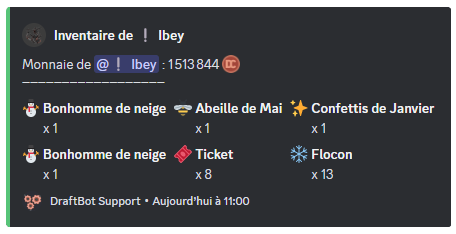
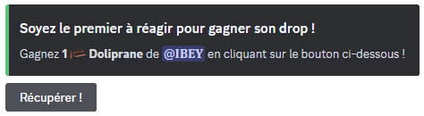

# Inventaire

## Obtenir un objet

Vous avez différentes possibilités d'obtenir un objet :

- **Récompenses de niveaux** : Configurable depuis la commande <mark style="color:orange;">/config</mark> ➜ "[Niveaux](https://docs.draftbot.fr/modules/niveaux)" ou via le panel web.
- **Achat dans la boutique** : Configurable depuis la commande <mark style="color:orange;">/config</mark> ➜ "[Économie](https://docs.draftbot.fr/modules/economie)" ou via le panel web.
- **Échange entre membres** : Avec la commande <mark style="color:orange;">/objet</mark>.
- **Les commandes /dropitem et /objet drop** : Elles génèrent un message où vous devez être le plus rapide pour récupérer l'objet.

## Gérer l'inventaire d'un membre

Avec l'aide de la commande <mark style="color:orange;">/admininventaire</mark>, vous avez la capacité en tant qu'**administrateur** de gérer l'inventaire d'un membre de votre serveur Discord.

Plusieurs options s'offrent à vous :

> <mark style="color:orange;">/admininventaire donner</mark> ➜ Ajouter un objet à l'inventaire d'un membre.\
<mark style="color:orange;">/admininventaire retirer</mark> ➜ Retirer un objet à l'inventaire d'un membre.\
<mark style="color:orange;">/admininventaire reset</mark> ➜ Vider en totalité l'inventaire d'un membre.\
<mark style="color:orange;">/admininventaire reset serveur</mark> ➜ Réinitialiser l'inventaire de tous les membres du serveur.

## Afficher son inventaire

Les membres du serveur peuvent accéder à tout moment à **leur propre inventaire** en utilisant la commande <mark style="color:orange;">/inventaire</mark>. Si le membre possède des objets, ils seront donc affichés, de même qu'il aura la possibilité de voir l'argent en sa possession grâce au système d'[économie](https://docs.draftbot.fr/modules/economie) de DraftBot.


Vous pouvez voir l'inventaire d'un autre membre en le **mentionnant** ou en utilisant son **pseudonyme** après la commande. Par exemple : <mark style="color:orange;">/inventaire [membre]</mark>.


## Échanger un objet

Il y a quelques méthodes pour échanger un objet auprès d'un autre membre grâce à la commande <mark style="color:orange;">/objet</mark> et en **sélectionnant** le membre avec qui vous souhaitez effectuer l'échange :

> <mark style="color:orange;">/objet donner</mark> ➜ Donner un objet à un membre.\
<mark style="color:orange;">/objet vendre</mark> ➜ Vendre un objet à un membre.\
<mark style="color:orange;">/objet échanger</mark> ➜ Échanger un objet à un membre.

## Les commande /dropitem et /objet drop

Les commandes <mark style="color:orange;">/objet drop</mark> et <mark style="color:orange;">/objet drop</mark> ont pour but de générer un message et d'offrir l'objet à la première personne qui clique sur le bouton **"Récupérer !"**. Toutefois, qu'elle est la différence entre les deux ?

> <mark style="color:orange;">/dropitem</mark> ➜ Commande exécutée par un administrateur pour lancer le drop.\
<mark style="color:orange;">/objet drop</mark> ➜ Offre un objet qui provient de l'inventaire d'un membre.


Vous avez également la possibilité de choisir dans les deux cas, le salon où le drop sera lancé.

