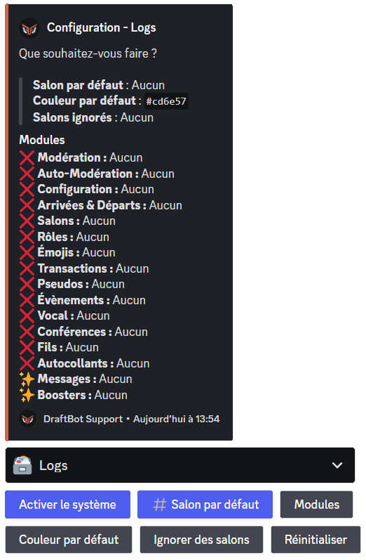
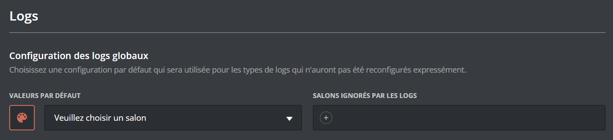

# 🗃 Logs

## Les logs, c'est quoi ?

Les logs sont un historique des actions faites sur votre serveur. Ils vous permettent de pouvoir retrouver une action qui vous intrigue ou bien de voir qui a fait quelle action.

Les logs sont des embeds qui sont envoyés non pas par **DraftBot** mais par des webhooks. Un webhook vous permet d'envoyer un message avec une photo de profil, un nom et un contenu personnalisé.
> ***DraftBot** gère ses propres webhooks et l'envoi des messages avec ses derniers. Si vous supprimez son webhook de logs, il le recréera automatiquement lors de l'envoi du prochain log.*

## Configuration générale



Vous pouvez configurer les logs avec la commande /config, en vous rendant ensuite dans l'onglet "🗃 Logs" du sélecteur.

**DraftBot** vous affichera alors la configuration actuelle :
* *Salon par défaut* ➜ Salon dans lequel les logs seront envoyés si le salon n'a pas été paramétré individuellement pour chaque log.
* *Couleur par défaut* ➜ Couleur des logs si la couleur n'a pas été paramétrée individuellement pour chaque log.
* *Salons ignorés* ➜ Salons qui sont ignorés par les logs : vous n'aurez aucun log des actions qui sont faites dedans.

La catégorie "*Modules*" résume la configuration de chaque log.\
Ici sera affiché, pour chaque modules :
* Log activé (✅) ou non (❌).
* Salon d'envoi.
* Couleur.


✨ Les logs de messages et de boosts sont réservés aux <mark style="color:blue;">[premiums](https://draftbot.fr/premium)</mark>.


Sous ce message se trouvent des boutons, servant à la configuration des logs :
* ***Activer le système*** / ***Système activé*** ➜ Pour activer ou désactiver le système de logs.
* ***Salon par défaut*** ➜ Salon dans lequel les logs seront envoyés si le salon n'a pas été paramétré individuellement pour chaque log.
* ***Modules*** ➜ Pour configurer individuellement chaque log.
* ***Couleur par défaut*** ➜ Pour configurer la couleur des logs si la couleur n'a pas été paramétrée individuellement pour chaque log.
* ***Ignorer des salons*** ➜ Pour configurer les salons qui seront ignorés par les logs : vous n'aurez aucun log des actions qui sont faites dedans.
* ***Réinitialiser*** ➜ Pour réinitialiser toute la configuration des logs.


Le bouton "Réinitialiser" est irréversible : impossible d'annuler l'action et de recréer les récompenses du serveur.



Les boutons bleus signifient que leur configuration doit être faite entièrement afin que le système soit opérationnel, lors de la première configuration.





<mark style="color:blue;">[Accéder au panel de **DraftBot**](https://draftbot.fr/dashboard)</mark>

Pour configurer les logs de **DraftBot**, rendez-vous dans la catégorie "Logs" du panel.

En haut de la page, vous aurez alors la configuration par défaut des logs.\
Vous pouvez configurer la couleur par défaut avec la palette de peinture, le salon par défaut avec le menu déroulant et les salons ignorés par les logs en appuyant sur "+".




 ## Configuration par module