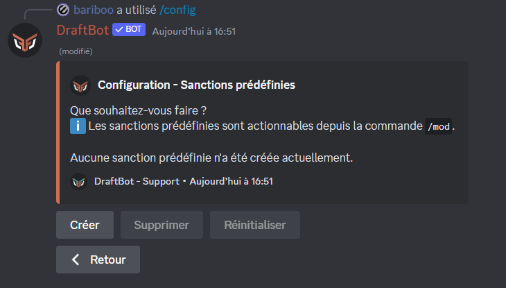
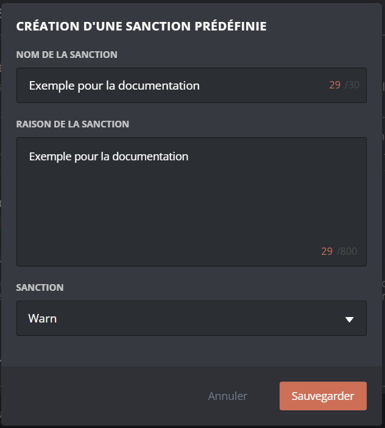

# Modération

**DraftBot** propose différents systèmes de modération automatique tel que l'auto-modération ou encore les auto-sanctions. Vous pouvez aussi effectuer des actions de modérations manuelles. Par exemple expulser un membre, l'avertir et bien plus encore ! Sans oublier le système de sanctions prédéfinies. 


Avant de commencer, voyons une petite différence subtile mais essentielle à la compréhensions des différents systèmes :

- Une Sanction est une action humaine. (Par exemple bannir un utilisateur)
- Une Infraction est une action faite par le bot. (Par exemple une auto-sanction)


# Sanctions 



Vous pouvez ajouter une note à un membre dans son historique de sanctions avec <mark style="color:orange;">/note \[utilisateur] \[note]</mark>.\
Cela permet d'ajouter un commentaire à un membre, visible par les modérateurs, sans avertir le membre en message privé.

Vous pourrez retirer une note à un membre avec la commande <mark style="color:orange;">/sanctions retirer</mark>.


**DraftBot** peut donner une note à un membre uniquement si vous disposez de la permission "_Gérer les messages_" ou que l'un de vos rôles peut utiliser la commande <mark style="color:orange;">/note</mark> sur votre serveur.






Vous pouvez avertir un membre avec la commande <mark style="color:orange;">/avertir \[membre] \[raison]</mark>.\
Le membre recevra un message privé avec le motif de son avertissement.


Le membre recevra son avertissement par message privé uniquement s'il accepte les messages privés venant du serveur.


Vous pourrez retirer un avertissement à un membre avec la commande <mark style="color:orange;">/sanctions retirer</mark>.


**DraftBot** peut donner un avertissement à un membre uniquement si vous disposez de la permission "_Gérer les messages_" ou que l'un de vos rôles peut utiliser la commande <mark style="color:orange;">/avertir</mark> sur votre serveur.







Vous pouvez réduire au silence un membre avec la commande <mark style="color:orange;">/mute \[membre] \[temps] \[raison]</mark>.\
La durée d'un mute ne peut pas dépasser **28 jours**.

Vous pourrez, si vous le souhaitez, acquitter un membre de sa réduction au silence avec la commande <mark style="color:orange;">/demute \[membre]</mark>.


**DraftBot** peut donner un mute à un membre uniquement si vous disposez de la permission "_Exclure temporairement des membres_" ou que l'un de vos rôles peut utiliser la commande <mark style="color:orange;">/mute</mark> sur votre serveur.

**DraftBot** doit avoir son rôle au-dessus des autres rôles pour rendre muet un membre.






Le fait d'expulser un membre fera quitter le membre du serveur, mais il pourra toujours revenir avec une autre invitation. Si vous souhaitez qu'il ne puisse pas revenir, consultez le <mark style="color:orange;">[bannissement](moderation.md#bannissement)</mark>.

Vous pouvez expulser un membre de votre serveur avec la commande <mark style="color:orange;">/expulser \[membre] \[raison]</mark>.


**DraftBot** peut expulser un membre uniquement si vous disposez de la permission "_Expulser des membres_" ou que l'un de vos rôles peut utiliser la commande <mark style="color:orange;">/expulser</mark> sur votre serveur.

**DraftBot** doit avoir son rôle au-dessus des autres rôles pour expulser un membre.






Le fait de bannir un membre fera quitter le membre du serveur et il ne pourra jamais y revenir. Vous pouvez également bannir temporairement le membre en question. Si vous souhaitez qu'il puisse revenir sur votre serveur, consultez l'<mark style="color:orange;">[expulsion](moderation.md#expulsion)</mark>.

Vous pouvez bannir un membre avec la commande <mark style="color:orange;">/ban \[utilisateur] \[raison]</mark>. Deux options facultatives supplémentaires s'offrent à vous :

* <mark style="color:orange;">\[temps]</mark> pour définir un temps de bannissement
* <mark style="color:orange;">\[messages\_supprimés]</mark> pour savoir depuis combien de temps les messages du membre doivent être supprimés (maximum 7 jours).

Si vous souhaitez révoquer le bannissement d'un membre, vous pouvez le débannir avec la commande <mark style="color:orange;">/deban \[utilisateur]</mark> ou depuis l'onglet "_Bannissement_" de votre serveur Discord.


**DraftBot** peut bannir un membre uniquement si vous disposez de la permission "_Bannir des membres_" ou que l'un de vos rôles peut utiliser la commande <mark style="color:orange;">/ban</mark> sur votre serveur.

**DraftBot** doit avoir son rôle au-dessus des autres rôles pour bannir un membre.





### Historique de sanctions
Vous pouvez voir toutes les sanctions de votre serveur avec <mark style="color:orange;">/sanctions lister</mark>.\
Dans la même optique, vous pouvez retrouver la liste de toutes les sanctions d'un membre avec <mark style="color:orange;">/sanctions lister \[utilisateur]</mark>.

### Gestion des sanctions

Vous pouvez enlever une sanction à un membre de votre serveur avec la commande <mark style="color:orange;">/sanctions retirer \[membre]</mark>.

Il est également possible d'enlever toutes les sanctions à un membre d'un coup via <mark style="color:orange;">/adminreinitialiser sanctions membre \[membre]</mark>.\
De même, si vous souhaitez enlever toutes les sanctions de tous les membres de votre serveur, vous pouvez utiliser <mark style="color:orange;">/adminreinitialiser sanctions serveur</mark>.


Les commandes <mark style="color:orange;">/adminreinitialiser sanctions membre</mark> et <mark style="color:orange;">serveur</mark> sont irréversibles : impossible de redonner les sanctions aux membres du serveur si la commande a été faite et validée.


## Sanctions prédéfinies

Une sanction prédéfinie est une sanction préconfigurée servant à centraliser différents actes de modération en une seule commande : <mark style="color:orange;">/mod</mark>. Vous pourrez y décider de la sanction à appliquer ainsi que de la raison de celle-ci. Cela facilietera et réglementera les sanctions applicables par vos modérateurs.


Toutefois, vos modérateurs doivent posséder des permissions nécessaires pour effectuer la sanction souhaitée via <mark style="color:orange;">/mod</mark>.


### Configuration



Rendez-vous d'abord dans la catégorie "🔨 Modération" de la commande <mark style="color:orange;">/config</mark> puis appuyez sur "<mark style="color:blue;">Sanctions prédéfinies</mark>".

#### Création d'une sanction prédéfinie

Pour créer une sanction prédéfinie, cliquez sur "Créer". Vous pourrez ensuite choisir la sanction à appliquer ainsi que la raison indiquée lors de l'utilisation de cette dernière. Vous aurez également la possibilité de définir un nom lors de la sélection de la sanction prédéfinie dans la commande <mark style="color:orange;">/mod</mark>.

#### Gestion d'une sanction prédéfinie existante

Pour supprimer une sanction prédéfinie, cliquez sur "Supprimer", **DraftBot** vous demandera par la suite de sélectionner la sanction à retirer.

Vous auvez également la possibilitée de retirer toutes les sanctions prédéfinies en cliquant sur "réinitialiser".


Notez que ces actions sont irréversibles, une fois effectuées, il vous sera impossible de revenir en arrière.





<mark style="color:blue;">[Accéder au panel de **DraftBot**](https://draftbot.fr/dashboard)</mark>

Rendez vous ensuite dans la rubrique modération puis cliquer sur <mark style="color:orange;">"Créer une sanction prédéfinie"</mark>. Vous pourrez ensuite choisir la sanction à appliquer ainsi que la raison indiquée lors de l'utilisation de cette dernière. Vous aurez également la possibilité de définir un nom lors de la sélection de la sanction prédéfinie dans la commande <mark style="color:orange;">/mod</mark>. Vous n'avez ensuite qu'à sauvegarder votre sanction et le tour est joué !

> ⚠️ Une fois fini, n'oubliez pas d'enregistrer vos modifications avec le bouton "Sauvegarder" en bas de la page.



## Auto-modération

Envie d'automatiser certains actes de modération tel que la censure des invitations discord ou du vocabulaire interdit ? Alors découvrez l'auto-modération de **DraftBot** !

### Configuration 






Rendez-vous d'abord dans la catégorie "🔨 Modération" de la commande <mark style="color:orange;">/config</mark> puis appuyez sur "<mark style="color:blue;">Auto-Modération</mark>". Enfin, appuyez sur "Vocabulaire".




<mark style="color:blue;">[Accéder au panel de **DraftBot**](https://draftbot.fr/dashboard)</mark>









Rendez-vous d'abord dans la catégorie "🔨 Modération" de la commande <mark style="color:orange;">/config</mark> puis appuyez sur "<mark style="color:blue;">Auto-Modération</mark>". Enfin, appuyez sur "Vocabulaire".



<mark style="color:blue;">[Accéder au panel de **DraftBot**](https://draftbot.fr/dashboard)</mark>









Here is first tab content.



<mark style="color:blue;">[Accéder au panel de **DraftBot**](https://draftbot.fr/dashboard)</mark>









Here is first tab content.



<mark style="color:blue;">[Accéder au panel de **DraftBot**](https://draftbot.fr/dashboard)</mark>









Here is first tab content.



<mark style="color:blue;">[Accéder au panel de **DraftBot**](https://draftbot.fr/dashboard)</mark>





