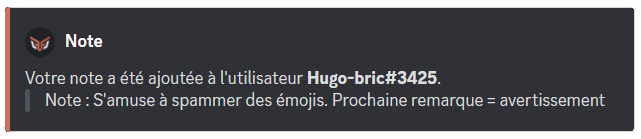
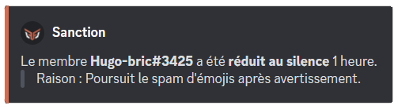
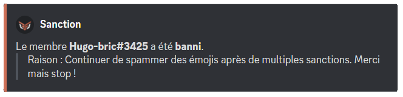

# Modération

## Note

Vous pouvez ajouter une note à un membre dans son historique de sanctions avec <mark style="color:orange;">/note \[utilisateur] \[note]</mark>.\
Cela permet d'ajouter un commentaire à un membre, visible par les modérateurs, sans avertir le membre en message privé.

Vous pourrez retirer une note à un membre avec la commande <mark style="color:orange;">/sanctions retirer</mark>.


**DraftBot** peut donner une note à un membre uniquement si vous disposez de la permission "_Gérer les messages_" ou que l'un de vos rôles peut utiliser la commande <mark style="color:orange;">/note</mark> sur votre serveur.


## Avertissement

Vous pouvez avertir un membre avec la commande <mark style="color:orange;">/avertir \[membre] \[raison]</mark>.\
Le membre recevra un message privé avec le motif de son avertissement.


Le membre recevra son avertissement par message privé uniquement s'il accepte les messages privés venant du serveur.


Vous pourrez retirer un avertissement à un membre avec la commande <mark style="color:orange;">/sanctions retirer</mark>.


**DraftBot** peut donner un avertissement à un membre uniquement si vous disposez de la permission "_Gérer les messages_" ou que l'un de vos rôles peut utiliser la commande <mark style="color:orange;">/avertir</mark> sur votre serveur.



## Mute

Vous pouvez réduire au silence un membre avec la commande <mark style="color:orange;">/mute \[membre] \[temps] \[raison]</mark>.\
La durée d'un mute ne peut pas dépasser **28 jours**.

Vous pourrez, si vous le souhaitez, acquitter un membre de sa réduction au silence avec la commande <mark style="color:orange;">/demute \[membre]</mark>.


**DraftBot** peut donner un mute à un membre uniquement si vous disposez de la permission "_Exclure temporairement des membres_" ou que l'un de vos rôles peut utiliser la commande <mark style="color:orange;">/mute</mark> sur votre serveur.

**DraftBot** doit avoir son rôle au-dessus des autres rôles pour rendre muet un membre.


## Expulsion

Le fait d'expulser un membre fera quitter le membre du serveur, mais il pourra toujours revenir avec une autre invitation. Si vous souhaitez qu'il ne puisse pas revenir, consultez le <mark style="color:orange;">[bannissement](moderation.md#bannissement)</mark>.

Vous pouvez expulser un membre de votre serveur avec la commande <mark style="color:orange;">/expulser \[membre] \[raison]</mark>.


**DraftBot** peut expulser un membre uniquement si vous disposez de la permission "_Expulser des membres_" ou que l'un de vos rôles peut utiliser la commande <mark style="color:orange;">/expulser</mark> sur votre serveur.

**DraftBot** doit avoir son rôle au-dessus des autres rôles pour expulser un membre.


## Bannissement

Le fait de bannir un membre fera quitter le membre du serveur et il ne pourra jamais y revenir. Vous pouvez également bannir temporairement le membre en question. Si vous souhaitez qu'il puisse revenir sur votre serveur, consultez l'<mark style="color:orange;">[expulsion](moderation.md#expulsion)</mark>.

Vous pouvez bannir un membre avec la commande <mark style="color:orange;">/ban \[utilisateur] \[raison]</mark>. Deux options facultatives supplémentaires s'offrent à vous :

* <mark style="color:orange;">\[temps]</mark> pour définir un temps de bannissement
* <mark style="color:orange;">\[messages\_supprimés]</mark> pour savoir depuis combien de temps les messages du membre doivent être supprimés (maximum 7 jours).

Si vous souhaitez révoquer le bannissement d'un membre, vous pouvez le débannir avec la commande <mark style="color:orange;">/deban \[utilisateur]</mark> ou depuis l'onglet "_Bannissement_" de votre serveur Discord.


**DraftBot** peut bannir un membre uniquement si vous disposez de la permission "_Bannir des membres_" ou que l'un de vos rôles peut utiliser la commande <mark style="color:orange;">/ban</mark> sur votre serveur.

**DraftBot** doit avoir son rôle au-dessus des autres rôles pour bannir un membre.


## Historique de sanctions
Vous pouvez voir toutes les sanctions de votre serveur avec <mark style="color:orange;">/sanctions lister</mark>.\
Dans la même optique, vous pouvez retrouver la liste de toutes les sanctions d'un membre avec <mark style="color:orange;">/sanctions lister \[utilisateur]</mark>.

Vous pouvez enlever une sanction à un membre de votre serveur avec la commande <mark style="color:orange;">/sanctions retirer \[membre]</mark>.

Il est également possible d'enlever toutes les sanctions à un membre d'un coup via <mark style="color:orange;">/adminreinitialiser sanctions membre \[membre]</mark>.\
De même, si vous souhaitez enlever toutes les sanctions de tous les membres de votre serveur, vous pouvez utiliser <mark style="color:orange;">/adminreinitialiser sanctions serveur</mark>.


Les commandes <mark style="color:orange;">/adminreinitialiser sanctions membre</mark> et <mark style="color:orange;">serveur</mark> sont irréversibles : impossible de redonner les sanctions aux membres du serveur si la commande a été faite et validée.


**Vous pouvez retrouver la configuration de l'auto-sanction de DraftBot sur cette page :**

[moderation.md](configuration/moderation.md)

