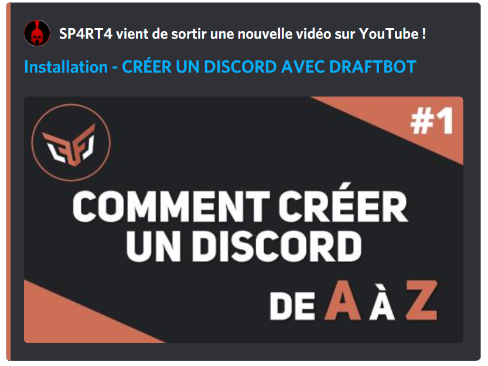
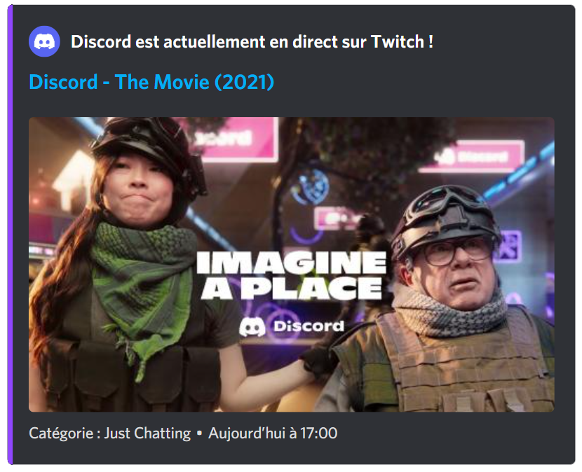
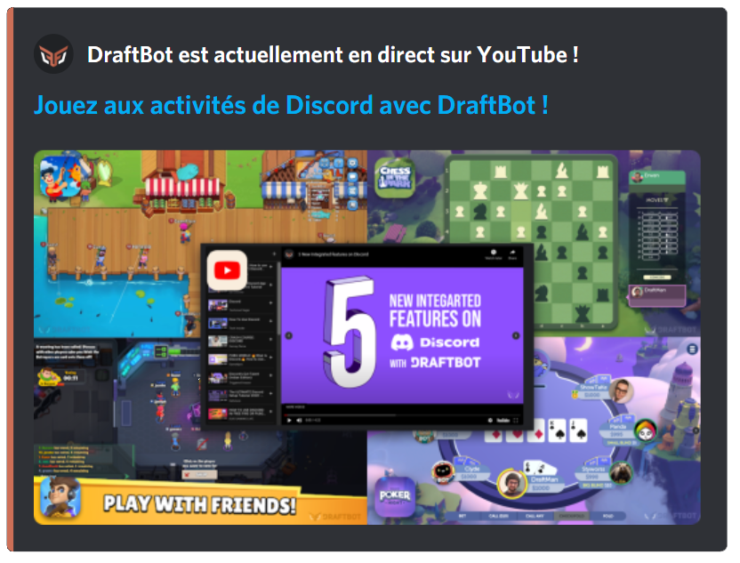
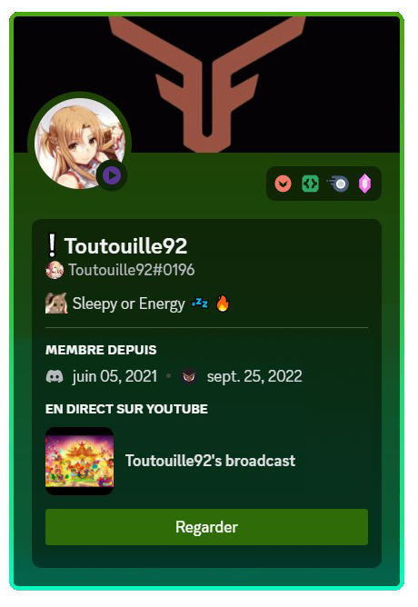
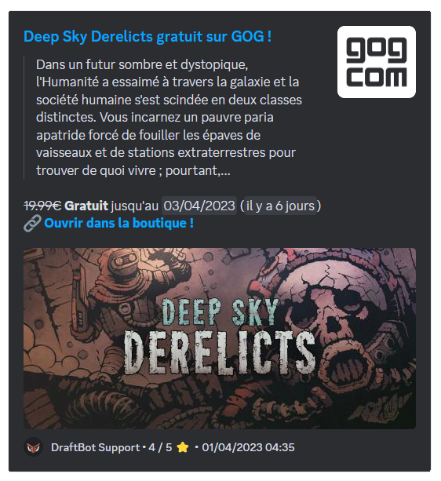
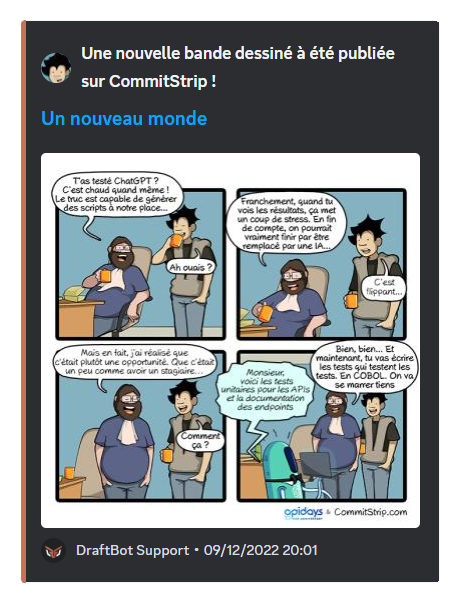
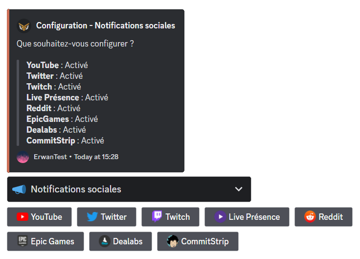
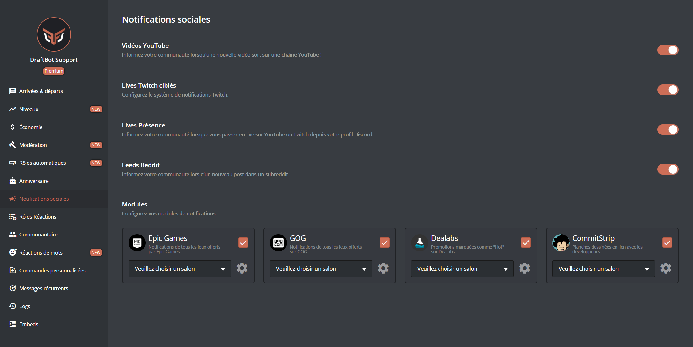

# Notifications sociales

## Explication des Notification Sociales

> Vous trouverez dans cette partie la liste des Notifications Sociales ainsi que leur utilité.

### YouTube

Ce module permet **d'afficher** un message lors de la **publication d'une vidéo <mark style="color:orange;">[YouTube](https://www.youtube.com/)</mark>.**

L'annonce est entièrement **customisable**. Cela permet donc aux administrateurs de configurer **un rôle notifié**, activer **la publication sur les autres serveurs**, la **couleur** de l'embed d'annonce (reservé aux <mark style="color:orange;"> [serveurs premiums](https://www.draftbot.fr/premium)</mark>), ainsi que d'autres éléments visuels.

Il peut y avoir **une seule chaîne <mark style="color:orange;">[YouTube](https://www.youtube.com/)</mark> différente** pour les serveurs **non-premiums** contrairement aux serveurs premiums qui peuvent avoir jusqu'à 5 chaînes YouTube différentes actuellement.

### Twitch


Les annonces <mark style="color:orange;">[Twitch](https://www.twitch.tv/)</mark> sont limitées aux serveurs <mark style="color:orange;">[✨ premiums](https://www.draftbot.fr/premium)</mark>.
Si vous n'avez pas le premium, il existe une alternative appelée le <mark style="color:orange;">[Live Presence](https://docs.draftbot.fr/modules/notifications-sociales#live-presence)</mark>.


**Les notifications sociales Twitch** permettent d'envoyer un message **customisable** lors du **lancement d'un live**. Il peut y avoir au maximum **5 notifications sociales Twitch différentes** par serveur.


Afin d'éviter un spam d'embed, un délai de 30 minutes a été mis en place entre deux annonces de la même personne.


### Live Presence

Le module **Live Presence** consiste à envoyer une notification lorsqu'un membre a un statut "**Streame** ..." (symbolisé par la bulle violette et le triangle).

En fonction de la configuration du module sur ce serveur, **n'importe quel membre** peut avoir sa notification lorsqu'il est en stream.

**Le nombre de notifications de Live Presence est illimité**, cela dit l'administrateur de votre serveur peut restreindre l'envoi de la notification à certains rôles.


L'envoi d'une notification Live Presence nécessite d'avoir **son compte Twitch ou YouTube lié à Discord**. Plus d'information ci-dessous.


#### Comment lier son compte Twitch ou YouTube à Discord

Voici <mark style="color:orange;">[ce tutoriel réalisé par Discord](https://support.discord.com/hc/fr/articles/8063233404823-Connexions-et-r%C3%B4les-li%C3%A9s-pour-les-membres-de-la-communaut%C3%A9)</mark> qui explique globalement comment ajouter des connexions ainsi que l'obtention des rôles liés sur un serveur.

Suite à cette manipulation, vous devrez normalement avoir cet aperçu sur votre profil lorsque vous serez en live :

### Reddit

Ce module permet d'afficher une notification lors d'une publication dans un **subreddit**. Comme pour les autres modules de notifications sociales, le message envoyé est entièrement customisable : il pourra donc être envoyé sous forme de **message classique ou sous forme d'embed.**

Il peut y avoir **une seule notification <mark style="color:orange;">[Reddit](https://www.reddit.com/)</mark> maximum** pour les serveurs **non-premiums**, contrairement aux serveurs premiums qui pourront avoir jusqu'à 10 notifications sociales Reddit.

Voici un exemple de message de notification :

### Epic Games

Ce module permet d'envoyer une annonce lorsqu'un jeu gratuit est disponible sur l'<mark style="color:orange;">[Epic Games Store](https://www.epicgames.com/site/fr/home)</mark>.


Le rôle mentionné, la couleur de l'annonce ainsi que le salon d'envoi peuvent être configurés par l'administrateur.


### Steam

Ce module permet d'envoyer une annonce lorsqu'un jeu gratuit est disponible sur Steam.


Le rôle mentionné, la couleur de l'annonce ainsi que le salon d'envoi peuvent être configurés par l'administrateur 


### GOG

Ce module permet d'envoyer une annonce lorsqu'un jeu gratuit est disponible sur GOG.


Le rôle mentionné, la couleur de l'annonce ainsi que le salon d'envoi peuvent être configurés par l'administrateur 


### CommitStrip

Ce module permet d'afficher des bandes dessinées en lien avec le métier de développeur.


Le rôle mentionné, la couleur de l'annonce ainsi que le salon d'envoi peuvent être configurés par l'administrateur.


### Dealabs

Ce module permet d'envoyer une notification lorsqu'une réduction devient "hot" (brûlante). Il s'agit du stade où la promotion est jugée intéressante par les utilisateurs du site.
Il faut aussi noter que l'administrateur peut configurer le module Dealabs uniquement pour certaines catégories (exemples : High-Tech, Mode, etc...).

## Configuration

Vous pouvez activer séparément tous les types de notifications sociales.




Pour ajouter une annonce lors d'un évènement (publication de vidéo, post, notification de stream, etc...), il vous suffit d'effectuer la commande <mark style="color:orange;">/config système:Notifications Sociales</mark>. Vous aurez alors accès à l'onglet ci-dessous.

Il vous suffira de sélectionner la plateforme de votre choix et il n'y aura plus qu'à configurer à partir de la sélection guidée.





Dans cette page, vous pouvez activer et désactiver à votre guise les Notifications Sociales. Il existe deux types de Notifications Sociales :
* Les onglets, qui peuvent être configurés pour plusieurs chaines/forums.
* Les modules, qui vous permettent d'activer des notifications qui nécessitent peu de configuration.


Certaines fonctionnalités telles que **la couleur de l'annonce** sont uniquement paramétrables avec le `/config`.





## Informations Complémentaires

Vous retrouverez le nombre maximum d'annonces par plateformes sur <mark style="color:orange;">[le comparatif de DraftBot Premium](https://www.draftbot.fr/premium#diff)</mark> dans la partie <mark style="color:orange;">Notifications sociales</mark>.