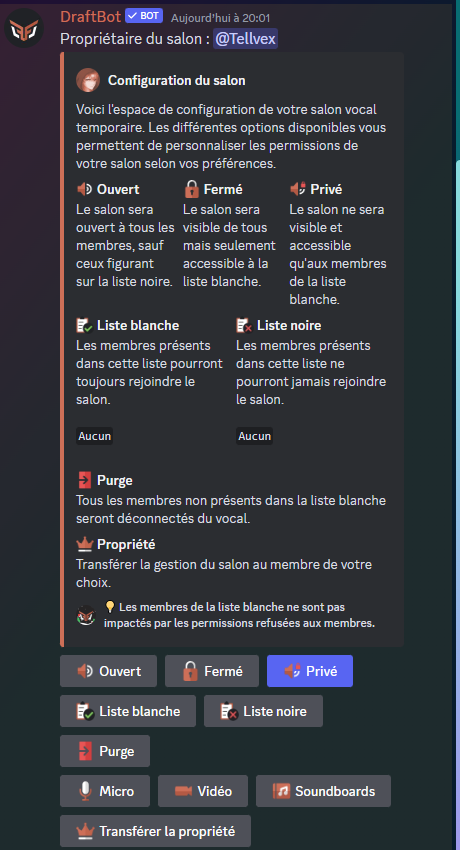

# Salons vocaux temporaires

## Utilisation des salons vocaux temporaires

Pour obtenir son salon vocal, il faut rejoindre le salon vocal "hub". Il s'agit du salon vocal permanent qui permet la création de votre salon vocal temporaire. Il se nomme par défaut `➕ Créer votre salon`.

Lorsque vous créez un salon vocal temporaire, vous avez la possibilité de configurer votre salon (selon la configuration des salons faite par l'administrateur).

Quand toutes les personnes auront quitté le salon vocal temporaire, ce dernier sera automatiquement supprimé par **DraftBot**.


Les **permissions par défaut** du salon vocal temporaire correspondent à celles de la **catégorie**.


## Configuration




### Créer un hub de salons vocaux temporaires

Pour activer les salons vocaux temporaires, il vous suffit d'aller dans le menu <mark style="color:orange;">Salons vocaux temporaires</mark> de la commande <mark style="color:orange;">/config</mark> et de cliquer sur le bouton <mark style="color:orange;">Créer un hub</mark>.

**DraftBot** vous demandera ensuite **la catégorie** ou seront stockés les salons vocaux.


Les salons vocaux déjà existants dans cette catégorie seront supprimés par le bot si vous ne les rendez pas permanents.


### Supprimer un hub de salons vocaux temporaires

Pour supprimer un hub de salons vocaux temporaires, il vous suffit d'aller dans le menu <mark style="color:orange;">Salons vocaux temporaires</mark> de la commande <mark style="color:orange;">/config</mark> et de cliquer sur le bouton <mark style="color:orange;">Supprimer un hub</mark>.



Cette action est irréversible une fois le message de confirmation validé :
> Message en question : "Êtes-vous sûr de vouloir supprimer la seule catégorie de salons vocaux temporaires du serveur ?"



### Modifier un hub de salons vocaux temporaires

Pour modifier un hub de salons vocaux temporaires, vous devez accéder au menu en allant dans le système <mark style="color:orange;">Salons vocaux temporaires</mark> de la commande <mark style="color:orange;">/config</mark>. Vous devez ensuite <mark style="color:orange;">Modifier un hub</mark>.

#### Activer/Désactiver un Hub

Pour activer ou désactiver des Salons Vocaux Temporaires, vous devez cliquer sur le bouton <mark style="color:orange;">Activer le système</mark>. Vous verrez alors le menu se mettre à jour.


Lorsqu'un hub est déjà activé, le bouton se nomme <mark style="color:orange;">Système activé</mark>.


#### Changer la catégorie des Salons Vocaux Temporaires

Pour changer la catégorie des salons vocaux temporaires, il vous suffit de cliquer sur le bouton <mark style="color:orange;">Catégorie</mark>. DraftBot demandera s'il faut créer une nouvelle catégorie ou attribuer une catégorie **déjà existante**.

#### Changer le salon hub

Pour changer le salon vocal qui vous redirigera dans votre salon temporaire, il suffit d'appuyer sur le bouton <mark style="color:orange;">Hub (salon)</mark>. Un message vous demandera alors <mark style="color:orange;">[l'identifiant du salon](https://docs.draftbot.fr/autres/recuperer-un-identifiant)</mark>.

#### Changer le nom par défaut des salons temporaires


Cette fonctionnalité est réservée aux <mark style="color:orange;">[serveurs premiums](https://www.draftbot.fr/premium)</mark>.


Vous pouvez changer le nom par défaut des salons en appuyant sur le bouton <mark style="color:orange;">Nom des salons</mark> et en écrivant simplement le nom que vous voulez. Il est recommandé <mark style="color:orange;">d'utiliser une [variable](https://docs.draftbot.fr/modules/privateroom#liste-des-variables)</mark> afin de pouvoir distinguer 2 salons différents.

#### Permissions par défaut des salons temporaires

Vous pouvez changer les permissions par défaut des salons temporaires en appuyant sur le bouton <mark style="color:orange;">Permissions par défaut</mark>. Vous pourrez alors choisir entre les permissions du <mark style="color:orange;">salon vocal hub</mark> ou les <mark style="color:orange;">permissions de la catégorie</mark>.

#### Définir les permissions du créateur du salon vocal

Vous pouvez définir les permissions du créateur du salon vocal temporaire en appuyant sur le bouton <mark style="color:orange;">Permissions du créateur</mark>. Un sélecteur apparaîtra avec 4 options :
- Créer une invitation : le créateur pourra créer des invitations qui amèneront dans son salon.
- Modifier le salon : le créateur du salon peut changer les paramètres du salon tels que <mark style="color:orange;">le nom, la limite de membre, etc.</mark>
- Changer les permissions : le créateur peut changer les permissions de son salon vocal, ce qui implique qu'il peut créer des dérogation de rôle, de membre, etc.
- Voix prioriaire : le son de tous les participants sera diminué lorsque le créateur du salon parle. ⚠ - Cette fonction ne fonctionne que lorsque le créateur est en mode "Appuyer pour parler".

#### Définir la limite de membre

Vous pouvez définir la limite de membres autorisés à rejoindre un salon vocal en appuyant sur le bouton <mark style="color:orange;">Limite de membre</mark>. Vous devrez ensuite indiquer une valeur entre 0 et 99 qui correspond au nombre de participants maximum. Veuillez noter que la valeur "0" désactive la limite.

Par défaut la limite de membres est définie à <mark style="color:orange;">99 participants</mark>.


Veuillez également noter que la limite de membre peut être changée à tout moment par <mark style="color:orange;">le créateur du salon</mark> s'il possède la permission <mark style="color:orange;">Modifier le salon</mark>


#### Ajouter/Supprimer un salon permanent


Par défaut, lorsque vos membres rejoignent un salon vocal dans la catégorie des salons vocaux temporaires et qu'ils le quittent ensuite, le salon se supprime. 


Pour qu'un salon soit conservé dans la catégorie sans être supprimé une fois qu'il n'a plus de membres, il faut appuyer sur le bouton <mark style="color:orange;">Salons permanents</mark>. Un menu s'ouvrira alors et vous pourrez ajouter ou supprimer les salons vocaux permanents de votre choix.




## Utilisation du configurateur de salon

Depuis la version [5.4.0](.././autres/changelog.md), lorsque vous créez un vocal un embed apparaît dans le <mark style="color:orange;">salon textuel du vocal</mark>. Il contient toutes les permission de modération lié au salon vocal.


Cet embed permet notamment d'utiliser toutes les permission de modération, et ce même si le membre n'a pas activé l'A2F (puisque l'utilisateur par le bot et non pas par son compte).
> Veuillez donc penser à désactiver cette option si votre serveur a des permissions strictes.



Voici donc une liste détaillée de chaque fonction du configurateur :

- Ouvert : Cette fonction permet d'ouvrir le salon à tous les membres, exepté ceux de la <mark style="color:orange;">liste noire</mark>.
- Fermé : Cette fonction vérouille le salon à tous les membres exceptés ceux inscrits dans la <mark style="color:orange;">liste blanche</mark>.
- Liste Blanche : Cette fonction permet d'ajouter des membres qui seront <mark style="color:orange;">autorisé à rejoindre</mark> le salon en permanence.


Cette fonction permet notamment de contourner les paramètres de verouillage du salon vocal, donc faites attention à qui vous ajouterez.


- Liste Noire : Cette fonction permet d'ajouter des membres qui ne pourront <mark style="color:orange;">jamais rejoindre</mark> le salon vocal.


Tout comme la fonction précédente, la liste noire contourne les paramètres de verouillage du salon vocal, donc faites attention à qui vous ajouterez dans cette liste.


- Purge : La purge permet de déconnecter tous les membres qui ne sont pas dans la liste blanche. Cette règle ne s'applique pas à _l'auteur_ (@IIbey si t'as un autre mot je suis preneur) du salon.

- Micro : Cette fonction permet d' activer/désactiver le micro de tous les participants du salon vocal.

- Vidéo : Tout comme la fonction précédente, elle permet d' activer/désactiver l'activation de la caméra ainsi que le partage d'écran de tous les participants du salon vocal.

- Sounboard : cette fonction permet d'activer/désactiver l'utilisation des soundboards pour tous les participants du salon vocal.


Les fonctions <mark style="color:orange;">micro, vidéo et soundboard</mark> s'appliquent à tous les membres hormis ceux ayant une dérogation spéciale ainsi qu'au propriétaire du salon.


- Transférer la propriété : Cette fonction permet de transférer les droits de gestion du salon vocal à quelqu'un d'autre.


Un transfert de propriété dans un salon vocal est permanent.
Veuillez noter également que vous perdrez l'accès au configurateur de <mark style="color:orange;">[salon vocal](https://docs.draftbot.fr/modules/privateroom#utilisation-du-configurateur-de-salon)</mark>


## Informations supplémentaires

### Liste des variables

Vous pouvez utiliser les variables suivantes pour nommer un salon vocal lors de sa création :
* `{user}` pour afficher le pseudonyme du membre sur le serveur.
* `{user.username}` pour afficher le nom Discord du membre.
* `{user.tag}` pour afficher le pseudonyme avec le tag du membre (Pseudo#0000).
* `{index}` pour numéroter le salon.
* `{random-word}` pour attribuer un mot aléatoire parmi une liste de mots de **DraftBot**.
* `{custom-word}` pour attribuer un mot aléatoire parmi une liste personnalisable.

### Limite d'hubs de salons vocaux temporaires

Par défaut, **DraftBot** limite les serveurs à **un seul hub**. Cela dit, si l'offre <mark style="color:orange;">[premium](https://www.draftbot.fr/premium)</mark> est activée sur votre serveur, vous pourrez créer jusqu'à **5 hubs**.

### Panel

Lien vers le panel : <mark style="color:orange;">[https://www.draftbot.fr/dashboard/user](https://www.draftbot.fr/dashboard/user)</mark>