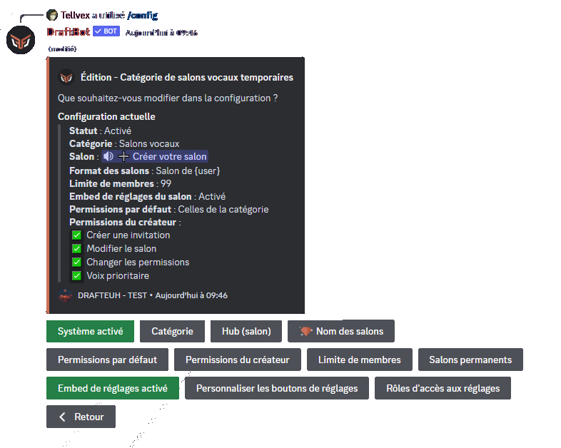

# Salons Vocaux Temporaires

## Utilisation des Salons Vocaux Temporaires

Pour obtenir son salon vocal, il faut rejoindre le salon vocal "hub". Il s'agit du salon vocal permanent qui permet la création de votre salon vocal temporaire. Il se nomme par défaut `➕ Créer votre salon`.

Lorsque vous créez un salon vocal temporaire, vous aurez la permission **Gérer le salon**, qui lui permet de modifier la limite d'utilisateur, les permissions du salon ainsi que le nom du salon.

Quand toutes les personnes auront quitté le salon crée par ce système, il sera supprimé automatiquement par **DraftBot**.


Les **permissions par défaut** du Salon vocal temporaire correspondent à celles de la **catégorie**.


## Configuration




### Ajouter les Salons Vocaux Temporaires

Pour activer les privaterooms, il vous suffit d'aller dans le menu <mark style="color:orange;">Salons Vocaux Temporaires</mark> du <mark style="color:orange;">/config</mark> et de cliquer sur le bouton <mark style="color:orange;">Créer un Hub</mark>.

**DraftBot** vous demandera ensuite **la catégorie** ou seront stockés les salons vocaux.


Les salons vocaux déjà existants dans cette catégorie seront supprimés par le bot si vous ne les rendez pas permanents.


### Supprimer les Salons Vocaux Temporaires

Pour activer les privaterooms, il vous suffit d'aller dans le menu <mark style="color:orange;">Salons Vocaux Temporaires</mark> du <mark style="color:orange;">/config</mark> et de cliquer sur le bouton <mark style="color:orange;">Supprimer un hub</mark>.



Cette action est irréversible, cela dit un message de confirmation sera envoyé.
> Message en question : "Êtes-vous sûr de vouloir supprimer la seule catégorie de salons vocaux temporaires du serveur ?"



### Modifier les Salons Vocaux Temporaires

#### Ajouter/Supprimer un salon permanent

Par défaut, lorsque vos membres rejoignent un salon vocal dans la catégorie privateroom et qu'ils le quittent ensuite, le salon se supprime. 

Pour qu'un salon soit conservé dans la catégorie sans être supprimé une fois qu'il n'a plus de membres, vous pouvez aller dans le système <mark style="color:orange;">Salons Vocaux Temporaires</mark> du <mark style="color:orange;">/config</mark>. Vous devez ensuite <mark style="color:orange;">Modifier un Hub</mark> et appuyer sur le bouton <mark style="color:orange;">Salons Permanents</mark>.

Un menu s'ouvrira alors et vous pourrez ajouter ou supprimer les salons vocaux permanents de votre choix.




## Informations Supplémentaires

### Liste des Variables

Vous pouvez utiliser les variables suivantes pour nommer un salon vocal lors de sa création :
* `{user}` pour afficher le pseudonyme du membre sur le serveur.
* `{user.username}` pour afficher le nom Discord du membre.
* `{user.tag}` pour afficher le pseudonyme avec le tag du membre (Pseudo#0000).
* `{index}` pour numéroter le salon.
* `{random-word}` pour attribuer un mot aléatoire parmi une liste de mots de DraftBot.
* `{custom-word}` pour attribuer un mot aléatoire parmi une liste personnalisable.

### Limite d'hubs de Salons Vocaux Temporaires

Par défaut, DraftBot limite les serveurs à **un seul hub**. Cela dit, si l'offre <mark style="color:orange;">[premium](https://www.draftbot.fr/premium)</mark> est activée sur votre serveur, vous pourrez créer jusqu'à **5 hubs**.

### Panel

Lien vers le panel : <mark style="color:orange;">[https://www.draftbot.fr/dashboard/user](https://www.draftbot.fr/dashboard/user)</mark>