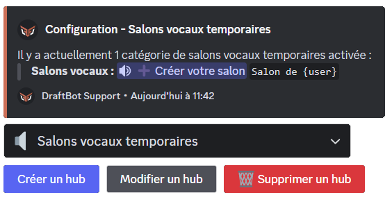
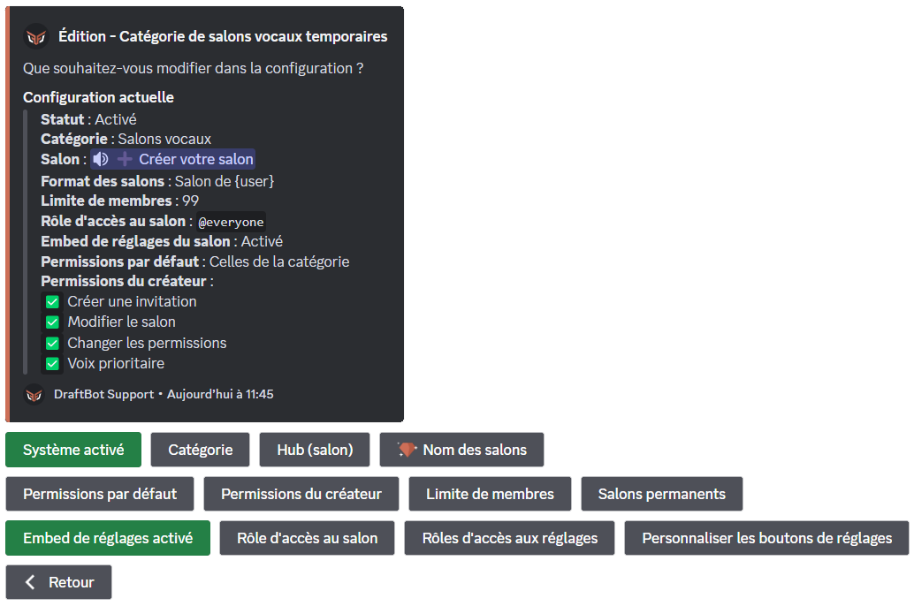
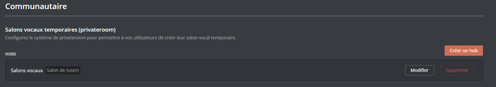
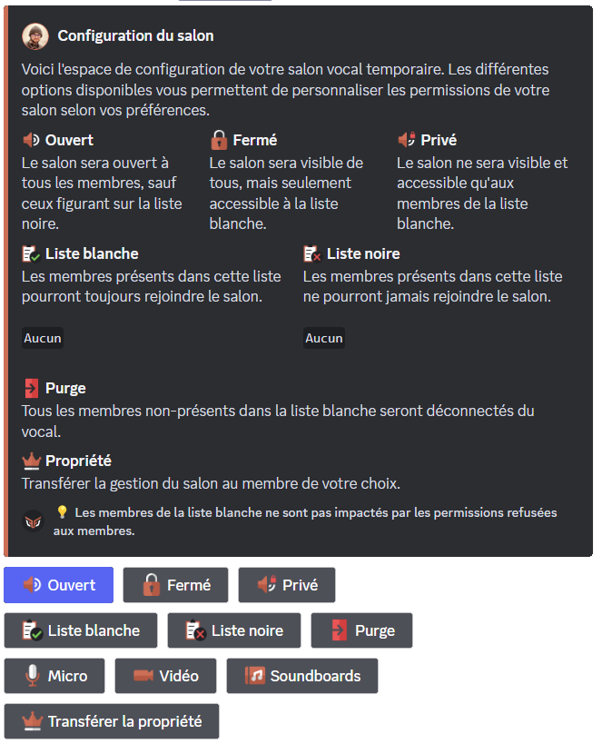

# Salons vocaux temporaires

## Utilisation des salons vocaux temporaires

Pour obtenir son salon vocal, il vous faudra rejoindre le salon vocal "hub". Il s'agit du salon vocal permanent qui permet la création de votre salon vocal temporaire. Il se nomme par défaut `➕ Créer votre salon`.

Lorsque vous créerez un salon vocal temporaire, vous aurez la possibilité de configurer votre salon par le biais d'un message (option désactivable).

Lorsque le dernier membre présent dans le salon se déconnectera, ce dernier sera automatiquement supprimé par **DraftBot**.

## Configuration




### Créer un hub de salons vocaux temporaires

Pour activer les salons vocaux temporaires, il vous suffira d'aller dans le menu <mark style="color:orange;">Salons vocaux temporaires</mark> de la commande <mark style="color:orange;">/config</mark> et de cliquer sur le bouton <mark style="color:orange;">Créer un hub</mark>.

**DraftBot** vous demandera ensuite de choisir **la catégorie** où seront créés les salons vocaux.


Les salons vocaux déjà existants dans cette catégorie seront supprimés par DraftBot si vous ne les rendez pas permanents.


### Supprimer un hub de salons vocaux temporaires

Pour supprimer un hub de salons vocaux temporaires, il vous suffira d'aller dans le menu <mark style="color:orange;">Salons vocaux temporaires</mark> de la commande <mark style="color:orange;">/config</mark> et de cliquer sur le bouton <mark style="color:orange;">Supprimer un hub</mark>.



Cette action sera irréversible une fois le message de confirmation validé :
> Message en question : "Êtes-vous sûr de vouloir supprimer la seule catégorie de salons vocaux temporaires du serveur ?"



### Modifier un hub de salons vocaux temporaires

Pour modifier un hub de salons vocaux temporaires, vous devrez accéder au menu en allant dans le système <mark style="color:orange;">Salons vocaux temporaires</mark> de la commande <mark style="color:orange;">/config</mark>. Vous devrez ensuite <mark style="color:orange;">Modifier un hub</mark>.

#### Activer/Désactiver un Hub

Pour activer ou désactiver la création de salons temporaires, vous devrez cliquer sur le bouton <mark style="color:orange;">Activer le système</mark>. Vous verrez alors le menu se mettre à jour.


Lorsqu'un hub est déjà activé, le bouton se nomme <mark style="color:orange;">Système activé</mark>.


#### Changer la catégorie des Salons Vocaux Temporaires

Pour changer la catégorie des salons vocaux temporaires, il vous suffira de cliquer sur le bouton <mark style="color:orange;">Catégorie</mark>. Vous devrez ensuite choisir de créer une nouvelle catégorie ou en sélectionner une existante.

#### Changer le salon hub

Pour changer le salon vocal de redirection vers les salons temporaires, il suffira d'appuyer sur le bouton <mark style="color:orange;">Hub (salon)</mark>. Vous devrez ensuite indiquer <mark style="color:orange;">[l'identifiant du salon](https://docs.draftbot.fr/autres/recuperer-un-identifiant)</mark> de votre choix.

#### Changer le nom par défaut des salons temporaires


Cette fonctionnalité est réservée aux <mark style="color:orange;">[✨ serveurs premiums](https://www.draftbot.fr/premium)</mark>.


Vous pourrez changer le nom par défaut des salons en appuyant sur le bouton <mark style="color:orange;">Nom des salons</mark> et en écrivant simplement le nom que vous voulez. Il est recommandé <mark style="color:orange;">d'utiliser une [variable](https://docs.draftbot.fr/modules/privateroom#liste-des-variables)</mark> afin de pouvoir distinguer 2 salons différents.

#### Permissions par défaut des salons temporaires

Vous pourrez choisir à partir de quelles permissions DraftBot devra se baser pour les dérogations par défaut des salons temporaires en appuyant sur le bouton <mark style="color:orange;">Permissions par défaut</mark> ce qui vous permettra de choisir entre les permissions du <mark style="color:orange;">salon vocal hub</mark> ou les <mark style="color:orange;">permissions de la catégorie</mark>.

#### Définir les permissions du créateur du salon vocal

Vous pourrez également définir les permissions du créateur du salon vocal en appuyant sur le bouton <mark style="color:orange;">Permissions du créateur</mark>. Un sélecteur apparaîtra avec les 4 options suivantes :
- **Créer une invitation** : Permet au créateur de créer des invitations pour le salon vocal.
- **Modifier le salon** : Donne la permission de modifier les paramètres du salon tels que <mark style="color:orange;">le nom, la limite de membres, etc.</mark>
- **Changer les permissions** : Permet de changer l'ensemble des paramètres du salon. Le créateur pourra créer des dérogations et attribuer ou refuser des permissions aux membres et rôles de son choix.
- **Voix prioritaire** : Le son de tous les participants sera diminué lorsque le créateur du salon parlera. ⚠ - Cette option ne fonctionne qu'en cas d'utilisation du mode "Appuyer pour parler".


Certaines permissions plus classiques peuvent être contrôlées depuis l'embed de gestion du salon vocal. Veillez à désactiver les options que vous ne souhaitez pas laisser modifiables dans les permissions du salon **et** l'embed de configuration.


#### Définir la limite de membre

Vous pouvez définir la limite de membres autorisés à rejoindre un salon vocal en appuyant sur le bouton <mark style="color:orange;">Limite de membre</mark>. Vous devrez ensuite indiquer une valeur entre 0 et 99 qui correspond au nombre de participants maximum. Indiquer "0" comme limite revient à la désactiver.

Par défaut, la limite de membres est définie à <mark style="color:orange;">99 participants</mark>.


Veuillez également noter que la limite de membre peut être changée à tout moment par <mark style="color:orange;">le créateur du salon</mark> s'il possède la permission <mark style="color:orange;">Modifier le salon</mark>.


#### Ajouter/Supprimer un salon permanent


Par défaut, lorsque le dernier membre quitte un salon vocal présent dans la catégorie des salons vocaux temporaires, il est instantanément supprimé.


Pour qu'un salon soit conservé dans la catégorie même après déconnexion du dernier membre, il vous faudra appuyer sur le bouton <mark style="color:orange;">Salons permanents</mark>. Un menu s'ouvrira alors et vous permettra d'ajouter ou supprimer des salons vocaux qui seront marqués comme permanents.

#### Activer/Désactiver l'embed de réglages

Pour activer ou désactiver l'embed de réglages, il vous suffira d'appuyer sur le bouton <mark style="color:orange;">Embed de réglages activé</mark>.
- Embed de réglages activé ➜ Activer l'embed de réglages
- Activer l'embed de réglages ➜ Embed de réglages activé

#### Personnaliser les boutons de réglages

Pour personnaliser les boutons de réglages, vous devrez d'abord appuyer sur le bouton <mark style="color:orange;">Personnaliser les boutons de réglages</mark> qui vous amènera sur un sélecteur. Cochez toutes les options que vous souhaitez rendre disponibles dans l'embed de configuration du salon..


Si vous avez déjà configuré cette option et souhaitez y apporter des modifications, assurez-vous de sélectionner l'ensemble des options de votre choix y compris celles qui étaient déjà activées auparavant.


#### Configurer les rôles d'accès aux réglages

Pour ajouter/supprimer des rôles qui auront accès à l'embed de configuration, il faudra appuyer sur le bouton <mark style="color:orange;">Rôles d'accès aux réglages</mark>. qui vous amènera sur un message composé des 4 boutons suivants, pouvant varier selon le type de liste de rôle choisi.

Restriction de rôles

- **Ajouter des rôles interdits** : Permet d'ajouter des rôles à la liste des rôles interdits d'utilisation de l'embed de configuration.
- **Supprimer des rôles interdits** : Permet de supprimer des rôles de la liste des rôles interdits d'utilisation de l'embed de configuration.
- **Réinitialiser les rôles interdits** : Permet de réinitialiser la liste des rôles interdits d'utilisation de l'embed de configuration.
- **Restreindre à des rôles** : Ce bouton change le type de filtrage, permettant de marquer les rôles ajoutés à la liste comme rôles autorisés à l'utilisation l'embed de configuration du salon.

Autorisation de rôles

- Ajouter des rôles autorisés : Permet d'ajouter des rôles à la liste des rôles autorisés à l'utilisation de l'embed de configuration.
- Supprimer des rôles autorisés : Permet de supprimer des rôles de la liste des rôles autorisés à l'utilisation de l'embed de configuration.
- Réinitialiser les rôles autorisés : Permet de réinitialiser la liste des rôles autorisés à l'utilisation de l'embed de configuration.
- Interdire à des rôles : Ce bouton change le type de filtrage, permettant de marquer les rôles ajoutés à la liste comme rôles interdits à l'utilisation l'embed de configuration du salon.





### Créer un Hub

Pour créer votre système de salons vocaux temporaires, vous devez passer par un salon vocal qui s'occupera de créer le salon temporaire et de donner les permissions requises au propriétaire du salon. Ce salon se nomme un **Hub**.

Pour créer un hub, il suffit de cliquer sur le bouton "<mark style="color:orange;">Créer un hub</mark>". Il y aura une liste d'informations à remplir, qui seront mentionnées dans la partie <mark style="color:orange;">[**Modifier un Hub**](https://docs.draftbot.fr/modules/privateroom#modifier-un-hub)</mark>.

### Modifier un Hub

Lorsque vous venez de créer votre hub, ou bien lorsque vous cliquez sur le bouton "<mark style="color:orange;">Editer</mark>" de votre hub, une série de paramètres apparaît. Vous trouverez dans cette catégorie chacun de ces paramètres détaillé de A à Z.

### Changer la catégorie des salons

Pour définir quelle catégorie accueillera le système de salons vocaux temporaires, il y a deux options possibles :
- Créer une catégorie : Vous devez cliquer sur le bouton "<mark style="color:orange;">Créer</mark>" et taper le nom de la catégorie.
- Utiliser une catégorie existante : En cliquant sur le bouton "<mark style="color:orange;">Sélectionner</mark>", un sélecteur apparaîtra et vous pourrez choisir la catégorie à utiliser.


Nous vous recommandons de choisir une catégorie vierge afin d'éviter les problèmes de suppression de salons permanents ainsi que le désordre qu'une grande quantité de salons peut provoquer.


### Changer le salon de création (Hub)

Il y a à nouveau deux options pour définir un salon hub dans une catégorie :
- Créer un salon : Vous devez cliquer sur le bouton "<mark style="color:orange;">Créer</mark>", indiquer un nom et <mark style="color:orange;">Draftbot</mark> se chargera de créer le salon avec les permissions adéquates.
- Utiliser un salon existant : Si votre salon est déjà prêt, vous pouvez cliquer sur le bouton "<mark style="color:orange;">Sélectionner</mark>" et indiquer quel salon utiliser.

### Changer le format des noms du salon


Cette fonctionnalité est réservée aux <mark style="color:orange;">[✨ serveurs premiums](https://www.draftbot.fr/premium)</mark>.


Pour définir les noms de salons, vous devez remplacer le nom existant par celui que vous souhaitez.
Afin d'éviter des salons dit doublons, il est conseillé d'indiquer au moins une <mark style="color:orange;">[variable](https://docs.draftbot.fr/modules/privateroom#liste-des-variables)</mark>.

### Changer les permissions par défaut

Les salons vocaux temporaires utilisent par défaut les permissions de la catégorie à leur créations, mais vous pouvez également changer ceci en choisissant entre <mark style="color:orange;">les permissions de la catégorie</mark> et <mark style="color:orange;">celles du hub</mark>.

### Changer les permissions du propriétaire

Vous pouvez attribuer certaine(s) permission(s) supplémentaire(s) au propriétaire du salon. Il suffit simplement de <mark style="color:orange;">cocher les permissions</mark> que vous voulez attribuer.

- **Créer une invitation :** Le propriétaire pourra créer des invitations menant à son salon vocal.
- **Modifier le salon :** Le propriétaire pourra changer des paramètres tels que le nom ou la taille du salon.
- **Changer les permissions :** Le propriétaire pourra changer les permissions des membres à l'intérieur de son salon vocal.
- **Voix prioritaire :** Lorsque le propriétaire parlera, le volume des participants sera diminué si le salon est en "Appuyer pour parler".


Ces fonctionnalités peuvent être contournées par le configurateur de salon vocal. Veuillez donc penser à désactiver les options "sensibles" à la fois dans les permissions du salon et dans l'embed de configuration.


#### Ajouter/Supprimer des salons permanents

Pour ajouter des salons permanents, il suffit d'appuyer sur l'icône "<mark style="color:orange;">**+**</mark>" et d'indiquer le nom du salon.

Pour supprimer un salon permanent, il suffit simplement d'<mark style="color:orange;">appuyer sur la croix</mark> à côté du salon permanent à retirer.

#### Définir la limite de membres

Pour définir la limite de membres, il suffit juste de sélectionner la valeur que vous voulez. Notez également que la valeur "**illimité**" retire la limite de membres.


Veuillez également noter que la limite de membre peut être changée à tout moment par <mark style="color:orange;">le créateur du salon</mark> s'il possède la permission <mark style="color:orange;">Modifier le salon</mark>.


#### Définir l'accès au configurateur de salon

Vous pouvez définir les accès à la configuration de 2 manières différentes :
- En retirant l'accès par défaut à tous les rôles et à ajouter les rôles exemptés.
- En donnant l'accès par défaut à tous les rôles sauf ceux listés.

Il suffit simplement de cliquer sur "<mark style="color:orange;">Avec</mark>" pour la première option, ou bien "<mark style="color:orange;">Sans</mark>" pour la deuxième option.

Pour ajouter des rôles, il suffit de cliquer sur le bouton "<mark style="color:orange;">**+**</mark>". Pour supprimer des rôles, il suffit de cliquer sur la <mark style="color:orange;">croix</mark> à côté de leur nom.

#### Définir les boutons de configurations

Vous pouvez ajouter des boutons de configuration en appuyant sur le bouton "<mark style="color:orange;">**+**</mark>". 

Vous pouvez supprimer des boutons de configuration en cliquant sur la <mark style="color:orange;">croix</mark> à côté de leur nom.


Par défaut, tous les boutons de configuration sont activés.

Notez également que ce menu n'apparaîtra pas si vous n'avez pas activé la "<mark style="color:orange;">configuration du salon</mark>".


### Supprimer un Hub

Pour supprimer un hub, il vous suffit d'aller dans la partie <mark style="color:orange;">communauté</mark> du [panel Draftbot](https://docs.draftbot.fr/modules/privateroom#liens-utiles) et de <mark style="color:orange;">supprimer</mark> le hub de votre choix.


Vous aurez une confirmation avant de supprimer votre hub (voir image ci-dessous). Après confirmation, votre hub sera **définitivement supprimé**.






## Utilisation du configurateur de salon

Lorsque vous créez un vocal un embed apparaît dans le <mark style="color:orange;">salon textuel du vocal</mark>. Il contient toutes les permissions de modération liées au salon vocal.


Cet embed permet notamment d'utiliser toutes les permissions de modération, et ce même si le membre n'a pas activé l'A2F (puisque l'utilisateur passe par le bot et non pas par son compte).



Voici donc une liste détaillée de chaque fonction de l'embed de configuration :

- **Ouvert** : Cette fonction permet d'ouvrir le salon à tous les membres, excepté ceux de la <mark style="color:orange;">liste noire</mark> et des dérogations par défaut.
- **Fermé** : Cette fonction verrouille le salon à tous les membres, excepté ceux inscrits dans la <mark style="color:orange;">liste blanche</mark> et les dérogations par défaut.
- **Liste Blanche** : Cette fonction permet d'ajouter des membres qui seront <mark style="color:orange;">autorisés à rejoindre</mark> le salon en permanence et ne seront pas impactés par les changements de permission (micro, vidéo & soundboards).


Cette fonction permet notamment de contourner les paramètres de verrouillage du salon vocal, donc faites attention à qui vous ajoutez.


- **Liste Noire** : Cette fonction permet d'ajouter des membres qui ne pourront <mark style="color:orange;">jamais rejoindre</mark> le salon vocal.


Tout comme la fonction précédente, la liste noire contourne les paramètres de verrouillage du salon vocal, donc faites attention à qui vous ajoutez dans cette liste.


- **Purge** : La purge permet de déconnecter tous les membres présents dans le salon à l'exception de ceux dans la liste blanche, du propriétaire du salon et des dérogations par défaut.

- **Micro** : Cette fonction permet d'activer/désactiver le micro de tous les participants du salon vocal.

- **Vidéo** : Tout comme la fonction précédente, elle permet d' activer/désactiver l'activation de la caméra ainsi que le partage d'écran de tous les participants du salon vocal.

- **Soundboard** : cette fonction permet d'activer/désactiver l'utilisation des soundboards pour tous les participants du salon vocal.


Les fonctions <mark style="color:orange;">micro, vidéo et soundboard</mark> s'appliquent à tous les membres hormis ceux ayant une dérogation spéciale, les membres de la liste blanche ainsi qu'au propriétaire du salon.


- **Transférer la propriété** : Cette fonction permet de transférer les droits de gestion du salon vocal à quelqu'un d'autre.


Un transfert de propriété dans un salon vocal est permanent.
Notez que vous perdrez l'accès à l'embed de configuration du <mark style="color:orange;">[salon vocal](https://docs.draftbot.fr/modules/privateroom#utilisation-du-configurateur-de-salon)</mark>.


## Informations supplémentaires

### Liste des variables

Vous pouvez utiliser les variables suivantes pour nommer un salon vocal lors de sa création :
* `{user}` pour afficher le pseudonyme du membre sur le serveur.
* `{user.username}` pour afficher le nom Discord du membre.
* `{user.tag}` pour afficher le pseudonyme avec le tag du membre (Pseudo#0000).
* `{index}` pour numéroter le salon.
* `{random-word}` pour attribuer un mot aléatoire parmi une liste de mots de **DraftBot**.
* `{custom-word}` pour attribuer un mot aléatoire parmi une liste personnalisable.

### Limite d'hubs de salons vocaux temporaires

Par défaut, **DraftBot** limite les serveurs à **un seul hub**. Cela dit, si l'offre <mark style="color:orange;">[premium](https://www.draftbot.fr/premium)</mark> est activée sur votre serveur, vous pourrez créer jusqu'à **5 hubs**.

### Liens Utiles

- Panel : <mark style="color:orange;">[https://www.draftbot.fr/dashboard/user](https://www.draftbot.fr/dashboard/user)</mark>
- Serveur Support : <mark style="color:orange;">[https://discord.gg/DrzKVU3](https://discord.gg/DrzKVU3)</mark>
- Site Web : <mark style="color:orange;">[https://www.draftbot.fr/](https://www.draftbot.fr/)</mark>