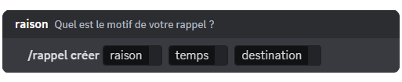

# Rappel

## Créer un rappel

Pour créer un rappel, vous devez effectué la commande <mark style="color:orange;">/rappel créer</mark>. DraftBot vous proposera ces champs : 

- **La raison** : afin de connaître le motif de votre rappel.
- **Le temps** : dans combien de temps souhaitez-vous recevoir votre rappel.
- **La destination** : où souhaitez-vous le recevoir, entre vos messages privés ou dans le salon où le rappel a été créé.


✨ Vous pouvez créer jusqu'à **10 rappels simultanément** avec le premium (max : 3 rappels sans premium). 


 🎉 Félicitations, vous avez créé un rappel ! Vous serez mentionné par DraftBot le moment venu.

## Modifier un rappel

Vous pouvez modifier un rappel à tout moment, même s'il est déjà en cours, avec l'aide de la commande <mark style="color:orange;">/rappel modifier</mark>. Vous n'aurez qu'à prendre le rappel que vous souhaitez modifier et de choisir une nouvelle raison, un nouveau temps en plus d'une autre destination.

## Supprimer un rappel

Pour supprimer un rappel en cours, vous devez effectué la commande <mark style="color:orange;">/rappel supprimer</mark> et sélectionner le rappel que vous souhaitez retirer de la liste.

## Voir la liste des rappels

Il est possible de voir la liste des rappels avec la commande <mark style="color:orange;">/rappel liste</mark>. Vous aurez un récapitulatif de tous les rappels en cours et classé en fonction de la durée.