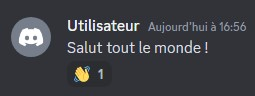
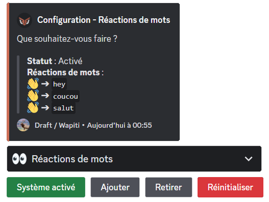
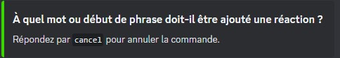

# 👀 Réactions de mots

## Qu'est-ce que le système de réactions de mots et quel est son utilité ?

Le système de réactions de mots fait réagir **DraftBot** à des messages qui commencent par un mot prédéfini avec une réaction définie. Un aperçu du message est disponible ci-dessous :


Le bot ne réagira que lorsque le mot est en **début de phrase**.


## Configuration



> Vous trouverez ci-dessous la configuration des réactions de mot avec la commande <mark style="color:orange;">/config</mark>.

### Activer le système de réactions de mots

Pour activer le système de réactions de mots, il faudra aller dans le système "👀 Réactions de mots" et de cliquer sur "Activer le système".


Pour désactiver le système, il suffira de faire la même procédure : le bouton "Activer le système" est devenu "Désactiver le système". Il faudra le sélectionner et le système sera désactivé.


### Ajouter des réactions de mots

Pour ajouter une réaction à un mot, il vous suffit de cliquer sur le bouton "Ajouter". Vous obtiendrez alors le message ci-dessous :


Il n'est pas possible d'ajouter un émoji provenant d'un autre serveur.


### Supprimer des réactions de mots

Si vous souhaitez supprimer une réaction en particulier, il vous suffira de cliquer sur le bouton "Retirer". Un sélecteur s'affichera et vous permettra de choisir la réaction de mot à supprimer.

### Lister les réactions de mots

Vous pouvez voir les réactions de mots sur votre serveur depuis l'onglet de configuration des réactions de mots. Vous aurez alors une liste avec toutes vos réactions de mots.

### Réinitialiser le système

Si vous souhaitez supprimer **toutes** les réactions de mots, il suffira d'appuyer sur le bouton "Réinitialiser".


Une réinitialisation est irréversible ! Une fois effectuée, elle remettra les trois réactions de mots par défaut, à savoir : "hey", "coucou" et "salut" avec la réaction "👋".





<mark style="color:blue;">[Accéder au panel de **DraftBot**](https://draftbot.fr/dashboard)</mark>

> Vous trouverez ci-dessous la configuration des réactions de mots sur le panel.

### Activer / Désactiver le système

Vous pouvez activer ou désactiver la réaction de mot en haut à droite de la page grâce à un bouton.

### Ajouter une réaction de mot

Vous pouvez ajouter une réaction de mot en mettant un **émoji** dans la case d'émoji et en mettant le mot concerné dans la case "Entrez un début de phrase". Vous pourrez alors "Ajouter" la réaction de mot.


Il n'est pas possible d'ajouter un émoji provenant d'un autre serveur.


### Modifier une réaction de mot

Pour modifier une réaction de mot, cliquez sur le bouton "Modifier" de la réaction de mot concernée. Les cases en haut se prérempliront : vous pourrez y modifier l'émoji et le mot. Il vous suffira de "Remplacer" pour que la modification soit prise en compte.

### Supprimer une réaction de mot

Pour supprimer une réaction de mot, cliquez sur le bouton "Supprimer" de la réaction de mot concernée.


La suppression est irréversible, cela dit une validation de la suppression sera demandée.
> Message en question : "Attention, vous avez des modifications non enregistrées".





## Informations supplémentaires

Si vous ne possédez pas le <mark style="color:orange;">[premium](https://draftbot.fr/premium)</mark>, vous serez limité à 10 réactions de mots. En possédant le premium de DraftBot, vous pourrez créer des réactions de mots de manière illimitée.

Voir le <mark style="color:orange;">[comparatif entre version gratuite et premium](https://www.draftbot.fr/premium#diff)</mark>.